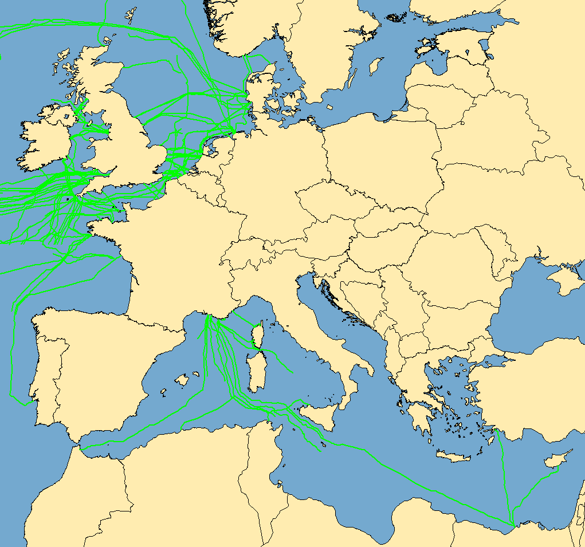

# Networks & the internet

*The internet is not a cloud, not a place, and definitely not wireless. It's cables — mostly under the ocean — and a set of rules for passing notes between machines that have never met.*

> Ask ten people where the internet is and nine will vaguely gesture upward. The tenth
> works in tech and gestures upward with more confidence. The truth is aggressively
> unmagical: the internet is **wires**. Hundreds of thousands of miles of them, most
> lying in the dark on the ocean floor, being nibbled by sharks and severed by anchors.
> Your video call to Australia goes *under the Pacific*, not over it. Nothing is in the
> sky. Let's dismantle this properly.

> **In real life**
>
> The internet is **the postal system, not the telephone.** Nobody keeps a line open
> between you and the server. You write a note, put an address on it, and hand it to the
> nearest post office. It gets passed from office to office — each one only knowing which
> neighbour is *closer* to the destination, never the whole route — until it arrives.
> Your message is chopped into postcards, and they may take different roads. This "nobody
> knows the whole route" design is exactly why the internet survives cut cables, and why
> it's so hard to switch off.

## A network is just two machines agreeing on rules

Two computers connected by a wire, following a shared rulebook, is a **network**. Add
more machines: still a network. Connect your network to your neighbour's, and theirs to
a city's, and cities to continents — and the network of networks is what we call the
**internet**. (That's literally where the name comes from: *inter*-connected
*net*works.)

What holds it together isn't wires. It's the rulebook — a **protocol**: An agreed set of rules for how machines exchange data: what a message looks like, how to address it, what to do if it's lost. TCP/IP is the internet's core protocol suite. Machines that follow the same protocol can talk even if they share no hardware, OS, or vendor.. Every device on
earth agrees to speak TCP/IP, and because they agree, a Nokia phone from 2004 can talk
to a Google data centre. No permission needed. No central owner. That's the design.


*Map: submarine communications cables — Wikimedia Commons, Public domain. [Source](https://commons.wikimedia.org/wiki/File:Submarine_cables.png)*
- **This is the internet. Actual cables.** — Roughly 99% of intercontinental data travels through these — not satellites. Fibre-optic strands about as thick as a garden hose, lying on the seabed, carrying every email, every video call, every API request between continents. When people say 'the cloud', THIS is the floor the cloud stands on.
- **The Atlantic crossing — the busiest street on earth** — Dozens of cables between North America and Europe. Your request to a European server crosses here in about 70 milliseconds, at roughly two-thirds the speed of light in glass. That number is a physical floor: no amount of money makes it faster. Latency is geography.
- **Redundancy — why cuts don't kill it** — Multiple cables per route, and every packet finds its own way (see the FlowAnimation). Cut one and traffic reroutes in seconds. This is the postal system's 'each office only knows the next hop' design paying off: no single office knows enough to be a single point of failure.
- **The chokepoints — where it's fragile** — The Red Sea, the Luzon Strait, the Suez. Several cables squeeze through narrow water, and a dragging anchor can slow an entire country. In 2024 three Red Sea cuts degraded traffic across Asia and Europe. The internet is robust, not invulnerable.
- **The gaps — why latency isn't uniform** — Notice where cables are sparse. A user in a poorly-connected region isn't 'on slow Wi-Fi' — their packets travel further, through more hops. When you test an app, remember: your 20ms is somebody else's 400ms. That user is real, and their experience of your product is the true one.

**Your message crossing the planet — press Play**

1. **✂️ Chopped into packets** — Your message isn't sent as one lump. It's split into small numbered chunks called packets. A 5 MB photo becomes thousands of them. Each one carries the destination address and its sequence number — everything needed to find its own way and be reassembled at the end.
2. **🏠 Out through your router** — Your device hands packets to your router, the only machine in your home that talks to the outside world. It's the local post office: it doesn't know where the destination is, only which neighbour is closer to it.
3. **🔀 Hop, hop, hop** — Each router passes the packet to the next router that seems closer to the destination — typically 10 to 20 hops across the world. NO router knows the full path. Each makes one local decision. The route emerges from thousands of independent small choices, which is why it survives failures.
4. **🌊 Under the ocean** — Between continents the packets travel through submarine fibre as pulses of light, at about 200,000 km/s (light in glass is slower than in vacuum). New York to London: about 70ms round trip. Physics, not engineering, sets that number.
5. **🧩 Reassembled — with gaps refilled** — Packets arrive out of order, and some are lost. TCP notices the missing sequence numbers and asks for those to be sent again. Only when everything is present does your device reassemble the message. You experienced a smooth stream; underneath it was chaos, patiently corrected.

*Try it — packets, out of order, with losses, reassembled*

```python
message = "THE INTERNET IS JUST CABLES AND AGREEMENTS"

# 1. Chop into packets, each numbered (this is what your device does)
size = 8
packets = [(i, message[i*size:(i+1)*size]) for i in range((len(message)+size-1)//size)]
print("sent:", [p[0] for p in packets])

# 2. The network mangles them: reordered, and packet 2 is LOST at sea
arrived = [packets[3], packets[0], packets[4], packets[1]]   # note: no packet 2
print("recv:", sorted(p[0] for p in arrived), "  <- out of order, and one missing")
print()

# 3. TCP notices the gap by checking sequence numbers
expected = set(range(len(packets)))
missing  = sorted(expected - {p[0] for p in arrived})
print("missing sequence numbers:", missing, "-> TCP asks the sender to retransmit")

# 4. Retransmission arrives, then reassemble in order
arrived.append(packets[2])
reassembled = "".join(chunk for _, chunk in sorted(arrived))
print()
print("reassembled:", repr(reassembled))
print("intact?     ", reassembled == message)
print()
print("You never saw the loss, the reordering, or the retransmit. That invisibility")
print("IS the protocol. When a tester says 'the app is flaky on bad networks',")
print("they mean this machinery is working harder than the developer assumed.")
```

## Wired, wireless, and the lie in the middle

"Wireless" describes about **10 metres** of your connection. Your laptop talks to your
router over radio. From the router onward: copper and glass, buried and submerged, all
the way to the server. Wi-Fi is the last hop, not the journey.

That's not pedantry — it's diagnostic. When a page loads slowly, the problem is in one
of three distinct places, and they need different fixes: the radio hop (your Wi-Fi),
the long haul (your ISP and the cables), or the destination (the server). Blaming
"the internet" collapses three answers into one shrug.

> **Tip**
>
> Testers care about this because **latency is a feature of geography, and your users
> don't live in your office.** Your app feels instant on the same continent as its
> server. To someone whose packets cross an ocean and fifteen extra hops, that same app
> takes a second and a half to respond, and the loading spinner you never bothered to
> design is the only thing they'll ever see. Chrome DevTools can simulate this ("Slow
> 4G"), and you'll do exactly that in chapter 2. The habit begins here: **your network
> is not the network.**

### Your first time: Your mission: see the hops with your own eyes

- [ ] Ping something close, then something far — In your terminal (Module 2, chapter 5 — told you it'd come back): `ping -c 4 google.com`. Note the time in ms. Now `ping -c 4 www.abc.net.au` (Australia). Watch the number jump. You just measured the width of the planet.
- [ ] Trace the actual route — `traceroute google.com` (Mac/Linux) or `tracert google.com` (Windows). Every line is one router — one hop, one post office. You are watching the FlowAnimation happen for real, with real machine names.
- [ ] Count the hops — How many routers did your packet touch? Usually 8–20. Each added a millisecond or two. Nobody planned that route in advance; it emerged from independent local decisions.
- [ ] Find where it leaves your country — Read the hostnames in the traceroute — they often contain city or airport codes (lhr = London, sin = Singapore). Watch your packet physically leave, and notice the latency jump when it crosses water.
- [ ] Look up your own IP — Search 'what is my IP'. That number is your address in this system, and it's how the reply found its way back to you. The next-but-one note is entirely about it.

You measured latency, traced a real route, and watched your data leave the country. The cloud is looking less fluffy.

- **Some sites load fine, one specific site is unbearably slow.**
  Not 'the internet' — the internet is working, since other sites are fine. It's either that server, or the path to it. `ping the-slow-site.com`: high times mean distance or an overloaded server; timeouts mean it's not answering at all. Then ping a fast site to compare. Two commands separate 'my connection is broken' from 'their server is struggling', and those go to completely different people.
- **The Wi-Fi bars are full, but nothing loads.**
  Full bars means the RADIO HOP is healthy — your laptop is happily talking to your router. It says nothing about whether your router can reach the world. The break is further along: your ISP, or the cable, or DNS (a later note). The bars measure ten metres of a ten-thousand-kilometre journey, which is why they lie so convincingly.
- **My app is fast for me, slow for users in another country.**
  Working as designed, unfortunately — that's geography, and no code change repeals it. Their packets travel further through more hops. Fixes are architectural: a CDN (servers placed near users), fewer round trips, and honest loading states. As a tester your job is to MEASURE it (throttle your connection, test from other regions) rather than to notice it after launch from an angry review.
- **Everything is slow, everywhere, for everyone in the house.**
  Now it might really be the shared parts. Check in order: your router (restart it — it's a computer, and it's been running for 400 days), your ISP's status page, and whether someone is saturating the link with a large upload. The order matters: check what you own before blaming what you don't.

### Where to check

Tools that make the invisible visible — all commands, all from Module 2:

- **`ping <host>`** — is it reachable, and how far away is it (in milliseconds)? The single most useful network command.
- **`traceroute <host>` / `tracert`** — every hop between you and it. Where does the journey slow down? The answer is often one specific hop.
- **Your router's admin page** (usually `192.168.1.1` in a browser) — connected devices, signal, uptime. Yes, your router has a web interface.
- **Your ISP's status page** — before you spend an hour debugging, check whether the problem is already known and being fixed.
- **`speedtest` / fast.com** — bandwidth (how much data per second), which is *not* latency (how long one round trip takes). Confusing the two is the most common networking mistake in existence.

Bandwidth is the width of the pipe; latency is the length of the pipe. A fat pipe from
here to Sydney is still long. Video streaming needs bandwidth. A responsive UI needs
low latency. Test the one your feature actually depends on.

### Worked example: the 'slow app' that was fast all along

A bug report arrives: *"the dashboard takes 6 seconds to load in Singapore, it's instant
in London."* Watch how the network concepts turn a vague complaint into a precise fault.

1. **Reproduce with numbers, not adjectives.** `ping api.ourapp.com` from London: 12ms. Asking a colleague in Singapore: 187ms. Already the shape is clear — distance is real and unavoidable.
2. **But 187ms ≠ 6 seconds.** Something is multiplying that latency. What multiplies latency? *Round trips.*
3. **Count the round trips.** Open DevTools (chapter 2's toy) and watch the network panel: the dashboard makes **31 sequential API calls**, each waiting for the previous one to finish.
4. **The arithmetic:** 31 × 187ms ≈ 5.8 seconds. In London: 31 × 12ms ≈ 0.4 seconds — fast enough that nobody ever noticed the design flaw.
5. **The bug was never the network.** The network was behaving exactly as physics requires. The bug is *31 sequential round trips*, a defect that London's short cable generously hid for two years.
6. **What a tester contributes:** not "it's slow in Singapore" but "the dashboard issues 31 sequential requests; at 187ms RTT that's 5.8s. Batching them into one call would make it 0.2s everywhere." That report gets fixed. And you built it out of `ping`, DevTools, and one multiplication.

> **Common mistake**
>
> Saying "the internet is down" when you mean "one site didn't load." The internet is a
> network of networks with no centre and no off switch — it is essentially never *down*.
> What breaks is something specific and findable: your Wi-Fi radio hop, your router, your
> ISP, DNS, a submarine cable, or one server. Each has a different symptom and a different
> fix, and `ping` plus `traceroute` will tell you which in about fifteen seconds. Vague
> diagnosis produces vague action, which is why the universal home remedy is "restart the
> router" — sometimes right, usually a coin flip. Testers don't flip coins. They localize
> the fault.

**Quiz.** A user in Singapore says your app is slow; it's instant in London where your server is. `ping` shows 187ms round trip from Singapore, 12ms from London. Your dashboard makes 31 sequential API calls. What's the bug?

- [ ] The user's Wi-Fi is bad — tell them to restart their router
- [x] 31 sequential round trips multiply the latency: 31 × 187ms ≈ 5.8s in Singapore, but only 0.4s in London, where the short distance hid the design flaw. The network is behaving correctly; the app's request pattern is the defect.
- [ ] The submarine cable to Singapore is faulty
- [ ] Nothing — physics means distant users are always slow

*187ms is unavoidable geography. Six seconds is not — it's that number multiplied by a chatty design. The fix is architectural (batch the calls, or put a server nearer the user), not a plea to physics. Note that London's short cable didn't prevent the bug, it CONCEALED it: proximity to your own server is the most effective way to never notice how badly your app performs. That's why 'test on a fast connection next to the data centre' is how these ship.*

- **What IS the internet?** — Interconnected networks following a shared protocol (TCP/IP). Physically: cables, mostly submarine fibre. No centre, no owner, no off switch.
- **Packets** — Messages are chopped into small numbered chunks that travel independently, possibly by different routes, and get reassembled at the destination. Lost ones are re-requested.
- **How routing works** — Each router only knows which neighbour is closer to the destination — never the whole path. The route emerges from local decisions, which is why cut cables reroute in seconds.
- **Wireless is 10 metres** — Wi-Fi covers only the hop from your device to your router. Everything after that is copper and glass. Full bars say nothing about the other 9,999 km.
- **Bandwidth vs latency** — Bandwidth = width of the pipe (data per second). Latency = length of the pipe (time per round trip). Streaming needs bandwidth; responsive UIs need low latency.
- **Why testers care** — Latency is geography, and your users don't sit next to your server. N sequential round trips multiply their distance. Your network is not the network.

### Challenge

Run `traceroute` (or `tracert`) to a website on another continent, and count the hops.
Then run it to a site in your own country. Compare the hop counts and the total time.
Finally: multiply the far-away round-trip time by 30 and look at that number. That's
what a chatty app feels like to a distant user, and it's the single most common
performance bug in web software. You now know how to find it before your users do.

### Ask the community

> Network question: `ping [host]` gives [ms / timeout]. `traceroute [host]` stops or slows at hop [N] ([hostname]). Other sites: [fast/slow]. On Wi-Fi or wired: [which]. Symptom: [what you actually see].

That 'other sites: fast' line is the whole diagnosis in four words — it instantly rules
out your router, your ISP, and the entire ocean, leaving one server. Bringing ping and
traceroute output means you've localized the fault before asking, which is the
difference between a question people answer and a question people scroll past.

- [Submarine Cable Map — the actual internet, drawn](https://www.submarinecablemap.com/)
- [How the internet finds things (a friendly comic)](https://howdns.works/)
- [How the internet works, in five minutes](https://www.youtube.com/watch?v=7_LPdttKXPc)

🎬 [The internet: packets, routing and cables](https://www.youtube.com/watch?v=7_LPdttKXPc) (9 min)

- The internet is interconnected networks agreeing on a protocol (TCP/IP). Physically it's cables — about 99% of intercontinental traffic runs through submarine fibre, not satellites.
- Messages travel as numbered packets that route independently; each router knows only the next hop. Lost packets are re-requested and the message is reassembled at the end.
- 'Wireless' describes about ten metres. Full Wi-Fi bars tell you the radio hop is healthy and nothing about the rest of the journey.
- Bandwidth (pipe width) and latency (pipe length) are different. Latency is geography and cannot be optimized away — only designed around.
- N sequential round trips multiply a user's distance: 31 calls × 187ms ≈ 6 seconds. Proximity to your own server hides this bug rather than preventing it.


---
_Source: `packages/curriculum/content/notes/the-internet-and-the-web/how-the-internet-works/networks-and-the-internet.mdx`_
