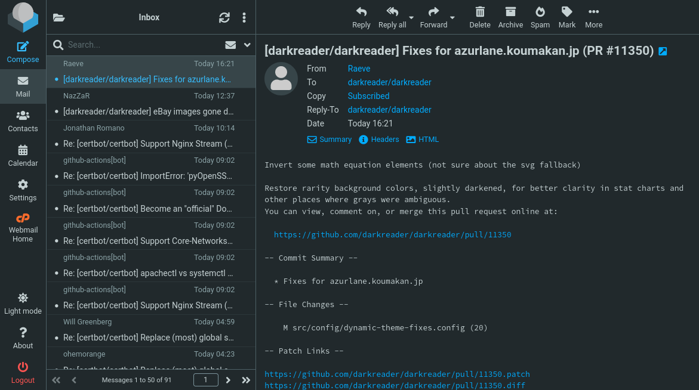

# Cloud storage

*Drive, Dropbox, iCloud — what actually happens to a file you 'put in the cloud', why sync is not backup, and the version-history trick that saves careers.*

> Everyone trusts cloud storage until the day a folder is empty on one device, full on
> another, and the file they need is a version from before lunch. Then they discover, at
> maximum stress, how sync actually works. You're going to learn it now instead — calmly,
> with the trash-recovery trick that has rescued more careers than any certification.

> **In real life**
>
> Cloud storage is a **hotel safe with room service**. Your valuables are stored in the
> hotel's vault (their data center), you get a key (your login), and any room you check
> into (any device) can call down for the contents. The parts people forget: the hotel
> keeps a log of everything you've stored (version history), housekeeping keeps whatever
> you throw away for thirty days (trash), and if you lose the key and the recovery
> codes, the vault does not care how much you cry — the contents are gone with it.

## What "uploaded" really means

When you drop `report.docx` into a synced folder, three different copies start
existing, and testers learn to name them precisely:

1. **The local copy** — bytes on *your* disk, in the folder you see. Keeping the copies identical is called **syncing**: Keeping two or more copies of a file identical across devices by propagating each change. Sync is not a backup: a deletion or corruption syncs too, faithfully destroying every copy. Versioning is what makes it recoverable., and it is not a backup.
2. **The remote copy** — bytes on the provider's disks (several of them — the previous
   note's redundancy).
3. **Other devices' copies** — your phone and laptop each pull their own local copy
   down, when they're online and feel like it.

The sync engine's whole job is making these three converge. Most of the time it's
brilliant. The bugs live in the gaps: mid-sync edits, two devices editing offline,
a rename racing a delete. If that sounds like a list of test cases — correct. That's
exactly what it is, and sync teams employ a lot of testers.


*Screenshot: Roundcube 1.6 — Wikimedia Commons, CC BY-SA 3.0. [Source](https://commons.wikimedia.org/wiki/File:Roundcube_1.6.0_screenshot.png)*
- **The list — none of this is on your disk** — Every row you see lives on the provider's servers and is fetched on demand. Close the tab and nothing remains on your machine except cache. This is storage-as-a-window: you're browsing a remote disk and it feels local. When it's slow, that feeling breaks — and users file bugs.
- **Search — running on THEIR machines** — Type here and the search executes on the server, across data that never touched your device. That's why cloud search finds things instantly in gigabytes you never downloaded. It's also why search results are a classic test surface: permissions bugs show up as 'I can search things I shouldn't see'.
- **The account rail — the actual key** — Everything hangs off the logged-in account. Storage isn't 'yours' like a USB stick is yours — it's an entry in their database that says this account may touch these bytes. Account recovery, therefore, is part of storage. Set it up BEFORE you need it.
- **Timestamps — sync's receipts** — 'Today 16:21' — every item carries server-side timestamps. When sync goes wrong, timestamps are the evidence: which device wrote last, which version won, what got clobbered. Testers read them the way detectives read alibis.
- **Actions that happen remotely** — Delete, archive, move — each button fires a request to the server, which changes the real data and then tells all your other devices. The button is local; the truth is remote. Mind the gap — that gap is where 'I deleted it on my phone but it's still on my laptop' lives.

## Sync is not backup — the sentence worth a tattoo

**Sync** makes all locations identical, as fast as possible. Edit a file — the edit
propagates. Corrupt a file — the corruption propagates. Delete everything — the
deletion propagates, everywhere, efficiently. Sync is a mirror, and mirrors copy
your mistakes with perfect fidelity.

**Backup** is a separate, versioned, point-in-time copy that nothing propagates to.
Yesterday's backup doesn't care what you deleted today. That independence is the
entire point.

Cloud storage products are sync-first, with backup-ish features bolted on: **version
history** (older copies of each file, usually 30–180 days) and **trash** (deleted
files linger, usually 30 days). Those two features are your safety net — know where
they are *before* the bad day.

**Two devices edit the same file offline — press Play for the collision**

1. **✈️ Laptop, offline, edits** — You edit report.docx on a plane. The change is saved locally and queued: 'sync when we see the internet again.' Perfectly normal so far.
2. **🏠 Phone, online, edits** — Meanwhile you fix a typo in the same file from your phone. The server accepts it — as far as the cloud knows, this is now the newest truth. Version 2 exists.
3. **📶 Laptop lands, reconnects** — The sync engine wakes up and finds a problem: the laptop's edit was built on version 1, but the server is already on version 2. Two truths, one filename. This is a CONFLICT.
4. **🤝 The resolution** — Good sync engines refuse to guess: they keep both, renaming one to 'report (conflicted copy 2026-07-10).docx'. Bad ones silently pick a winner — meaning someone's work silently loses. Which behavior an app has? That's a test somebody ran. Hopefully.
5. **🧪 The tester's takeaway** — Conflict handling is a designed behavior, not luck. When you test any syncing product: two devices, go offline, edit the same thing, reconnect. What happens next tells you how much the team respects users' work.

*Try it — build a tiny version history (the feature that saves careers)*

```python
# Cloud drives keep old versions of your files. Model it in 20 lines.

history = []   # the server keeps every version, newest last

def save(content, device):
    version = {'v': len(history) + 1, 'content': content, 'from': device}
    history.append(version)
    print('saved v' + str(version['v']), 'from', device, '->', repr(content))

def restore(v):
    version = history[v - 1]
    print()
    print('RESTORE requested: rolling back to v' + str(v))
    save(version['content'], 'restore-tool')

save('Q3 report draft', 'laptop')
save('Q3 report draft + numbers', 'laptop')
save('', 'phone')          # oops -- fat-fingered, saved an EMPTY file
save('lol', 'phone')       # and then made it worse

print()
print('Panic: the report is gone and the newest version says lol.')
print('But the server never forgot:')
for v in history:
    print('  v' + str(v['v']), 'from', v['from'], '->', repr(v['content']))

restore(2)   # back to the good version -- crisis over

print()
print('Every cloud drive has this feature. Right-click -> Version history.')
print('Knowing it exists is the difference between a bad minute and a bad week.')
```

> **Tip**
>
> Do this today, not during a crisis: in Google Drive, right-click any file → **File
> information → Manage versions** (in Docs it's File → Version history). In Dropbox:
> right-click → Version history. In OneDrive: right-click → Version history. Thirty
> seconds of clicking now means that during a real emergency your hands already know
> the way. Testers call this "learning the fire exits while the building isn't on fire."

### Your first time: First time? Run the sync-truth experiment

- [ ] Put one test file in a synced folder — Any cloud drive you use. Call it sync-test.txt, write 'version 1' in it. Watch for the checkmark/cloud icon that says it's uploaded.
- [ ] Open the same file on a second device — Phone app or the web interface counts. Confirm 'version 1' arrived. That round trip went through a data center — possibly in another country — in seconds.
- [ ] Edit it to 'version 2' and watch it propagate — Change it on one device, watch the other update. THIS is sync working. Note the delay — seconds, not instant. That window is where conflicts breed.
- [ ] Delete it on one device — Watch it vanish from the other too. Feel slightly betrayed. Sync mirrors deletes — you've now proven it safely with a file worth nothing.
- [ ] Rescue it from the trash — Find the provider's trash/deleted-files area and restore it. Note the retention window (usually 30 days). You now know the fire exits.

One worthless file, five minutes, and you've verified sync, propagation, deletion
mirroring, and recovery — a better understanding than most people ever get.

- **“The file shows a cloud icon and won't open — I'm on a plane.”**
  That icon means 'not actually on this device' — the drive saves space by keeping some files online-only and downloading on demand. No internet, no download. Fix for next time: right-click → 'Make available offline' before you travel. Testers: online-only files are a whole test dimension (what does YOUR app do when the OS says the file exists but the bytes aren't local?).
- **“I have 'report (conflicted copy)' files multiplying like rabbits.”**
  Two devices (or you and a colleague) edited the same file before sync could reconcile. The engine kept both rather than guess — that's the polite behavior. Open both, merge by hand, delete the loser. Prevention: don't edit the same file from two places in quick succession, or use an app with real-time co-editing (Docs/Office online), which solves this with a different architecture entirely.
- **“Sync is stuck at 99% and has been 'syncing' for an hour.”**
  Classic causes, in order of likelihood: one enormous file (check the sync app's activity list — it usually names the culprit), a file locked by an open program (close the app that has it open), a path too long or a character the provider forbids (rename), or the provider having a bad day (status page). The sync app's own activity/error panel is the log — read it before restarting anything.
- **“I ran out of space and now nothing syncs — but I deleted lots of files!”**
  Check the trash: most providers count trashed files against your quota until the trash is emptied. Empty it (after making sure nothing precious is inside — this is the one delete that's genuinely final), then check what's actually big: every provider has a storage-breakdown page. Usually it's videos and old phone backups, not documents.

### Where to check

Sync misbehaving? Evidence, in order of usefulness:

- **The sync client's activity/error panel** — the tray/menu-bar icon opens a list of what's uploading, what failed, and why. This is the log; most people never open it.
- **The web interface** — the browser view shows the SERVER's truth. If the file is right on the web but wrong on your device, it's a download problem; reversed, an upload problem. This one check localizes the bug.
- **Version history & trash** — right-click the file. Establishes what existed when, and whether 'lost' really means lost (it usually doesn't, for ~30 days).
- **The provider's status page** — sync engines fail loudly when the mothership is down. Check before blaming your own setup.
- **File timestamps on both devices** — modified-time tells you which side has the newer truth, which is the first question in any conflict autopsy.

### Worked example: the vanished folder — a recovery, step by step

A teammate messages, all caps: their project folder is EMPTY on every device, weeks of
work gone. You, calmly:

1. **Web interface first.** The server's truth: folder exists, zero files. So the deletion is real and has synced. Bad — but expected: something deleted them, and sync obediently mirrored it everywhere.
2. **Trash next.** Provider's web UI → Trash → filter by folder. All 214 files, deleted 11:03 this morning from device "LAPTOP-KITCHEN". Nothing is lost. Deep breath, tell them immediately — panic makes people do destructive things (like emptying trash).
3. **Restore.** Select all → Restore. Files reappear; sync propagates them back to every device over a few minutes. Total data loss: zero.
4. **Root cause.** 11:03, LAPTOP-KITCHEN: their kid's online class was at 11. A small human dragged the folder to the bin. Sync did exactly its job — mirrored a human mistake with perfect efficiency.
5. **The lesson you write up:** deletion at ANY endpoint deletes everywhere; the trash's 30-day window is the real safety net; and version history would even have survived an overwrite. Sync did not fail. The mental model did.

> **Common mistake**
>
> Treating the sync folder as the only copy of irreplaceable things. The failure modes
> that beat sync are all account-level: password lost with no recovery set up, account
> suspended, payment lapsed on a storage plan, the provider discontinuing the product,
> or ransomware encrypting your files — and sync dutifully uploading the encrypted
> versions. For things that genuinely cannot be lost (theses, tax records, the novel),
> apply 3-2-1: three copies, two kinds of storage, one offline or elsewhere. The cloud
> drive is one leg. An external disk in a drawer is a fine second. This paragraph costs
> nothing today and everything the day it's ignored.

**Quiz.** You delete a file in your synced folder on your laptop. What's the cloud drive's default behavior?

- [ ] Nothing — deletes only apply to the local copy
- [x] The file is deleted on the server and every synced device, and moves to the provider's trash for a limited window (usually ~30 days)
- [ ] The provider asks for confirmation on each device before deleting there
- [ ] The file is deleted locally but archived forever on the server

*Sync means mirror: the delete is a change, and changes propagate everywhere — efficiently. The safety net is the trash (and version history), which typically keeps things ~30 days. 'Forever archived' is wishful thinking, per-device confirmations would defeat the point of sync, and 'local only' describes a folder that isn't synced at all. If the mirror behavior surprises you, re-run the FirstTime experiment above — with a worthless file.*

- **The three copies** — Local copy (your disk), remote copy (their data center, redundant), other devices' copies. Sync's job is convergence; bugs live in the gaps.
- **Sync vs backup** — Sync mirrors everything including mistakes and deletes. Backup is separate, versioned, point-in-time. Cloud drives are sync-first with version-history and trash as the safety net.
- **Version history** — Old copies of every file, kept server-side (30–180 days typical). Right-click → Version history. The career-saving feature nobody learns until the crisis.
- **Conflicted copy** — Two edits raced from different devices; the engine kept both rather than guess. Merge by hand. Real-time co-editing apps solve this differently.
- **Online-only file** — Cloud icon = the bytes aren't on this device; they download on demand. No internet, no file. 'Make available offline' before flights.
- **3-2-1 rule** — 3 copies, 2 storage types, 1 offsite/offline. The cloud drive is one leg, never all three. Beats account loss, ransomware, and fat fingers.

### Challenge

Stage a disaster, then survive it: create a folder with three junk files in your
cloud drive and let it sync. Now (1) overwrite one file with garbage and recover the
good version via version history, (2) delete the whole folder from a SECOND device
and restore it from trash, (3) find the provider's retention windows for trash and
versions and write them down. When you're done you'll have practiced, on worthless
data, the exact recovery a panicking teammate will someday need from you.

### Ask the community

> Cloud storage question: file [name] on [provider]. Web interface shows [state], device A shows [state], device B shows [state]. Sync client's activity panel says [message]. Trash/version history shows [what]. What happened, and in what order?

List the state in the WEB interface first — that's the server's truth and the anchor
everyone will reason from. Then per-device states. With those three data points,
most sync mysteries solve themselves in one reply.

- [GCFGlobal — Google Drive from zero (transferable to any provider)](https://edu.gcfglobal.org/en/googledriveanddocs/getting-started-with-google-drive/1/)
- [Backblaze — the 3-2-1 backup rule, canonical write-up](https://www.backblaze.com/blog/the-3-2-1-backup-strategy/)
- [Google — find & recover files (trash, versions)](https://support.google.com/drive/answer/2409045)

🎬 [Cloud computing (and storage) in eight minutes](https://www.youtube.com/watch?v=8sNAPqJ_c7c) (8 min)

- A synced file exists in three-plus places: your disk, their redundant servers, and every other device. Sync's job is convergence.
- Sync mirrors everything — edits, corruption, deletes. It is not backup. Version history and trash (usually ~30 days) are the built-in safety nets.
- Conflicts are designed behavior: good engines keep both copies ('conflicted copy'), bad ones silently pick a winner. Test with two offline devices.
- Online-only files (cloud icon) have no local bytes — 'make available offline' before you need them without internet.
- For irreplaceable data, 3-2-1: three copies, two media, one elsewhere. The cloud drive is one leg of that, never all of it.


---
_Source: `packages/curriculum/content/notes/the-internet-and-the-web/what-the-cloud-is/cloud-storage.mdx`_
