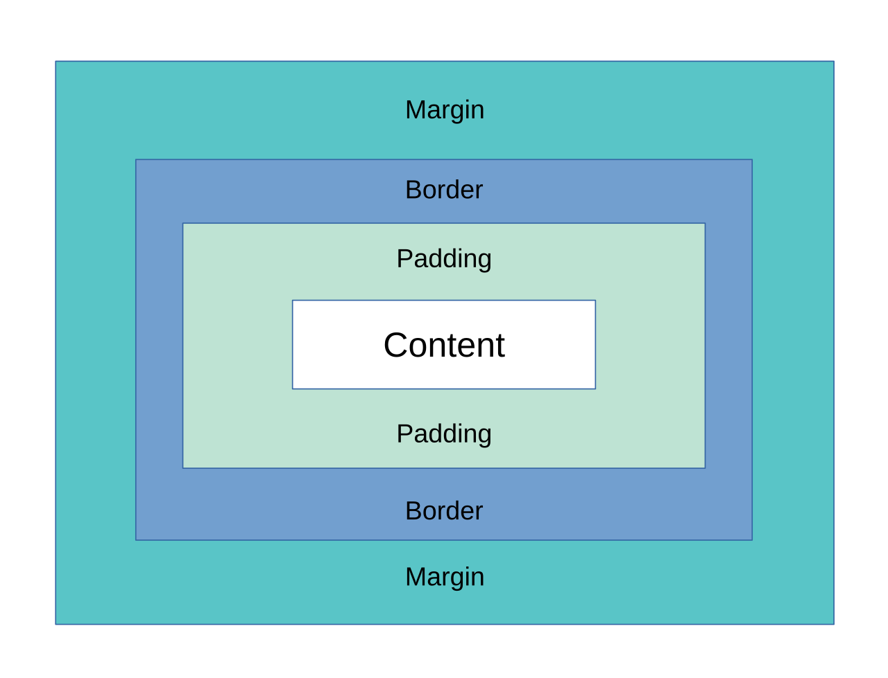

# The box model

*Every element on every page is a rectangle wrapped in three other rectangles. Learn which one `width` actually means and half of all layout bugs stop being mysterious.*

> You set `width: 300px`. You measure it. It's 348 pixels wide. You have not lost your mind
> and CSS is not broken. **By default, `width` describes only the content box** — then the
> browser adds your padding, then your border, on the outside. Twenty-four pixels of padding
> on each side, and 300 became 348. Every developer meets this once, curses, and learns the
> one line that fixes it forever.

> **In real life**
>
> An element is a **framed photograph.** The photo is the content. The mount board around it
> is the padding. The frame is the border. The gap you leave between this frame and the next
> one on the wall is the margin. Now: when a shop sells you a "12-inch frame," do they mean
> the photo, the photo plus mount, or the whole thing off the wall? Everybody has an opinion,
> the answer changes by country, and that ambiguity is *precisely* the CSS box model
> argument — except CSS lets you pick, with one property.

## Four boxes, from the inside out

1. **Content** — the text or image itself.
2. **Padding** — space *inside* the border. It takes the element's background colour.
3. **Border** — the drawn edge. Has a thickness that occupies space.
4. **Margin** — space *outside* the border. Always transparent. Pushes other elements away.

And the one property that decides what `width: 300px` counts:

- `box-sizing: content-box` — the CSS default. `width` = content only. Total = 300 + padding + border.
- `box-sizing: border-box` — `width` = content + padding + border. Total = 300. Full stop.

Nearly every modern codebase sets `border-box` globally on the first line of its stylesheet,
because `content-box` is the behaviour nobody has ever wanted:

```css
*, *::before, *::after { box-sizing: border-box; }
```


*CSS box model diagram — Wikimedia Commons, CC BY-SA 4.0. [Source](https://commons.wikimedia.org/wiki/File:Boxmodell-detail.svg)*
- **Content box — what `width` means by default** — With the default `box-sizing: content-box`, `width: 300px` sizes only this innermost rectangle. Padding and border are then added outside it. This is why your 300px element measures 348px, and why every framework overrides it.
- **Padding — inside the border, painted with the background** — Increase the padding and the element grows outward (under content-box) while the text stays put. Because padding takes the background colour, a button's clickable area and its coloured area are the same. That matters: padding is how you make a tap target big enough.
- **Border — thickness that occupies real space** — A 1px border adds 2px to the element's total width. This is the classic 'my layout jumps on hover' bug: adding a border on :hover reflows everything. Use an outline or an inset box-shadow instead — neither takes up space.
- **Margin — outside, transparent, and it COLLAPSES** — Vertical margins between siblings don't add up — the larger one wins. 20px below one element and 30px above the next gives you 30px of gap, not 50px. Horizontal margins never collapse. This asymmetry is genuinely surprising and entirely real.
- **The one place to check all four** — DevTools → Elements → Computed tab shows this exact diagram, filled in with real numbers, for the element you selected. Hover any layer and the browser highlights it on the page. Stop guessing; the browser will show you which rectangle is lying.

**Why your 300px box is 348px — press Play**

1. **You write `width: 300px`** — You are thinking of the box you can see. The browser is thinking of the content box — the innermost rectangle only. You have not yet said anything about the space the element will occupy on the page.
2. **Add `padding: 20px`** — Twenty pixels of breathing room inside the border, on every side. Under the default `content-box`, this does NOT come out of the 300. It is added outside it. The element is now 340px wide. The text still occupies 300.
3. **Add `border: 4px solid`** — Four more pixels each side, again added outside. Total 348px. Your grid of three 300px cards no longer fits in a 900px container and one wraps onto a new line, which is when you finally notice.
4. **The instinct: change 300 to 252** — It works! Until someone changes the padding, or the design system bumps the border. You have now hard-coded the answer to an arithmetic problem into a magic number that no comment explains. It will be wrong within a month.
5. **The fix: `box-sizing: border-box`** — Now `width: 300px` means the whole visible box — content plus padding plus border. Padding eats inward from the 300 instead of growing outward. Change the padding to anything you like; the element stays 300px. This is why every framework sets it globally.

*Try it — measure the box both ways*

```python
def total_width(width, padding, border, box_sizing):
    if box_sizing == "content-box":
        # width sizes the CONTENT only; padding + border are added outside
        return width + 2*padding + 2*border
    else:  # border-box
        # width sizes content + padding + border; content shrinks to fit
        return width

def content_width(width, padding, border, box_sizing):
    if box_sizing == "content-box":
        return width
    inner = width - 2*padding - 2*border
    return inner

print(f"{'box-sizing':13} {'declared':9} {'padding':8} {'border':7} {'ON SCREEN':10} {'content'}")
print("-" * 66)
for bs in ("content-box", "border-box"):
    for pad, bor in [(0,0), (20,0), (20,4), (60,4)]:
        t = total_width(300, pad, bor, bs)
        c = content_width(300, pad, bor, bs)
        flag = "  <-- doesn't fit a 900px row x3" if t*3 > 900 else ""
        print(f"{bs:13} {'300px':9} {str(pad)+'px':8} {str(bor)+'px':7} {str(t)+'px':10} {c}px{flag}")

print()
print("content-box: padding GROWS the element. Three cards overflow the row.")
print("border-box:  padding SHRINKS the content. Three cards always fit.")
print()
# The trap: content-box with too much padding
c = content_width(300, 160, 4, "border-box")
print(f"border-box, padding 160px -> content width = {c}px")
print("Negative content width is clamped to 0. The box stops shrinking and")
print("OVERFLOWS instead. border-box is not magic; it just moves where you lie.")
```

## Margin collapse, the rule that sounds made up

Two vertical margins that touch do not add. The **larger one wins**.

```css
.card   { margin-bottom: 20px; }
.card+.card { margin-top: 30px; }
/* The gap between two cards is 30px. Not 50px. */
```

This only happens **vertically**, only between **adjacent or nested** elements, and it's
prevented by anything between them — a border, padding, a flex or grid container. It is one
of the oldest and most confusing behaviours in CSS, and it is the reason "the spacing is
wrong and I've tried everything" tickets exist. Inside a flexbox or grid container, margins
never collapse, which is a large part of why modern layouts feel saner.

> **Tip**
>
> Stop reading the stylesheet and open **Elements → Computed**. The browser draws this exact
> box diagram with the real, final numbers for the selected element, and hovering each layer
> highlights it on the page in colour. Ninety percent of "why is there a gap there" is
> answered in five seconds by hovering the margin band and watching an orange rectangle
> appear somewhere you did not expect.

margin collapse

### Your first time: Your mission: read a box with your eyes shut

- [ ] Inspect any button — Right-click → Inspect. Elements → Computed tab. Scroll to the top: the box diagram, with four nested rectangles and real numbers in each.
- [ ] Hover each layer — Hover the margin band, then padding, then content. Watch the browser paint each one on the page. This is the single fastest way to understand a layout you didn't write.
- [ ] Find its box-sizing — In Computed, filter for `box-sizing`. Almost certainly `border-box`. Now you know whether `width` includes the padding — before you try to reason about anything.
- [ ] Make a gap appear — Select an element with space above it. Is that space its own margin-top, the previous element's margin-bottom, or the parent's padding? Hover each. One of them lights up. Now you know who to blame.
- [ ] Prove margin collapse — Find two stacked paragraphs. Read both margins in Computed. Measure the actual gap by hovering. It equals the larger margin, not the sum. Watch CSS admit it to your face.

You can now answer "where is this space coming from?" — the most common layout question there is — without reading one line of CSS.

- **My element is wider than the `width` I set.**
  Default `box-sizing: content-box`: padding and border are added outside the width. Check Computed → `box-sizing`. If it says content-box, either set `border-box` (correct) or do the arithmetic (fragile). Do not fix it by shrinking the width to 252px — you'll have buried a magic number that the next padding change silently invalidates.
- **Three 33%-wide cards won't fit on one row.**
  Same cause, one step further along. Under content-box, `width: 33%` plus any padding or border exceeds 100% and the third card wraps. Set `border-box` globally. If it already is border-box, look for a `margin` — margins are always outside the width, in both box models. That's the exception everybody forgets.
- **The layout jumps by a couple of pixels when I hover.**
  You're adding a `border` on `:hover`. Borders take real space, so the element grows and pushes its neighbours — a reflow (Module 4, ch4). Use `outline` (drawn outside, occupies no space) or an inset `box-shadow` (painted, no layout). Or set a transparent border in the resting state so the thickness never changes.
- **There's a mysterious gap between two elements and neither has a margin that explains it.**
  Margin collapse: the gap equals the larger of the two touching vertical margins, so a 30px `margin-top` you'd forgotten is eating your 20px `margin-bottom` entirely. Or it's the parent's padding. Hover the bands in Computed — one of them will light up exactly where the gap is, and you'll stop guessing.
- **I set a huge padding and the content overflows instead of shrinking.**
  Under `border-box` the content box shrinks to make room, but it cannot go below zero. Once padding plus border exceeds the declared width, the content box clamps at 0 and the content spills out. `border-box` doesn't repeal arithmetic — it just moves where the lie surfaces.

### Where to check

Every question in this note is answered in one panel:

- **Elements → Computed → the box diagram** — the four rectangles with final numbers, for the element you selected.
- **Hover each band** — the browser paints margin/border/padding/content on the page in colour. This is the tool.
- **Computed → filter `box-sizing`** — decide whether `width` includes padding before reasoning about anything else.
- **Computed → filter `margin`** — the *computed* margin, after collapse, not what the stylesheet asked for.
- **The Layout / grid overlay** — for when the box isn't the culprit and the container is.

Tester's habit: **never argue with a layout from the stylesheet.** The stylesheet contains
intentions; Computed contains outcomes. A rule can be overridden, collapsed, clamped, or
struck through by specificity, and the only place you'll see what actually happened is the
computed value.

### Worked example: the 4px that broke a checkout on one browser

1. **Report:** "The Place Order button is cut off on the right on my work laptop." One reporter. Nobody else can reproduce. It sits for a month.
2. **The first real question:** what's different about that laptop? Answer: an old browser at a 1280px viewport with a browser zoom of 110%.
3. **Reproduce it properly.** Set the viewport to 1280px, zoom 110%. There it is: the button's right edge is under the sidebar.
4. **Inspect the button. Computed tab.** `width: 200px`. `padding: 0 24px`. `border: 2px`. `box-sizing: content-box`. The button is not 200px wide. It is 200 + 48 + 4 = **252px**.
5. **Why only here?** The container is a flex row with a fixed 240px slot. At 100% zoom the browser rounds a fractional pixel down and it fits by a hair. At 110%, the rounding goes the other way and 252 wins.
6. **The site sets `border-box` globally.** So why is this element `content-box`? Search the stylesheet: a third-party payment widget ships its own reset — `.pay-widget * { box-sizing: content-box; }` — and it out-specifies the global rule.
7. **The bug was never in the button.** It was a vendor stylesheet quietly reverting a global assumption for one subtree, and the arithmetic only surfaced under a rounding condition almost nobody hit.
8. **The report writes itself:** 'Place Order button computes to 252px inside a 240px flex slot because `.pay-widget *` overrides the global `box-sizing: border-box`. Visible at 1280px viewport, 110% zoom (rounding). Evidence: Computed panel screenshot. Fix: scope the vendor reset, or set `box-sizing: border-box` on `.pay-widget button`.'
9. **The lesson:** "cannot reproduce" almost always means "have not yet reproduced the reporter's *conditions*." Viewport and zoom are conditions. And one number in the Computed panel — `content-box` where you expected `border-box` — ended a month of shrugging.

> **Common mistake**
>
> Fixing "my 300px box is 348px" by changing the width to 252px. It works, it looks like
> competence, and you have just written an undocumented equation into your stylesheet:
> `252 = 300 − 2(20) − 2(4)`. The next person to change the padding — a designer, in a
> different file, six months from now, adjusting a number that has no visible relationship to
> this one — silently breaks the layout, and nothing anywhere connects the two changes. Set
> `box-sizing: border-box` and let the browser do the arithmetic every time it lays out the
> page. Magic numbers are bugs that haven't been scheduled yet.

**Quiz.** An element has `width: 300px`, `padding: 20px`, `border: 4px`, and `box-sizing: content-box`. How much horizontal space does it occupy, and what is its content width?

- [ ] 300px total, 252px of content
- [x] 348px total, 300px of content — under content-box, `width` sizes the content box only, so padding (20×2) and border (4×2) are added outside it
- [ ] 300px total, 300px of content
- [ ] 348px total, 252px of content

*content-box means `width` describes the innermost rectangle. The browser then adds 40px of padding and 8px of border around it: 300 + 40 + 8 = 348px on screen, with the text still getting its full 300px. Option 3 describes border-box, where the same declaration would give a 300px element whose content is squeezed to 252px. Notice that margin is in neither number — margin is always outside the width, in both box models. That's the exception everybody forgets.*

- **The four boxes, inside out** — Content, padding (inside the border, takes the background), border (occupies space), margin (outside, transparent, collapses).
- **content-box vs border-box** — content-box (the CSS default): `width` = content only, padding+border added outside. border-box: `width` = the whole visible box. Frameworks set border-box globally.
- **Why 300px measures 348px** — content-box + 20px padding each side + 4px border each side. 300 + 40 + 8.
- **Margin collapse** — Touching vertical margins produce the LARGER one, not the sum. Never horizontal, never in flex/grid, blocked by any border or padding between.
- **Layout jumps on hover** — You added a border, which takes real space and reflows the row. Use `outline` or an inset `box-shadow` — neither occupies space.
- **Where to check, always** — Elements → Computed → the box diagram. Hover each band to paint it on the page. Intentions live in the stylesheet; outcomes live in Computed.
- **Does margin count toward width?** — No — in either box model. Margin is always outside. That's why three border-box cards at 33% still overflow if they have margins.

### Challenge

Open any site, inspect its primary button, and predict its total width from the Computed
panel before you read the number: content + padding×2 + border×2 if content-box, or just
the declared width if border-box. Then find two stacked paragraphs and prove margin
collapse to yourself: read both vertical margins, add them, then measure the real gap by
hovering. CSS will admit, to your face, that the sum was never the answer.

### Ask the community

> Layout question: element renders [N]px wide but I declared [M]px. Computed panel says box-sizing=[value], padding=[p], border=[b], margin=[m]. Parent is display=[block/flex/grid], width=[w]. Screenshot of the Computed box diagram attached.

Paste the Computed values, never the stylesheet. The stylesheet says what someone wanted;
Computed says what the browser did, after specificity, collapse and clamping. Nine times in
ten the answer is visible in the `box-sizing` line alone, and whoever helps you will spot it
before they finish reading.

- [MDN — the box model (with live examples)](https://developer.mozilla.org/en-US/docs/Learn/CSS/Building_blocks/The_box_model)
- [MDN — mastering margin collapsing](https://developer.mozilla.org/en-US/docs/Web/CSS/CSS_box_model/Mastering_margin_collapsing)
- [CSS-Tricks — box-sizing, and why everyone sets border-box](https://css-tricks.com/box-sizing/)

🎬 [The CSS box model explained in ten minutes](https://www.youtube.com/watch?v=rIO5326FgPE) (10 min)

- Every element is four nested rectangles: content, padding, border, margin. Margin is always outside the width, in every box model.
- `box-sizing: content-box` (the CSS default) makes `width` size the content only — padding and border grow the element outward. That's the 300px-is-348px bug.
- `box-sizing: border-box` makes `width` mean the whole visible box. Set it globally and stop doing arithmetic in your stylesheet.
- Touching vertical margins collapse to the larger one, never the sum. Not horizontally, never inside flex or grid.
- Elements → Computed draws the real box with real numbers, and hovering each band paints it on the page. Intentions live in the stylesheet; outcomes live in Computed.


---
_Source: `packages/curriculum/content/notes/the-web-platform-for-testers/css-essentials/the-box-model.mdx`_
