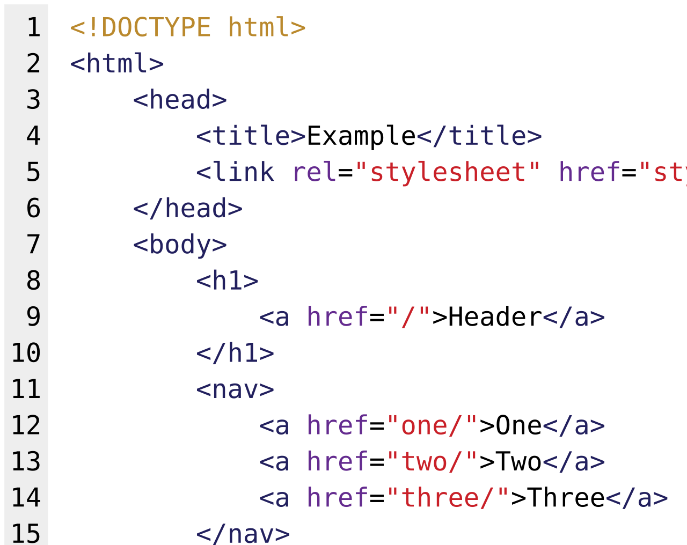

# Structure & semantic tags

*HTML tags carry meaning, not looks. A `<div>` styled like a button is a lie the browser tells your eyes and refuses to tell a screen reader — and your test locators side with the screen reader.*

> Two buttons look identical on screen. One is a `<button>`. The other is a `<div>` with
> a click handler. To your eyes: no difference. To a keyboard user: one is reachable and
> one isn't. To a screen reader: one is announced as a button and one is announced as
> nothing. To `getByRole('button')`: one exists and one doesn't. **The tag you choose is
> not a styling decision. It is a contract about what a thing *is*.**

> **In real life**
>
> HTML tags are **job titles, not uniforms.** You can dress anyone in a paramedic's
> uniform — that's CSS. But the job title is what gets them through the hospital doors,
> onto the radio, and into the rota. A `<div>` in a button's uniform fools every human
> who can see it and no machine at all. Screen readers, keyboards, search engines and
> test frameworks all read the title, never the outfit.

## Semantic vs generic

**Semantic tags say what a thing is:** `<button>`, `<nav>`, `<header>`, `<main>`,
`<article>`, `<h1>`–`<h6>`, `<label>`, `<table>`.

**Generic tags say nothing:** `<div>` (a block-shaped nothing), `<span>` (an
inline-shaped nothing). Both are perfectly legitimate — as containers for layout, which
is all they claim to be.

Choosing `<div>` where `<button>` belongs costs you four things at once:

1. **Keyboard focus.** A `<button>` is tabbable. A `<div>` is not.
2. **Keyboard activation.** Enter and Space fire a `<button>`. They do nothing to a `<div>`.
3. **The accessibility tree.** `<button>` announces as "button, Add to cart." A `<div>` announces as nothing at all.
4. **Your locators.** `getByRole('button', { name: 'Add to cart' })` finds one and not the other.

Those four are the same fact wearing four coats.


*Diagram: HTML source code example — Wikimedia Commons, Public domain. [Source](https://commons.wikimedia.org/wiki/File:HTML_source_code_example.svg)*
- **Angle brackets: an opening tag** — Every element opens and (almost always) closes. What sits between them is that element's content — including other elements. That nesting is what makes HTML a tree, which is what makes it the DOM (Module 4, ch4).
- **Nesting = parent and child** — Indentation is a courtesy to humans; the browser reads the brackets. A tag closed in the wrong order still usually renders, because browsers are famously forgiving — and that forgiveness is why broken markup survives for years.
- **Attributes ride inside the opening tag** — `id`, `class`, `href`, `type`, `data-testid`. They configure the element. Two of them — `id` and `data-testid` — are the handles your automated tests will grab, so they aren't decoration either.
- **The tag NAME carries the meaning** — `h1` isn't 'big bold text' — it's 'the most important heading on this page'. Screen readers build a table of contents from headings. Skipping from h1 to h4 because h4 'looked right' breaks that navigation, and CSS could have made h2 look identical.
- **The document structure lives here** — `header`, `nav`, `main`, `footer` — landmarks a screen-reader user jumps between with one keystroke. A page of anonymous divs offers no landmarks, so they must read everything, in order, every time. That's the cost of a `div` soup, measured in minutes of someone's life.

**The same button, two ways — press Play**

1. **👀 Sighted mouse user** — Sees two identical buttons, styled by the same CSS. Clicks either one. Both work, because both have click handlers. Everything is fine. This is the only user most teams ever test with.
2. **⌨️ Keyboard user presses Tab** — Focus lands on the real `<button>` and skips the `<div>` entirely — divs aren't in the tab order. They cannot reach it. Not 'it's awkward': they cannot reach it at all, ever, by any keystroke.
3. **🔊 Screen reader arrives** — The `<button>` announces: 'Add to cart, button.' The `<div>` announces its text with no role — or, if it has no text node, nothing whatsoever. The user has no idea an interactive element exists there.
4. **✅ The fix is one word** — Change `div` to `button`. Focus works. Enter and Space work. The screen reader announces it. The role locator finds it. Four problems, one tag name, zero CSS changes. This is why semantic HTML is the cheapest accessibility work that exists.

*Try it — what each tag promises, and what a div doesn't*

```python
elements = [
    # tag,       role,        focusable, announced_as
    ("button",   "button",    True,  "Add to cart, button"),
    ("a href=#", "link",      True,  "Add to cart, link"),
    ("div",      "generic",   False, "(nothing — no role, not focusable)"),
    ("span",     "generic",   False, "(nothing)"),
    ("h1",       "heading 1", False, "Add to cart, heading level 1"),
    ("input",    "textbox",   True,  "(depends entirely on a <label>!)"),
]

print(f"{'tag':12} {'role':11} {'tabbable':9} {'screen reader hears'}")
print("-" * 76)
for tag, role, focus, says in elements:
    print(f"{tag:12} {role:11} {str(focus):9} {says}")
print()

# What a role-based locator can actually find:
def get_by_role(role_wanted, name_wanted):
    return [t for t, r, f, s in elements if r == role_wanted and name_wanted.lower() in s.lower()]

print("getByRole('button', name='Add to cart') ->", get_by_role("button", "Add to cart") or "NOT FOUND")
print("getByRole('generic', ...)               -> frameworks don't offer this. On purpose.")
print()
print("The div is invisible to the locator for exactly the same reason it is")
print("invisible to a screen reader: it has no role. Your failing test and your")
print("locked-out user are the SAME BUG, reported by two different tools.")
```

## The landmarks that make a page navigable

`<header>`, `<nav>`, `<main>`, `<article>`, `<aside>`, `<footer>`. A screen-reader user
jumps between these with a single keystroke — the way you skim a page with your eyes.
A page built from anonymous `<div>`s has no landmarks, so there is nothing to jump
between: they must listen to everything, in order, on every visit.

Headings do the same job. `<h1>`–`<h6>` form an outline, and assistive tech generates a
table of contents from it. Picking `<h4>` because it "looked the right size" breaks that
outline for a visual effect CSS could have delivered for free.

> **Tip**
>
> The tester's five-second semantic audit, on any page: press **Tab** repeatedly and watch
> where focus goes. Every interactive thing should receive focus, in a sensible order, with
> a visible focus ring. If Tab skips a button, that button is a `<div>` — and you have found
> a real, filable accessibility bug without opening a single panel. Then press Tab again on
> a modal: if focus escapes to the page behind it, that's another one. Two minutes, no
> tools, bugs that automated scanners frequently miss.

### Your first time: Your mission: interrogate the markup

- [ ] Tab through a real site — Press Tab twenty times on any site. Does focus ever vanish? Does it land on things that don't look interactive? Does it skip a button you can see? Each answer is a finding.
- [ ] Count the divs — Console: `document.querySelectorAll('div').length` then `document.querySelectorAll('button, a, nav, main, header, h1, h2').length`. The ratio tells you how much meaning the page carries.
- [ ] Check the heading outline — Console: `[...document.querySelectorAll('h1,h2,h3,h4,h5,h6')].map(h => h.tagName + ' ' + h.textContent.slice(0,30))`. Does it read like a table of contents? Are levels skipped?
- [ ] Find a fake button — Inspect anything clickable that isn't `<button>` or `<a>`. Open the Accessibility pane (Module 4, ch4). Role `generic`, no name? That's a real bug and you found it in seconds.
- [ ] Verify with a locator — Console: `document.querySelectorAll('[role=button], button').length`. Compare with how many button-looking things you can count on screen. The gap is the number of users you're locking out.

Tabbed, counted, outlined, and caught one impostor. You can now audit markup meaning without reading a spec.

- **Tab skips right over a control I can see and click.**
  Non-interactive elements aren't in the tab order. A `<div onclick>` is invisible to the keyboard. The correct fix is a real `<button>`; the common bad fix is `tabindex="0"`, which makes it focusable but still leaves it announcing as nothing and still not responding to Enter or Space. Half-fixes here are worse than none, because they hide the problem from automated scanners.
- **The page has three `<h1>` elements. Is that a bug?**
  Usually yes, and it's a soft one. The h1 answers 'what is this page?' — three answers means no answer. Screen-reader users navigate by heading level, and a scrambled outline turns a table of contents into noise. Report it as an accessibility/SEO issue, low severity, easy fix. Nobody will thank you and it's still worth filing.
- **A screen reader reads a button as just 'button', with no name.**
  It has no accessible name — usually an icon-only button with no text and no `aria-label`. The user hears 'button' and has to guess. Check the Accessibility pane for the computed name. This is one of the most common real-world a11y bugs in existence, and it's found by looking at one field in one panel.

### Where to check

Meaning, not appearance:

- **The Tab key** — the cheapest audit there is. Every interactive element should be reachable in a sensible order.
- **Elements → Accessibility pane** — computed role and accessible name. `generic` on something clickable is a bug, printed by the browser.
- **`document.querySelectorAll('div').length`** vs semantic tags — a crude but revealing ratio.
- **The heading outline** — does it read like a table of contents?
- **`getByRole`** — a locator that queries the accessibility tree, and therefore audits it every time your suite runs.

Tester's habit: **when a role-based locator fails, believe it before you replace it.**
It's asking the same question a screen reader asks. Switching to `.class-name` to make
the test green converts a real accessibility bug into a silent one — and now nobody will
ever find it, because the test that was reporting it is the test you just changed.

### Worked example: the accessibility bug that a failing test found first

The same story as Module 4's render-tree note, told from the markup's side — because it's the single most common finding in web QA and worth seeing twice.

1. **The test:** `await page.getByRole('button', { name: 'Add to cart' }).click()` → times out.
2. **The tempting move:** switch to `page.locator('.btn-primary').click()`. It passes. Ship it. This takes thirty seconds and destroys the evidence.
3. **The right move:** ask *why* the role locator failed. Inspect the element: `<div class="btn-primary" onclick="addToCart()">Add to cart</div>`.
4. **Accessibility pane:** role `generic`, accessible name empty. The browser is stating, in a panel, that no button exists here.
5. **Test it as a human would.** Press Tab: focus never lands on it. Press Enter while it's "selected": nothing. So a keyboard user cannot add anything to a cart. Neither can a screen-reader user.
6. **Estimate the blast radius honestly.** Every keyboard-only user, every screen-reader user, and anyone using voice control ("click Add to cart" — there is no button by that name). On an e-commerce site, that's revenue.
7. **The report:** '"Add to cart" is a div with an onclick handler: role generic, no accessible name, not in the tab order. Keyboard and screen-reader users cannot add items to the cart. Fix: use a `<button>` element — no CSS change needed. Evidence: Accessibility pane, Tab traversal, failing getByRole locator.'
8. **The point:** a role-based locator is an accessibility audit that runs on every commit, for free, forever. The team that "fixes" the locator has disabled the audit and kept the bug.

> **Common mistake**
>
> Choosing tags by how they look. `<h4>` because the text should be smallish. `<div>`
> because `<button>` "comes with weird default styles." `<span>` because you only wanted
> to colour one word. Every one of those decisions swaps a *meaning* for an *appearance* —
> and CSS could have delivered the appearance without touching the meaning. The browser
> will render your `<div>` button beautifully and then tell every assistive technology on
> earth that there's nothing there. Choose the tag for what the thing IS, then style it
> into whatever you want. That order — meaning first, appearance second — is the entire
> discipline of semantic HTML, and it is free.

\`, or an \`aria-label\`, in a defined order of precedence. An icon-only button with no text and no \`aria-label\` has *no* accessible name: it announces as bare "button" and the user must guess. It is also the \`name\` in \`getByRole('button', { name: 'Add to cart' })\`, which is why that locator and a screen reader always agree with each other. Read the computed value in DevTools → Elements → Accessibility pane.`}>accessible name

**Quiz.** Your test `getByRole('button', { name: 'Add to cart' })` times out. Inspecting shows a div with an onclick handler and role `generic`. What is the correct response?

- [ ] Switch to a CSS selector like `.btn-primary` so the test passes
- [x] File an accessibility bug. The locator queries the accessibility tree — the same view a screen reader uses — so its failure means keyboard and screen-reader users cannot use the control either. Changing the locator makes the test green and leaves real users locked out.
- [ ] Add `tabindex="0"` to the div and move on
- [ ] Ignore it — most users use a mouse

*Role-based locators are an accessibility audit disguised as a test API. When getByRole can't find a button, it's reporting that no button exists in the accessibility tree — which is precisely what a screen-reader user experiences. Option 1 deletes the evidence. Option 3 is the classic half-fix: tabindex makes it focusable, but it still announces as nothing and still ignores Enter and Space, so it now passes automated scanners while remaining broken. The real fix is one word: use a `<button>`.*

- **Semantic vs generic tags** — Semantic (button, nav, h1, label) declares what a thing IS. Generic (div, span) declares nothing. CSS controls appearance; the tag controls meaning.
- **What a div-as-button costs** — Keyboard focus, Enter/Space activation, an accessibility-tree role and name, and your getByRole locator. Four coats, one fact.
- **Landmarks** — header, nav, main, article, aside, footer — screen-reader users jump between them with one keystroke. A page of divs has nothing to jump between.
- **The five-second audit** — Press Tab repeatedly. If focus skips something you can click, it's a div. Real bug, no tools needed.
- **Why a failing role locator is good news** — It queries the same tree a screen reader does. Replacing it with a CSS selector turns a visible accessibility bug into a silent one.
- **The half-fix to avoid** — `tabindex="0"` on a div makes it focusable but still nameless and still deaf to Enter/Space. It fools scanners, not users.

### Challenge

Open any e-commerce site and press Tab until you reach the "Add to cart" control — or
until you're convinced you can't. Then inspect it and read its role in the Accessibility
pane. Do the same for the site's menu and its close-the-modal button (the classic
offender is an `<span>` with an ×). Count the impostors. Every one is a real bug you found
with the Tab key and one panel, and most of them have been shipping for years.

### Ask the community

> Markup question: `getByRole('[role]', { name: '[name]' })` can't find [element]. Elements panel markup: [paste]. Accessibility pane: role=[r], name=[n]. Reachable by Tab: [yes/no]. Responds to Enter/Space: [yes/no].

Those last two lines convert a test question into an accessibility report. If Tab can't
reach it and Enter doesn't fire it, the locator isn't being fussy — it's the only tool in
the room telling you the truth. Bring both facts and nobody will suggest you 'just use a
CSS selector'.

- [MDN — document structure and semantic elements](https://developer.mozilla.org/en-US/docs/Learn/HTML/Introduction_to_HTML/Document_and_website_structure)
- [W3C — the first rule of ARIA: use the real element instead](https://www.w3.org/WAI/ARIA/apg/practices/read-me-first/)
- [Semantic HTML and why it matters](https://www.youtube.com/watch?v=oCwB4rlnjBI)

🎬 [Semantic HTML, and the div soup problem](https://www.youtube.com/watch?v=oCwB4rlnjBI) (9 min)

- Tags declare meaning, not appearance. CSS makes a button look like anything; only `<button>` makes it *be* one.
- A div-as-button loses keyboard focus, Enter/Space activation, its accessibility role and name, and your getByRole locator — one fact wearing four coats.
- Landmarks (header, nav, main, footer) and a clean heading outline are how screen-reader users navigate. Div soup removes both.
- Press Tab. If focus skips something clickable, you've found a real accessibility bug with no tools at all.
- A failing role-based locator is an accessibility audit reporting a defect. Replacing it with a CSS selector hides the bug and keeps it.


---
_Source: `packages/curriculum/content/notes/the-web-platform-for-testers/html-essentials/structure-and-semantic-tags.mdx`_
