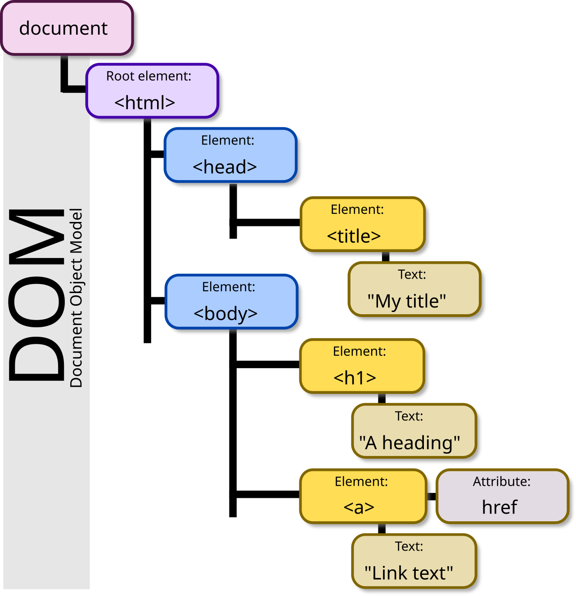

# Why semantics matter

*Semantic HTML isn't a style guide — it's the same decision showing up as an accessibility bug, an SEO problem, a flaky locator, and a lawsuit. Four departments, one tag.*

> In 2019 a blind man named Guillermo Robles tried to order a pizza from Domino's. He
> couldn't — the site didn't work with his screen reader. Domino's argued that the Americans
> with Disabilities Act shouldn't apply to websites. They lost, and the Supreme Court
> declined to hear their appeal. **The pizza company spent four years and a great deal of
> money defending a `<div>`.** Somewhere in that codebase, a decision that took a developer
> under a second to make cost more than most engineering teams earn in a year.

> **In real life**
>
> Semantic markup is **wiring a building to code.** Nobody sees it. The lights work either
> way. The inspector doesn't visit and the tenants never ask. Then one day the fire marshal
> arrives, or the insurance claim is filed, or the building is sold and a survey is done —
> and it turns out that "it worked fine" was never the standard anyone was measuring
> against. Code compliance isn't paperwork about a working building. It's the difference
> between a working building and a lucky one.

## One tag, four bills

You've now seen the mechanics (chapter 1, note 1) and the handles (note 3). This note is
about why anyone should care, told from four desks that never talk to each other:

**The accessibility desk.** A `<div>` with a click handler is unreachable by keyboard,
announces nothing to a screen reader, and is invisible to voice control. Roughly one in
six people worldwide has some disability. Some fraction of them are your users, and they
don't file bug reports — they leave.

**The SEO desk.** Search engines read headings, landmarks and link text to work out what
a page is about. A page whose entire structure is `<div>` tells the crawler nothing, so
it guesses. Marketing then buys ads to recover traffic that better markup would have been
given free.

**The QA desk.** Every role-based locator you write queries the accessibility tree. Div
soup means no roles, which means no role locators, which means CSS-class locators, which
means the flaky suite from note 3. Your test infrastructure inherits the markup's
quality whether or not you agreed to.

**The legal desk.** In the US, the ADA. In the EU, the European Accessibility Act, which
became enforceable for most consumer digital services in June 2025 *(as of 2026-07 — check
current scope, it phases in by sector)*. In the UK, the Equality Act. Public-sector bodies
have had binding requirements for years. This is no longer a matter of taste.

Four desks. One tag name. Nobody in the room when it was chosen.


*DOM tree model — Wikimedia Commons, CC BY-SA 3.0. [Source](https://commons.wikimedia.org/wiki/File:DOM-model.svg)*
- **One document, several trees** — The DOM is what the parser built. The accessibility tree is derived FROM it, keeping only what has meaning: roles, names, states. Semantic tags populate that second tree. Divs contribute nothing to it, which is why they're invisible to assistive tech.
- **Landmarks become a table of contents** — `header`, `nav`, `main`, `footer` and the heading levels give a screen-reader user a jump menu. Take them away and every visit means listening to the page from the top. Nobody stays.
- **Roles become locators** — `getByRole('button', …)` reads the accessibility tree. This is why your test suite silently doubles as an accessibility audit — and why teams who "fix" a failing role locator with a CSS selector have disabled that audit without noticing.
- **A div contributes nothing here** — It occupies space in the DOM and is dropped from the accessibility tree. To a sighted mouse user it is a button. To every other user and every tool, that region of the page is empty. Same pixels, different worlds.
- **The crawler reads this tree too** — Search engines parse structure, not screenshots. Headings, link text and landmarks tell a crawler what the page means. Div soup makes it guess, and then marketing pays to fix the guess.

**The lifecycle of one `<div>` — press Play**

1. **Tuesday, 14:20 — the decision** — A developer needs a clickable thing. `<button>` comes with browser default styles they'd have to reset. `<div onclick>` doesn't. They write the div. Elapsed time: under a second. Nobody reviews it, because it renders correctly and the ticket is closed.
2. **Month 2 — the flaky test** — A tester writes `getByRole('button')`. It fails. They switch to `.cta-primary` and the suite goes green. The accessibility bug has now been detected and silenced by the one system that was reporting it. Everyone did reasonable work.
3. **Month 7 — the redesign** — `.cta-primary` gets renamed. Forty tests go red. Two engineer-days go into a codemod. Nobody connects this to Tuesday, 14:20 — the div is now three refactors old and nobody remembers writing it.
4. **Month 14 — the support ticket** — 'I can't complete checkout with my screen reader.' It gets tagged low-priority: one user, no repro on the team's machines. It sits. Meanwhile every keyboard and screen-reader user who hit it left months ago and filed nothing.
5. **Month 23 — the letter** — A law firm's demand letter. Now it's an audit, a remediation contract, legal fees and a deadline. The engineering fix is still the same one word it was on Tuesday: `div` → `button`. Everything else in those 23 months was the interest.

*Try it — the compounding cost of one wrong tag*

```python
# What it costs to fix the SAME bug at each stage. Numbers are illustrative,
# but the SHAPE is well documented: defects get more expensive the later they're found.
timeline = [
    ("write the tag correctly",      "0 min",   0),
    ("caught in code review",        "5 min",   1),
    ("caught by a failing a11y test","30 min",  1),
    ("found by manual QA later",     "2 hours", 1),
    ("support ticket, months later", "1 day",   1),
    ("external audit + remediation", "3 weeks", 1),
    ("legal action",                 "years",   1),
]

print(f"{'stage':32} {'eng. cost':10} {'users lost meanwhile'}")
print("-" * 72)
lost = 0
for stage, cost, leaking in timeline:
    print(f"{stage:32} {cost:10} {'~' + str(lost) if lost else '0'}")
    if leaking: lost += 40   # every month it ships, more people quietly leave

print()
print("The engineering fix NEVER changes: <div> -> <button>. One word, zero CSS.")
print()
print("What changes is everything attached to it. And note the last column:")
print("users who cannot use your product do not file bugs. They leave, silently,")
print("and your analytics record it as a bounce. That is why nobody notices for")
print("23 months -- the failure mode is INDISTINGUISHABLE from disinterest.")
```

## The rule that makes all of this go away

The W3C calls it the **first rule of ARIA**, and it is the whole discipline in one line:

> If you can use a native HTML element with the semantics and behaviour you require
> already built in, then do so.

You do not need to memorise WCAG. You do not need an audit budget. For the great majority
of real-world defects, you need to use `<button>` for buttons, `<a href>` for links,
`<label>` for labels, `<h1>`–`<h6>` in order, and `<main>`/`<nav>` around the obvious
things. That's it. The browser then gives you focus, keyboard activation, roles and names
for free — and it has been doing so, correctly, for twenty-five years.

> **Tip**
>
> When you file a semantic bug, do not lead with "this violates WCAG 4.1.2." Lead with what
> a person cannot do: *"A keyboard user cannot add anything to the cart. Repro: press Tab —
> focus never reaches the Add to cart control, because it is a `<div>`."* Standards
> citations argue with the reader. A user who cannot buy your product does not. Put the
> standard in a footnote where it belongs.

\`, or \`aria-label\`), and **state** (checked, expanded, disabled). Semantic elements populate it automatically; \`<div>\` and \`<span>\` contribute nothing and are pruned. Inspect it in DevTools' Accessibility pane — and note that \`getByRole\` queries this tree, which is why a role-based test suite audits accessibility on every run without anyone deciding that it should.`}>accessibility tree

### Your first time: Your mission: put a number on it

- [ ] Pick a real checkout or signup flow — Your own product if you have one. Any e-commerce site otherwise. Somewhere money or an account is at stake.
- [ ] Complete it with the keyboard only — Hands off the mouse. Tab, Shift+Tab, Enter, Space, arrows. Note every point you get stuck. Do not cheat — if you're stuck, you're stuck, and so is a real user.
- [ ] Record where you failed — For each blocker, inspect the element and read its role in the Accessibility pane. Write down the tag name. You'll see the same one repeatedly.
- [ ] Translate each into a human sentence — Not 'div has no role'. Instead: 'A keyboard user cannot dismiss the newsletter modal, so they cannot reach the page beneath it.' That sentence gets fixed. The other one gets triaged.
- [ ] Estimate the population — Search the site's own analytics or just cite the WHO's ~16% disability figure. A blocked checkout is not a niche bug — it's a revenue bug with an accessibility cause.

You just ran an accessibility audit with no tools, no training and no budget, and produced findings a product manager will act on.

- **'We'll fix accessibility later, after launch.'**
  Later costs more, and the timeline above shows why. But the argument that actually lands isn't ethical — it's that the same defect is already costing you a flaky test suite and organic traffic today. Bring the forty red builds from note 3 and the crawler's view of the page. Semantic markup is the cheapest of the four fixes and it retires all four bills at once.
- **'Just add ARIA attributes to the divs.'**
  `role="button" tabindex="0"` gets you a role and focus — and you still have to hand-write Enter and Space handlers, the focus ring, and the disabled state. Every one is a chance to get it wrong, and the wrongness now passes automated scanners. The first rule of ARIA exists because ARIA is a repair kit, not a building material. `<button>` gives you all of it, correctly, with no JavaScript.
- **An automated scanner (axe, Lighthouse) reports zero issues, so the page must be fine.**
  Automated tools catch roughly 30–40% of WCAG issues *(widely cited industry figure — verify against your tool's own docs)*. They find missing alt text and contrast failures. They cannot tell you the focus order is nonsense, the alt text says 'image123.png', or the modal traps nobody. Zero automated issues is a floor, not a ceiling. Press Tab.
- **'Our users don't use screen readers.' **
  You cannot know this, because the ones who tried have already left and your analytics recorded them as bounces. And screen readers aren't the whole of it: keyboard-only users include people with RSI, tremor, or a broken trackpad. Semantic markup also serves search crawlers, browser reader modes, translation tools, password managers, and your own test suite — none of which have a disability.

### Where to check

Everything in this note is checkable in under ten minutes:

- **The Tab key** — the whole audit, free, no install. Focus must reach everything interactive, in order, visibly.
- **Elements → Accessibility pane** — role and accessible name. `generic` on something clickable is the bug.
- **Lighthouse → Accessibility** — a floor, not a verdict. Read what it *cannot* check.
- **Your own e2e suite** — every `getByRole` that fails is an accessibility finding you're already paying to collect.
- **`document.querySelectorAll('div[onclick], div[role=button]').length`** — a rough count of the impostors.

Tester's habit: **run the flow with the keyboard before you run it with a tool.** Tools
report what they were built to find. Ten minutes of Tab finds what nobody built a tool
for — and it produces findings written in the language of what a person cannot do, which
is the only language that gets things fixed.

### Worked example: how one QA engineer retired four bills with one grep

1. **The complaint she was given:** "The e2e suite is flaky, fix it." Nothing about accessibility. Nobody had mentioned it.
2. **She reads the failures.** 40 of them name a CSS class (note 3's story). She asks *why* CSS classes and not roles.
3. **She checks.** `grep -c "getByRole" e2e/` → 3. `grep -c "locator('\." e2e/` → 152. The suite avoids role locators almost entirely.
4. **She tests the hypothesis.** She rewrites one CSS locator as `getByRole('button', { name: 'Add to cart' })`. It fails. Inspects: a `<div>`. The suite doesn't use role locators *because they don't work on this codebase.*
5. **She counts.** `document.querySelectorAll('div[onclick]').length` → 61. Sixty-one controls no keyboard user can reach.
6. **She keyboards the checkout.** Blocked at step two. She cannot buy anything from her own employer's website without a mouse.
7. **She writes one document,** and she writes it for four readers. *For engineering:* 61 divs, here's the codemod, no CSS changes needed. *For QA:* once they're buttons, 152 brittle locators become role locators and the flakiness ends. *For marketing:* here's what the crawler sees. *For legal:* here's the EAA date, and here's Domino's.
8. **It ships in a sprint.** Not because of the ethics — those had been in the backlog for two years — but because she showed four people that they had been paying four separate invoices for **one** decision, made on a Tuesday afternoon, by someone who just didn't want to reset a border-radius.
9. **The lesson, and it isn't about HTML:** the fix was never hard. Finding the person who cared was hard. Learn to write the same finding four ways.

> **Common mistake**
>
> Treating semantics as a *checklist item owned by the accessibility person*. There is no
> accessibility person. There is a developer choosing a tag, and that choice quietly bills
> QA (flaky locators), marketing (invisible to crawlers), support (tickets nobody can
> reproduce) and legal (a deadline set by a statute). Every one of those departments would
> have paid for the fix. None of them was in the room. Your job, as the person who tests
> the thing, is to be the one who notices — because the failing role locator on your screen
> is the *only* early warning any of them get.

**Quiz.** An automated accessibility scanner reports zero issues on a page where a `<div onclick>` acts as the primary button. How is that possible?

- [ ] The scanner is broken and should be replaced
- [ ] The div must actually be accessible if the scanner passed it
- [x] Automated tools catch only a fraction of WCAG issues (commonly cited as 30–40%). A div with a click handler is just a div — there's no rule being violated in the markup for a scanner to detect. It takes a human pressing Tab, or a role-based locator failing, to notice that nothing is reachable.
- [ ] Scanners only check colour contrast

*This is the trap that makes 'we ran axe and it was clean' so dangerous. A scanner detects violations it has rules for: missing alt text, low contrast, a label pointing at nothing. A `<div onclick>` breaks no markup rule — it's a perfectly valid div. What's broken is that a whole interaction is missing from the accessibility tree, and only a human pressing Tab, or a getByRole locator resolving to zero elements, will tell you. Zero automated issues is a floor, never a verdict.*

- **The first rule of ARIA** — If a native HTML element with the semantics and behaviour you need exists, use it. ARIA is a repair kit, not a building material.
- **The four bills for one wrong tag** — Accessibility (users locked out), SEO (crawlers guess), QA (no role locators → brittle CSS ones), legal (ADA / EAA / Equality Act).
- **What an automated scanner catches** — Roughly 30–40% of WCAG issues — missing alt, contrast, broken label associations. Never focus order, never a div-as-button. Zero issues is a floor.
- **Why nobody notices for years** — Users who can't use the product don't file bugs. They leave, and analytics records it as a bounce — indistinguishable from disinterest.
- **How to file a semantic bug** — Lead with what a person cannot do ('a keyboard user cannot reach checkout'), not with a WCAG clause number. Standards go in the footnote.
- **Accessibility tree** — Derived from the DOM; holds role, accessible name, state. Semantic tags populate it; divs are pruned. `getByRole` queries it.
- **Why `role=button tabindex=0` isn't the fix** — You must still hand-write Enter/Space handlers, focus ring and disabled state. Each is a chance to be wrong — and now it passes scanners.

### Challenge

Take the checkout or signup flow of any product you use daily. Complete it with the
keyboard only — no mouse, no trackpad, no cheating. Time yourself. Note every place you
get stuck, inspect the element, and write down its tag. Then write the finding twice: once
as an engineer would file it, once as a sentence about a person who cannot buy something.
Notice which version you'd rather hand to a product manager, and which one gets scheduled.

### Ask the community

> Semantics finding: [element] is a `<[tag]>` with a click handler. Accessibility pane: role=[r], name=[n]. Reachable by Tab: [y/n]. Enter/Space activates it: [y/n]. Blocks this user journey: [describe]. getByRole locator resolves to: [0 / n] elements.

The last line is the one that gets you an engineer's attention rather than an argument.
A failing role locator is a machine-checkable, CI-reproducible statement that the control
does not exist in the accessibility tree. It is not an opinion about markup style, and it
cannot be triaged away as subjective.

- [W3C — the first rule of ARIA (read this one)](https://www.w3.org/WAI/ARIA/apg/practices/read-me-first/)
- [WebAIM Million — an annual accessibility survey of the top 1,000,000 home pages](https://webaim.org/projects/million/)
- [W3C WAI — accessibility fundamentals](https://www.w3.org/WAI/fundamentals/accessibility-intro/)
- [MDN — ARIA roles reference (for when you truly have no native element)](https://developer.mozilla.org/en-US/docs/Web/Accessibility/ARIA/Roles)

🎬 [What a screen reader actually hears on a page of divs](https://www.youtube.com/watch?v=bnu-hLmxYrY) (14 min)

- One wrong tag bills four departments: accessibility, SEO, QA (via brittle locators), and legal. None of them is in the room when it's chosen.
- The first rule of ARIA retires most of it: if a native element with the right semantics exists, use it. `<button>` gives you focus, keyboard, role and name for free.
- Automated scanners catch a fraction of real issues and cannot see a div-as-button at all. Zero findings is a floor, not a verdict. Press Tab.
- Users who can't use your product don't file bugs — they leave, and analytics calls it a bounce. That's why it goes unnoticed for years.
- A failing `getByRole` locator is the earliest, cheapest, most machine-checkable accessibility warning any team receives. Don't silence it with a CSS selector.


---
_Source: `packages/curriculum/content/notes/the-web-platform-for-testers/html-essentials/why-semantics-matter.mdx`_
