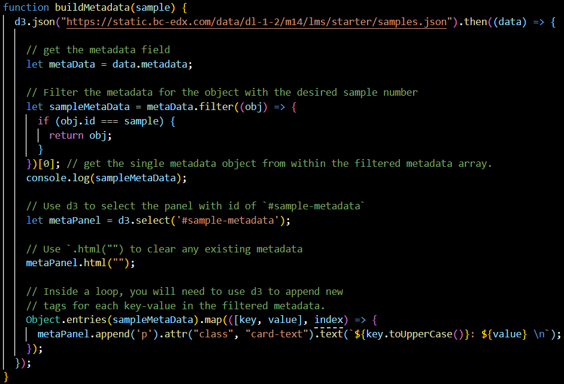

# What JS does on a page

*You will never write production JavaScript. You will read it every week. Here's what it actually does to a page — and why the DOM you inspect is almost never the HTML the server sent.*

> Nobody expects a tester to write JavaScript. Everybody expects a tester to look at a
> red error in the console and say something more useful than "there's a red thing."
> Those are wildly different skills, and only the second one is your job. The good news:
> reading JavaScript is enormously easier than writing it, and about six concepts cover
> everything you'll meet in a bug report for the rest of your career.

> **In real life**
>
> If HTML is the skeleton and CSS is the skin (Module 3's closer), JavaScript is the
> **muscle *and* the nervous system.** It moves things, yes — but more importantly it
> *listens*. It waits for a click, waits for data to come back from a server, and then
> rewrites the body while you're standing in it. Which means the page you're inspecting
> is not the page that arrived. It's the page after surgery, performed live, by a program.

## The six things JavaScript does. That's the list.

1. **Finds elements** in the page — `document.querySelector('#pay')` queries the **DOM**: Document Object Model — the browser's live in-memory tree of the page. It starts as the HTML the server sent and is then rewritten by JavaScript, which is why the Elements panel and View source usually disagree., the same hunt your test locators perform.
2. **Changes them** — text, classes, attributes, visibility. The DOM mutates.
3. **Listens for events** — clicks, typing, scrolling, page load. (Next note.)
4. **Talks to servers** — `fetch()`, sending Module 3's requests and handling responses.
5. **Stores things** — local storage, session storage, cookies. Where stale-state bugs breed.
6. **Waits** — timers and promises, doing things later. (Two notes from now, and it's the source of every flaky test you'll ever write.)

Everything else is elaboration.


*JavaScript source code — Wikimedia Commons, CC0. [Source](https://commons.wikimedia.org/wiki/File:SampleJavaScriptCode.png)*
- **function — a named block of behaviour** — A recipe with a name. It does nothing until something CALLS it. Half of 'the button does nothing' bugs are a perfectly correct function that nobody ever called, and you can see that in the console: no error, no request, nothing happened at all.
- **Variables hold state** — `const` never changes, `let` does, `var` is the old one you'll meet in old code. When a test sees stale data on screen, some variable is holding yesterday's value — and the fix is never in the HTML.
- **The semicolons and the noise** — Punctuation. Genuinely ignorable for reading purposes. Testers who freeze at JavaScript are usually freezing at syntax, not at meaning — and meaning is all you need. Read the verbs, skip the grammar.
- **Indentation shows nesting** — Deeper means 'inside'. Follow the indentation to see what runs when. This alone lets you read a stack trace later and say which block was executing when everything caught fire.

**JavaScript rewriting the page under your feet — press Play**

1. **📄 The server sends HTML** — An empty shell: a `div` with an id, maybe a spinner. That's ALL the server sent. Press Ctrl+U on many modern sites and you'll find almost no content — just a script tag and a hopeful empty container.
2. **📜 The script runs** — It finds that container by its id, exactly the way a test locator would. Nothing is visible yet; the page still looks empty. Everything that will exist is about to be manufactured on the user's machine.
3. **🌐 It fetches data** — `fetch('/api/products')` — one of Module 3's requests, fired from inside the browser. The spinner spins. The user waits. This request is visible in the Network panel, and its response body is the ONLY truth about what data arrived.
4. **🏗 It builds the DOM** — For each product, it creates elements and inserts them into the container. The page fills. None of this exists in View source — it was assembled here, in memory, seconds ago. THIS is why the Elements panel and View source disagree.
5. **🧪 Your test looks for a product** — If it looks before step 4 finishes, it finds nothing and fails — and the failure will look like a missing element rather than a timing problem. Every flaky test you will ever write is standing on this exact gap. Learn it now, save yourself a year.

*Try it — read JavaScript by translating it, not by memorizing it*

```python
# You don't need to WRITE JavaScript. You need to READ it. It maps almost
# line-for-line onto Python, which you have been reading all module.

pairs = [
    ("const total = 0;",                      "total = 0            # never reassigned"),
    ("let count = 5;",                        "count = 5            # can change"),
    ("if (user.isAdmin) { show(); }",         "if user.is_admin: show()"),
    ("items.forEach(i => print(i));",         "for i in items: print(i)"),
    ("function pay(amount) { ... }",          "def pay(amount): ..."),
    ("document.querySelector('#pay')",        "find the element with id 'pay'"),
    ("el.textContent = 'Sold out';",          "set that element's visible text"),
    ("el.classList.add('disabled');",         "add a CSS class (changes appearance)"),
    ("fetch('/api/orders')",                  "send an HTTP GET (Module 3!)"),
    ("localStorage.setItem('k', 'v')",        "store a value in the browser"),
]
print(f"{'JavaScript':42} {'What it means'}")
print("-" * 84)
for js, meaning in pairs:
    print(f"{js:42} {meaning}")
print()
print("That's the whole vocabulary of a bug report. You can now read the line")
print("a stack trace points at and say what it was TRYING to do — which is")
print("the entire skill. Nobody is asking you to write the fix.")
```

## Why the DOM and the HTML disagree

`View source` (Ctrl+U) shows the HTML the server sent. The **Elements panel** shows the
DOM *right now*, after JavaScript has added, removed and rewritten nodes.

On a modern site those two are barely related. The source may be a near-empty shell; the
DOM is a full page built in the browser. Once you've seen this, three things stop being
mysterious at once: why your test can't find an element that's plainly visible, why
"view source" looks empty, and why disabling JavaScript leaves some sites completely blank.

> **Tip**
>
> The single most useful sentence a tester can put in a bug report about JavaScript:
> **"the console shows `TypeError: cannot read property 'name' of undefined` at
> `checkout.js:42`."** You did not need to understand the code. You copied a line. That
> line names the file, the position, and the nature of the fault — and it converts an
> unassignable ticket into a five-minute fix. Reading JavaScript, for a tester, mostly
> means being willing to copy the red text instead of describing it.

### Your first time: Your mission: watch JavaScript build a page

- [ ] Compare source with DOM — Open any modern web app. Ctrl+U (view source) — note how little content there is. Now F12 → Elements. Enormous. The difference is JavaScript's work, done on your machine, moments ago.
- [ ] Watch a mutation happen — Keep the Elements panel open and click something that changes the page. Nodes flash as they're rewritten. You are watching step 4 of the FlowAnimation, live.
- [ ] Run one line yourself — In the Console, type `document.querySelector('h1').textContent = 'I did this'` and press Enter. The headline changes. You just did what every script does — and nothing was saved; refresh and it's gone.
- [ ] Find a fetch in the wild — Network panel → filter Fetch/XHR → click around. Every entry is a `fetch()` call in someone's JavaScript. Module 3's requests, issued from code you can now read.
- [ ] Break it on purpose — In the Console, type `null.foo`. Read the TypeError. That's the exact error class behind most 'the page looks fine but nothing works' bugs — some value was missing and the code assumed it wasn't.

Source vs DOM compared, a live mutation watched, one line executed, one error caused deliberately. JavaScript is no longer a wall.

- **`TypeError: cannot read property 'x' of undefined`**
  The most common JavaScript error in existence, and it's readable. Something was expected to be an object and was `undefined` instead — usually data that hadn't arrived yet, or an API response missing a field. Check the Network panel: did the request return, and does its body actually contain `x`? Half the time the API changed its shape and the front-end wasn't told. That's a real, well-scoped bug, and the console named the file and line for you.
- **My test can't find an element that I can see on the page.**
  It exists in the DOM but not in the HTML — JavaScript created it after load. The test looked too early. Fix: wait for the element rather than query immediately (`await expect(locator).toBeVisible()`). This is not a workaround; it's the correct model of a page that builds itself. Confirm by comparing View source with the Elements panel.
- **A button works, then stops working after I navigate around.**
  Its event handler was attached to an element that JavaScript later replaced. The new button looks identical and has no listener — a classic bug in apps that rebuild parts of the DOM. Report it as 'handler lost after re-render'. Testers find these constantly by doing the boring thing: using the app for more than thirty seconds.
- **Disabling JavaScript makes the site completely blank.**
  Working as designed for a client-rendered app — the server sent a shell, and JavaScript was going to build everything. Worth knowing rather than reporting, with one exception: if the content should be indexable or accessible without JS (a public marketing page, say), a blank no-JS render is a genuine SEO and resilience finding.

### Where to check

Where JavaScript shows itself:

- **Console** — errors with file and line. Also a live prompt: type any expression and see its value. It's a calculator sitting inside the page.
- **Elements panel** — the DOM after JavaScript. Compare with View source to see what was built.
- **Network → Fetch/XHR** — every `fetch()` the code made, with the response body it received.
- **Sources panel** — the actual script files. You can even set a breakpoint and pause execution, though that's Track C territory.
- **Application → Storage** — what the code stored. Where stale-state bugs live (Module 3's logout example).
- **DevTools → Settings → Disable JavaScript** — the cleanest way to see how much of an app depends on it.

Tester's reflex: **when behaviour is wrong, the Console is the first place, not the last.**
Red text there is not noise. It's a signed confession with a file name and a line number.

### Worked example: the API that changed its mind and broke the page

A bug that looks like a front-end crash and is really a contract change.

1. **Symptom:** the profile page shows a spinner forever. Nothing renders.
2. **Console.** Red: `TypeError: cannot read property 'displayName' of undefined` at `profile.js:87`. You don't need to understand `profile.js`. You have a file, a line, and a name: `displayName`.
3. **Network → Fetch/XHR.** `GET /api/user/me` → **200 OK**. The server is happy. Read the response body: `{"id": 42, "name": "Sajan", "email": "..."}`.
4. **Put the two facts together.** The code asked for `displayName`. The response contains `name`. The field was renamed — and nothing else in the system noticed, because a 200 is a 200.
5. **Confirm rather than assume.** Check an older environment, or the API docs: `displayName` was the old field. A backend release renamed it, the front-end still asks for the old name, and JavaScript's answer to "read a property of something that doesn't exist" is to throw and take the whole render down.
6. **The report:** '`GET /api/user/me` now returns `name`; front-end reads `displayName` (profile.js:87) and throws TypeError, blocking render. Either restore the field or update the client. Response body attached.'
7. **What the tester actually did:** read a red line, read a response body, noticed two words didn't match. No JavaScript was written. No JavaScript was even fully understood. This is what "reading JavaScript" means in practice, and it is worth an enormous amount.

> **Common mistake**
>
> Skipping the console because "I'm not a developer, that's not for me." The console is
> not a developer tool that testers may borrow — it is the single richest source of bug
> evidence in the browser, and it speaks in complete sentences: what went wrong, in which
> file, on which line, while doing what. A tester who reads it turns "the page is broken"
> into a ticket a developer can act on before lunch. A tester who doesn't is guessing at
> the outside of a machine that is, right now, describing its own injury in plain text.
> Being unable to *write* the fix is fine and expected. Refusing to *read* the diagnosis
> is a choice, and it's the difference between the two testers in every worked example in
> this curriculum.

**Quiz.** The console shows `TypeError: cannot read property 'displayName' of undefined` and the API returns 200 with body `{id: 42, name: 'Sajan'}`. What is the bug?

- [ ] The server is broken — it returned an error
- [x] The API response contains `name`, but the front-end code reads `displayName`. The field was renamed server-side and the client wasn't updated, so JavaScript throws when reading a property of a value that isn't there — taking the render down with it.
- [ ] The user's profile is missing data
- [ ] JavaScript is disabled in the browser

*A 200 status means the server did its job — but 'did its job' says nothing about the SHAPE of the data. The TypeError is JavaScript's way of reporting that it reached for a property on something undefined, and the response body shows exactly why: the field is called `name` now. Two artifacts, one mismatch, one precise bug report. Notice that neither artifact required reading the application's source code.*

- **The six things JS does** — Finds elements, changes them, listens for events, talks to servers (fetch), stores things, and waits (timers/promises). Everything else is elaboration.
- **Source vs DOM** — View source = the HTML the server sent. Elements panel = the DOM after JavaScript rewrote it. On modern apps they're barely related.
- **TypeError: ... of undefined** — The most common JS error. Code reached for a property on something that isn't there — usually data that hadn't arrived, or an API field that got renamed.
- **Reading JS as a tester** — You don't write it. You copy the red console line — file, line, error type — and compare what the code expected against what the API returned.
- **Why tests can't find visible elements** — The element was created by JavaScript after load. The test looked too early. Wait for it; don't query immediately.
- **Handler lost after re-render** — JavaScript replaced an element; the new one looks identical but has no event listener attached. A classic bug found by using the app for more than thirty seconds.

### Challenge

Open a web app, press Ctrl+U, and count the words of real content in the source. Then
open the Elements panel and look at how much is there. The gap is what JavaScript built.
Now open the Console and type `document.querySelectorAll('button').length` — that's how
many buttons your test framework would find. You just queried the DOM the way a test does,
and you have written no code.

### Ask the community

> JavaScript question: console shows `[paste the exact red error, with file:line]`. The API request `[method + url]` returned `[status]` with body `[paste]`. The code at that line appears to expect `[field/thing]`. Page behaviour: [what happens].

Notice this template never asks you to interpret the code — only to place the error next
to the data. Almost every JavaScript bug a tester meets is a mismatch between what the
code expected and what actually arrived, and putting those two things side by side is
the entire diagnosis.

- [MDN — what JavaScript is, for people who won't write it](https://developer.mozilla.org/en-US/docs/Learn/JavaScript/First_steps/What_is_JavaScript)
- [Chrome DevTools — the console, properly](https://developer.chrome.com/docs/devtools/console/)
- [JavaScript, explained for readers](https://www.youtube.com/watch?v=W6NZfCO5SIk)

🎬 [What JavaScript actually does on a page](https://www.youtube.com/watch?v=W6NZfCO5SIk) (12 min)

- JavaScript does six things: finds elements, changes them, listens for events, calls servers, stores data, and waits. Everything else elaborates on those.
- The DOM you inspect is not the HTML the server sent — JavaScript rewrote it. That gap explains empty view-source, blank no-JS pages, and tests that can't find visible elements.
- You never have to write JavaScript to test it. You have to copy the red console line, which names the error, the file and the line.
- `TypeError: ... of undefined` almost always means the data's shape differed from what the code expected — compare the console error with the API response body.
- The console is the richest bug-evidence source in the browser. Refusing to read it is a choice, and it's what separates 'it's broken' from a ticket that gets fixed.


---
_Source: `packages/curriculum/content/notes/the-web-platform-for-testers/javascript-for-readers/what-js-does-on-a-page.mdx`_
