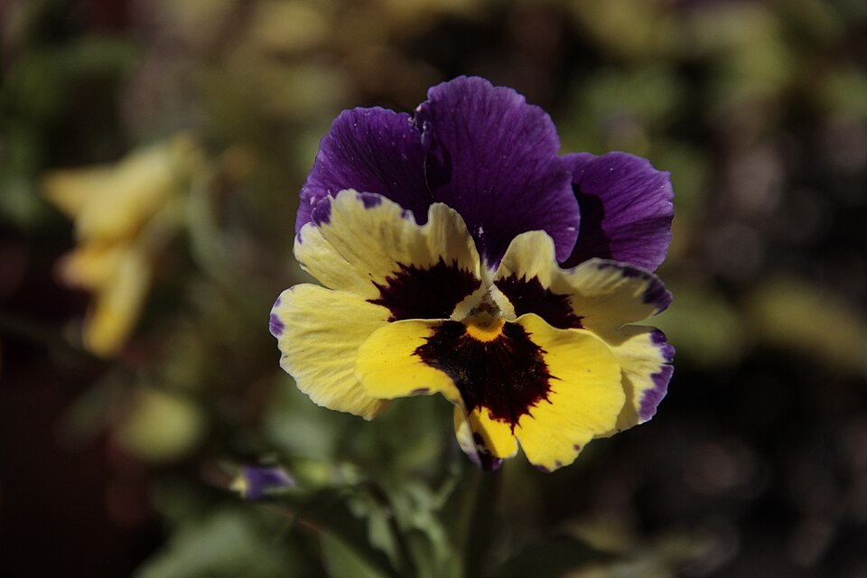

# Color harmony

*Complementary (180° apart), triadic (120° apart), analogous (within 30°), and split-complementary schemes are just fixed hue-angle offsets on the color wheel - checkable with arithmetic, and real production palettes usually approximate one rather than hitting it exactly.*

> A designer says a palette is "complementary." You don't have to take their word for it - pull the
> two hex values, convert to HSV, subtract the hues, and check whether the answer is close to 180. Color
> harmony schemes have exact numeric definitions, which means a claim about them is checkable the same
> way a claim about contrast ratios is checkable - not a matter of taste, a matter of arithmetic.

> **In real life**
>
> A pansy's petals: the top two are deep violet-purple, the bottom three are bright yellow with a dark
> maroon throat. Purple and yellow sit almost exactly opposite each other on the color wheel - the
> flower is running a complementary color scheme it didn't design, it grew that way, and the effect
> (each color making the other look more vivid) is the same reason designers deliberately pair
> opposite hues for a bold call-to-action against a calmer background.

**Color harmony**: Color harmony schemes are named relationships between hues, defined by their angular distance apart on the 360°-hue color wheel. Complementary = 180° apart (opposite). Triadic = three hues 120° apart (evenly spaced). Split-complementary = a base hue plus the two hues flanking its complement (roughly 150° and 210° from the base). Analogous = hues within about 30° of each other (adjacent on the wheel). Each scheme is a fixed offset pattern, checkable by converting real colors to HSV and comparing hue differences.

## What each scheme is actually checking

- **Complementary (180°)** — maximum contrast; commonly used to make a call-to-action pop against
  a background of its opposite hue.
- **Triadic (120°/240°)** — three evenly-spaced hues; vibrant and playful, usually with one hue
  dominant and the other two used as smaller accents.
- **Split-complementary (~150°/~210°)** — nearly as much contrast as complementary, softer because
  neither accent is the exact opposite.
- **Analogous (within ~30°)** — adjacent hues; calm, low-contrast, cohesive - the scheme most likely
  to accidentally fail contrast requirements since the hues are close together and can end up close
  in perceived brightness too.
- **None of these guarantee accessible contrast on their own.** A "correct" complementary pair (like
  a saturated red and a saturated green, both mid-brightness) can still fail WCAG contrast ratios -
  harmony is about hue relationships, not the luminance checks covered in
  [[ui-ux-design-qa/color-theory-for-testers/contrast-and-wcag-ratios]].

> **Tip**
>
> When a palette is described by name ("we're using a triadic scheme"), verify it the same way you'd
> verify any other spec claim: convert the actual hex values to HSV and check the hue differences.
> Real palettes rarely hit the textbook angle exactly - being within roughly 10-15° of the target is a
> reasonable practical tolerance, not grounds for a bug report on its own.

> **Common mistake**
>
> Flagging a palette as "not really triadic/complementary" because the hue difference isn't the exact
> textbook number. Designers routinely nudge a harmony scheme's angles for brand fit, accessibility,
> or because a slightly-off hue simply renders better on screens - a scheme approximating its target
> angle within a reasonable margin is still a legitimate, intentional harmony choice, not a defect.


*Viola Tricolor (purple, yellow and brown) — Wikimedia Commons, CC BY-SA 4.0. [Source](https://commons.wikimedia.org/wiki/File:Viola_Tricolor_(purple,_yellow_and_brown).JPG)*
- **Upper petals — violet-purple** — A hue firmly in the purple range of the wheel, roughly opposite yellow - the dominant color of the top two petals.
- **Lower petals — bright yellow** — Yellow sits close to 180° away from purple on a standard hue wheel - this flower's two dominant colors form a naturally-occurring complementary pair, which is exactly why the contrast reads as so vivid.
- **The dark maroon throat marking** — A third, much darker and less saturated color near the flower's center - a reminder that a real palette (natural or designed) is rarely just two pure harmony-scheme hues; a supporting near-black/desaturated accent is common alongside the two main hues.

**Verifying a claimed color scheme**

1. **A palette is described by name (complementary, triadic, etc.)** — Usually asserted by a designer or a style guide, not yet independently checked.
2. **Pull the actual hex/RGB values for each color in the claim** — From the design file, DevTools, or the design-token source directly.
3. **Convert each to HSV and note the hue** — Only the hue number matters for this check - saturation and value are irrelevant to harmony classification.
4. **Compute the hue differences between the colors** — Wrap at 360° - the difference between 350° and 10° is 20°, not 340°.
5. **Compare against the scheme's target angle within a reasonable tolerance** — Close (roughly 10-15°) counts as a legitimate match; wildly off is worth asking about, not automatically flagging as wrong.

Every harmony scheme is just a fixed hue offset — deriving them from a base hue is pure, checkable
arithmetic:

*Run it - deriving every harmony scheme from one base hue (Python)*

```python
def wrap_hue(h):
    return h % 360

def harmony_hues(base_hue):
    return {
        "complementary": [wrap_hue(base_hue + 180)],
        "split-complementary": [wrap_hue(base_hue + 150), wrap_hue(base_hue + 210)],
        "analogous": [wrap_hue(base_hue - 30), wrap_hue(base_hue + 30)],
        "triadic": [wrap_hue(base_hue + 120), wrap_hue(base_hue + 240)],
    }

base = 210  # a blue accent, picked as the base/dominant hue

print(f"Base hue: {base}° (a blue)")
print()
schemes = harmony_hues(base)
for scheme, hues in schemes.items():
    hues_str = ", ".join(f"{h}°" for h in hues)
    print(f"  {scheme:<22} -> {hues_str}")

print()
print("Every one of these numbers is base_hue plus a fixed offset, wrapped")
print("at 360°. 'Complementary' isn't a vibe - it's exactly +180°. 'Triadic'")
print("is exactly +120° and +240°. A palette that LOOKS harmonious and one")
print("that was mathematically derived this way often turn out to be the")
print("same palette - harmony schemes are angles on a circle, not taste.")

# Base hue: 210 deg (a blue)
#
#   complementary          -> 30 deg
#   split-complementary    -> 0 deg, 60 deg
#   analogous              -> 180 deg, 240 deg
#   triadic                -> 330 deg, 90 deg
#
# Every one of these numbers is base_hue plus a fixed offset, wrapped
# at 360 deg. 'Complementary' isn't a vibe - it's exactly +180 deg. 'Triadic'
# is exactly +120 deg and +240 deg. A palette that LOOKS harmonious and one
# that was mathematically derived this way often turn out to be the
# same palette - harmony schemes are angles on a circle, not taste.
```

Turning that same check around — classifying a REAL palette by measuring its hue distance — works on
QA Mastery's own live design tokens:

*Run it - classifying QA Mastery's own accent/bug tokens by hue distance (Java)*

```java
public class Main {
    static double[] rgbToHsv(double r, double g, double b) {
        double max = Math.max(r, Math.max(g, b));
        double min = Math.min(r, Math.min(g, b));
        double delta = max - min;
        double h;
        if (delta == 0) h = 0;
        else if (max == r) h = 60 * (((g - b) / delta) % 6);
        else if (max == g) h = 60 * (((b - r) / delta) + 2);
        else h = 60 * (((r - g) / delta) + 4);
        if (h < 0) h += 360;
        double s = (max == 0) ? 0 : delta / max;
        return new double[]{h, s * 100, max * 100};
    }

    static double[] hexToRgb01(String hex) {
        int r = Integer.parseInt(hex.substring(0, 2), 16);
        int g = Integer.parseInt(hex.substring(2, 4), 16);
        int b = Integer.parseInt(hex.substring(4, 6), 16);
        return new double[]{r / 255.0, g / 255.0, b / 255.0};
    }

    public static void main(String[] args) {
        // QA Mastery's own real dark-mode design tokens (apps/platform globals.css)
        double[] accentRgb = hexToRgb01("2dd4a7"); // --accent
        double[] bugRgb = hexToRgb01("f5b948");    // --bug

        double[] accentHsv = rgbToHsv(accentRgb[0], accentRgb[1], accentRgb[2]);
        double[] bugHsv = rgbToHsv(bugRgb[0], bugRgb[1], bugRgb[2]);

        double diff = Math.abs(accentHsv[0] - bugHsv[0]);
        if (diff > 180) diff = 360 - diff;

        System.out.println("Classifying QA Mastery's own live design tokens by hue distance:");
        System.out.println();
        System.out.printf("  --accent (#2dd4a7): hue %.1f%n", accentHsv[0]);
        System.out.printf("  --bug    (#f5b948): hue %.1f%n", bugHsv[0]);
        System.out.printf("  hue distance: %.1f%n", diff);
        System.out.println();

        String[] labels = {"complementary (180 deg)", "triadic (120 deg)", "split-complementary (150 deg)", "analogous (<=30 deg)"};
        double[] targets = {180, 120, 150, 30};
        String closest = null;
        double bestGap = Double.MAX_VALUE;
        for (int i = 0; i < targets.length; i++) {
            double gap = Math.abs(diff - targets[i]);
            if (gap < bestGap) {
                bestGap = gap;
                closest = labels[i];
            }
        }
        System.out.printf("Closest textbook scheme: %s, off by %.1f%n", closest, bestGap);
        System.out.println();
        System.out.println("124.6 is close to triadic's 120 but doesn't hit it exactly - real");
        System.out.println("production palettes rarely land on a textbook-perfect angle. That's");
        System.out.println("not a bug in the palette; designers nudge hues for contrast, brand fit,");
        System.out.println("or accessibility, and 'roughly triadic' is still a coherent harmony");
        System.out.println("choice. The math tells you WHICH relationship a palette approximates -");
        System.out.println("it doesn't demand the palette hit the angle to the decimal.");
    }
}

/* Classifying QA Mastery's own live design tokens by hue distance:

     --accent (#2dd4a7): hue 163.8
     --bug    (#f5b948): hue 39.2
     hue distance: 124.6

   Closest textbook scheme: triadic (120 deg), off by 4.6

   124.6 is close to triadic's 120 but doesn't hit it exactly - real
   production palettes rarely land on a textbook-perfect angle. That's
   not a bug in the palette; designers nudge hues for contrast, brand fit,
   or accessibility, and 'roughly triadic' is still a coherent harmony
   choice. The math tells you WHICH relationship a palette approximates -
   it doesn't demand the palette hit the angle to the decimal. */
```

### Your first time: Your mission: classify a real palette by measured hue distance

- [ ] Pick two or three colors from any real design system (this platform's tokens, or another app you use) — Design tokens, brand colors, or a component library's accent set all work.
- [ ] Convert each to HSV and record just the hue — Saturation and value don't matter for this specific check.
- [ ] Compute the pairwise hue distances (wrapping at 360°) — Watch for the wraparound case - the difference between hues near 0° and near 360° is small, not large.
- [ ] Compare each distance against the four target angles (180/120/150/30) — Note which scheme each pairing most closely approximates.
- [ ] Write down whether the palette matches its stated/intended scheme, and by how much — A precise 'off by 4.6°, still a reasonable match' beats a vague 'looks about right.'

You've practiced turning a subjective-sounding design claim ("this is a triadic palette") into a
measured, falsifiable check - the same instinct that makes contrast-ratio and spacing audits rigorous.

- **A hue-distance calculation gives a huge number (like 340°) for two colors that look close together.**
  Classic wraparound bug - always take the shorter arc: if the raw difference exceeds 180°, subtract it from 360° to get the true angular distance (as the Java playground does with `if (diff > 180) diff = 360 - diff`).
- **A palette is 15-20° off its claimed scheme's target angle, and you're unsure whether that's worth flagging.**
  There's no universal hard cutoff, but as a practical guideline: within ~10-15° is a reasonable, intentional match; beyond ~20-25° is worth a genuine question to the designer about intent, since it's drifting toward a different relationship entirely (or no clear scheme).
- **Two colors form a mathematically perfect complementary or triadic pair but look muddy or clash badly together in the actual UI.**
  Hue relationship alone doesn't guarantee a pleasant result - saturation and value mismatches (see [[ui-ux-design-qa/color-theory-for-testers/hue-saturation-and-value]]) can make a textbook-correct hue pairing look wrong anyway. A harmony check is one input, not a complete aesthetic guarantee.

### Where to check

- **The design system's actual token values** (CSS custom properties, a Figma variables panel) — the ground truth for what colors are actually in use, versus what's merely described in documentation.
- **Any HSV-capable color picker** — for a quick manual hue read without writing code.
- **lawsofux.com / standard color-theory references** — for the canonical target angles if you want a citation alongside your measured numbers.
- **[[ui-ux-design-qa/color-theory-for-testers/contrast-and-wcag-ratios]]** — a harmony check tells you about hue relationships only; pair it with an actual contrast-ratio check before signing off on legibility.

### Worked example: checking a claimed 'complementary' palette

1. A style guide states the product uses "a complementary palette: brand blue and accent orange."
2. Pulling the actual hex values: brand blue is #1E5EDB, accent orange is #E8862E.
3. Converting to HSV: blue's hue is 221°, orange's hue is 29°. Hue distance: |221 - 29| = 192°,
   which wraps to 360 - 192 = 168° (since it exceeds 180°, take the shorter arc).
4. 168° is close to the complementary target of 180°, off by only 12° - within the reasonable
   tolerance from this note's practical guideline.
5. Finding: "Confirmed - brand blue (hue 221°) and accent orange (hue 29°) form a near-complementary
   pair, 168° apart versus an exact 180°. Within normal tolerance for an intentional complementary
   scheme; no action needed." A verified claim, not just an assumed one.

**Quiz.** Two colors have hues of 15° and 265°. What is their correct wrapped hue distance, and which harmony scheme does that distance most closely approximate?

- [ ] 250°, which doesn't match any standard scheme - the colors are unrelated
- [x] 110°, approximating a triadic relationship (120°)
- [ ] 130°, approximating a split-complementary relationship (150°) most closely among the four schemes, though it's also roughly between triadic and split-complementary
- [ ] 15°, approximating an analogous relationship

*The raw difference between 265 and 15 is 250. Since 250 exceeds 180, the correct wrapped distance is 360 - 250 = 110 (the shorter arc around the circle) - exactly the method this note's Java playground uses (`if (diff > 180) diff = 360 - diff`). Among the four target angles (180 complementary, 150 split-complementary, 120 triadic, 30 analogous), 110 is closest to 120 (triadic), off by only 10 - well within the reasonable tolerance this note describes. Option one is wrong because it uses the unwrapped raw difference (250) instead of the correct shorter arc. Option three's 130 value is simply an incorrect distance calculation, and even if it were the true distance, 130 sits almost exactly between triadic (120) and split-complementary (150) rather than being a clean nearest match to either - this option is included as a plausible-sounding but arithmetically wrong distractor. Option four's raw subtraction (265-15=250, not 15) reflects a miscalculation, not the wrapped result.*

- **The four harmony schemes' target hue offsets** — Complementary: 180°. Triadic: 120° and 240°. Split-complementary: ~150° and ~210°. Analogous: within ~30°.
- **The wraparound rule for hue distance** — If the raw hue difference exceeds 180°, subtract it from 360° to get the true (shorter-arc) angular distance.
- **Why hue harmony alone doesn't guarantee legible contrast** — Harmony schemes only constrain hue relationships - two hues that form a perfect complementary pair can still have similar saturation/value and fail a WCAG contrast check.
- **The practical tolerance for calling a palette 'a match' to its claimed scheme** — Roughly within 10-15° of the target angle is a reasonable, intentional match; beyond ~20-25° is worth asking the designer about, not automatically flagging as broken.
- **Why real palettes rarely hit exact textbook angles, and why that's fine** — Designers nudge hues for brand fit, contrast, or on-screen rendering - an approximate match to a harmony scheme is still a legitimate, intentional design choice, not a defect.

### Challenge

Pick two or three real colors from this platform's own design tokens (or another product's design
system). Convert each to HSV, compute the pairwise hue distances with correct wraparound handling,
and classify which harmony scheme (if any) each pairing most closely approximates. Note how close
or far the actual distance is from the textbook target angle.

### Ask the community

> I measured the hue distance between `[color A]` and `[color B]` as `[N]°`. I think this approximates a `[complementary/triadic/split-complementary/analogous]` scheme, off by `[gap]°` from the textbook angle. Does that read as a reasonable match, or is the gap large enough to be worth flagging?

The most useful replies will weigh in on where the practical tolerance line sits for your specific
case - a small gap on a subtle background accent matters less than the same gap on a primary
call-to-action pairing.

- [Interaction Design Foundation — Complementary Colors: The Ultimate Guide](https://ixdf.org/literature/article/complementary-colors-and-color-wheel)
- [Supercharge Design — Color Harmonies in UI: In-depth Guide](https://supercharge.design/blog/color-harmonies-in-ui-in-depth-guide)
- [Cecilia Marranita Atelier — Color Theory for Beginners: Color Harmonies, Complementary, Triadic, Monochromatic](https://www.youtube.com/watch?v=X7cVdqHo9BA)

🎬 [Sarah Renae Clark — Color Theory Basics: Use the Color Wheel & Color Harmonies to Choose Colors that Work Well Together](https://www.youtube.com/watch?v=YeI6Wqn4I78) (7 min)

- Color harmony schemes are fixed hue-angle offsets on the 360° wheel: complementary 180°, triadic 120°/240°, split-complementary ~150°/~210°, analogous within ~30°.
- A claimed scheme is checkable arithmetic - convert real colors to HSV, compute hue distance (with correct 360° wraparound), and compare to the target angle.
- Real production palettes usually approximate a scheme rather than hitting the exact angle - being off by 10-15° is normal, not a defect.
- Hue harmony alone doesn't guarantee accessible contrast - a textbook-correct hue pairing can still fail a WCAG contrast check if saturation/value are mismatched.
- Verifying a design claim with a quick hue-distance calculation is the same rigor this track applies everywhere: check the number, don't just trust the label.


## Related notes

- [[Notes/ui-ux-design-qa/color-theory-for-testers/hue-saturation-and-value|Hue, saturation & value]]
- [[Notes/ui-ux-design-qa/color-theory-for-testers/contrast-and-wcag-ratios|Contrast & WCAG ratios]]
- [[Notes/ui-ux-design-qa/design-principles-and-the-laws-of-ux/gestalt-principles|Gestalt principles]]


---
_Source: `packages/curriculum/content/notes/ui-ux-design-qa/color-theory-for-testers/color-harmony.mdx`_
