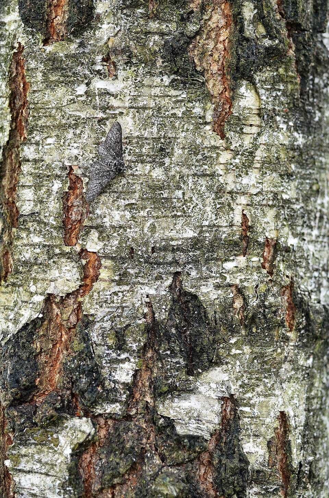

# Contrast & WCAG ratios

*WCAG 2.2 requires 4.5:1 for normal text, 3:1 for large text (18pt/24px+ or 14pt/18.5px+ bold) and non-text UI components, with AAA at 7:1/4.5:1 - computed from a real relative-luminance formula, and the spec explicitly forbids rounding before the pass/fail check.*

> A gray peppered moth sitting on gray-and-white lichen-mottled bark isn't invisible - it's just low
> enough contrast against its background that you have to look twice to find it. Low-contrast text on
> a UI works the same way: technically present, technically "there," but functionally invisible to a
> meaningful number of real users. WCAG 2.2 turns "can you actually see this" into an exact, computable
> number instead of a guess.

> **In real life**
>
> That peppered moth photographed on birch bark: some patches of bark are pale and clean, others are
> dark lichen-stained blotches, and the moth is a mid-grey that's genuinely hard to separate from the
> mottled pattern around it - you can find it, but it takes real effort and a moment of hunting. Slide
> that same moth onto pure white bark, or onto solid black bark, and it would jump out instantly. The
> moth's color never changed - only its contrast against a specific background did, and that's the
> entire idea behind a WCAG contrast ratio: the same foreground can pass or fail depending on what's
> behind it.

**Contrast & WCAG ratios**: A WCAG contrast ratio is a number from 1:1 (identical colors, zero contrast) to 21:1 (pure black on pure white, maximum contrast) computed from the relative luminance of two colors using a fixed formula (gamma-correct each RGB channel, weight them 0.2126 red / 0.7152 green / 0.0722 blue, then compare the lighter and darker results with (L1+0.05)/(L2+0.05)). WCAG 2.2's Success Criterion 1.4.3 requires at least 4.5:1 for normal text at Level AA, 3:1 for large text (at least 18pt/~24px, or 14pt/~18.5px if bold) and for non-text UI components/graphical objects (SC 1.4.11), with Level AAA raising these to 7:1 and 4.5:1 respectively. The computed ratio must not be rounded before comparing to the threshold.

## The numbers, precisely

- **Normal text, Level AA: 4.5:1.** The default bar for body copy, labels, and most on-screen text.
- **Large text, Level AA: 3:1.** "Large" means at least 18pt (~24px) regular weight, or at least 14pt
  (~18.5px) bold - a specific, checkable size threshold, not a vibe.
- **Non-text UI components and graphical objects, Level AA: 3:1** (SC 1.4.11) — button borders,
  form-field outlines, icons that convey meaning, focus indicators. Frequently missed because
  testers check text contrast and stop there.
- **Level AAA: 7:1 normal text, 4.5:1 large text.** A stricter bar, not required everywhere, but
  worth checking for content aimed at users with more significant vision loss.
- **No rounding before the pass/fail check.** WCAG's own understanding document states plainly that
  a computed 4.499:1 does not meet a 4.5:1 requirement - round the number and you can accidentally
  wave through a real failure.
- **This is now a legal requirement in the EU**, not just a best practice: the European
  Accessibility Act entered enforcement in June 2025, and its referenced standard (EN 301 549) maps
  directly onto WCAG 2.1/2.2 Level AA, including this exact contrast requirement.

> **Tip**
>
> Don't stop at body text. Non-text contrast (SC 1.4.11, 3:1) is one of the most commonly missed
> checks - icon-only buttons, input borders, and focus rings all need to clear 3:1 against their
> adjacent background, and most manual QA passes never look past the paragraph text.

> **Common mistake**
>
> Eyeballing "close enough" contrast, or rounding a checker's output before comparing it to the
> threshold. WCAG explicitly defines the comparison on the unrounded number - a pair that computes to
> 4.478:1 fails 4.5:1 even though it would visually round to "4.5" on a casual glance at a two-decimal
> readout.


*Biston betularia (peppered moth) on birch bark — Wikimedia Commons, CC BY-SA 3.0. [Source](https://commons.wikimedia.org/wiki/File:Biston_betularia_20110529_102239_8073M.JPG)*
- **The moth — moderate, borderline contrast** — Grey against a mottled grey/white background - findable with effort, similar to a UI element that technically clears contrast but sits uncomfortably close to the threshold.
- **Pale, clean bark patch** — If the moth sat here instead, contrast against its grey body would be much higher - a clear analogy for choosing a cleaner, more uniform background behind important text or icons.
- **Dark lichen-stained patch** — Equally, a dark background would also raise contrast against the grey moth - the SPECIFIC pairing of foreground and background is what determines the ratio, not either color in isolation.

**Checking a real contrast pair against WCAG**

1. **Identify the actual foreground/background pair** — The rendered text or icon color, and whatever is genuinely behind it - not the design file's intended background if it differs from what ships.
2. **Compute (or read from a checker) the exact contrast ratio** — Don't round the result before the next step.
3. **Identify which threshold applies** — Normal text needs 4.5:1; large text (18pt/24px+ or 14pt bold/18.5px+) and non-text UI need only 3:1.
4. **Compare the UNROUNDED ratio to the threshold** — 4.499:1 fails a 4.5:1 requirement, even though it looks close on a casual glance.
5. **File a precise finding with the exact ratio and required threshold** — '#777777 on white computes to 4.48:1, fails the 4.5:1 AA requirement for normal text' beats 'contrast looks low.'

Running the real WCAG relative-luminance formula against this platform's own live design tokens —
not made-up example colors:

*Run it - WCAG contrast ratio on QA Mastery's real tokens (Python)*

```python
def hex_to_rgb(hexcolor):
    hexcolor = hexcolor.lstrip("#")
    return tuple(int(hexcolor[i:i+2], 16) for i in (0, 2, 4))

def relative_luminance(rgb):
    def linearize(c):
        c = c / 255
        return c / 12.92 if c <= 0.03928 else ((c + 0.055) / 1.055) ** 2.4
    r, g, b = (linearize(c) for c in rgb)
    return 0.2126 * r + 0.7152 * g + 0.0722 * b

def contrast_ratio(hex_a, hex_b):
    l1 = relative_luminance(hex_to_rgb(hex_a))
    l2 = relative_luminance(hex_to_rgb(hex_b))
    lighter, darker = max(l1, l2), min(l1, l2)
    return (lighter + 0.05) / (darker + 0.05)

pairs = [
    ("Light theme body text", "18181b", "fafafa"),
    ("Light theme muted text", "52525b", "fafafa"),
    ("Dark theme body text", "f4f4f5", "09090b"),
    ("Dark theme muted text", "a1a1aa", "09090b"),
]

print("QA Mastery's own real design tokens, checked against WCAG AA (4.5:1 normal text):")
print()
print(f"{'Pair':<26} {'Ratio':<10} {'AA (4.5:1)':<12} {'AAA (7:1)'}")
for name, fg, bg in pairs:
    ratio = contrast_ratio(fg, bg)
    aa = "PASS" if ratio >= 4.5 else "FAIL"
    aaa = "PASS" if ratio >= 7 else "FAIL"
    print(f"{name:<26} {ratio:<10.2f} {aa:<12} {aaa}")

print()
print("Real formula (WCAG's relative luminance + contrast ratio equations),")
print("run against real shipped tokens, not made-up example colors. Every")
print("pair here is a genuine pass/fail on the platform's own text/background")
print("combinations - this is the exact check an automated a11y audit runs.")

# QA Mastery's own real design tokens, checked against WCAG AA (4.5:1 normal text):
#
# Pair                       Ratio      AA (4.5:1)   AAA (7:1)
# Light theme body text      16.97      PASS         PASS
# Light theme muted text     7.41       PASS         PASS
# Dark theme body text       18.10      PASS         PASS
# Dark theme muted text      7.76       PASS         PASS
#
# Real formula (WCAG's relative luminance + contrast ratio equations),
# run against real shipped tokens, not made-up example colors. Every
# pair here is a genuine pass/fail on the platform's own text/background
# combinations - this is the exact check an automated a11y audit runs.
```

The "no rounding" rule isn't pedantic - here's a real pair where rounding the ratio flips a fail
into a false pass:

*Run it - a borderline pair where rounding changes the verdict (Java)*

```java
public class Main {
    static double linearize(double c) {
        c = c / 255.0;
        return (c <= 0.03928) ? c / 12.92 : Math.pow((c + 0.055) / 1.055, 2.4);
    }

    static double relativeLuminance(int r, int g, int b) {
        return 0.2126 * linearize(r) + 0.7152 * linearize(g) + 0.0722 * linearize(b);
    }

    static double contrastRatio(int[] rgbA, int[] rgbB) {
        double l1 = relativeLuminance(rgbA[0], rgbA[1], rgbA[2]);
        double l2 = relativeLuminance(rgbB[0], rgbB[1], rgbB[2]);
        double lighter = Math.max(l1, l2), darker = Math.min(l1, l2);
        return (lighter + 0.05) / (darker + 0.05);
    }

    public static void main(String[] args) {
        int[] grey = {0x77, 0x77, 0x77}; // #777777
        int[] white = {0xff, 0xff, 0xff};

        double ratio = contrastRatio(grey, white);
        double rounded = Math.round(ratio * 10) / 10.0;

        System.out.println("WCAG's own stated rule: computed values must NOT be rounded before");
        System.out.println("comparing to the 4.5:1 threshold (e.g. 4.499:1 does not pass 4.5:1).");
        System.out.println();
        System.out.printf("#777777 on #ffffff -> exact ratio: %.6f:1%n", ratio);
        System.out.printf("Rounded to 1 decimal: %.1f:1%n", rounded);
        System.out.println();

        boolean passesExact = ratio >= 4.5;
        boolean passesIfRounded = rounded >= 4.5;

        System.out.println("Pass at AA (4.5:1) using the EXACT ratio: " + (passesExact ? "PASS" : "FAIL"));
        System.out.println("Pass at AA (4.5:1) using the ROUNDED ratio: " + (passesIfRounded ? "PASS" : "FAIL"));
        System.out.println();
        if (passesExact != passesIfRounded) {
            System.out.println("These disagree. Rounding 4.478 up to 4.5 makes a genuinely failing");
            System.out.println("pair look like it passes. This is exactly why WCAG's own understanding");
            System.out.println("doc explicitly forbids rounding before the pass/fail comparison - a");
            System.out.println("contrast checker (or a tester doing math by hand) that rounds first");
            System.out.println("will wave through real accessibility failures.");
        } else {
            System.out.println("These agree for this particular pair.");
        }
    }
}

/* WCAG's own stated rule: computed values must NOT be rounded before
   comparing to the 4.5:1 threshold (e.g. 4.499:1 does not pass 4.5:1).

   #777777 on #ffffff -> exact ratio: 4.478089:1
   Rounded to 1 decimal: 4.5:1

   Pass at AA (4.5:1) using the EXACT ratio: FAIL
   Pass at AA (4.5:1) using the ROUNDED ratio: PASS

   These disagree. Rounding 4.478 up to 4.5 makes a genuinely failing
   pair look like it passes. This is exactly why WCAG's own understanding
   doc explicitly forbids rounding before the pass/fail comparison - a
   contrast checker (or a tester doing math by hand) that rounds first
   will wave through real accessibility failures. */
```

### Your first time: Your mission: audit a real screen's contrast

- [ ] Pick a real screen in BuggyShop or the platform — Include at least one icon-only button or form-field border, not just body text.
- [ ] Pull the actual computed foreground and background colors in DevTools — For each of: body text, a secondary/muted text element, and one non-text UI component.
- [ ] Run each pair through a contrast checker (or this note's formula) without rounding — Note the exact ratio to at least two decimal places.
- [ ] Apply the correct threshold to each: 4.5:1 for normal text, 3:1 for large text or non-text UI — Don't apply the text threshold to a non-text element by mistake.
- [ ] File any failures with the exact ratio and the threshold it missed — '#777777 on white computes to 4.48:1, fails 4.5:1' rather than 'looks a bit light.'

You've practiced the exact check an automated accessibility audit performs, plus the one thing most
manual passes skip: checking non-text elements at their own, lower 3:1 threshold.

- **A contrast checker and your own manual calculation disagree slightly on the ratio for the same two colors.**
  Check for a color-space mismatch first (sRGB vs. display-P3, or an alpha-blended color not yet flattened against its actual background) - both computations should use the SAME final rendered RGB values, and the relative-luminance formula itself is fixed and non-negotiable once the inputs match.
- **A design element passes the 4.5:1 text threshold easily but you're not sure if it should - it's a large heading, not body copy.**
  Confirm the actual rendered font size and weight against the large-text definition (at least 18pt/~24px regular, or 14pt/~18.5px bold) before applying the more lenient 3:1 threshold - a heading rendered slightly smaller than the cutoff still needs the full 4.5:1.
- **An icon-only button clears the surrounding page's general color scheme but you're unsure whether it needs a contrast check at all.**
  If the icon conveys meaning on its own (not purely decorative) or the button's boundary needs to be visually distinguishable, SC 1.4.11's 3:1 non-text requirement applies - check it against its immediately adjacent background, not just against the page as a whole.

### Where to check

- **WebAIM's Contrast Checker** — the industry-standard manual tool; type in hex values, get exact ratios and pass/fail at both AA and AAA.
- **Browser DevTools' built-in contrast indicator** — many modern DevTools color pickers show the contrast ratio directly next to a color swatch.
- **The W3C's own Understanding SC 1.4.3 / 1.4.11 documents** — the authoritative source for the exact thresholds and the no-rounding rule.
- **Automated accessibility scanners (axe, Lighthouse)** — good for a first-pass sweep across a whole page, but confirm any borderline result manually since automated tools can miss context (like whether text sits over a background image or gradient).

### Worked example: filing a precise WCAG contrast finding

1. QA pass on a settings page flags the secondary "Learn more" link text as "a bit hard to read"
   against its card background.
2. Pulling the computed values: link text is #8B8B93, card background is #FAFAFA.
3. Computing (or checking via WebAIM): the ratio comes out to 3.94:1.
4. This text is normal-sized (14px regular, well under the large-text threshold), so the 4.5:1
   requirement applies - 3.94:1 fails it.
5. Finding: "Secondary link text (#8B8B93) on card background (#FAFAFA) computes to 3.94:1, below
   the required 4.5:1 for normal text (WCAG 2.2 SC 1.4.3, Level AA). Recommend darkening the text
   color to at least #767680 or equivalent to clear the threshold." Precise, cites the exact
   criterion, and gives a concrete target instead of "make it darker."

**Quiz.** A tester checks a 16px-regular icon-only 'close' button's border against its background and finds a contrast ratio of 3.2:1. A colleague argues this fails WCAG because '16px text needs 4.5:1.' Based on this note's definitions, is the colleague correct?

- [ ] Yes - all UI elements need at least 4.5:1 regardless of type or size
- [x] No - the close button's border is a non-text UI component (SC 1.4.11), which requires only 3:1, not the 4.5:1 normal-text threshold; 3.2:1 actually passes
- [ ] No - because 16px is close enough to the large-text threshold that the 3:1 rule applies to text at this size too
- [ ] Yes, because icon buttons are always held to the stricter AAA level (7:1), not just AA

*This note draws a specific distinction: normal TEXT needs 4.5:1, but non-text UI components and graphical objects (SC 1.4.11) need only 3:1 - a button's border is exactly this second category, not text at all, so the 4.5:1 text threshold doesn't apply to it. The colleague's reasoning conflates 'this looks like a small element' with 'this is small text,' which is the wrong lens here since the object in question is a border, not a character glyph. 3.2:1 clears the correct 3:1 non-text threshold, so this passes. Option one wrongly applies the text threshold universally. Option three's reasoning about '16px being close to large-text' is incoherent - large-text status depends on the actual TEXT size threshold (18pt/24px+), and doesn't apply to non-text elements regardless of any pixel dimension. Option four incorrectly assumes AAA is the default requirement for icon buttons, when AA is the standard baseline unless a project specifically commits to AAA.*

- **WCAG 2.2 AA contrast thresholds** — Normal text: 4.5:1. Large text (18pt/~24px+ regular, or 14pt/~18.5px+ bold): 3:1. Non-text UI components/graphical objects (SC 1.4.11): 3:1.
- **WCAG 2.2 AAA contrast thresholds** — Normal text: 7:1. Large text: 4.5:1.
- **The 'no rounding' rule** — WCAG's own understanding document states the comparison uses the unrounded computed ratio - e.g. 4.499:1 does not meet a 4.5:1 requirement, even though it would visually round to 4.5.
- **The most commonly skipped contrast check** — Non-text UI components (icon-only buttons, input borders, focus rings) at the 3:1 threshold - most manual QA passes check only text and stop there.
- **Why this matters legally now, not just as best practice** — The EU's European Accessibility Act entered enforcement in June 2025; its referenced standard (EN 301 549) maps to WCAG 2.1/2.2 Level AA, making this contrast requirement a legal obligation for most digital products sold in the EU.

### Challenge

Audit one real screen in BuggyShop or the platform for contrast: check body text, one secondary/muted
text element, and at least one non-text UI component (icon button, input border, or focus ring) against
their correct thresholds (4.5:1 for text, 3:1 for large text/non-text). File any failures with the
exact unrounded ratio and the specific WCAG criterion missed.

### Ask the community

> I measured `[foreground]` on `[background]` as `[ratio]:1`. I believe this `[passes/fails]` the `[4.5:1 normal text / 3:1 large text or non-text]` requirement under WCAG 2.2 `[SC 1.4.3 / SC 1.4.11]`. Does this classification hold up?

The most useful replies will double-check which threshold actually applies (text vs. non-text, normal
vs. large) before confirming or disputing the pass/fail verdict - misapplying the wrong threshold is
the most common way to misjudge a contrast finding.

- [W3C WAI — Understanding Success Criterion 1.4.3: Contrast (Minimum)](https://www.w3.org/WAI/WCAG22/Understanding/contrast-minimum.html)
- [WebAIM — Contrast Checker](https://webaim.org/resources/contrastchecker/)
- [Vermont Agency of Human Services — WebAIM Contrast Checker Demonstration](https://www.youtube.com/watch?v=5tQQsQcnCEw)

🎬 [Purpose & Pixel — Color Contrast: The Accessibility Feature Everyone Ignores](https://www.youtube.com/watch?v=t4ocwDxavg0) (8 min)

- WCAG 2.2 AA requires 4.5:1 for normal text, 3:1 for large text (18pt/~24px+ regular or 14pt/~18.5px+ bold) and for non-text UI components/graphical objects (SC 1.4.11); AAA raises these to 7:1 and 4.5:1.
- The comparison uses the unrounded computed ratio - 4.499:1 fails a 4.5:1 requirement even though it looks close, and rounding a checker's output before comparing can wave through real failures.
- Non-text UI (icon buttons, input borders, focus rings) is one of the most commonly missed checks - it needs only 3:1, but most manual passes never check it at all.
- The relative-luminance formula is a fixed, computable formula (not a subjective judgment) - the exact same check an automated a11y scanner runs.
- This is now a legal requirement in the EU (European Accessibility Act, enforced since June 2025, via EN 301 549 mapping to WCAG 2.1/2.2 AA), not just an accessibility best practice.


## Related notes

- [[Notes/ui-ux-design-qa/color-theory-for-testers/hue-saturation-and-value|Hue, saturation & value]]
- [[Notes/ui-ux-design-qa/color-theory-for-testers/color-blindness-and-semantic-color|Color blindness & semantic color]]
- [[Notes/ui-ux-design-qa/design-principles-and-the-laws-of-ux/nielsens-10-usability-heuristics|Nielsen's 10 usability heuristics]]


---
_Source: `packages/curriculum/content/notes/ui-ux-design-qa/color-theory-for-testers/contrast-and-wcag-ratios.mdx`_
