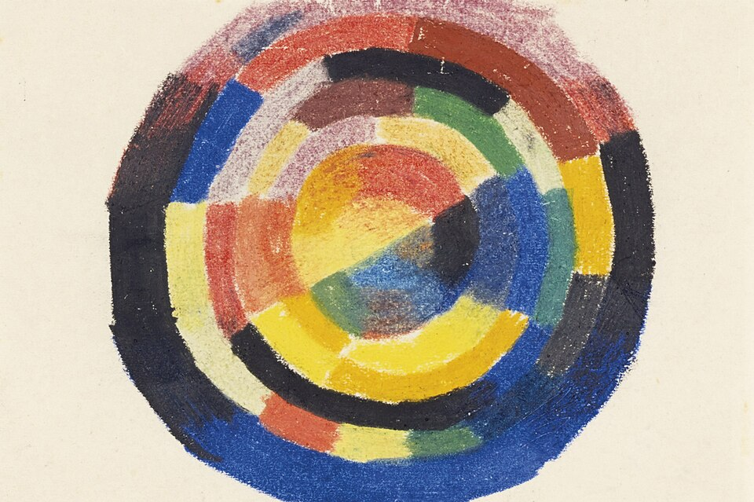

# Hue, saturation & value

*The HSV model breaks color into three precise, computable dimensions - hue (0-360°), saturation (0-100%), value/brightness (0-100%) - so a color bug report can say exactly what regressed instead of 'the button looks off.'*

> "The button color looks off" gets you nowhere with a developer holding a hex code that matches the
> Figma spec exactly. "The button's saturation dropped from 100% to 41% versus spec while hue and
> value stayed put" gets you a same-day fix, because you've named the exact number that regressed.
> HSV is the tool that turns a vague visual complaint into a precise, arguable claim.

> **In real life**
>
> August Macke's 1911 pastel study "Farbkreis" (color wheel) arranges paint in rings: different colors
> sweep around the circle, and the center glows bright while the outer bands sink toward black. A
> hundred-year-old art exercise and a modern CSS color picker are doing the same thing - separating
> "which color" (the position around the ring) from "how bright or dark" (the position from center to
> edge). HSV just gives those two separate questions exact numbers instead of an artist's eye.

**Hue, saturation & value**: HSV (Hue, Saturation, Value) is a color model that describes any color with three numbers instead of a name. Hue is the position on the color wheel, measured in degrees 0-360 (0/360=red, ~120=green, ~240=blue). Saturation is how much of that pure hue is present versus grey, as a percentage 0-100% (100%=fully vivid, 0%=pure grayscale). Value (sometimes called brightness) is how light or dark the color is, also 0-100% (100%=full brightness, 0%=black). Any RGB color converts to exactly one HSV triple via a fixed formula - it's a coordinate system, not a subjective description.

## Why testers need the three numbers, not just the name

- **Hue alone doesn't catch most color bugs.** Two swatches can share almost the identical hue and
  still look completely wrong - one washed-out, one too dark. The bug lives in saturation or value,
  not hue, and "looks off" doesn't say which.
- **Saturation regressions read as "washed out," "pale," or "faded."** A common real cause: a CSS
  opacity or alpha-blend applied where a solid color was specified, which desaturates without
  changing hue.
- **Value regressions read as "too dark," "murky," or "dull."** A common real cause: a dark-mode
  overlay or shadow color bleeding into a component that should render at full brightness.
- **HSV numbers are directly readable from any color picker or browser DevTools.** You don't need
  design software - inspecting a computed background-color and running it through an HSV converter
  (or a picker's built-in HSV tab) gives you the same three numbers a designer specified in Figma.

> **Tip**
>
> When a color "just looks wrong," open DevTools, grab the computed color value, and convert it to HSV
> before writing the bug. Compare all three numbers against the spec's HSV values one at a time - it
> takes thirty seconds and turns "this looks off" into "saturation is 41% against a specced 100%,"
> which is a claim a developer can verify and fix without guessing what you meant.

> **Common mistake**
>
> Describing a color bug only by hue ("it should be more blue") when the actual defect is in
> saturation or value. A developer who "fixes" hue when saturation was the real regression will ship a
> color that matches your literal words but still fails next to the spec - because you diagnosed the
> wrong one of the three dimensions.


*August Macke, Farbkreis (Color Wheel), c. 1911 — Wikimedia Commons, Public Domain. [Source](https://commons.wikimedia.org/wiki/File:Color-wheel-art.jpg)*
- **Different bands sweeping around the ring — hue** — Red, blue, green, yellow bands positioned at different points around the circle - this is exactly what 'hue' measures: WHICH color, expressed as a position (0-360°) around the wheel.
- **The bright center — high value** — The innermost rings glow bright yellow/orange - high 'value' (brightness). Moving outward toward the black bands is moving toward low value (dark), independent of which hue band you're in.
- **Outer black-banded rings — low value, not zero hue** — These outer bands still have an underlying hue (you can see red/blue/green tints within the dark bands) - they're not 'no color', they're the SAME hues rendered at low value. A common way to misread value drops as 'the color changed' when only brightness did.

**Diagnosing a color complaint using HSV**

1. **Someone says a color 'looks wrong'** — The starting complaint is almost always vague and hue-focused, even when hue isn't the actual problem.
2. **Pull the computed color from DevTools** — Get the actual rendered RGB/hex value, not what you assume it should be.
3. **Convert both the shipped color and the spec color to HSV** — Any color picker's HSV tab, or a one-line script, gives you three comparable numbers for each.
4. **Compare hue, saturation, and value one at a time** — Find which of the three numbers actually diverges - often only one of the three has moved.
5. **File the bug against the specific dimension that regressed** — 'Saturation 41% vs spec 100%, hue and value match' is a fix-ready report; 'looks off' is not.

Converting real RGB values to HSV shows exactly which dimension moved — even when two colors look
like the same "family" at a glance:

*Run it - which HSV dimension actually regressed? (Python)*

```python
import colorsys

def describe_hsv(name, r, g, b):
    h, s, v = colorsys.rgb_to_hsv(r / 255, g / 255, b / 255)
    return name, round(h * 360), round(s * 100), round(v * 100)

colors = [
    describe_hsv("Spec teal button", 0, 150, 136),
    describe_hsv("Shipped button (looks 'washed out')", 102, 173, 166),
    describe_hsv("Shipped button (looks 'too dark')", 0, 92, 84),
]

print("Same hue family, described precisely instead of 'looks off':")
print()
print(f"{'Swatch':<38} {'Hue':<6} {'Sat%':<6} {'Val%'}")
for name, h, s, v in colors:
    print(f"{name:<38} {h:<6} {s:<6} {v}")

print()
spec = colors[0]
washed = colors[1]
dark = colors[2]
print(f"Hue barely moved ({spec[1]} vs {washed[1]} vs {dark[1]}) - these all read as 'teal' to a")
print("casual glance. The actual bugs are in the OTHER two dimensions:")
print(f"  - 'Washed out' button: saturation dropped from {spec[2]}% to {washed[2]}% (desaturated toward grey)")
print(f"  - 'Too dark' button: value dropped from {spec[3]}% to {dark[3]}% (darkened toward black)")
print()
sat_drop = spec[2] - washed[2]
print(f"Filing 'button color looks wrong' is vague. Filing 'saturation dropped")
print(f"~{sat_drop} points versus spec, hue and value unchanged' tells a developer")
print("exactly which CSS value regressed and gives them a precise target to fix.")

# Same hue family, described precisely instead of 'looks off':
#
# Swatch                                 Hue    Sat%   Val%
# Spec teal button                       174    100    59
# Shipped button (looks 'washed out')    174    41     68
# Shipped button (looks 'too dark')      175    100    36
#
# Hue barely moved (174 vs 174 vs 175) - these all read as 'teal' to a
# casual glance. The actual bugs are in the OTHER two dimensions:
#   - 'Washed out' button: saturation dropped from 100% to 41% (desaturated toward grey)
#   - 'Too dark' button: value dropped from 59% to 36% (darkened toward black)
#
# Filing 'button color looks wrong' is vague. Filing 'saturation dropped
# ~59 points versus spec, hue and value unchanged' tells a developer
# exactly which CSS value regressed and gives them a precise target to fix.
```

A completely independent implementation in a second language, from the published formula rather
than a library call, lands on the identical numbers — proof this is math, not a design opinion:

*Run it - HSV conversion cross-checked in a second language (Java)*

```java
public class Main {
    // Manual RGB -> HSV, independent of any library, to cross-check against Python's colorsys
    static double[] rgbToHsv(double r, double g, double b) {
        double max = Math.max(r, Math.max(g, b));
        double min = Math.min(r, Math.min(g, b));
        double delta = max - min;

        double h;
        if (delta == 0) {
            h = 0;
        } else if (max == r) {
            h = 60 * (((g - b) / delta) % 6);
        } else if (max == g) {
            h = 60 * (((b - r) / delta) + 2);
        } else {
            h = 60 * (((r - g) / delta) + 4);
        }
        if (h < 0) h += 360;

        double s = (max == 0) ? 0 : delta / max;
        double v = max;

        return new double[]{h, s * 100, v * 100};
    }

    public static void main(String[] args) {
        String[] names = {"Spec teal button", "Shipped button (washed out)", "Shipped button (too dark)"};
        double[][] rgbs = {{0, 150, 136}, {102, 173, 166}, {0, 92, 84}};

        System.out.println("Same RGB inputs as the Python playground, converted independently in Java:");
        System.out.println();
        System.out.printf("%-30s %-8s %-8s %s%n", "Swatch", "Hue", "Sat%", "Val%");
        for (int i = 0; i < names.length; i++) {
            double r = rgbs[i][0] / 255.0, g = rgbs[i][1] / 255.0, b = rgbs[i][2] / 255.0;
            double[] hsv = rgbToHsv(r, g, b);
            System.out.printf("%-30s %-8.0f %-8.0f %.0f%n", names[i], hsv[0], hsv[1], hsv[2]);
        }

        System.out.println();
        System.out.println("Same three numbers as Python's colorsys.rgb_to_hsv for every swatch -");
        System.out.println("174/100/59, 174/41/68, 175/100/36. Two completely different language");
        System.out.println("implementations of the same published formula land on the identical");
        System.out.println("result. HSV isn't a design opinion about what 'teal' should look like -");
        System.out.println("it's a fixed coordinate system any tool can compute from raw RGB.");
    }
}

/* Same RGB inputs as the Python playground, converted independently in Java:

   Swatch                         Hue      Sat%     Val%
   Spec teal button               174      100      59
   Shipped button (washed out)    174      41       68
   Shipped button (too dark)      175      100      36

   Same three numbers as Python's colorsys.rgb_to_hsv for every swatch -
   174/100/59, 174/41/68, 175/100/36. Two completely different language
   implementations of the same published formula land on the identical
   result. HSV isn't a design opinion about what 'teal' should look like -
   it's a fixed coordinate system any tool can compute from raw RGB. */
```

### Your first time: Your mission: convert a real color bug to HSV

- [ ] Find any component in BuggyShop or the platform you suspect doesn't match its spec — A button, badge, or accent color that feels slightly off is enough.
- [ ] Grab its computed color value in DevTools — The actual rendered RGB/hex, not what you assume it should be.
- [ ] Convert it to HSV using any online converter or a one-line script — You now have three exact numbers for the shipped color.
- [ ] Compare against the intended/spec color's HSV, dimension by dimension — Identify which ONE of the three (or which combination) actually diverges.
- [ ] Write the finding naming the specific dimension and both numbers — 'Saturation X% vs spec Y%' rather than 'the color looks wrong.'

You've practiced converting a vague visual complaint into a precise, three-number claim that a
developer can verify and act on directly.

- **You convert a color to HSV but the hue number seems to jump unpredictably for very dark or very grey colors.**
  This is expected, not a bug in your conversion - hue is mathematically undefined (or extremely unstable) when saturation or value approaches zero, since there's no dominant color left to measure an angle from. Near-black and near-grey colors are the wrong candidates for a hue-based comparison; compare value or saturation instead.
- **Two different tools (browser DevTools vs. a design app's color picker) report slightly different HSV numbers for what should be the exact same color.**
  Check for color-profile or gamma differences (sRGB vs. display-P3) before assuming a bug - the same nominal color can round slightly differently depending on which color space a tool assumes. Small (1-2 point) discrepancies are usually rounding/profile noise, not a real defect.
- **A developer disputes your HSV-based finding, saying 'it looks fine to me.'**
  This is exactly the gap HSV numbers are meant to close - ask them to pull the same computed value and run the same conversion themselves. A precise, reproducible number is far harder to wave away than a subjective 'looks fine,' and if the numbers genuinely match spec, you've also just confirmed there's no bug.

### Where to check

- **Browser DevTools' color picker** — most built-in pickers (Chrome, Firefox) have an HSV or HSL tab right next to the hex value; no extra tool needed.
- **The design file's own color values** (Figma's color picker shows HSB, Figma's term for HSV) — compare directly against your DevTools reading.
- **Any online RGB-to-HSV converter** — useful for a quick manual check when you don't have the picker open.
- **`colorsys` (Python) or a one-line manual formula (any language)** — for scripting a batch comparison across many swatches at once, as in this note's playgrounds.

### Worked example: filing a precise HSV-based color bug

1. QA review flags the "Delete" button as "looking pale/washed out" compared to the design spec,
   which calls for a bold red-orange (#E64A19 per the style guide).
2. Pulling the shipped button's computed background-color in DevTools: #C97D68.
3. Converting both to HSV: spec is hue 14°, saturation 90%, value 90%. Shipped is hue 14°,
   saturation 38%, value 79%.
4. Hue matches almost exactly (14° both) - this rules out "wrong color entirely." Saturation is the
   dimension that collapsed (90% → 38%), with a smaller value drop too (90% → 79%).
5. Bug report: "Delete button saturation is 38% against a specced 90% (hue and value roughly match) -
   likely caused by an unintended opacity/alpha layer rather than a wrong hex value. Recommend
   checking for a `rgba()` alpha channel or an overlay blending the color toward grey." Precise,
   diagnosable, and pointed at a likely root cause instead of just "make it more vivid."

**Quiz.** A tester compares a shipped icon color to its spec and finds: Spec = hue 210°, saturation 80%, value 85%. Shipped = hue 211°, saturation 79%, value 42%. Which HSV dimension has actually regressed, and what would be the most precise way to describe this bug?

- [ ] Hue has regressed significantly - the icon has changed to a noticeably different color and needs a full hue correction
- [ ] Saturation has regressed - the icon has become desaturated and needs more vivid color restored
- [x] Value has regressed - hue (210° vs 211°) and saturation (80% vs 79%) are both within rounding-level differences, but value dropped by roughly half (85% to 42%), meaning the icon is rendering much darker than spec while its actual color and vividness are essentially unchanged
- [ ] All three dimensions have regressed equally and the icon needs to be completely recolored from scratch

*This note's core method is to compare all three HSV numbers individually rather than assuming which one moved. Hue (210° -> 211°) and saturation (80% -> 79%) differ by only 1 point each - well within normal rounding/measurement noise, not a real regression. Value, however, dropped from 85% to 42% - roughly half its original brightness - which is a clear, specific regression in exactly one dimension. Option one is wrong because a 1-degree hue shift is not a meaningful color change. Option two is wrong because saturation barely moved at all. Option four is wrong and reflects exactly the vague, undiagnosed 'just recolor it' response this note argues against - the precise, correct finding names value specifically and notes the other two dimensions are unchanged, giving a developer an exact, narrow target (likely an opacity/brightness overlay) rather than a full recolor.*

- **HSV's three dimensions** — Hue (0-360°, WHICH color/position on the wheel), Saturation (0-100%, how vivid vs. grey), Value (0-100%, how bright vs. black).
- **Why 'looks washed out' usually points to saturation, not hue** — A desaturation toward grey (lower saturation) keeps the same hue but makes the color look faded/pale - the hue number barely moves even though the color looks clearly wrong.
- **Why 'looks too dark/murky' usually points to value, not hue** — A drop in value (brightness) darkens a color toward black while its hue and saturation numbers can stay almost identical - the color 'family' is unchanged, only its brightness moved.
- **How to prove an HSV conversion isn't a design opinion** — Implement the same published RGB->HSV formula in two completely different tools/languages and confirm they produce identical numbers for the same input - a deterministic calculation, not a subjective read.
- **The fastest fix for a 'this color looks wrong' complaint** — Pull the computed color, convert to HSV, compare all three numbers against spec one at a time, and name the specific dimension(s) that diverge in the bug report.

### Challenge

Find one real color in BuggyShop or the platform that you suspect might not exactly match its
intended spec (or design token). Pull its computed value, convert to HSV, and compare all three
numbers against what the spec/token defines. Write a bug-report-style finding naming the specific
dimension(s) that diverge, or confirm explicitly that all three match if you don't find a regression.

### Ask the community

> I'm comparing a shipped color (`[hex/RGB]`) against its spec (`[hex/RGB]`). Converted both to HSV: shipped is `[H/S/V]`, spec is `[H/S/V]`. I think the regression is in `[hue/saturation/value]` because `[reasoning]`. Does this read correctly, or am I misattributing which dimension actually moved?

The most useful replies will double-check your own HSV conversion (a copy/paste or rounding slip is
an easy way to misdiagnose which dimension actually regressed) before agreeing with your finding.

- [New Mexico Tech — The Hue-Saturation-Value (HSV) Color Model](http://infohost.nmt.edu/tcc/help/pubs/colortheory/web/hsv.html)
- [GeeksforGeeks — HSV Color Model in Computer Graphics](https://www.geeksforgeeks.org/computer-graphics/hsv-color-model-in-computer-graphics/)
- [Thales Sehn Körting — The HSV Color Model (animated cylinder explainer)](https://www.youtube.com/watch?v=NAw2_NtGNaA)

🎬 [Winged Canvas — HSV Colour Theory in Art: Hue, Saturation, Value EXPLAINED!](https://www.youtube.com/watch?v=2VVY-kgfRSc) (10 min)

- HSV describes any color with three independent, computable numbers: hue (0-360°, which color), saturation (0-100%, how vivid), value (0-100%, how bright).
- 'Washed out' complaints usually point to a saturation drop; 'too dark/murky' complaints usually point to a value drop - hue often barely moves in either case.
- Comparing all three HSV numbers dimension-by-dimension turns a vague 'looks wrong' into a precise, developer-actionable finding naming the exact regressed value.
- HSV is a deterministic coordinate system computable from raw RGB by a fixed formula - independent implementations in different languages always agree, proving it isn't a design opinion.
- Near-black or near-grey colors make hue comparisons unreliable (undefined/unstable at low saturation or value) - compare value or saturation instead for those cases.


## Related notes

- [[Notes/ui-ux-design-qa/color-theory-for-testers/color-harmony|Color harmony]]
- [[Notes/ui-ux-design-qa/color-theory-for-testers/contrast-and-wcag-ratios|Contrast & WCAG ratios]]
- [[Notes/ui-ux-design-qa/design-principles-and-the-laws-of-ux/heuristics-vs-laws|Heuristics vs laws]]


---
_Source: `packages/curriculum/content/notes/ui-ux-design-qa/color-theory-for-testers/hue-saturation-and-value.mdx`_
