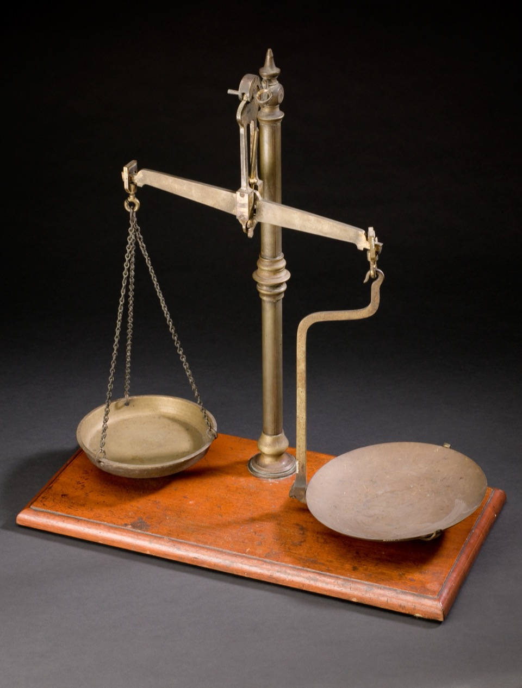

# Pixel-perfect vs pragmatic

*The judgment call every design-QA tester makes when a build doesn't EXACTLY match spec: measure the real delta first, apply a documented tolerance threshold consistently, then separately check whether an explicit rule (grid, WCAG, brand) is broken regardless of size.*

> A button spec says 44px tall. The live build measures 43px. Is that a bug? The honest answer is "it
> depends" - and the entire skill of design QA in practice lives inside that dependency. Treat every
> single-pixel gap as a filed bug and developers start ignoring your reports on principle. Treat every
> gap as "close enough" and a genuine 7px drift ships unnoticed. Pixel-perfect vs pragmatic is the
> judgment call that sits between those two failure modes, and it's a skill you can actually practice.

> **In real life**
>
> A beam balance doesn't just tell you two things are unequal - it shows exactly HOW unequal, one pan
> settling lower than the other by a precise, visible amount. But the balance itself never decides
> whether that amount matters; a jeweler weighing gold cares about a fraction of a gram, a market
> stall weighing potatoes doesn't. The instrument's job is only to report the real, exact difference -
> deciding whether that difference is worth acting on is a separate, deliberate judgment made by
> whoever's reading the scale, every time.

**Pixel-perfect vs pragmatic**: Pixel-perfect vs pragmatic is the judgment call a design-QA tester makes once a live build doesn't EXACTLY match its Figma spec. The pixel-perfect stance treats any measurable deviation as a bug. The pragmatic stance accepts that some deviation is inevitable - subpixel rounding, font hinting, browser rendering differences - and reserves 'bug' for drift a real user would plausibly notice, or drift that breaks an explicit documented rule (a spacing grid, a WCAG minimum, a brand color) regardless of how small it measures. The actual skill isn't picking one stance forever - it's measuring the real delta first, then applying a consistent, documented tolerance threshold instead of a mood-based guess.

## Why zero deviation isn't a realistic bar

- **Subpixel rounding varies by rendering engine.** A spec value of 44px can legitimately render as
  43px or 45px on different browsers, zoom levels, or device pixel ratios - with zero human error
  anywhere in the chain.
- **Font hinting and anti-aliasing differ across OS/browser combinations.** Text metrics that look
  identical inside Figma can measure a pixel or two differently once real font rendering is involved.
- **A spec is one source of truth; a live page renders across dozens of real combinations.** Holding
  every device/browser/zoom permutation to the exact same pixel isn't a bar most teams can or should
  actually enforce - it produces noise, not signal.

## Setting (and defending) a tolerance threshold

- **Pick a number before you start measuring.** A common starting point is a fixed px tolerance (for
  example +/-2px) - decided in advance, applied consistently, not re-decided case by case based on
  how a particular gap happens to look.
- **A threshold isn't a blanket pass.** A deviation that's small in px but violates an explicit rule
  - an 8px grid, a WCAG minimum touch target, a brand color - gets flagged regardless of how "small"
  it measures. Tolerance and rule-violation are two separate checks.
- **The fastest sanity check for a borderline case:** would a real user, glancing at this without a
  ruler, ever notice? If genuinely not, and no explicit rule is broken, that's the pragmatic call -
  write it down as a note, not a filed bug.

> **Tip**
>
> Document your tolerance threshold once, somewhere shared (a test plan, a README, a team wiki) - so
> "is 2px worth filing" stops being re-litigated from scratch in every single review and becomes a
> rule either side can point to and verify against real numbers.

> **Common mistake**
>
> Treating "pragmatic" as permission to stop measuring. Applying a 2px tolerance still requires knowing
> the actual delta is 1px and not 12px - skipping the measurement isn't pragmatism, it's guessing with
> extra confidence. Pragmatic and precise are not opposites; pragmatic is precise measurement PLUS a
> deliberate, consistent threshold for what to act on.


*Apothecary's balance, Europe, 1901-1930 — Wellcome Collection via Wikimedia Commons, CC BY 4.0. [Source](https://commons.wikimedia.org/wiki/File:Apothecary%27s_balance,_Europe,_1901-1930_Wellcome_L0057866.jpg)*
- **The hanging pan — flexible, settles wherever the real weight pulls it** — Free to move on its chains rather than forced into a fixed position - the pragmatic side of the judgment call, where the actual measured delta is allowed to be what it is before anyone decides whether it matters.
- **The fixed platform pan — solid, holds a rigid position** — Bolted to a rigid arm rather than hanging loose - the pixel-perfect side: the exact spec value everything else gets weighed against, unmoving regardless of how small or large the difference turns out to be.
- **The pivot — where the two sides actually get compared** — The single point where both pans' positions are read against each other - the equivalent of a documented tolerance threshold: the fixed, agreed place where 'how much difference is too much' actually gets decided, instead of re-argued per review.

**Deciding whether a pixel deviation is a bug**

1. **Measure the real delta first** — Never skip this - a judgment call about a number you haven't actually measured is just a guess.
2. **Check it against your team's documented tolerance threshold** — A fixed, agreed-in-advance number - not a fresh decision made under the pressure of this specific review.
3. **Separately check for an explicit rule violation** — A spacing grid, a WCAG minimum, a brand color - these get flagged regardless of how small the px delta is.
4. **Ask: would a real user notice without a ruler?** — The fastest sanity check for anything that's genuinely borderline on both gates above.
5. **File it, or note it and move on — consistently** — The same process, applied the same way, every time - not a mood-based call on this particular element.

Turning "is this close enough" into a repeatable rule is just classifying a measured delta against a
fixed tolerance - simple, and exactly what keeps the call consistent across reviews:

*Run it - classifying spec-vs-measured drift against a fixed tolerance (Python)*

```python
TOLERANCE_PX = 2

comparisons = [
    ("card_border_radius_px", 8, 8),
    ("button_height_px", 44, 42),
    ("hero_heading_margin_top_px", 48, 41),
    ("avatar_diameter_px", 32, 33),
    ("nav_item_gap_px", 24, 24),
]

print(f"Classifying spec-vs-measured drift with a {TOLERANCE_PX}px tolerance:")
print()
flagged = []
for name, spec, measured in comparisons:
    delta = abs(spec - measured)
    verdict = "within tolerance" if delta <= TOLERANCE_PX else "FLAG"
    print(f"  {name:<28} spec={spec:>3}px  measured={measured:>3}px  delta={delta:>2}px  {verdict}")
    if delta > TOLERANCE_PX:
        flagged.append((name, spec, measured, delta))

print()
print(f"{len(flagged)} of {len(comparisons)} comparisons exceed the {TOLERANCE_PX}px tolerance:")
for name, spec, measured, delta in flagged:
    print(f"  - {name}: expected {spec}px, measured {measured}px ({delta}px off)")
print()
print("A 1px avatar difference and an exact match don't deserve a bug report -")
print("that's normal sub-pixel rendering noise. A 7px margin miss does: it's")
print("large enough that a user would plausibly notice the extra whitespace,")
print("and precise enough to state as an exact, fixable number.")

# Classifying spec-vs-measured drift with a 2px tolerance:
#
#   card_border_radius_px        spec=  8px  measured=  8px  delta= 0px  within tolerance
#   button_height_px             spec= 44px  measured= 42px  delta= 2px  within tolerance
#   hero_heading_margin_top_px   spec= 48px  measured= 41px  delta= 7px  FLAG
#   avatar_diameter_px           spec= 32px  measured= 33px  delta= 1px  within tolerance
#   nav_item_gap_px              spec= 24px  measured= 24px  delta= 0px  within tolerance
#
# 1 of 5 comparisons exceed the 2px tolerance:
#   - hero_heading_margin_top_px: expected 48px, measured 41px (7px off)
#
# A 1px avatar difference and an exact match don't deserve a bug report -
# that's normal sub-pixel rendering noise. A 7px margin miss does: it's
# large enough that a user would plausibly notice the extra whitespace,
# and precise enough to state as an exact, fixable number.
```

A single measurement can also be a fluke. Checking the SAME element across a few renders, and looking
at the spread rather than any one reading, tells noise apart from a real, worth-flagging outlier:

*Run it - telling rendering noise apart from a real outlier (Java)*

```java
public class Main {
    public static void main(String[] args) {
        int[] widths = {128, 127, 128, 129};

        int sum = 0;
        int min = widths[0];
        int max = widths[0];
        for (int w : widths) {
            sum += w;
            if (w < min) min = w;
            if (w > max) max = w;
        }
        double mean = sum / (double) widths.length;
        int spread = max - min;

        System.out.print("Same button, measured across " + widths.length + " renders: [");
        for (int i = 0; i < widths.length; i++) {
            System.out.print(widths[i]);
            if (i < widths.length - 1) System.out.print(", ");
        }
        System.out.println("]");
        System.out.printf("  mean = %.2fpx, min = %dpx, max = %dpx, spread = %dpx%n", mean, min, max, spread);
        System.out.println();

        int NOISE_THRESHOLD_PX = 2;
        if (spread <= NOISE_THRESHOLD_PX) {
            System.out.println("Spread is within " + NOISE_THRESHOLD_PX + "px - this is ordinary sub-pixel");
            System.out.println("rounding across renders, not a real layout bug. Not worth filing.");
        } else {
            System.out.println("Spread exceeds " + NOISE_THRESHOLD_PX + "px - this is bigger than rendering");
            System.out.println("noise and worth a closer look before writing it off as pragmatic slack.");
        }

        System.out.println();
        int[] widths2 = {128, 121, 128, 129};
        sum = 0; min = widths2[0]; max = widths2[0];
        for (int w : widths2) {
            sum += w;
            if (w < min) min = w;
            if (w > max) max = w;
        }
        int spread2 = max - min;
        System.out.print("Same check, different button: [");
        for (int i = 0; i < widths2.length; i++) {
            System.out.print(widths2[i]);
            if (i < widths2.length - 1) System.out.print(", ");
        }
        System.out.println("]");
        System.out.println("  spread = " + spread2 + "px");
        if (spread2 <= NOISE_THRESHOLD_PX) {
            System.out.println("  Within noise threshold - not a bug.");
        } else {
            System.out.println("  Exceeds noise threshold - one render is a genuine outlier, worth flagging.");
        }
    }
}

/* Same button, measured across 4 renders: [128, 127, 128, 129]
     mean = 128.00px, min = 127px, max = 129px, spread = 2px

   Spread is within 2px - this is ordinary sub-pixel
   rounding across renders, not a real layout bug. Not worth filing.

   Same check, different button: [128, 121, 128, 129]
     spread = 8px
     Exceeds noise threshold - one render is a genuine outlier, worth flagging. */
```

### Your first time: Your mission: set and apply a real tolerance threshold

- [ ] Pick one component and get its exact spec value plus its exact measured value — See [[ui-ux-design-qa/design-qa-in-practice/reading-a-figma-spec]] for the spec side and a measuring tool for the live side.
- [ ] Write down the raw delta before deciding anything — The number comes first - the judgment call comes after, never before.
- [ ] Apply a fixed threshold (for example 2px) consistently — Not based on how the deviation happens to look or feel in the moment.
- [ ] Separately check whether an explicit rule is violated regardless of the threshold — Spacing grid, WCAG minimum size, brand color - these can matter even at a 'small' px delta.
- [ ] Decide: file it, or note it as within tolerance — and write down WHY — Not just which verdict, but the reasoning, so the next reviewer can follow it without re-litigating.

You've practiced the actual skill this note is about: measuring first, then applying a consistent,
defensible threshold instead of a mood-based glance.

- **A designer insists every single pixel must match exactly, with zero tolerance at all.**
  Point to the reality that subpixel rendering and font hinting alone can produce 1-2px of drift with no human error involved. A zero-tolerance policy generates false-positive bugs a developer can't actually fix, which erodes trust in every OTHER finding you file - propose a small, explicit, documented threshold instead of an unenforceable absolute.
- **A developer dismisses a real, measured deviation as 'basically pixel-perfect' when it's actually well outside your team's agreed threshold.**
  Bring the actual numbers - spec value, measured value, delta, and the documented threshold it exceeds - rather than re-arguing 'it looks fine to me.' A written threshold turns a subjective disagreement into an objective check either side can verify.
- **A specific deviation is genuinely borderline, right around your threshold, and you're not sure which way to call it.**
  Fall back to the check that never depends on the tolerance number: does it break an explicit rule (grid, WCAG minimum size, brand color)? A borderline px value that ALSO breaks a defined rule is worth flagging regardless of exactly how many pixels it is.

### Where to check

- **[[ui-ux-design-qa/design-qa-in-practice/reading-a-figma-spec]]** — get the exact spec value first; a tolerance decision without an exact source-of-truth number isn't really a decision.
- **[[testers-toolbox/link-page-ui-checks/whatfont-perfectpixel-page-ruler]]** — the tools that produce the exact measured value your judgment call is actually based on.
- **Your team's test plan or QA wiki** — where a documented tolerance threshold should live, so it stops being re-argued per review.
- **[[ui-ux-design-qa/design-qa-in-practice/design-bugs-devs-respect]]** — once you've decided something IS worth filing, this is how to write it up so it actually gets fixed.

### Worked example: four elements, four different verdicts, one consistent process

1. Hero heading top margin: spec 48px, live 41px, delta 7px - well outside a 2px threshold, no
   explicit-rule question needed. Clear bug.
2. Same page, a card's border radius: spec 8px, live 8px, delta 0px - trivially fine, not worth a
   note at all.
3. An avatar's diameter: spec 32px, live 33px, delta 1px - inside the 2px threshold, and doesn't
   violate any explicit rule. Pragmatic call: note it internally, don't file it.
4. A secondary button's touch target: spec 40px, live 39px, delta 1px - also inside the general
   tolerance, but the platform's documented minimum tappable size applies here. Despite the tiny px
   delta, this one gets flagged - as an accessibility finding, not a pixel-perfect one.
5. Net result: one clear bug, one clean pass, one pragmatic non-issue, and one small-delta-but-
   rule-violating flag - four different verdicts from four different deltas, each justified by the
   same consistent two-gate process rather than a mood-based glance at each one.

**Quiz.** A team's documented policy is '+/-2px tolerance, unless an explicit rule is broken.' A button's measured height is 1px under spec (well within tolerance), but its resulting touch-target size now falls below the platform's documented minimum tappable size. What's the correct call?

- [ ] Ignore it - 1px is within the team's tolerance threshold, so by policy nothing here is worth flagging
- [x] File it - the 1px delta is within general pixel tolerance, but it also crosses an explicit, documented rule (minimum touch target size), and the policy explicitly carves out rule violations regardless of how small the px delta is
- [ ] Escalate it as a spec error, since Figma should never allow a button below the minimum touch target size in the first place
- [ ] Wait for a second tester to independently confirm the 1px delta before making any decision

*This is exactly the fourth case in this note's worked example: tolerance threshold and explicit-rule violation are two SEPARATE gates, and passing the first (a small px delta) doesn't exempt an element from the second (an explicit rule like a minimum touch target). The correct filing cites both the measured delta AND the specific rule it violates - see [[ui-ux-design-qa/design-qa-in-practice/design-bugs-devs-respect]] for how to write that up precisely enough for a developer to act on immediately. Option one misapplies the policy by ignoring its own stated carve-out. Option three assumes the design file itself is wrong without evidence the spec value was ever below the minimum. Option four adds unnecessary process to a deviation that's already been measured and cross-checked against a clear, documented rule.*

- **Why zero pixel deviation isn't a realistic QA bar** — Subpixel rounding, font hinting, and anti-aliasing differ across browser, OS, and zoom combinations - a spec value can legitimately render 1-2px off with zero human error anywhere in the chain.
- **The two-gate process for deciding if a deviation is a bug** — Gate one: is it outside the team's documented tolerance threshold? Gate two: does it violate an explicit rule (grid, WCAG, brand) regardless of size? Either gate failing means flag it.
- **Why 'pragmatic' doesn't mean 'stop measuring'** — Applying a tolerance still requires knowing the real delta - you can't apply a 2px threshold without first measuring whether the actual gap is 1px or 12px.
- **Why a documented threshold matters more than the exact number chosen** — A shared, written threshold turns 'is this worth filing' from a re-litigated argument into an objective check either side can verify against real numbers.
- **The fastest sanity check for a borderline case** — Would a real user, glancing at this without a ruler, ever notice? If genuinely not, and no explicit rule is broken, that's the pragmatic call - write it down, don't file it.

### Challenge

Measure two real elements on BuggyShop or the platform against their spec. For each, write down the
raw delta, apply a threshold (use +/-2px if your team doesn't have one yet), and separately check for
any explicit rule violation. Try to produce two different verdicts, and justify each with the actual
numbers, not an impression.

### Ask the community

> I measured `[element]` at a `[delta]`px deviation from spec - `[inside/outside]` my `[threshold]`px tolerance, and `[found/found no]` explicit rule violation. Is this worth filing, or is my threshold miscalibrated for this kind of element?

The most useful replies will ask what kind of element it is before answering - a decorative
border-radius and a tappable touch target deserve very different tolerance instincts even at the
exact same measured pixel delta.

- [Wikipedia — Satisficing (the 'good enough' decision-making concept)](https://en.wikipedia.org/wiki/Satisficing)
- [Nielsen Norman Group — Aesthetic-Usability Effect](https://www.nngroup.com/articles/aesthetic-usability-effect/)
- [Figma — Figma Tutorial: Intro to Dev Mode](https://www.youtube.com/watch?v=__ABPkb0aF8)

🎬 [Zia ul Mustafa Danish — How to Do QA in Webflow From Figma for Pixel-Perfect Work (Part 1)](https://www.youtube.com/watch?v=dRzAeS3NGyA) (5 min)

- Zero pixel deviation isn't a realistic QA bar - subpixel rounding, font hinting, and rendering differences produce real drift with no human error involved.
- Measure the real delta first, always - a tolerance decision applied to an unmeasured gap is just a guess with extra confidence.
- Use two separate gates: a documented tolerance threshold, AND a check for explicit rule violations (grid, WCAG, brand) that apply regardless of size.
- A shared, written threshold turns 'is this worth filing' from a re-argued opinion into an objective, verifiable check.
- The fastest sanity check for a borderline case: would a real user notice without a ruler? If not, and no rule is broken, note it - don't file it.


## Related notes

- [[Notes/ui-ux-design-qa/design-qa-in-practice/reading-a-figma-spec|Reading a Figma spec]]
- [[Notes/ui-ux-design-qa/design-qa-in-practice/design-bugs-devs-respect|Design bugs devs respect]]
- [[Notes/ui-ux-design-qa/design-principles-and-the-laws-of-ux/heuristics-vs-laws|Heuristics vs laws]]
- [[Notes/testers-toolbox/link-page-ui-checks/whatfont-perfectpixel-page-ruler|WhatFont, PerfectPixel & Page Ruler]]


---
_Source: `packages/curriculum/content/notes/ui-ux-design-qa/design-qa-in-practice/pixel-perfect-vs-pragmatic.mdx`_
