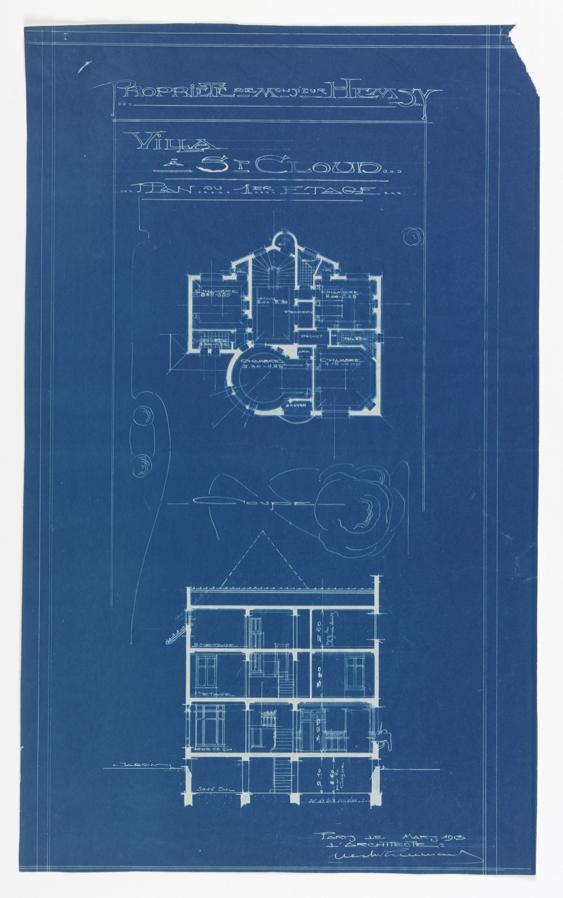

# Reading a Figma spec

*Reading a Figma spec means pulling exact, buildable values out of Dev Mode - px, resolved color or token, full typography, spacing - and reading the file's structure (layer names, variants) too, not eyeballing the canvas and estimating.*

> A Figma file with no Dev Mode open, no named layers, and no listed variants is just a very detailed
> picture. The same file with Dev Mode open, layers named for what they ARE instead of "Frame 47," and
> every intended state listed as a variant is a blueprint - a document precise enough that two different
> people building from it independently would produce the same result. Reading a spec well is the
> difference between shipping someone's picture and shipping their actual design.

> **In real life**
>
> A 1913 architect's blueprint for a villa doesn't just show a floor plan - it's covered in exact
> numbers: room dimensions to the centimeter, floor-to-floor heights, a title block naming the
> property, the architect, and the date. A builder reading it doesn't estimate "the bedroom looks like
> it's about five meters" - they read the number already printed on the page. A Figma spec is the same
> kind of document, just laid out with panels and pixels instead of ink and centimeters: the whole
> point is that nobody building from it should ever have to estimate anything.

**Reading a Figma spec**: Reading a Figma spec is the practice of using Figma's Dev Mode (or the classic Inspect panel) to extract exact, buildable values - pixel dimensions, resolved color (hex/rgba or a design-token name), font family/size/weight/line-height, spacing, corner radius, and exportable assets - directly from a design file, rather than eyeballing the canvas and estimating. It also means reading the file's STRUCTURE: layer names, component variants, and auto-layout settings, which describe intended behavior (what resizes, what states exist) that a static image alone can never show.

## What Dev Mode actually gives you

- **Exact px** for width, height, padding, gap (auto layout), and corner radius on any selected
  layer - not just whatever's visible in the current frame.
- **Color as a resolved value, not just a swatch** - hex/rgba, or a variable/token name if the file
  uses design tokens (`color/text/primary` tells you far more than a raw hex ever could).
- **Typography as a full block** - font family, size, weight, line-height, letter-spacing - not
  "looks like a slightly bigger heading."
- **Exportable assets** at the exact scale/format the file specifies (1x/2x/3x, SVG vs PNG).
- **A generated CSS/iOS/Android snippet** - a useful starting point, never a substitute for checking
  the live build's actual rendered values against it.

## Reading structure, not just numbers

- **Layer names are the legend.** A layer named "CTA / Primary / Default" tells you it's a component
  with defined variants; a layer named "Frame 47" usually means nobody expected it to ship as-is.
- **Auto-layout settings describe behavior, not just spacing.** A frame set to "hug contents" behaves
  differently on longer text than one set to a fixed width - that distinction never shows up in a
  static screenshot, only in the properties panel.
- **Component variants list every intended state.** If a button component has hover/focus/disabled
  variants defined in Figma, that IS the spec for
  [[ui-ux-design-qa/design-qa-in-practice/checking-spacing-states-and-breakpoints]] - read them
  before asking a designer "what's disabled supposed to look like?"

> **Tip**
>
> Before measuring anything, check the frame's "Ready for dev" status (or equivalent handoff marker)
> and its last-modified date against your sprint's start date. A spec still in draft, or edited AFTER
> the current build shipped, is the single most common cause of "the spec doesn't match what got
> approved in standup" - check the source's freshness before checking pixels against it.

> **Common mistake**
>
> Reading only the values on the currently selected layer and missing that its PARENT frame adds
> padding too. A button might show 8px internal padding in the panel, but the card wrapping it can add
> another 16px around that - measure the real on-screen gap against BOTH, not just whichever layer
> happened to be selected when you opened the panel.


*Blueprint, Villa of M. Hemsy, St. Cloud, Plan du 1er Etage, 1913 — Wikimedia Commons, Public Domain. [Source](https://commons.wikimedia.org/wiki/File:Blueprint,_Villa_of_M._Hemsy,_St._Cloud,_Plan_du_1e_Etage,_1913_(CH_18384917).jpg)*
- **The title block — property, project, and date** — The blueprint equivalent of a Figma file's 'Ready for dev' status and last-modified date - before trusting any measurement below it, confirm you're reading the CURRENT, approved version, not an earlier draft.
- **The floor plan — exact room dimensions in meters** — Every room is labeled with a precise size, not an impression - nobody building this villa was meant to guess 'about a medium bedroom.' This is exactly what Figma's Dev Mode panel gives you in pixels: a specific number for every element, on demand.
- **The section view — floor-to-floor heights** — A second view of the SAME building, showing vertical measurements the floor plan alone can't - the equivalent of checking a component's spacing and padding in Dev Mode after already reading its width and height, because one view never shows every dimension that matters.

**Reading a Figma spec before writing a single finding**

1. **Check 'Ready for dev' status and last-modified date** — Confirm you're reading the current, approved version - not a stale export or a still-in-progress draft.
2. **Read the layer names and structure first** — Component vs. one-off frame, auto-layout settings, and whether this is even the right layer to be measuring.
3. **Open Dev Mode / Inspect on the actual element** — Not a parent, not a sibling - the specific layer whose values you need.
4. **Read every relevant value: size, spacing, color/token, typography** — All of it, not just whichever number first catches your eye.
5. **Check component variants for every intended state** — Hover, focus, active, disabled, error - if they're defined in the file, they're part of the spec.

Checking whether a spec's own spacing values are internally consistent is a simple grid-conformance
check - and it catches exactly the kind of one-off value that's easy to miss scrolling through a
panel by eye:

*Run it - checking spec spacing values against an 8px base grid (Python)*

```python
spec_spacing = {
    "card_padding_px": 16,
    "button_gap_px": 8,
    "section_margin_top_px": 32,
    "icon_text_gap_px": 6,
    "list_item_padding_px": 24,
}

BASE = 8

print(f"Checking spec spacing values against an {BASE}px base grid:")
print()
violations = []
for name, value in spec_spacing.items():
    on_grid = value % BASE == 0
    verdict = "on-grid" if on_grid else "OFF-GRID"
    print(f"  {name:<24} {value:>3}px   {verdict}")
    if not on_grid:
        violations.append((name, value))

print()
print(f"{len(violations)} of {len(spec_spacing)} spacing values fall off the {BASE}px grid:")
for name, value in violations:
    nearest = round(value / BASE) * BASE
    print(f"  - {name}: {value}px is not a multiple of {BASE} (nearest grid value: {nearest}px)")
print()
print("Four of five values land cleanly on the grid - the lone exception, a 6px")
print("icon-to-text gap, is exactly the kind of thing worth a quick 'is this")
print("intentional?' ping to the designer before a dev builds an off-grid one-off")
print("value into the codebase instead of reusing the shared 8px spacing scale.")

# Checking spec spacing values against an 8px base grid:
#
#   card_padding_px           16px   on-grid
#   button_gap_px              8px   on-grid
#   section_margin_top_px     32px   on-grid
#   icon_text_gap_px           6px   OFF-GRID
#   list_item_padding_px      24px   on-grid
#
# 1 of 5 spacing values fall off the 8px grid:
#   - icon_text_gap_px: 6px is not a multiple of 8 (nearest grid value: 8px)
#
# Four of five values land cleanly on the grid - the lone exception, a 6px
# icon-to-text gap, is exactly the kind of thing worth a quick 'is this
# intentional?' ping to the designer before a dev builds an off-grid one-off
# value into the codebase instead of reusing the shared 8px spacing scale.
```

The same idea applies to typography: reading a spec means checking whether every font size actually
belongs to the approved type scale, not just noting what each one says:

*Run it - checking spec font sizes against the approved type scale (Java)*

```java
import java.util.*;

public class Main {
    public static void main(String[] args) {
        List<Integer> approvedScale = Arrays.asList(12, 14, 16, 20, 24, 32, 40);

        Map<String, Integer> specFontSizes = new LinkedHashMap<>();
        specFontSizes.put("body", 16);
        specFontSizes.put("caption", 13);
        specFontSizes.put("h3", 22);
        specFontSizes.put("h1", 40);
        specFontSizes.put("button", 14);

        System.out.println("Checking spec font sizes against the approved type scale " + approvedScale + ":");
        System.out.println();

        List<String> offScale = new ArrayList<>();
        for (Map.Entry<String, Integer> entry : specFontSizes.entrySet()) {
            String name = entry.getKey();
            int size = entry.getValue();
            boolean onScale = approvedScale.contains(size);
            String verdict = onScale ? "on-scale" : "OFF-SCALE";
            System.out.printf("  %-10s %3dpx   %s%n", name, size, verdict);
            if (!onScale) offScale.add(name + " (" + size + "px)");
        }

        System.out.println();
        System.out.println(offScale.size() + " of " + specFontSizes.size() + " font sizes fall outside the approved scale:");
        for (String item : offScale) {
            System.out.println("  - " + item);
        }
        System.out.println();
        System.out.println("caption and h3 are both one-off sizes nobody else in the file uses -");
        System.out.println("exactly the pattern that signals a designer eyeballed a size in Figma");
        System.out.println("instead of picking from the shared type scale, and it will quietly");
        System.out.println("multiply into a new one-off CSS class if nobody catches it here.");
    }
}

/* Checking spec font sizes against the approved type scale [12, 14, 16, 20, 24, 32, 40]:

   body        16px   on-scale
   caption     13px   OFF-SCALE
   h3          22px   OFF-SCALE
   h1          40px   on-scale
   button      14px   on-scale

   2 of 5 font sizes fall outside the approved scale:
     - caption (13px)
     - h3 (22px)

   caption and h3 are both one-off sizes nobody else in the file uses -
   exactly the pattern that signals a designer eyeballed a size in Figma
   instead of picking from the shared type scale, and it will quietly
   multiply into a new one-off CSS class if nobody catches it here. */
```

### Your first time: Your mission: read one real Figma spec end-to-end

- [ ] Open a real Figma file in Dev Mode (a project file, or a public Community file if you don't have project access) — Any file with more than one frame and at least one component works.
- [ ] Check 'Ready for dev' status and last-modified date before anything else — Confirm you're reading the current, approved version.
- [ ] Pick one component and read every relevant value in the panel — Size, spacing, resolved color/token, and full typography - not just the first number you notice.
- [ ] Check its layer name and any listed variants — What state does the name imply, and what other states (hover/focus/disabled) are defined alongside it?
- [ ] Write the full spec as a short checklist — The way you would before comparing it against a live build - every value, named plainly.

You've practiced pulling a complete, buildable spec out of a Figma file instead of skimming the
canvas for an impression of what it should look like.

- **Dev Mode shows a raw hex color instead of a token/variable name.**
  That usually means the design predates the token system, or a designer worked outside it. Flag it as a finding - component not using design tokens - rather than just copying the raw hex, since an un-tokenized color drifts silently the next time the palette changes.
- **Two different frames show conflicting values for what should be the same spacing (e.g. card padding is 16px in one frame, 20px in another).**
  That's a spec inconsistency, not a measurement error on your part. Report it as a design-file finding before comparing anything against the live build - 'which one is right' needs a designer's answer, not a guess made under deadline pressure.
- **A component has no listed variants for hover, focus, or disabled at all.**
  That's a genuine spec gap, not a personal reading failure. Flag it as missing states in the design file itself (see [[ui-ux-design-qa/design-qa-in-practice/checking-spacing-states-and-breakpoints]]) rather than inventing values or assuming the build should just reuse the default state everywhere.

### Where to check

- **Figma's Dev Mode / Inspect panel** — the primary source; always check it live rather than trusting a screenshot or an exported spec doc that might already be stale.
- **The file's version history** — confirms whether you're looking at the version that was actually approved, not an earlier or later draft.
- **[[ui-ux-design-qa/design-qa-in-practice/pixel-perfect-vs-pragmatic]]** — once you have the exact spec value, that's where you decide how strictly to hold the build to it.
- **[[testers-toolbox/link-page-ui-checks/whatfont-perfectpixel-page-ruler]]** — for measuring what the LIVE build actually renders, once you know what the spec says it should be.

### Worked example: reading a spec correctly before filing anything

1. A tester opens a card component in Dev Mode: width 320px, padding 16px, corner radius 8px,
   heading font Bricolage Grotesque 24px.
2. Before measuring the live build, the tester checks the layer name: "Card / Pricing / Default" -
   which reveals there's also a "Card / Pricing / Featured" variant with its OWN values, so the
   tester notes both instead of assuming one spec covers every card on the page.
3. The tester checks "Ready for dev" status: confirmed, last modified two days ago, matches the
   current sprint - the spec is current, safe to measure against.
4. Measuring the live Pricing page: the Featured card renders with the Default variant's padding
   (16px), not its own specified padding (24px).
5. Finding: "Featured pricing card (`.pricing-card--featured`) uses the Default variant's padding
   (16px) instead of its own Figma-specified padding (24px) - likely built from the wrong variant."
   Specific, traces to the correct spec source, and avoids the trap of reading only one variant and
   assuming it represents the whole component.

**Quiz.** A tester measures a live component and finds it doesn't match the Figma spec's stated padding, and is about to file a bug. Before filing, they notice the frame has no 'Ready for dev' badge and was last edited by a designer 3 hours ago, while the current build has been live since yesterday. What should the tester do?

- [ ] File the bug immediately - a live build not matching Figma is always the developer's fault, regardless of when the file was edited
- [x] Check whether the file was updated AFTER the build shipped - a still-in-progress or freshly-edited spec that postdates the current build may not be the version the build was actually built against, so the mismatch may reflect a stale-spec ordering issue rather than a build defect
- [ ] Ignore the 'Ready for dev' badge entirely, since it has no bearing on whether a measurement is accurate
- [ ] Assume the padding value in Dev Mode itself is wrong and remeasure it repeatedly until it happens to match the live build

*This note's tip on checking freshness before measuring exists for exactly this case: a spec edited AFTER the build shipped may simply be a newer design the build was never built against, which is a sequencing question, not evidence of a build defect. The correct move is to check the timeline before filing anything. Option one skips that check entirely and risks a wrongly-attributed bug. Option three dismisses a genuinely useful freshness signal. Option four invents a reason to distrust Dev Mode's reported value with no basis - the panel reports what the file actually contains. Once the timeline is sorted out, deciding exactly how much drift is even worth reporting is a separate judgment call covered in [[ui-ux-design-qa/design-qa-in-practice/pixel-perfect-vs-pragmatic]].*

- **What Figma's Dev Mode / Inspect panel gives you** — Exact px size, spacing, and radius; resolved color (hex or token name); a full typography block; and export-ready assets - for any selected layer, on demand.
- **Why layer names matter as much as the numbers** — A layer named for what it IS ('CTA / Primary / Default') signals intended structure and variants; an unnamed 'Frame 47' usually means nobody expected it to ship as-is.
- **Why check 'Ready for dev' and last-modified date before measuring** — A spec still in draft, or edited AFTER the current build shipped, may not be the version the build was actually built against - the mismatch could be a stale-spec problem, not a build defect.
- **Why component variants matter** — They list every intended STATE (hover, focus, disabled, etc.) directly in the file - read them before asking a designer what a missing state should look like.
- **The most common structural miss when reading a spec** — Measuring only the selected layer and missing that its PARENT frame adds its own padding or spacing - the real on-screen gap is often the sum of both.

### Challenge

Open a real Figma file in Dev Mode - a project file, or a public Community file if that's all you
have access to. Pick one component, read every relevant value (size, spacing, resolved color/token,
typography), and check its layer name and any listed variants. Write the full spec as a short
checklist, exactly as you would before comparing it against a live build.

### Ask the community

> I'm reading a Figma spec for `[component]` and Dev Mode shows `[value or token]`, but the layer naming or variant structure looks like `[what you found]`. Is this a real spec gap, or am I missing something in how the file is organized?

The most useful replies will check whether a parent frame, a shared component instance, or an
overridden property elsewhere in the file explains what looks like a gap - file structure issues are
easy to misdiagnose as missing spec when the real value is defined one level up or down.

- [Figma — Guide to Dev Mode](https://help.figma.com/hc/en-us/articles/15023124644247-Guide-to-Dev-Mode)
- [Figma — Guide to Developer Handoff](https://www.figma.com/best-practices/guide-to-developer-handoff/)
- [icode ng — Check the Spacing Between Two Items in Figma](https://www.youtube.com/watch?v=Ur13iRC0_gM)

🎬 [Figma — Figma Tutorial: Intro to Dev Mode](https://www.youtube.com/watch?v=__ABPkb0aF8) (4 min)

- Reading a Figma spec means extracting exact values via Dev Mode/Inspect - px, resolved color or token, full typography, spacing - never eyeballing the canvas.
- Layer names and component variants ARE part of the spec - they describe structure and intended states a static screenshot can never show.
- Always check 'Ready for dev' status and last-modified date before measuring - a stale or in-progress spec produces false mismatches.
- A selected layer's own padding isn't the whole story - its parent frame's padding or spacing adds to the real on-screen gap.
- Structural spec gaps (missing variants, inconsistent values across frames) are findings in their own right, worth flagging before comparing anything to the live build.


## Related notes

- [[Notes/ui-ux-design-qa/design-qa-in-practice/pixel-perfect-vs-pragmatic|Pixel-perfect vs pragmatic]]
- [[Notes/ui-ux-design-qa/design-qa-in-practice/checking-spacing-states-and-breakpoints|Checking spacing, states & breakpoints]]
- [[Notes/testers-toolbox/link-page-ui-checks/whatfont-perfectpixel-page-ruler|WhatFont, PerfectPixel & Page Ruler]]
- [[Notes/ui-ux-design-qa/design-principles-and-the-laws-of-ux/nielsens-10-usability-heuristics|Nielsen's 10 usability heuristics]]


---
_Source: `packages/curriculum/content/notes/ui-ux-design-qa/design-qa-in-practice/reading-a-figma-spec.mdx`_
