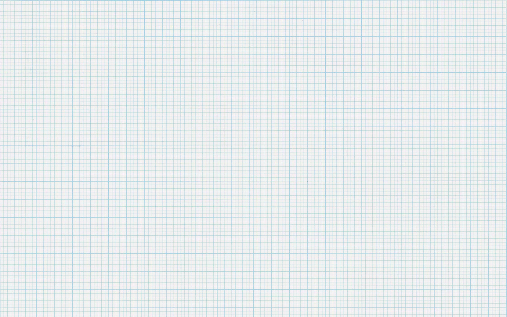

# Grids & the 8pt system

*The 8pt grid builds every margin, padding and component size from whole multiples of a small base unit (usually 8px, often paired with a 4px half-step) - Material Design and Tailwind both ship this way, and a real audit checks computed values against 4/8, not eyeballing 'looks aligned.'*

> Every LEGO brick ever molded, from the smallest 1x1 to the largest baseplate, clicks perfectly onto
> every other LEGO brick - because every one of them, across seven decades of sets, is built from exact
> multiples of a single stud unit. A UI built on an 8pt grid works the same way: every margin, padding,
> and component size is a multiple of one small base number, so anything placed next to anything else
> lines up without anyone doing the math by eye.

> **In real life**
>
> A sheet of engineering graph paper: a fine grid of small squares covering the whole page, with a
> noticeably bolder line marking off every fifth square into a larger, more visible unit. Nobody drawing
> on this paper measures each line by hand - the grid itself enforces consistency, and the bold lines
> give a quick, countable larger unit for measuring bigger distances. That's the exact relationship an
> 8pt grid formalizes for a screen: a small base unit (here, the fine grid) plus a larger multiple of it
> (the bold line) that everything drawn on the page aligns to - on paper, centuries before "8pt grid"
> was a UI design term.

**Grids & the 8pt system**: The 8pt grid system is a spacing and sizing convention where every layout value - margin, padding, gap, component dimension - is built as a whole-number multiple of a small base unit, most commonly 8px. Many real systems pair it with a 4px 'half-step' for finer adjustments (icon padding, hairline borders, small nudges) where a full 8px jump would be too coarse. The point isn't the specific number 8 - it's that every spacing decision comes from one small fixed set of values instead of arbitrary ad hoc numbers, so anything built at different times by different people still lines up.

## Why 8, specifically

- **8 divides evenly into common screen pixel densities** — at 2x and 3x device pixel ratios (the
  standard scaling factors for most phones and high-DPI displays), an 8px value scales to a clean
  whole pixel every time, avoiding the sub-pixel rounding that odd base units can produce.
- **Material Design's own spacing scale is explicitly built this way** — Google documents a scale of
  4, 8, 12, 16, 24, 32, 40, 48, 56, 64px, all multiples of 4, with the 8-multiples (8, 16, 24, 32...)
  doing most of the layout work and 4px reserved for the tightest gaps.
- **It reduces decision fatigue** — a designer or developer picks from a small fixed set of numbers
  instead of inventing a new margin value for every component, which is also what makes a spacing
  audit checkable at all: there's a defined "correct" set to check computed values against.
- **Tailwind's default spacing scale is built on a 4px base multiplier**, not a pure 8px one — every
  utility number is that number times 4px (`p-4` = 16px, `p-6` = 24px), so roughly half of Tailwind's
  default steps land on 4px only, not the full 8px grid (see the Python playground below for the
  real breakdown).
- **A "4pt grid" variant exists on purpose** for denser UI — icon-heavy toolbars, data-table row
  padding, and other detail-dense areas where 8px steps would be too coarse to express real distinctions.

> **Tip**
>
> When auditing spacing, don't assume "off the 8pt grid" automatically means "bug." Many real, well-regarded
> design systems (Tailwind included) deliberately ship 4px half-steps alongside 8px steps. The actual
> question is whether the VALUE IN FRONT OF YOU matches the system's own documented scale - a 13px
> padding in a system whose scale only defines 4/8/12/16px steps is a real finding; a 12px padding in
> that same system is not, even though 12 isn't a multiple of 8.

> **Common mistake**
>
> Flagging every non-multiple-of-8 value as a defect without checking whether the design system defines
> a 4px half-step. An 8pt grid system that only ever produces exact multiples of 8 is one specific,
> stricter variant - plenty of real systems (Material Design's own scale included) intentionally include
> 4px values as legitimate grid citizens, not exceptions.


*Graph paper scan — Wikimedia Commons, CC BY 2.0. [Source](https://commons.wikimedia.org/wiki/File:Graph_paper_scan_1600x1000_(6509259561).jpg)*
- **One small square — the base unit** — Every distance on this sheet is drawn as some number of these squares - nobody re-measures a fresh unit for each line, the same way an 8pt grid fixes one base value everything else multiplies from.
- **A bold gridline intersection — the larger, more visible unit** — Marking off every fifth small square, this is the paper equivalent of a design system's larger spacing steps (16px, 24px, 32px) built from repeating the same small base unit.
- **The same bold interval, repeating consistently across the whole sheet** — The grid doesn't get looser or tighter in different areas of the page - exactly the property that makes an 8pt grid checkable: any two components anywhere in a UI should share the same base unit.

**Auditing a screen's spacing against the grid**

1. **Find the design system's actual documented spacing scale** — Not an assumption of 'pure 8px' - confirm whether 4px half-steps are legitimate in this specific system.
2. **Pull real computed margin/padding/gap values from DevTools** — The rendered pixel values, not the design file's stated intent.
3. **Check each value against the documented scale, not just 'divisible by 8'** — A value can be off-grid even if it's a multiple of 4, if the system's own scale never defines that step.
4. **Flag specific off-scale values with their actual numbers** — 'Tooltip padding renders at 13px; the system's scale only defines 4/8/12/16px steps' beats 'spacing feels inconsistent.'
5. **Distinguish a genuine outlier from an intentional half-step** — Cross-check against the system's own documentation before filing - not every non-8 value is a bug.

Tailwind's real, shipped spacing scale is checkable arithmetic — and it shows plainly that not every
step lands on the full 8px grid, only some of them:

*Run it - checking Tailwind's real spacing scale against the 8pt grid (Python)*

```python
# Tailwind CSS's real spacing scale: every utility number * a 4px base unit
# (--spacing: 0.25rem in Tailwind v4, unchanged in practice from v3's config)
tailwind_steps = [0, 0.5, 1, 1.5, 2, 2.5, 3, 3.5, 4, 5, 6, 7, 8, 9, 10, 12, 14, 16, 20, 24]
base_px = 4

print("Tailwind's spacing scale (step * 4px base unit) checked against the 8pt grid:")
print()
print(f"{'Step':<8}{'px value':<10}{'On 4px grid?':<14}{'On 8px grid?'}")
on_8_count = 0
on_4_only_count = 0
off_grid_count = 0
for step in tailwind_steps:
    px = step * base_px
    on_4 = (px % 4 == 0)
    on_8 = (px % 8 == 0)
    if on_8:
        on_8_count += 1
    elif on_4:
        on_4_only_count += 1
    else:
        off_grid_count += 1
    label = f"p-{step}"
    print(f"{label:<8}{px:<10.1f}{'yes' if on_4 else 'no':<14}{'yes' if on_8 else 'no'}")

print()
print(f"{on_8_count} of {len(tailwind_steps)} default steps land on the full 8px grid.")
print(f"{on_4_only_count} land on the 4px half-step only (odd multiples of 4, e.g. 4px, 12px, 20px).")
print(f"{off_grid_count} land off the 4px grid entirely (the 2px half-steps: 2, 6, 10, 14px).")
print()
print("None of this makes Tailwind's scale 'wrong' - it means an accurate audit against a")
print("Tailwind-based UI has to check against Tailwind's REAL scale (4px steps, with 8px")
print("steps as a subset), not assume every legitimate value is a multiple of 8.")

# Tailwind's spacing scale (step * 4px base unit) checked against the 8pt grid:
#
# Step    px value  On 4px grid?  On 8px grid?
# p-0     0.0       yes           yes
# p-0.5   2.0       no            no
# p-1     4.0       yes           no
# p-1.5   6.0       no            no
# p-2     8.0       yes           yes
# p-2.5   10.0      no            no
# p-3     12.0      yes           no
# p-3.5   14.0      no            no
# p-4     16.0      yes           yes
# p-5     20.0      yes           no
# p-6     24.0      yes           yes
# p-7     28.0      yes           no
# p-8     32.0      yes           yes
# p-9     36.0      yes           no
# p-10    40.0      yes           yes
# p-12    48.0      yes           yes
# p-14    56.0      yes           yes
# p-16    64.0      yes           yes
# p-20    80.0      yes           yes
# p-24    96.0      yes           yes
#
# 11 of 20 default steps land on the full 8px grid.
# 5 land on the 4px half-step only (odd multiples of 4, e.g. 4px, 12px, 20px).
# 4 land off the 4px grid entirely (the 2px half-steps: 2, 6, 10, 14px).
#
# None of this makes Tailwind's scale 'wrong' - it means an accurate audit against a
# Tailwind-based UI has to check against Tailwind's REAL scale (4px steps, with 8px
# steps as a subset), not assume every legitimate value is a multiple of 8.
```

Running the same grid-check logic on a realistic set of computed spacing values from an actual QA
pass — the kind of numbers DevTools hands you directly:

*Run it - auditing real computed spacing values against the 8pt/4pt grid (Java)*

```java
public class Main {
    public static void main(String[] args) {
        // A QA review's computed padding/margin/gap values pulled from DevTools
        // across several real components on one screen.
        String[] labels = {
            "Card padding", "Button vertical padding", "Section margin-bottom",
            "Icon-to-label gap", "Form field gap", "Modal padding",
            "Tooltip padding", "Badge padding", "Nav item gap"
        };
        int[] values = {16, 10, 32, 6, 12, 24, 13, 4, 20};

        System.out.println("QA design review: computed spacing values checked against the 8pt/4pt grid");
        System.out.println();
        System.out.printf("%-26s %-8s %s%n", "Element", "px", "Grid status");

        int on8 = 0, on4only = 0, offGrid = 0;
        for (int i = 0; i < values.length; i++) {
            int px = values[i];
            String status;
            if (px % 8 == 0) {
                status = "on 8pt grid";
                on8++;
            } else if (px % 4 == 0) {
                status = "on 4pt half-step only";
                on4only++;
            } else {
                status = "OFF GRID - flag it";
                offGrid++;
            }
            System.out.printf("%-26s %-8d %s%n", labels[i], px, status);
        }

        System.out.println();
        System.out.printf("%d on the full 8pt grid, %d on the 4pt half-step, %d off grid entirely.%n", on8, on4only, offGrid);
    }
}

/* QA design review: computed spacing values checked against the 8pt/4pt grid

   Element                    px       Grid status
   Card padding               16       on 8pt grid
   Button vertical padding    10       OFF GRID - flag it
   Section margin-bottom      32       on 8pt grid
   Icon-to-label gap          6        OFF GRID - flag it
   Form field gap             12       on 4pt half-step only
   Modal padding              24       on 8pt grid
   Tooltip padding            13       OFF GRID - flag it
   Badge padding              4        on 4pt half-step only
   Nav item gap               20       on 4pt half-step only

   3 on the full 8pt grid, 3 on the 4pt half-step, 3 off grid entirely. */
```

### Your first time: Your mission: audit a real screen's spacing against the grid

- [ ] Find the design system's actual documented spacing scale — The style guide, Figma tokens, or (for QA Mastery itself) Tailwind's real default scale.
- [ ] Pick a content-dense screen in BuggyShop or the platform — A card grid, a form, or a modal with several distinct spacing decisions.
- [ ] Pull the actual computed margin/padding/gap values from DevTools for at least five elements — The rendered pixel values, not the design file's stated intent.
- [ ] Check each value against the documented scale, not just 'divisible by 8' — Confirm whether 4px half-steps are legitimate in this system before flagging them.
- [ ] Write a finding naming the specific off-scale value(s) — 'Tooltip padding renders at 13px against a 4/8/12/16px scale' beats 'spacing looks inconsistent.'

You've practiced turning "the spacing feels off" into a specific, measured finding naming which value
breaks the system's own documented grid, and why that's different from a legitimate half-step.

- **A component's padding measures 12px, and you're not sure whether to flag it since 12 isn't a multiple of 8.**
  Check the design system's own documented scale first. If it defines a 4px half-step (as Material Design and Tailwind both do), 12px is a legitimate grid value, not a defect - only flag values the system's own scale doesn't define at all.
- **Two visually similar components (e.g. two card types) use different spacing values that are both individually 'on grid.'**
  Being individually valid grid values doesn't mean they're consistent with EACH OTHER - if the design intent was for both card types to match, flag the inconsistency as a design-system adherence issue distinct from a grid-violation issue.
- **A spacing value renders as 15px or 17px instead of an expected clean number, and you suspect a calculation bug rather than an intentional choice.**
  This is a strong signal worth checking the source CSS directly - values one pixel off a grid step (15 instead of 16, 17 instead of 16) are more often the result of a border, subpixel rounding, or a box-sizing miscalculation than an intentional design decision.

### Where to check

- **Browser DevTools' computed styles panel** — the ground truth for actual rendered margin, padding, and gap values, independent of what a style guide states.
- **The design system's own token/scale documentation** — the actual defined scale to check computed values against, not an assumed "pure multiples of 8" rule.
- **A Figma/design-file inspector panel** — useful for comparing the intended value against what's actually rendered, to separate a design-file error from an implementation error.
- **[[ui-ux-design-qa/typography-and-spacing/alignment-and-white-space]]** — a related check; grid adherence and alignment both contribute to whether a layout reads as deliberate rather than ad hoc.

### Worked example: filing an 8pt grid finding

1. QA review of a product card grid notes that "the cards feel slightly inconsistent," without a
   specific number attached.
2. Pulling computed styles: card A's internal padding is 16px, card B's (a supposedly identical
   component reused elsewhere) is 14px.
3. Checking the design system's documented scale: it defines 4, 8, 12, 16, 24, 32px steps. 14px does
   not appear anywhere in it - this isn't a legitimate half-step, it's off the system's own scale entirely.
4. The real problem: card B was very likely built independently rather than reusing the actual card
   component, and picked up a slightly different, off-scale padding value in the process.
5. Finding: "Card component padding is inconsistent: 16px (Products page) vs. 14px (Search results
   page), and 14px doesn't appear in the design system's documented 4/8/12/16/24/32px scale at all.
   Recommend confirming both instances use the same underlying card component." Specific numbers, a
   check against the actual documented scale, and a concrete likely root cause - not "needs more consistency."

**Quiz.** A design system's documentation explicitly defines a spacing scale of 4, 8, 12, 16, 24, 32, 48, 64px. A component renders with 20px padding. Based on this note's framework, what's the correct assessment?

- [ ] This is fine, because 20 is a multiple of 4, and any multiple of 4 is automatically valid in an 8pt grid system
- [x] This is a genuine finding - 20px isn't a multiple of 8, but more specifically it also doesn't appear anywhere in THIS system's own documented scale, which is the actual test that matters, not a generic 'divisible by 8 or 4' rule
- [ ] This is fine, because 20 is close enough to 16 or 24 that the difference wouldn't be visually noticeable
- [ ] This is impossible to assess without knowing the component's font size, since spacing grids are defined relative to type size, not as fixed pixel values

*This note's central point is that grid adherence has to be checked against a system's OWN documented scale, not a generic assumption that any multiple of 4 (or of 8) is automatically valid. Here, the system explicitly lists 4, 8, 12, 16, 24, 32, 48, 64px - 20px is absent from that list entirely, even though it IS a multiple of 4. Option one wrongly assumes any multiple of 4 is automatically fine, which contradicts this system's own explicit, narrower scale. Option three substitutes a subjective 'close enough' judgment for the actual documented values, which is exactly the kind of vague eyeballing this note's worked examples argue against in favor of specific numbers. Option four is a real but separate typographic concept (relative/fluid spacing) that this note doesn't claim applies here - the system in the question defines fixed pixel steps, not type-relative ones, and grid-adherence checks work the same way regardless of which system a project uses, which is exactly the distinction covered in [[ui-ux-design-qa/typography-and-spacing/grids-and-the-8pt-system]]'s own worked example.*

- **What the 8pt grid actually requires** — Every spacing/sizing value is a whole-number multiple of one small base unit (commonly 8px) - the fixed unit matters more than the specific number 8.
- **Why 8 specifically** — It divides evenly into common 2x/3x device pixel ratios, so scaled values land on a clean whole pixel - plus it's what Material Design's own spacing scale is built on.
- **The 4pt half-step** — Many real systems (Material Design, Tailwind) pair the 8px grid with a 4px half-step for finer adjustments - a 4px-only value isn't automatically a bug.
- **Tailwind's real spacing scale, precisely** — Every utility number times a 4px base unit - only about half of Tailwind's default steps land on the full 8px grid; the rest are legitimate 4px (or smaller) steps.
- **The correct test for a grid-adherence finding** — Check the computed value against the SYSTEM'S OWN documented scale, not a generic 'must be divisible by 8' rule - a value can be off that system's scale even if it's a multiple of 4.

### Challenge

Pick a real content-dense screen in BuggyShop or the platform. Pull the actual computed margin,
padding, and gap values for at least five elements via DevTools, check each against the actual
documented spacing scale (Tailwind's real 4px-based scale for this project), and write a finding
naming any specific off-scale value you find.

### Ask the community

> I measured `[element]` at `[value]px` padding/margin on `[screen]`. The design system's documented scale is `[scale]`, and this value `[does/doesn't]` appear in it. Does this framing hold up as a grid-adherence finding, or am I missing a legitimate half-step?

The most useful replies will check the actual documented scale for the specific project rather than
assuming a generic 8px-only rule - what counts as "on grid" genuinely varies system to system.

- [Spec.fm — The 8pt Grid](https://spec.fm/specifics/8-pt-grid)
- [UX Planet — Everything You Should Know About the 8 Point Grid System](https://uxplanet.org/everything-you-should-know-about-8-point-grid-system-in-ux-design-b69cb945b18d)
- [Why Product Designers Should Be Using an 8pt Grid System](https://www.youtube.com/watch?v=ak_zNvESZL8)

🎬 [UX Tshili — 8 Point Grid System: Improve Your UI Designs](https://www.youtube.com/watch?v=FhGdLUW_8S0) (9 min)

- The 8pt grid builds every spacing/sizing value from whole multiples of one small base unit - usually 8px, often paired with a 4px half-step for finer adjustments.
- 8 is chosen because it divides evenly into common 2x/3x device pixel ratios - and Material Design's own documented spacing scale is built on exactly this pattern.
- Tailwind's real default spacing scale is built on a 4px base multiplier, not a pure 8px one - only about half its default steps land on the full 8px grid.
- A real grid-adherence check compares a computed value against the SYSTEM'S OWN documented scale, not a generic 'must be divisible by 8' assumption - a legitimate 4px half-step isn't a bug.
- The actionable finding names the specific off-scale pixel value and what the documented scale actually defines - not a vague 'spacing feels inconsistent.'


## Related notes

- [[Notes/ui-ux-design-qa/typography-and-spacing/type-hierarchy|Type hierarchy]]
- [[Notes/ui-ux-design-qa/typography-and-spacing/alignment-and-white-space|Alignment & white space]]
- [[Notes/ui-ux-design-qa/design-principles-and-the-laws-of-ux/gestalt-principles|Gestalt principles]]


---
_Source: `packages/curriculum/content/notes/ui-ux-design-qa/typography-and-spacing/grids-and-the-8pt-system.mdx`_
