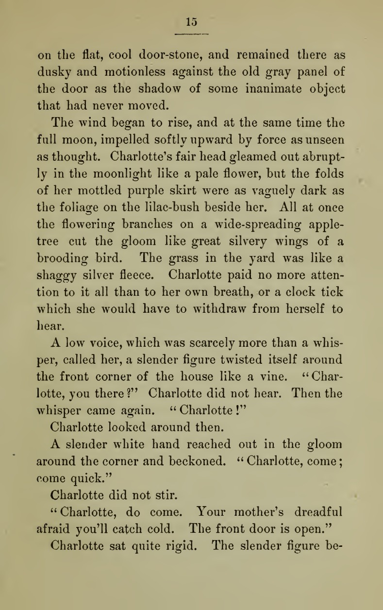

# Readable line lengths

*The classic 45-75 characters-per-line range (Bringhurst; 66 CPL most cited) reduces eye strain and re-fixation errors - WCAG SC 1.4.8 caps it at 80. CSS's 'ch' unit approximates this but isn't a literal character count, so a real check still needs a measurement, not just trusting max-width: 70ch.*

> Open a typeset novel from over a century ago and count the characters on a typical line - it lands
> close to 60-70, almost every time, on almost every page, across almost every publisher. That's not
> coincidence or house style; it's a range typographers converged on because it's genuinely easier to
> read. A UI's body text column follows the exact same physics, whether or not anyone designing it knows
> the number.

> **In real life**
>
> A page from an 1894 novel: dense, single-column prose, each line running from margin to margin at a
> remarkably consistent length - not too short (which would force the eye to jump lines constantly),
> not too long (which would make it easy to lose your place returning to the start of the next line).
> Typesetters arrived at this range through centuries of trial and error, long before anyone measured
> saccades in a lab - modern eye-tracking research just explains, with numbers, why that instinct was
> right.

**Readable line lengths**: Readable line length is usually measured in characters per line (CPL) - the average number of characters, including spaces, that fit on one line of body text. Robert Bringhurst's classic typographic guideline recommends 45-75 CPL for single-column prose, with 66 CPL the most frequently cited single target (following Jan Tschichold's earlier recommendation). WCAG 2.2's Success Criterion 1.4.8 (Visual Presentation, an AAA-level criterion) sets an explicit upper bound of no more than 80 characters or glyphs per line. Lines shorter than this range force too-frequent line breaks and disrupt reading rhythm; lines longer than it make it easy for the eye to lose its place returning to the start of the next line.

## The actual numbers

- **45-75 CPL, Bringhurst's range** — the classic single-column-prose guideline from The Elements
  of Typographic Style, still the most commonly cited reference point.
- **66 CPL** — the single most frequently cited "sweet spot," tracing back to Tschichold.
- **~55 CPL** — research by Dyson & Haselgrove found this medium length supported effective reading
  at both normal and fast reading speeds specifically.
- **80 characters, WCAG SC 1.4.8's explicit ceiling** — an AAA-level criterion, but a useful hard
  upper bound to check against even on projects not targeting full AAA compliance.
- **30-50 CPL on mobile** — narrower viewports need a shorter target range to account for reduced
  screen real estate, not the same 45-75 desktop range squeezed into a phone width.
- **Real e-commerce research backs this up**: Baymard found product descriptions wider than 80 CPL
  were skipped roughly 41% more often than ones in the 60-70 CPL range - this isn't just an eye-strain
  argument, it affects whether people read the text at all.

> **Tip**
>
> CSS's `max-width: 70ch` is a genuinely good, widely-used technique for approximating a target line
> length - but the `ch` unit is defined as the width of the `0` (zero) glyph specifically, not an
> average character. It's an approximation, not a literal character-count guarantee (see the Java
> playground below for exactly how far real text can diverge from the nominal number).

> **Common mistake**
>
> Assuming a column that "looks about right" is fine without ever counting. Line length is one of the
> few typography checks with a genuinely simple, fast manual test: select a full typical line of body
> text and count (or use DevTools/a script to count) the actual characters. A column that "looks fine"
> at a glance can easily be 90-100+ CPL on a wide unconstrained desktop layout.


*Pembroke; a novel (Mary Wilkins Freeman, 1894) — Wikimedia Commons / Internet Archive, Public Domain. [Source](https://commons.wikimedia.org/wiki/File:Pembroke;_a_novel_(IA_pembrokenovel00free).pdf)*
- **A typical full line of this page's prose** — Counting characters on a representative line here lands close to the 45-75 Bringhurst range typesetters converged on well before it was studied scientifically.
- **The left margin** — Fixed alongside the right margin, the two margins together define the column's actual width - and thus its CPL, independent of font size choices made elsewhere on the page.
- **The right margin** — A page's line-length discipline comes from BOTH margins staying consistent - a page that widens or narrows its text column partway down would break the steady CPL visible here.

**Measuring a real column's line length**

1. **Find the actual rendered column width and font size** — DevTools' computed styles for the text container and its font-size, not the design file's stated values.
2. **Either count characters on a real rendered line, or estimate from width/font-size** — Counting a real line is more accurate; an estimate (like this note's playground) is a faster first pass.
3. **Compare against the target range for the context** — 45-75 CPL desktop, 30-50 CPL mobile, hard ceiling of 80 (WCAG SC 1.4.8) either way.
4. **If using a CSS `ch`-based max-width, verify with real text** — The `ch` unit approximates a target, but actual CPL varies with the real character mix - check, don't just trust the number.
5. **File a finding with the actual measured/estimated CPL and the target range** — 'Estimated ~90 CPL against a 45-75 target' beats 'the lines feel long.'

Estimating characters-per-line from a container's actual width and font size — including a check on
QA Mastery's own real notes-reader container (the exact one rendering this note):

*Run it - estimating CPL for real container widths (Python)*

```python
def estimate_cpl(container_width_px, font_size_px, avg_char_width_ratio=0.5):
    # avg_char_width_ratio: average character advance width as a fraction of
    # font-size, for a typical proportional UI font - a commonly-cited
    # approximation (~0.5), not an exact per-font measurement.
    avg_char_width_px = avg_char_width_ratio * font_size_px
    return container_width_px / avg_char_width_px

samples = [
    ("Narrow mobile column", 320, 16),
    ("Common article column", 600, 18),
    ("QA Mastery's own notes container (max-w-2xl, text-[15px])", 672, 15),
    ("Wide unconstrained desktop paragraph", 1200, 16),
]

print("Estimated characters-per-line (CPL) for real container widths:")
print()
print(f"{'Sample':<58} {'Est. CPL':<10} {'In 45-75 range?'}")
for name, width, font_size in samples:
    cpl = estimate_cpl(width, font_size)
    in_range = "yes" if 45 <= cpl <= 75 else "NO - outside Bringhurst's range"
    print(f"{name:<58} {cpl:<10.0f} {in_range}")

print()
print("QA Mastery's own notes reader (this very page's container) estimates to")
print("roughly 90 CPL at this heuristic ratio - above Bringhurst's 45-75 range")
print("and above WCAG's 80-character upper bound (SC 1.4.8). This is an ESTIMATE")
print("using a common approximation ratio, not a precise per-font measurement -")
print("worth a real DevTools check (actual rendered characters per line at the")
print("real font) before filing it as a confirmed finding rather than a lead.")

# Estimated characters-per-line (CPL) for real container widths:
#
# Sample                                                     Est. CPL   In 45-75 range?
# Narrow mobile column                                       40         NO - outside Bringhurst's range
# Common article column                                      67         yes
# QA Mastery's own notes container (max-w-2xl, text-[15px])  90         NO - outside Bringhurst's range
# Wide unconstrained desktop paragraph                       150        NO - outside Bringhurst's range
#
# QA Mastery's own notes reader (this very page's container) estimates to
# roughly 90 CPL at this heuristic ratio - above Bringhurst's 45-75 range
# and above WCAG's 80-character upper bound (SC 1.4.8). This is an ESTIMATE
# using a common approximation ratio, not a precise per-font measurement -
# worth a real DevTools check (actual rendered characters per line at the
# real font) before filing it as a confirmed finding rather than a lead.
```

The CSS `ch` unit's actual definition, tested against real narrow-vs-wide text — this is why "70ch"
and "70 characters" aren't the same claim:

*Run it - why 'max-width: 70ch' isn't literally 70 characters (Java)*

```java
class Main {
    // Simplified relative character widths versus the '0' glyph (what CSS's
    // 'ch' unit is actually defined by) for a typical proportional font.
    static double relativeWidth(char c) {
        String narrow = "iIljtf.,;:'!|";
        String wide = "mwMW@";
        if (narrow.indexOf(c) >= 0) return 0.35;
        if (wide.indexOf(c) >= 0) return 1.45;
        if (c == ' ') return 0.4;
        return 1.0; // an average-width character, same as '0' itself
    }

    public static void main(String[] args) {
        String sentence = "The quick will jump over many walls with tiny little instincts filling this line with narrow letters mmmm";
        double targetChWidth = 70.0; // a CSS max-width: 70ch container

        double cumulativeWidth = 0.0;
        int charsFitted = 0;
        for (char c : sentence.toCharArray()) {
            double w = relativeWidth(c);
            if (cumulativeWidth + w > targetChWidth) break;
            cumulativeWidth += w;
            charsFitted++;
        }

        System.out.println("A CSS 'max-width: 70ch' container - 'ch' is defined as the width of");
        System.out.println("the '0' glyph specifically, not an average character.");
        System.out.println();
        System.out.println("Test sentence (deliberately narrow-heavy then wide-heavy):");
        System.out.println("  \"" + sentence + "\"");
        System.out.println();
        System.out.printf("Characters that actually fit before hitting 70 '0'-widths: %d%n", charsFitted);
        System.out.printf("(Literal character count of the full sentence: %d)%n", sentence.length());
        System.out.println();
        System.out.println("A container set to '70ch' does NOT guarantee 70 real characters per line -");
        System.out.println("it guarantees a width equal to 70 COPIES OF THE ZERO GLYPH. A sentence full");
        System.out.println("of narrow characters (i, l, t) fits MORE than 70 real characters in that");
        System.out.println("same width; one full of wide characters (m, w, M) fits FEWER. 'ch'-based");
        System.out.println("max-width is a good, real CSS technique for approximating a target line");
        System.out.println("length, but checking actual rendered CPL still needs a real measurement,");
        System.out.println("not just trusting the 'ch' number as if it were a literal character count.");
    }
}

/* A CSS 'max-width: 70ch' container - 'ch' is defined as the width of
   the '0' glyph specifically, not an average character.

   Test sentence (deliberately narrow-heavy then wide-heavy):
     "The quick will jump over many walls with tiny little instincts filling this line with narrow letters mmmm"

   Characters that actually fit before hitting 70 '0'-widths: 98
   (Literal character count of the full sentence: 105)

   A container set to '70ch' does NOT guarantee 70 real characters per line -
   it guarantees a width equal to 70 COPIES OF THE ZERO GLYPH. A sentence full
   of narrow characters (i, l, t) fits MORE than 70 real characters in that
   same width; one full of wide characters (m, w, M) fits FEWER. 'ch'-based
   max-width is a good, real CSS technique for approximating a target line
   length, but checking actual rendered CPL still needs a real measurement,
   not just trusting the 'ch' number as if it were a literal character count. */
```

### Your first time: Your mission: measure a real column's line length

- [ ] Pick a body-text column in BuggyShop or the platform — A lesson page, a product description, or this very Notes reader all work.
- [ ] Pull the actual computed container width and font-size from DevTools — Not the design file's stated intent.
- [ ] Estimate CPL using this note's ratio, or count a real rendered line directly — Counting a real line is the more accurate method when you have time.
- [ ] Compare against 45-75 CPL (desktop) or 30-50 CPL (mobile), with 80 as a hard ceiling — Note which target applies based on the viewport.
- [ ] If a `ch`-based max-width is in use, sanity-check with real prose — Confirm the nominal 'Nch' number roughly matches the real character count for typical text, not just narrow or wide extremes.

You've practiced measuring a genuinely simple but frequently-skipped typography check - one with a
real numeric target rather than a subjective "feels long" judgment.

- **Your CPL estimate and an actual character count of a real rendered line disagree noticeably.**
  The estimate uses an approximate average character-width ratio (~0.5x font-size) - real fonts vary, and real prose has an uneven mix of narrow/wide characters. Prefer an actual count of real text over the estimate whenever precision matters; treat the estimate as a fast first-pass screening tool, not a final measurement.
- **A container using `max-width: 70ch` still feels too wide when read normally.**
  As the Java playground shows, 'ch' is defined by the zero-glyph width - it approximates but doesn't guarantee a literal character count. If the real font's average character tends wider than the '0' glyph, the resulting line will hold FEWER real characters than the nominal ch number suggests (the reverse of the narrow-text case in the playground) - re-check with the actual font in place, not just the ch number in isolation.
- **A responsive layout has good line length on desktop but the same relative check flags it as too narrow on mobile.**
  This may be correct, not a bug - the practical target range genuinely shifts to roughly 30-50 CPL on narrower viewports, since desktop's 45-75 range doesn't need to (and often can't) hold on a phone-width column. Check against the width-appropriate range, not one fixed number for every viewport.

### Where to check

- **Browser DevTools' computed styles** — actual rendered container width and font-size, the inputs for any real CPL check.
- **A quick manual character count on a real rendered line** — still the most reliable ground truth, faster than it sounds for a single spot-check.
- **WCAG's Understanding SC 1.4.8 (Visual Presentation)** — the authoritative source for the 80-character AAA ceiling.
- **[[ui-ux-design-qa/typography-and-spacing/grids-and-the-8pt-system]]** — line length interacts with the broader spacing/grid system a layout uses; check both together on a content-heavy screen.

### Worked example: filing a line-length finding

1. QA review of a lesson page's body-text column notes that "the paragraphs feel like a lot to read
   at once," without a specific number attached.
2. Pulling the computed container width (840px) and font-size (17px): estimated CPL using the 0.5
   ratio is 840 / (0.5 × 17) ≈ 99.
3. Manually counting a representative full line of actual rendered text confirms roughly 95-100
   characters per line - consistent with the estimate.
4. This is well above Bringhurst's 75-CPL upper bound and above WCAG's 80-character ceiling.
5. Finding: "Lesson body-text column renders at approximately 95-100 characters per line (840px
   container, 17px font), exceeding both Bringhurst's typographic guideline (45-75 CPL) and WCAG's
   80-character SC 1.4.8 ceiling. Recommend constraining the text column to roughly 650-700px at
   this font size, or applying a `max-width` around 65-70ch with verification against real rendered
   text." Specific measured numbers, not "feels like a lot to read."

**Quiz.** A developer implements a text column with `max-width: 65ch` and considers the line-length requirement satisfied without further checking. Based on this note, is that sufficient verification?

- [ ] Yes - setting max-width in 'ch' units is mathematically defined to produce exactly 65 characters per line for any text, so no further check is needed
- [x] No - 'ch' is defined as the width of the '0' glyph specifically, not an average character; real rendered text with a different mix of narrow/wide characters can hold noticeably more or fewer than 65 real characters, so a check against actual rendered text is still warranted
- [ ] No, but only because 65ch falls slightly outside the 45-75 CPL range and should be changed to a different ch value instead
- [ ] Yes, because WCAG SC 1.4.8 only requires an 80-character ceiling to be declared in CSS, not verified against real rendered content

*This note's Java playground demonstrates directly that a 'ch'-based max-width approximates a target line length but doesn't guarantee a literal character count, because 'ch' is defined by the width of the zero glyph specifically - real prose with narrow characters (i, l, t) fits MORE than the nominal number, and prose with wide characters (m, w, M) fits FEWER. Option one incorrectly treats 'ch' as a literal, guaranteed character count, which the playground's own numeric result (98 characters fit inside a nominal '70ch' budget) directly contradicts. Option three misreads the situation - 65ch is well WITHIN the 45-75 CPL target this note describes, so the problem isn't the chosen value, it's the unverified assumption that the value guarantees a specific character count. Option four misstates WCAG's requirement, which concerns actual rendered content meeting the criterion, not merely a CSS declaration existing - a control being present in the CSS doesn't verify what a user's browser actually renders.*

- **Bringhurst's classic CPL range, and the single most-cited target** — 45-75 characters per line, with 66 CPL the most frequently cited single target (following Tschichold).
- **WCAG's explicit ceiling** — SC 1.4.8 (Visual Presentation, AAA level) requires no more than 80 characters or glyphs per line.
- **The practical mobile-viewport target** — Roughly 30-50 CPL - narrower than the desktop 45-75 range, to account for reduced screen real estate.
- **What CSS's 'ch' unit is actually defined by** — The width of the '0' (zero) glyph in the current font - not an average character width, so 'max-width: 70ch' approximates rather than guarantees 70 real characters per line.
- **The fastest real-world check for line length** — Count the characters on one representative real rendered line directly - faster and more reliable than it sounds, and doesn't require any tooling.

### Challenge

Pick a real body-text column in BuggyShop or the platform (or this Notes reader itself). Pull its
actual container width and font-size, estimate CPL using this note's approach, and confirm with a
manual count of one real rendered line. Compare against the correct target range for that viewport
and write a finding with the specific measured numbers.

### Ask the community

> I measured `[container]` at `[width]px` with `[font-size]px` text, estimating roughly `[CPL]` characters per line. This is `[within/outside]` the 45-75 (desktop) / 30-50 (mobile) target range. Does this framing hold up against a manual count of the real rendered text?

The most useful replies will actually count a real line rather than trusting the estimate alone -
the approximation ratio can be off for specific fonts, and a manual count is the more reliable check.

- [Baymard Institute — Readability: The Optimal Line Length](https://baymard.com/blog/line-length-readability)
- [UXPin — Optimal Line Length for Readability: The 50-75 Character Rule Explained](https://www.uxpin.com/studio/blog/optimal-line-length-for-readability/)
- [Design Pilot — The Ultimate Guide to Typography in UI Design (in-depth, ~46 min)](https://www.youtube.com/watch?v=xnqdvs4zp2o)

🎬 [Pimp my Type — The Right Line Length & Line Height in Typography](https://www.youtube.com/watch?v=6UC5ANh-wT0) (10 min)

- The classic readable range is 45-75 characters per line (Bringhurst), with 66 CPL the most commonly cited target - narrower on mobile (roughly 30-50 CPL).
- WCAG SC 1.4.8 sets an explicit 80-character ceiling (AAA level) - a useful hard upper bound to check regardless of a project's formal compliance target.
- Real e-commerce research (Baymard) shows lines over 80 CPL get skipped ~41% more often than 60-70 CPL lines - this affects whether content gets read, not just how comfortable it feels.
- CSS's `ch` unit approximates a target line length using the zero-glyph's width, not an average character - a 'max-width: 70ch' container can hold noticeably more or fewer than 70 real characters depending on the actual text.
- The fastest real check is simple: count the characters on one representative rendered line and compare to the target range for that viewport.


## Related notes

- [[Notes/ui-ux-design-qa/typography-and-spacing/type-hierarchy|Type hierarchy]]
- [[Notes/ui-ux-design-qa/typography-and-spacing/grids-and-the-8pt-system|Grids & the 8pt system]]
- [[Notes/ui-ux-design-qa/design-principles-and-the-laws-of-ux/fitts-hick-miller-and-jakob|Fitts, Hick, Miller & Jakob]]


---
_Source: `packages/curriculum/content/notes/ui-ux-design-qa/typography-and-spacing/readable-line-lengths.mdx`_
