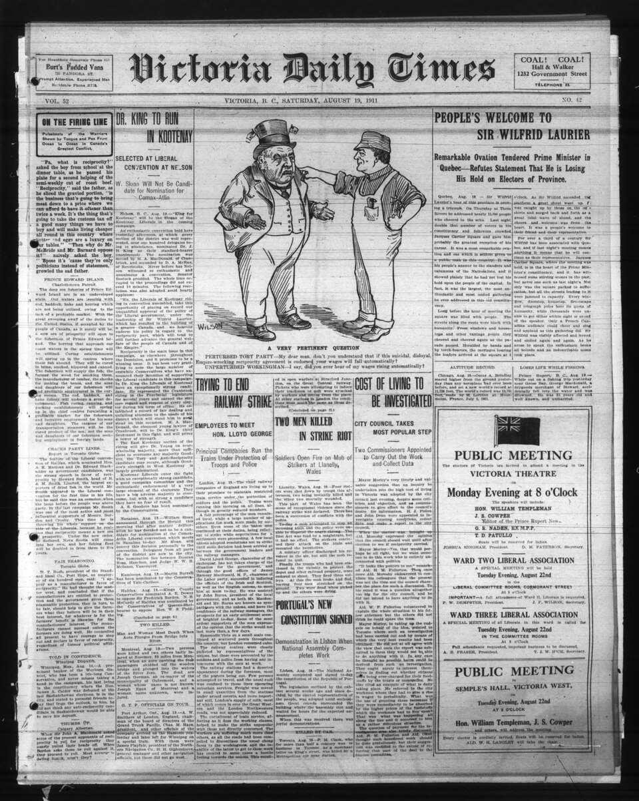

# Type hierarchy

*Type hierarchy is the sized/weighted system telling a reader what to read first - headline biggest and boldest, subheads next, body smallest - built from font size, weight, and a scale ratio, and checkable against real numbers rather than a vibe.*

> Look at any newspaper front page for half a second and you already know which story matters most -
> nobody reads the masthead, then the headline, then the byline, then the body copy in that order
> because a rulebook told them to. The size and weight differences do that work automatically. A UI
> without a real type hierarchy forces users to read everything to figure out what matters, which is
> exactly the failure mode this note teaches you to spot and measure.

> **In real life**
>
> A 1911 newspaper front page: "Victoria Daily Times" in enormous ornate type across the masthead,
> section headlines like "PEOPLE'S WELCOME TO SIR WILFRID LAURIER" in bold caps at a clearly smaller
> but still prominent size, then a smaller subhead line, then dense small body copy filling the column.
> Four distinct levels, readable from across a room down to arm's length, entirely through size and
> weight - no color, no icons, over a century before "visual hierarchy" was a UX term anyone used.

**Type hierarchy**: Type hierarchy is the system of font size, weight, and style differences that tells a reader what to focus on first, second, and last. It's built from a type scale (a set of font sizes, often following a consistent ratio between steps) combined with weight contrast (e.g. bold headlines vs. regular body text). A strong hierarchy has clearly distinct levels; a weak one uses sizes or weights too close together for the eye to separate at a glance.

## What actually creates hierarchy

- **Size contrast** — the most obvious lever; a scale where each level is meaningfully larger than
  the one below it (not just 1-2px different).
- **Weight contrast** — often more important than size alone; a 700-weight heading next to
  400-weight body text reads as clearly distinct even at similar sizes, while a 600-weight heading
  next to 400-weight body is a common "almost, but not quite" mistake.
- **A type scale gives the size steps a system**, rather than picking sizes ad hoc. Classic scales
  use a fixed ratio (Major Third = 1.25, Perfect Fourth = 1.333, etc.) applied repeatedly from a
  base size - but real, widely-shipped frameworks don't always follow this purely (see the Tailwind
  playground below).
- **16px is the common baseline for body text** on the web - small enough to fit dense content,
  large enough to stay comfortably readable without zooming.
- **Hierarchy needs at least a "meaningfully different" gap between levels** to register at a
  glance - two adjacent levels that are only a couple pixels or one weight step apart tend to blur
  together rather than read as genuinely separate levels.

> **Tip**
>
> When two heading levels look "almost the same," check both size AND weight, not just size. A
> Heading 2 and Heading 3 at 24px/700 and 22px/600 might individually look intentional in a style
> guide, but on screen the 2px + 100-weight gap often isn't enough to register as a distinct level -
> try widening one or the other before concluding the design "just needs more contrast" vaguely.

> **Common mistake**
>
> Assuming every widely-used framework's default type scale follows a strict mathematical ratio.
> Tailwind's real, shipped default scale (12/14/16/18/20/24/30/36/48px) does NOT use one constant
> ratio between steps - the jumps range from about 1.11x to 1.33x. That's a legitimate, practical
> design choice, not a bug - don't flag "inconsistent ratio" as a defect against a scale that was
> never meant to be a pure geometric progression.


*Victoria Daily Times, August 19, 1911 — Wikimedia Commons, Public Domain. [Source](https://commons.wikimedia.org/wiki/File:Victoria_Daily_Times_(1911-08-19)_(IA_victoriadailytimes19110819).pdf)*
- **The masthead — the largest, most ornate level** — Read once per issue, not once per story - the top of the hierarchy is reserved for something the reader only needs to register a single time.
- **A bold section headline** — Clearly smaller than the masthead but still the dominant text on the page below it - this is the level meant to be scanned first across every story competing for attention.
- **A secondary subhead line** — Smaller and lighter than the headline above it, but still distinct from body copy - a real THIRD level, not just a variation of the headline or the body text.
- **Dense small body copy** — The smallest, plainest level - meant to be read closely and slowly by someone who has already decided (via the levels above) that this story is worth their time.

**Auditing a screen's type hierarchy**

1. **List every distinct text role on the screen** — Page title, section headers, card titles, body text, captions, metadata.
2. **Record the actual rendered size AND weight for each** — From DevTools' computed styles, not the design file's stated intent.
3. **Check whether adjacent levels are meaningfully distinct** — A small size gap alone may not register - check whether weight also differs where size doesn't jump much.
4. **Confirm the reading order matches the intended importance** — The visually largest/boldest element should be the one that matters most on that screen.
5. **Flag any two levels that read as visually identical despite being semantically different** — This is the concrete, checkable version of 'the hierarchy feels flat.'

Tailwind's real, shipped default type scale is checkable arithmetic — and it reveals it isn't built
on one constant ratio, contrary to what "textbook modular scale" theory might suggest:

*Run it - Tailwind's real type scale isn't one constant ratio (Python)*

```python
# Tailwind CSS's real, documented default type scale (v4, unchanged from v3)
tailwind_scale = [
    ("text-xs", 12),
    ("text-sm", 14),
    ("text-base", 16),
    ("text-lg", 18),
    ("text-xl", 20),
    ("text-2xl", 24),
    ("text-3xl", 30),
    ("text-4xl", 36),
    ("text-5xl", 48),
]

print("Tailwind's real default type scale and the ratio between each consecutive step:")
print()
print(f"{'Step':<12} {'Size (px)':<10} {'Ratio vs previous'}")
prev_size = None
ratios = []
for name, size in tailwind_scale:
    if prev_size is None:
        print(f"{name:<12} {size:<10} -")
    else:
        ratio = size / prev_size
        ratios.append(ratio)
        print(f"{name:<12} {size:<10} {ratio:.3f}")
    prev_size = size

print()
print(f"Ratios range from {min(ratios):.3f} to {max(ratios):.3f} - NOT a single constant number.")
print("A 'textbook' modular scale (like the classic Major Third, ratio 1.25 applied")
print("uniformly) produces a perfectly consistent geometric progression. Tailwind's")
print("actual shipped scale doesn't do that - it's a hand-tuned, practical progression,")
print("tighter at small sizes and looser at large ones. Both are legitimate: one is a")
print("pure mathematical model, the other is a widely-used real-world compromise.")

# Tailwind's real default type scale and the ratio between each consecutive step:
#
# Step         Size (px)  Ratio vs previous
# text-xs      12         -
# text-sm      14         1.167
# text-base    16         1.143
# text-lg      18         1.125
# text-xl      20         1.111
# text-2xl     24         1.200
# text-3xl     30         1.250
# text-4xl     36         1.200
# text-5xl     48         1.333
#
# Ratios range from 1.111 to 1.333 - NOT a single constant number.
# A 'textbook' modular scale (like the classic Major Third, ratio 1.25 applied
# uniformly) produces a perfectly consistent geometric progression. Tailwind's
# actual shipped scale doesn't do that - it's a hand-tuned, practical progression,
# tighter at small sizes and looser at large ones. Both are legitimate: one is a
# pure mathematical model, the other is a widely-used real-world compromise.
```

Generating a strict, textbook modular scale in a second language shows exactly how far it diverges
from Tailwind's real, practical one:

*Run it - a pure Major Third scale vs. Tailwind's real scale (Java)*

```java
class Main {
    public static void main(String[] args) {
        double base = 16.0;
        double ratio = 1.25; // Major Third - a classic modular-scale ratio
        int steps = 8;

        System.out.println("A strict Major Third (1.25) modular scale generated from a 16px base:");
        System.out.println();

        double[] modularScale = new double[steps];
        for (int i = 0; i < steps; i++) {
            modularScale[i] = base * Math.pow(ratio, i);
            System.out.printf("  step %d: %.2fpx%n", i, modularScale[i]);
        }

        // Tailwind's real shipped scale, for comparison at the same step count
        double[] tailwindScale = {12, 14, 16, 18, 20, 24, 30, 36};

        System.out.println();
        System.out.println("Comparing the pure formula to Tailwind's real shipped scale:");
        System.out.println();
        System.out.printf("%-8s %-16s %-16s %s%n", "Step", "Major Third", "Tailwind", "Difference");
        for (int i = 0; i < steps; i++) {
            double diff = modularScale[i] - tailwindScale[i];
            System.out.printf("%-8d %-16.2f %-16.1f %+.2f%n", i, modularScale[i], tailwindScale[i], diff);
        }

        System.out.println();
        System.out.println("The two scales diverge immediately, and the gap widens steadily - from");
        System.out.printf("+%.2fpx at step 0 to +%.2fpx at step 7. The pure formula grows faster at%n", modularScale[0] - tailwindScale[0], modularScale[7] - tailwindScale[7]);
        System.out.println("every step because a constant 1.25 ratio compounds, while Tailwind's real");
        System.out.println("scale grows by smaller, hand-tuned increments. Neither is 'wrong': a strict");
        System.out.println("ratio guarantees mathematical consistency; a real shipped framework's scale");
        System.out.println("reflects practical judgment about what actually reads well at each size.");
    }
}

/* A strict Major Third (1.25) modular scale generated from a 16px base:

     step 0: 16.00px
     step 1: 20.00px
     step 2: 25.00px
     step 3: 31.25px
     step 4: 39.06px
     step 5: 48.83px
     step 6: 61.04px
     step 7: 76.29px

   Comparing the pure formula to Tailwind's real shipped scale:

   Step     Major Third      Tailwind         Difference
   0        16.00            12.0             +4.00
   1        20.00            14.0             +6.00
   2        25.00            16.0             +9.00
   3        31.25            18.0             +13.25
   4        39.06            20.0             +19.06
   5        48.83            24.0             +24.83
   6        61.04            30.0             +31.04
   7        76.29            36.0             +40.29

   The two scales diverge immediately, and the gap widens steadily - from
   +4.00px at step 0 to +40.29px at step 7. The pure formula grows faster at
   every step because a constant 1.25 ratio compounds, while Tailwind's real
   scale grows by smaller, hand-tuned increments. Neither is 'wrong': a strict
   ratio guarantees mathematical consistency; a real shipped framework's scale
   reflects practical judgment about what actually reads well at each size. */
```

### Your first time: Your mission: map a real screen's type hierarchy

- [ ] Pick a content-heavy screen in BuggyShop or the platform — A lesson page, a product listing, or a dashboard with several text roles.
- [ ] List every distinct text role and pull its actual computed size and weight — DevTools' computed styles panel, not the design file.
- [ ] Order them from largest/boldest to smallest/lightest — This is the hierarchy as actually rendered, which may differ from the intended one.
- [ ] Check any two adjacent levels that seem close together — Is the size AND weight gap big enough to register at a glance, or does it need widening?
- [ ] Write down whether the rendered hierarchy matches the content's actual importance — The visually loudest element should be the one that matters most on that specific screen.

You've practiced turning "the hierarchy feels flat" into a specific, measured finding naming which
two levels are too close together and by how much.

- **Two heading levels look nearly identical on screen even though the style guide lists different sizes for them.**
  Check the ACTUAL rendered weight alongside size - a small size difference (say, 2-4px) combined with the same font-weight often fails to register, even though the size values in the style guide are technically distinct.
- **A design uses a framework's default type scale, and you're unsure whether inconsistent ratios between steps are a bug.**
  As this note's playgrounds show, widely-shipped scales (like Tailwind's) are commonly hand-tuned rather than built on one constant ratio - inconsistent step ratios in a well-established framework default are a design choice, not automatically a defect worth flagging.
- **Body text at the platform's stated 16px baseline still feels small on a specific screen.**
  Check the actual computed line-height and surrounding whitespace, not just the font-size number alone - identical font sizes can read as noticeably different in perceived size depending on line-height and the density of content packed around them.

### Where to check

- **Browser DevTools' computed styles panel** — the ground truth for actual rendered font-size, font-weight, and line-height, independent of what a style guide states.
- **The design system's own type-scale documentation** — compare against actual rendered values to confirm implementation matches intent.
- **A screenshot viewed at actual size (not zoomed)** — hierarchy problems that are obvious at 100% zoom can be invisible when a reviewer is unconsciously zoomed in while inspecting.
- **[[ui-ux-design-qa/typography-and-spacing/readable-line-lengths]]** — a related check; hierarchy and line length both affect how comfortably a block of text actually reads.

### Worked example: filing a type-hierarchy finding

1. A lesson page shows a page title, a section header, and body text. QA review notes "the section
   headers don't stand out much."
2. Pulling computed styles: page title is 32px/700, section headers are 18px/600, body text is
   16px/400.
3. Section header vs. body: only 2px size difference (18 vs 16) plus a 200-weight difference
   (600 vs 400) - individually plausible, but together they produce a fairly subtle jump given how
   much smaller the SIZE gap is compared to the page-title-to-header gap (32px/700 to 18px/600 is a
   much bigger drop).
4. The real problem: section headers sit much closer to body text than to the page title, even
   though semantically they're a distinct middle level, not "slightly bigger body text."
5. Finding: "Section headers (18px/600) are only marginally distinct from body text (16px/400) -
   recommend increasing to at least 20-22px and/or 700 weight to create a clearer third hierarchy
   level, proportionate to the larger jump already present between page title and section header."
   Specific numbers, not "needs more visual separation."

**Quiz.** A screen has a page title (28px, weight 700), a card title (20px, weight 700), and body text (16px, weight 400). A reviewer says the card title 'doesn't feel like its own level' compared to the page title. Based on this note's framework, what's the most likely correct diagnosis?

- [x] The card title's weight (700) is identical to the page title's weight (700), so despite the 8px size difference, the lack of weight contrast between these TWO levels specifically may be making them read as more similar in importance than intended
- [ ] There's no real problem here since all three levels have different pixel sizes, and any size difference is automatically sufficient for hierarchy
- [ ] The body text is the actual problem, since 16px is objectively too small for any interface regardless of context
- [ ] The issue must be a color problem, since type hierarchy can only be diagnosed through color contrast, not size or weight

*This note explicitly states that weight contrast is 'often more important than size alone,' and gives the specific example of same-weight headings at different sizes reading as less distinct than expected. Here, page title and card title share identical 700 weight, differing only by 8px - plausible on paper, but exactly the kind of size-only gap this note flags as potentially insufficient on its own, especially if the CARD title also needs to feel distinct from the smaller card content beneath it. Option one correctly identifies the shared weight as the likely contributing factor. Option two is wrong because this note explicitly warns that a numeric size difference existing doesn't guarantee it registers as meaningfully distinct at a glance. Option three is a sweeping generalization this note doesn't support - 16px is described as a common, comfortable BASELINE, not a universal defect regardless of context. Option four is wrong because this note's entire framework for diagnosing hierarchy is built on size and weight, not color, which belongs to a different chapter entirely.*

- **The two main levers that create type hierarchy** — Size contrast and weight contrast - weight is often more important than size alone, and a same-weight pair at slightly different sizes can fail to register as distinct levels.
- **The common web body-text baseline** — 16px - small enough for dense content, large enough to stay comfortably readable without zooming.
- **What a 'modular scale' is** — A set of font sizes generated by applying a single fixed ratio (e.g. Major Third = 1.25) repeatedly from a base size - a pure mathematical progression.
- **Whether Tailwind's real default scale follows a single constant ratio** — No - its step-to-step ratios range from about 1.11x to 1.33x. It's a hand-tuned, practical scale, not a pure geometric progression, and that's a legitimate design choice, not a bug.
- **How to check if two hierarchy levels are 'too close'** — Pull the actual rendered size AND weight for both from DevTools, and judge whether the combined gap (not size alone) would register as a distinct level at a glance.

### Challenge

Pick a real content-heavy screen in BuggyShop or the platform. Map every distinct text role's actual
rendered size and weight via DevTools, and identify any two adjacent levels whose combined size+weight
gap might be too subtle to register as genuinely distinct. Write a finding with the specific numbers,
not a vague "needs more contrast."

### Ask the community

> I found `[element A]` (`[size]`/`[weight]`) sitting close to `[element B]` (`[size]`/`[weight]`) on `[screen]`. I think the combined size+weight gap is too subtle to read as a distinct hierarchy level. Does this framing hold up?

The most useful replies will actually view a screenshot at real size (not zoomed) before agreeing -
hierarchy gaps that look fine zoomed-in can be a real problem at actual viewing size, and vice versa.

- [Toptal — How to Structure an Effective Typographic Hierarchy](https://www.toptal.com/designers/typography/typographic-hierarchy)
- [Uxcel — Typography Hierarchy: A Beginner's Guide for Designers](https://uxcel.com/blog/beginners-guide-to-typographic-hierarchy)
- [Dennis Leoca — Typography Scale: The Secret Weapon for Your Designs](https://www.youtube.com/watch?v=oBBjUdwLWuQ)

🎬 [DesignCourse — Typographic Visual Hierarchy in UI Design (4 Examples)](https://www.youtube.com/watch?v=u9XSmlZhYq4) (16 min)

- Type hierarchy is built from size contrast and weight contrast together - weight is often the more important lever, and same-weight pairs at similar sizes commonly fail to register as distinct levels.
- A type scale gives font sizes a system, often via a fixed ratio (Major Third=1.25, Perfect Fourth=1.333) - but real, widely-shipped frameworks like Tailwind don't always follow a single constant ratio, and that's a legitimate practical choice.
- 16px is the common web body-text baseline - a comfortable floor for dense content, not a universal minimum for every element.
- Diagnosing a 'flat hierarchy' finding means pulling actual rendered size AND weight from DevTools, not eyeballing the design file's stated intent.
- A meaningfully distinct hierarchy level needs a big enough COMBINED size+weight gap to register at a glance - a numeric difference existing on paper doesn't guarantee it reads as distinct on screen.


## Related notes

- [[Notes/ui-ux-design-qa/typography-and-spacing/readable-line-lengths|Readable line lengths]]
- [[Notes/ui-ux-design-qa/typography-and-spacing/grids-and-the-8pt-system|Grids & the 8pt system]]
- [[Notes/ui-ux-design-qa/color-theory-for-testers/color-harmony|Color harmony]]


---
_Source: `packages/curriculum/content/notes/ui-ux-design-qa/typography-and-spacing/type-hierarchy.mdx`_
