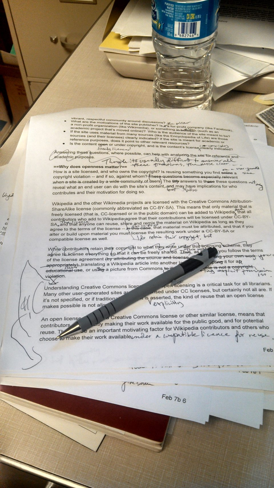

# Microcopy & UX-writing checks

*Microcopy is the smallest text in a product - button labels, error messages, empty states - and it's checked word by word: specific over vague, plain over jargon, the next physical action over a technically-correct-but-useless status report.*

> "Error: Invalid input" is technically true and completely useless. It doesn't say what's invalid,
> why, or what to do next - so the person reading it has to guess, retry blindly, or give up.
> Microcopy review is the discipline of catching exactly this: not typos, but the gap between text
> that's correct and text that actually helps the person reading it act.

> **In real life**
>
> A heavily marked-up manuscript page - crossed-out words, phrases rewritten in the margin, circled
> sentences with a question mark next to them - is what careful editing actually looks like: not a
> read-through for spelling, but a line-by-line challenge of every word choice. Microcopy review is
> the same discipline applied to a product's smallest text: does THIS word carry its weight, or is
> there a more specific one that would actually help?

**Microcopy**: Microcopy is the small, functional text throughout a product's UI - button labels, form field hints, error and success messages, empty states, tooltips, confirmation dialogs - as distinct from marketing copy or long-form content. A UX-writing check reviews microcopy for specificity (naming the actual thing, not a generic category), plain language (no unexplained jargon), and actionability (telling the user the next physical step), because these small strings are read under stress or in passing far more often than they're read carefully.

## What a microcopy check actually looks for

- **Specific over vague.** "Something went wrong" tells the user nothing they can act on; "That
  card number doesn't look right" names the actual problem.
- **Plain over jargon.** Internal terms ("payload," "endpoint," "null") leaking into user-facing
  text assume knowledge a user doesn't have and shouldn't need.
- **The next physical action, not just a status.** "Submission failed" is a status report; "Check
  the highlighted fields and try again" tells the user what to actually do.
- **Consistency in terminology.** If a field is called "Email" on one screen, don't call it
  "Username" or "Login ID" on the next - this overlaps directly with Nielsen's Consistency and
  Standards heuristic (see
  [[ui-ux-design-qa/design-principles-and-the-laws-of-ux/nielsens-10-usability-heuristics]]).
- **Tone matches the moment.** A playful empty state ("Nothing here yet!") reads fine on a new
  dashboard; the same tone on a failed payment reads as tone-deaf.

> **Tip**
>
> Read every piece of microcopy in the actual state it appears in, not in a spec document. "Invalid
> input" reads differently sitting quietly in a design file than it does popping up red after someone
> just spent two minutes filling out a form.

> **Common mistake**
>
> Flagging microcopy purely on grammar or spelling and calling the review done. A perfectly
> grammatical sentence can still be vague, jargon-heavy, or silent about what to do next - the check
> that matters most here isn't proofreading, it's specificity and actionability.

## Where this overlaps with dark patterns

Microcopy review and [[ui-ux-design-qa/usability-evaluation/dark-patterns-to-flag]] look at the
same small pieces of text from different angles: a UX-writing check asks "is this clear and
helpful," while a dark-pattern check asks "is this DELIBERATELY confusing or coercive." A button
that reads "No thanks, I don't want to save money" fails both checks at once - it's confusing
AND manipulative - but plenty of findings are only one or the other. A double-negative checkbox
label can be a genuine writing mistake with no bad intent behind it; know which check you're
actually running.

## When to run it

- **Alongside heuristic evaluation** — several of Nielsen's ten (Match Between System and the Real
  World, Help Users Recognize/Diagnose/Recover From Errors) are largely ABOUT microcopy quality.
- **After a usability-testing session that flagged confusion** — if a
  [[ui-ux-design-qa/usability-evaluation/usability-testing-basics]] participant hesitated or
  misread a specific label out loud, that's a direct, evidence-backed microcopy finding, not a
  guess.
- **On every new error state before it ships** — error messages are the microcopy most likely to be
  written last, under time pressure, and read by someone who is already frustrated.


*Example of copyedited manuscript — Wikimedia Commons, CC BY-SA 3.0. [Source](https://commons.wikimedia.org/wiki/File:Example_of_copyedited_manuscript.jpg)*
- **The pencil resting on the page** — The reviewer's actual tool for a microcopy check: reading every word, not skimming for typos - the same word-by-word attention this note applies to a button label or an error message.
- **The circled passage with a margin note** — A specific phrase flagged and rewritten right next to it - exactly the granularity a real microcopy finding needs: not 'the copy is bad,' but this exact word, here, replaced with this exact alternative.
- **A crossed-out phrase with an inline correction** — Editing in place, word by word - the same discipline as rewriting 'Submission failed' into 'Check the highlighted fields and try again': specific, small, and immediately actionable.

**Running a microcopy pass on a screen**

1. **Read every string in its actual shipped state** — Not the spec document - the real button, the real error banner, in the real layout it appears in.
2. **For each string, ask: specific or vague?** — Does it name the actual thing, or a generic category ("something," "an issue," "invalid")?
3. **Ask: plain language or jargon?** — Would a first-time user understand every word without needing to know how the system works internally?
4. **Ask: does it say the next action?** — A status alone ("failed") is incomplete; a next step ("check X and retry") completes the finding.
5. **Rewrite and compare, don't just flag** — A concrete rewrite is far more actionable for a writer/dev to act on than "this copy is bad."

Turning "this reads badly" into something measurable - specificity and jargon, checked word by
word:

*Run it - scoring an error message before and after a rewrite (Python)*

```python
JARGON_WORDS = {"utilize", "leverage", "invalid", "error", "failed", "unauthorized", "submit", "proceed"}
VAGUE_WORDS = {"something", "issue", "problem", "oops"}

def microcopy_score(text):
    words = text.lower().replace(",", "").replace(".", "").replace("!", "").split()
    jargon_hits = [w for w in words if w in JARGON_WORDS]
    vague_hits = [w for w in words if w in VAGUE_WORDS]
    long_sentence = len(words) > 12
    return {
        "word_count": len(words),
        "jargon": jargon_hits,
        "vague": vague_hits,
        "long_sentence": long_sentence,
    }

original = "Error: Invalid input. Submission failed. Please proceed to resolve the issue and resubmit."
rewritten = "That card number doesn't look right. Check the digits and try again."

for label, text in [("Original error message", original), ("Rewritten error message", rewritten)]:
    report = microcopy_score(text)
    print(f"{label}: \\"{text}\\"")
    print(f"  words: {report['word_count']}  long sentence: {report['long_sentence']}")
    print(f"  jargon words found: {report['jargon'] or 'none'}")
    print(f"  vague words found: {report['vague'] or 'none'}")
    print()

print("The rewrite is shorter, names the SPECIFIC problem (the card number, not")
print("'the issue'), and tells the user the next physical action to take. The")
print("original scores three jargon hits and zero specifics - technically correct,")
print("useless to whoever is staring at it mid-checkout.")

# Original error message: "Error: Invalid input. Submission failed. Please proceed to resolve the issue and resubmit."
#   words: 13  long sentence: True
#   jargon words found: ['invalid', 'failed', 'proceed']
#   vague words found: ['issue']
#
# Rewritten error message: "That card number doesn't look right. Check the digits and try again."
#   words: 12  long sentence: False
#   jargon words found: none
#   vague words found: none
#
# The rewrite is shorter, names the SPECIFIC problem (the card number, not
# 'the issue'), and tells the user the next physical action to take. The
# original scores three jargon hits and zero specifics - technically correct,
# useless to whoever is staring at it mid-checkout.
```

The same scoring idea, applied to a button label instead of an error message:

*Run it - scoring a vague CTA vs a specific one (Java)*

```java
import java.util.ArrayList;
import java.util.Arrays;
import java.util.HashSet;
import java.util.List;
import java.util.Set;

public class Main {
    static final Set<String> JARGON_WORDS = new HashSet<>(Arrays.asList(
            "click", "here", "proceed", "submit", "confirm", "utilize"));

    static class Report {
        int wordCount;
        List<String> jargonHits = new ArrayList<>();
        boolean longSentence;
    }

    // Same idea as the Python playground, ported: score a piece of microcopy
    // for length and jargon-word hits.
    static Report microcopyScore(String text) {
        String cleaned = text.toLowerCase().replace(",", "").replace(".", "");
        String[] words = cleaned.split("\\\\s+");
        Report r = new Report();
        r.wordCount = words.length;
        r.longSentence = words.length > 8;
        for (String w : words) {
            if (JARGON_WORDS.contains(w)) {
                r.jargonHits.add(w);
            }
        }
        return r;
    }

    public static void main(String[] args) {
        String vagueButton = "Click here to proceed and confirm your submission.";
        String specificButton = "Save changes and continue to shipping.";

        for (String[] pair : new String[][]{
                {"Vague CTA button label", vagueButton},
                {"Specific CTA button label", specificButton}}) {
            String label = pair[0], text = pair[1];
            Report r = microcopyScore(text);
            System.out.println(label + ": \\"" + text + "\\"");
            System.out.println("  words: " + r.wordCount + "  long sentence: " + r.longSentence);
            System.out.println("  jargon words found: " + (r.jargonHits.isEmpty() ? "none" : r.jargonHits));
            System.out.println();
        }

        System.out.println("'Click here to proceed and confirm' tells the user nothing about WHAT");
        System.out.println("happens next - and scores four jargon hits doing it. 'Save changes and");
        System.out.println("continue to shipping' is shorter AND names the actual action and actual");
        System.out.println("destination - the same specific-over-vague rule from the error-message");
        System.out.println("check, applied to a button.");
    }
}

/* Vague CTA button label: "Click here to proceed and confirm your submission."
  words: 8  long sentence: false
  jargon words found: [click, here, proceed, confirm]

Specific CTA button label: "Save changes and continue to shipping."
  words: 6  long sentence: false
  jargon words found: none

'Click here to proceed and confirm' tells the user nothing about WHAT
happens next - and scores four jargon hits doing it. 'Save changes and
continue to shipping' is shorter AND names the actual action and actual
destination - the same specific-over-vague rule from the error-message
check, applied to a button. */
```

### Your first time: Your mission: rewrite one real piece of microcopy

- [ ] Find one error message, empty state, or button label in BuggyShop — Anything user-facing and short - a validation message is an easy first target.
- [ ] Check it against the specific/plain/actionable criteria — Does it name the actual problem? Any unexplained jargon? Does it say what to do next?
- [ ] Write a rewrite, not just a critique — "This is vague" is a start; the actual deliverable is the replacement sentence.
- [ ] Check your rewrite doesn't introduce a NEW inconsistency — Does it use the same terminology the rest of the product uses for this field/action?
- [ ] Note which Nielsen heuristic the original violated, if any — Ties this finding into the same vocabulary a heuristic-evaluation finding would use.

You've done the real work of a microcopy check: not flagging that something reads badly, but
producing the specific, plain, actionable replacement for it.

- **A rewrite is more specific but now noticeably longer than the original.**
  Specificity usually beats brevity in microcopy - a slightly longer message that tells the user exactly what to do is worth more than a shorter one that doesn't. Trim filler words first ("please," "kindly") before cutting anything that adds real information.
- **A developer pushes back that an error message needs to stay generic because the underlying system can't distinguish the specific cause.**
  That's a legitimate constraint, not an excuse to stop - ask what the system CAN distinguish (even a broader category like "payment" vs "shipping" beats a fully generic "something went wrong"), and push the specificity as far as the actual data allows.
- **Two different screens use different words for what's clearly the same concept, and it's unclear which term should win.**
  Check which term appears in more places, or which one matches the underlying data model / API field name most closely - consistency matters more than which specific word was picked, so pick one and change the minority usage.

### Where to check

- **Every error, empty, and confirmation state, read in its shipped context** — not a copy-doc, the
  actual rendered string in the actual layout.
- **[[defect-management/writing-bug-reports/clarity]]** — the same "specific and actionable, not
  vague" discipline applies to writing up the microcopy finding itself.
- **A shared terminology glossary, if one exists** — the fastest way to catch a consistency
  violation is checking the term against an agreed list rather than memory.
- **[[ui-ux-design-qa/design-principles-and-the-laws-of-ux/nielsens-10-usability-heuristics]]** — several
  of the ten are largely about microcopy quality; cite the matching one in the finding.

### Worked example: rewriting a real empty state

1. A new user's dashboard, before they've added anything, shows: "No data available." Technically
   accurate, and completely unhelpful about what to do next.
2. Checking against the criteria: is it specific? No - "data" is a generic catch-all. Is it
   actionable? No - there's no next step offered at all.
3. Rewrite: "You haven't added any projects yet. Create your first one to see activity here." This
   names the actual thing (projects, not "data") and gives a concrete next action.
4. Checking for consistency: the rest of the product calls this object a "project," not "item" or
   "entry" - confirming the rewrite matches existing terminology rather than introducing a new term.
5. Finding written up: "Dashboard empty state ('No data available') is vague and non-actionable.
   Rewrite: 'You haven't added any projects yet. Create your first one to see activity here.' Uses
   existing 'project' terminology, names the actual action available." Specific critique, concrete
   replacement, terminology checked - the complete deliverable, not half of it.

**Quiz.** A confirmation dialog before deleting an account reads: 'Are you sure you want to proceed with this action?' What's the strongest microcopy finding here?

- [ ] The sentence is grammatically fine, so there's no finding to report
- [ ] It's too short and should be expanded with more legal disclaimer text
- [x] It's vague ('this action') and doesn't state the consequence - a specific rewrite like 'Delete your account? This can't be undone.' names the actual action and its irreversibility
- [ ] The word 'proceed' should be replaced with 'continue' for a friendlier tone

*This note's core criteria are specificity, plain language, and actionability - 'this action' is exactly the vague, generic phrasing that fails the specificity check on a decision this consequential, and the message doesn't communicate that deleting an account is irreversible, which is the single most important thing a user needs to know before confirming. Option 1 wrongly treats grammatical correctness as sufficient, which this note explicitly warns against. Option 2 misreads the fix as needing MORE text rather than more specific text - length isn't the problem. Option 4 is a minor word-choice/tone tweak that doesn't address the actual missing information (what will happen, and that it's permanent). See [[ui-ux-design-qa/usability-evaluation/dark-patterns-to-flag]] for the related but distinct concern of confirmation dialogs worded to manipulate rather than merely inform.*

- **What is microcopy?** — The small, functional text throughout a UI - button labels, error messages, empty states, tooltips - as distinct from marketing or long-form content.
- **The three core checks** — Specific over vague, plain language over jargon, and stating the next physical action over just a status report.
- **Why proofreading alone isn't a microcopy check** — A grammatically perfect sentence can still be vague, jargon-heavy, or silent about what to do next - those are the failures that actually matter most.
- **Microcopy review vs dark-pattern review** — Microcopy asks 'is this clear and helpful'; dark-pattern review asks 'is this deliberately confusing or coercive' - related but distinct checks on the same text.
- **The actual deliverable of a microcopy finding** — A concrete rewrite, not just a critique - 'this is vague' is a start, the replacement sentence is the real output.

### Challenge

Find one real error message, empty state, or button label in BuggyShop or the platform. Score it
against specific/plain/actionable, write a concrete rewrite, and check the rewrite against existing
product terminology for consistency. Note which Nielsen heuristic (if any) the original violated.

### Ask the community

> I found this microcopy on `[screen]`: `[original text]`. My rewrite is `[your rewrite]`, aiming to fix `[vague/jargon/no-next-action]`. Does the rewrite actually read clearer, and does it still match how the product refers to `[the relevant object/action]` elsewhere?

The most useful replies will check the rewrite for a NEW consistency problem (a rewrite that fixes
vagueness but introduces different terminology than the rest of the product uses) before agreeing
it's an improvement.

- [CareerFoundry — What Is Microcopy? 5 Essential Tips](https://careerfoundry.com/en/blog/ux-design/what-is-microcopy-ux/)
- [UX Tools — 7 Practical Tips for Better Microcopy](https://www.uxtools.co/blog/7-practical-tips-for-better-microcopy)
- [Smashing Magazine — How to Improve Your Microcopy](https://www.smashingmagazine.com/2024/06/how-improve-microcopy-ux-writing-tips-non-ux-writers/)

🎬 [UXLx — Microcopy: How to Write Small, Deadly Copy for All Occasions](https://www.youtube.com/watch?v=pkbO6hwLbpc) (30 min)

- Microcopy is a product's smallest functional text - buttons, errors, empty states - read under stress or in passing far more than carefully.
- The three checks: specific over vague, plain language over jargon, and the next physical action stated, not just a status.
- Proofreading for grammar isn't a microcopy check - a grammatically correct sentence can still fail all three real criteria.
- Microcopy review and dark-pattern review look at the same text from different angles: clear-and-helpful vs deliberately-confusing-or-coercive.
- A microcopy finding's real deliverable is a concrete rewrite that also checks against existing product terminology, not just a critique.


## Related notes

- [[Notes/ui-ux-design-qa/usability-evaluation/dark-patterns-to-flag|Dark patterns to flag]]
- [[Notes/ui-ux-design-qa/design-principles-and-the-laws-of-ux/nielsens-10-usability-heuristics|Nielsen's 10 usability heuristics]]
- [[Notes/defect-management/writing-bug-reports/clarity|Clarity]]
- [[Notes/ui-ux-design-qa/usability-evaluation/usability-testing-basics|Usability testing basics]]


---
_Source: `packages/curriculum/content/notes/ui-ux-design-qa/usability-evaluation/microcopy-and-ux-writing-checks.mdx`_
