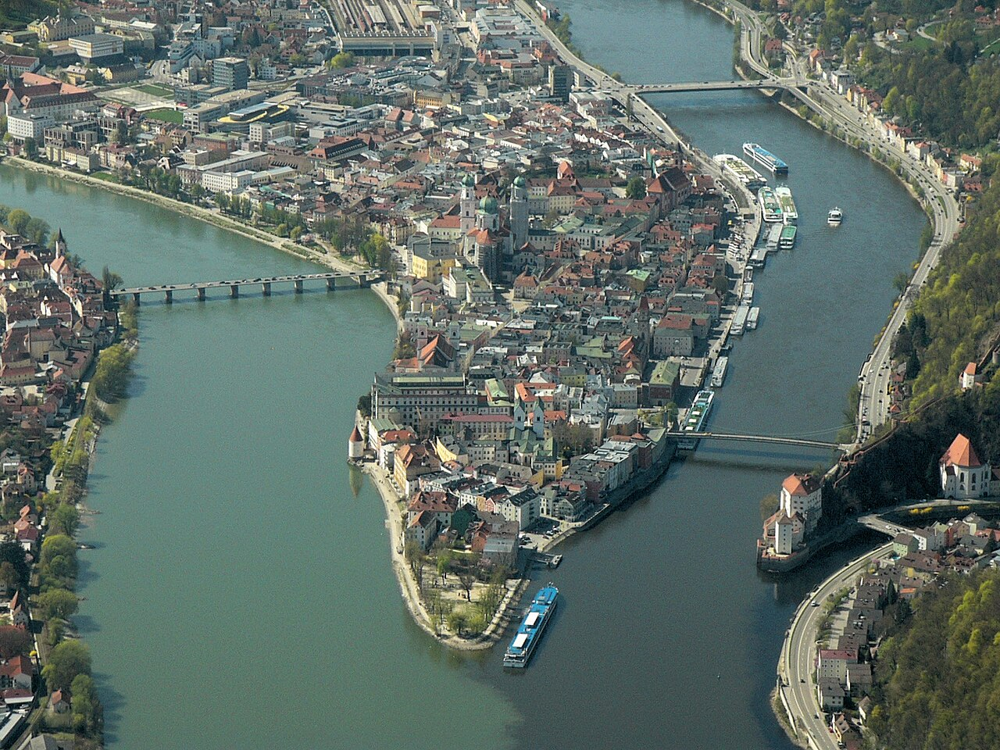

# Merging: bringing branches back together

*Merging joins a branch's work back into another line. Fast-forward: the label just slides ahead when the target never moved. Merge commit: a new commit with two parents when both lines advanced. You always merge INTO the branch you're standing on — direction matters.*

> You branched, you committed, your fix works. Lovely. Now it's sitting on `login-fix` doing absolutely
> nothing for anyone, like a birthday gift you wrapped and then hid in your own closet. The whole point of
> a branch is to come *back* — and coming back is `git merge`. Here's the good news nobody tells beginners:
> most merges are boring. Git looks at two lines of work, figures out how they relate, and joins them —
> often without creating anything new at all. There are exactly two shapes a merge can take: the
> **fast-forward** (Git just slides a label forward, because there was nothing to combine) and the **merge
> commit** (a real commit with two parents, stitching two diverged lines together). Learn to tell them
> apart and to answer one question before every merge — *which branch am I standing on?* — and merging goes
> from scary ritual to two-second habit.

> **In real life**
>
> Remember the side road forking off the highway? A **merge**: Combining the work of one branch into another. Git finds the commits the target branch is missing and joins them in — either by sliding the branch label forward (fast-forward) or by creating a merge commit with two parents. You always merge INTO the branch you currently have checked out.
> is **the on-ramp where the side road rejoins the highway.** Everything you built out on your own road —
> every commit — flows back onto `main`, and from that point on there's one road again carrying both
> histories. Two kinds of on-ramp exist. If the highway didn't move an inch while you were gone, there's
> nothing to reconcile: your side road simply *becomes* the new stretch of highway (fast-forward). But if
> traffic kept flowing on `main` while you worked, the two roads genuinely diverged — and Git builds a
> proper interchange: a **merge commit**, one commit that connects both roads at once. Either way, nothing
> is deleted and nothing is copied. Merging joins history; it never rewrites it.

## The golden rule: you merge INTO where you're standing

`git merge` has a direction, and beginners get it backwards constantly. The command
`git merge login-fix` does **not** mean 'send my work to login-fix.' It means 'bring `login-fix`'s
commits *into the branch I am currently on*.' The branch you're standing on is the one that changes;
the branch you name stays exactly where it was. So the ritual is always two steps:

```bash
git switch main          # step 1: stand on the branch that should RECEIVE the work
git merge login-fix      # step 2: pull the named branch's commits into it
```

Say it out loud before every merge: *'I am on the receiver.'* That one sentence prevents the classic
beginner accident — standing on `login-fix`, running `git merge main`, and wondering why `main` still
doesn't have the fix. (It doesn't, because in that direction `main` was the *giver*. More on why you'd
sometimes want that direction on purpose, below.)

## Shape one: the fast-forward

Picture the simplest case. You branched off `main`, made two commits, and while you worked `main`
received **zero** new commits — it's still parked at the fork point. There is nothing to combine; your
branch's line IS the continuation of main's line. So Git does the laziest, safest thing imaginable — it
slides the `main` label forward:

```text
Before the merge:

A --- B                (main)
       \
        C --- D        (login-fix)

After 'git switch main' + 'git merge login-fix':

A --- B --- C --- D    (main, login-fix)
```

No new commit. No combining. Git literally just moved a pointer — which is why the output says
`Fast-forward` and why this merge can never, ever conflict. Both labels now sit on commit D, and the
history reads as one straight line, as if you'd never branched at all.


*The rivers Inn and Danube meet at Passau — Wikimedia Commons, CC0. [Source](https://commons.wikimedia.org/wiki/File:Dreifl%C3%BCsseeck-Passau-Aerial_(P1140080E).jpg)*
- **The dark Danube = main** — The wider river is main: the line of work everything eventually flows into. It was flowing before your branch existed and it keeps flowing after. A merge doesn't replace it — it feeds into it. Downstream of the confluence, main carries both histories.
- **The green Inn = your branch** — The smaller river is your feature branch: it split off, gathered its own commits upstream, and now arrives carrying work the big river doesn't have yet. Until the confluence, the two flows are genuinely separate — commits on one are invisible to the other.
- **The peninsula tip = the merge** — This exact spot is git merge: the place two histories become one. If the big river had nothing new, the tributary just becomes the river (fast-forward). If both flowed independently, the joining point is a real thing — a merge commit with two parents, one for each incoming line.
- **Downstream = the merged history** — Below the confluence there's one river containing both waters. That's history after a merge: run git log on main and you'll see commits from both lines, joined. Nothing was deleted, nothing rewritten — merging is additive, which is why it's the safe, boring way to combine work.
- **The two-colour seam = where conflicts live** — Right at the join, the two waters visibly collide before they blend. That narrow zone is where merge conflicts happen: both lines touched the same spot and Git needs a human to decide. It's a small zone — most of both rivers merges automatically — but it's the part that needs your attention. Next note's entire topic.

## Shape two: the merge commit

Now the realistic case: while you worked on `login-fix`, someone (possibly you) also committed on
`main`. The two lines have genuinely diverged — each has commits the other lacks. No label-sliding can
represent that. Git combines both sets of changes and records the join as a
**merge commit**: A commit with TWO parents — one on each of the lines being joined. It's the knot that ties two diverged branches together: its snapshot contains the combined result of both lines, and history from that point flows through both parents. Git usually writes its message for you: Merge branch 'login-fix'.:

```text
Before the merge:

A --- B --- E          (main)
       \
        C --- D        (login-fix)

After 'git switch main' + 'git merge login-fix':

A --- B --- E --- M    (main)
       \         /
        C --- D        (login-fix)
```

M is the merge commit. Notice it has **two parents** — E from main's line, D from the branch's line —
which is what makes it special. A normal commit says 'here's what changed since one parent.' A merge
commit says 'these two histories are now one, and here's the combined result.' Git even writes the
commit message for you (`Merge branch 'login-fix'`) and opens the merge summary in your editor —
save-and-close is all it needs.

When does each shape happen? You don't choose — Git does, based on one question: **did the receiving
branch move since the fork?** No: fast-forward. Yes: merge commit. That's the entire decision tree.

**One merge, start to finish. Press Play.**

1. **Two lines, one question** — login-fix has commits main lacks. Before touching anything, you ask the golden question: which branch should RECEIVE this work? Answer: main. So main is where you stand. Getting this backwards is the number one merge mistake — the named branch gives, the current branch receives.
2. **Stand on the receiver** — git switch main. Now HEAD points at main, and any merge you run will change main and only main. Quick sanity check before merging anything: git status says 'On branch main', working tree clean. Merging with uncommitted changes lying around is asking for confusion — commit or stash first.
3. **git merge login-fix** — Git finds the commits login-fix has that main doesn't, and works out how the lines relate. Did main move since the fork? That single question picks the shape of what happens next — you don't choose fast-forward or merge commit; the history's shape chooses for you.
4. **Shape A — fast-forward** — main never moved, so there's nothing to combine: Git slides the main label forward to login-fix's newest commit and prints 'Fast-forward'. No new commit exists. History stays a single straight line — as if the branch's commits had been made on main all along. Zero conflict risk.
5. **Shape B — merge commit** — Both lines moved, so Git combines the two sets of changes and seals them in a new commit M with two parents. Output: 'Merge made by the ort strategy.' git log now shows both lines flowing into M. And if both lines touched the same lines of the same file, Git stops and asks you — that's a conflict, and it's the next note.

Watch shape A happen for real. This picks up exactly where the last note left off — `login-fix` is one
commit ahead, `main` never moved:

*Try it — a fast-forward merge. Press Run.*

```bash
git switch main
# Switched to branch 'main'

git log --oneline -1
# e4f5a6b (HEAD -> main) Add checkout page
# main is still parked at the fork point -- it never moved

git merge login-fix
# Updating e4f5a6b..f0e1d2c
# Fast-forward
#  login.txt | 1 +
#  1 file changed, 1 insertion(+)

git log --oneline -2
# f0e1d2c (HEAD -> main, login-fix) Fix login page typo
# e4f5a6b Add checkout page
# no new commit was created -- main's label just slid forward to f0e1d2c
```

Now shape B. Give `main` a commit of its own first, so the lines truly diverge — then merge and meet
your first merge commit:

*Try it — a real merge commit. Press Run.*

```bash
git switch -c report-page
# Switched to a new branch 'report-page'
echo "report layout" >> report.txt
git add report.txt
git commit -m "Add report page skeleton"
# [report-page c3d4e5f] Add report page skeleton

git switch main
# Switched to branch 'main'
echo "v1.1 notes" >> changelog.txt
git add changelog.txt
git commit -m "Update changelog"
# [main a9b8c7d] Update changelog
# now BOTH lines have moved since the fork -- no fast-forward possible

git merge report-page
# Merge made by the 'ort' strategy.
#  report.txt | 1 +
#  1 file changed, 1 insertion(+)

git log --oneline -4
# 1f2e3d4 (HEAD -> main) Merge branch 'report-page'
# a9b8c7d Update changelog
# c3d4e5f (report-page) Add report page skeleton
# e4f5a6b Add checkout page
# the top commit is the merge commit -- one commit, two parents
```

## Which direction — and why both exist

Both directions are legitimate; they just answer different needs:

- **Your branch into `main`** — the finish line. The work is done, reviewed, tested; you stand on
  `main` and merge the branch in. This is how features and fixes ship. On real teams this usually
  happens through a pull request, but underneath it's this exact merge.
- **`main` into your branch** — the refresh. Your branch has been alive for a week and `main` has
  moved on without you. You stand on *your branch* and `git merge main` to pull main's new commits
  into your line. Now you're building on current code instead of last week's, and the eventual merge
  back into `main` will be smaller and calmer. Testers, note this one: when your automation branch
  starts failing against features that 'don't exist,' your branch is probably testing last week's
  `main` — refresh it.

Same command, opposite receivers. The only thing that changes is where you're standing — which is why
the golden rule is the whole game.

> **Tip**
>
> Before any merge, run the two-line pre-flight: `git status` (right branch? clean tree?) and
> `git log --oneline -3 the-other-branch` (do I actually know what I'm about to pull in?). Ten seconds,
> and it catches wrong-direction merges, uncommitted-mess merges, and 'wait, THOSE commits?' surprises
> before they happen. And after any merge, `git log --oneline -5` to see what you made — a slid label or
> a two-parent knot. Reading history right after writing it is how the shapes become instinct.

### Your first time: First time? Run both merge shapes yourself

- [ ] Set up a fast-forward — In a practice repo, create and switch to a branch (git switch -c ff-demo), make one commit, and switch back to main WITHOUT committing anything on main. The setup matters: main must not move, or you'll get the other shape.
- [ ] Merge and read the word — On main, run git merge ff-demo. Read the output — the word 'Fast-forward' is right there. Now git log --oneline: no merge commit anywhere, one straight line, both branch labels on the same commit. You moved a pointer, nothing more.
- [ ] Set up a divergence — Create another branch (git switch -c mc-demo), commit once, switch back to main — and this time commit something on main too (touch a different file). Two lines, each with a commit the other lacks. Fast-forward is now impossible.
- [ ] Merge and meet the merge commit — git merge mc-demo. An editor may open with the message 'Merge branch mc-demo' — save and close, that's all. Now git log --oneline: the top commit is the merge commit, and both lines flow into it. Run git log --graph --oneline to see the diamond shape drawn for you.
- [ ] Say the golden rule out loud — Look at what changed: main moved in both merges; ff-demo and mc-demo stayed put. The branch you STAND ON receives; the branch you NAME gives. Before your next merge — every merge, forever — check git status and say: I am on the receiver.

Two merges, two shapes, zero drama — and you now know which one you'll get before you press enter.

- **'merge: login-fix - not something we can merge.'**
  Git can't find a branch by that name — almost always a typo. Run git branch to see the real names (was it login_fix? Login-fix?). If the branch only exists on the remote (a teammate made it), fetch first: git fetch, then merge origin/login-fix or check the branch out locally. Nothing is broken; Git just can't merge a name that doesn't resolve.
- **'I merged, but main didn't get my work — the fix still isn't there.'**
  Direction accident: you were standing on your feature branch and ran git merge main — so main's commits flowed INTO your branch, and main itself never changed. No harm done; that direction is even useful (it's the refresh). To actually ship: git switch main, then git merge your-branch. Check git log --oneline afterwards — your commits should now be reachable from main.
- **'error: Your local changes to the following files would be overwritten by merge.'**
  You have uncommitted edits in files the merge needs to touch, and Git refuses to trample them — this is protection, not failure. Either commit the changes (if they're real work), or stash them (git stash, merge, git stash pop), or discard them if they're junk (git restore <file>). Then merge again. Rule of thumb: merge with a clean working tree, always.
- **An editor suddenly opened full of text like 'Merge branch report-page' and now the terminal seems stuck.**
  Not stuck — Git is asking you to confirm the merge commit's message. Save and close the editor (in vim: type :wq and press enter; yes, everyone googles this once) and the merge completes. Want to skip the editor entirely next time? git merge report-page -m 'Merge report-page' provides the message up front. If you closed it wrong and the merge aborted, just run the merge again.
- **'CONFLICT (content): Merge conflict in login.txt. Automatic merge failed.'**
  Both branches edited the same lines of the same file, and Git — correctly — refuses to guess which version wins. This is not an error state, it's a question addressed to you. Breathe. The full step-by-step (reading the markers, choosing, finishing the merge, or aborting with git merge --abort) is the entire next note. Nothing is lost and nothing is damaged while you decide.

### Where to check

Merge confusion is almost always answered by history. Look here, in order:

- **Which branch received the merge?** — `git status` first line. The branch you were on when you merged is the one that changed. If the 'wrong' branch got the work, you were standing in the wrong place.
- **Did the merge actually happen?** — `git log --oneline -5` on the receiving branch. Fast-forward: the branch's commits are simply there. Merge commit: a 'Merge branch ...' commit sits on top.
- **Which shape did I get?** — read the merge output itself: 'Fast-forward' vs 'Merge made by the ort strategy'. Or check log: a commit with two parents (git log --graph --oneline draws the diamond) means merge commit.
- **What came in?** — `git log --oneline main..login-fix` BEFORE merging shows exactly which commits main is missing — the merge's shopping list. After merging it shows nothing, because nothing is missing anymore.
- **Is a merge half-finished?** — `git status` says 'You have unmerged paths' or 'All conflicts fixed but you are still merging'. That's a paused merge waiting on you — the next note's territory.

### Worked example: the fix that shipped to nowhere

A tester fixes a flaky login test on a branch, merges it, and tells the team it's done. Next morning CI
is still red with the same flake. Did the merge fail? Did Git lose it?

1. **The claim:** 'I merged it yesterday.' And they did run `git merge` — that part is true. The
   question a merge question always starts with: *standing where, merging what?*
2. **First check — what does main have?** `git log --oneline -5 main` shows no trace of the fix commit.
   Whatever got merged, `main` wasn't the receiver.
3. **Second check — what does the branch have?** `git log --oneline -5 flaky-login-fix` shows the fix
   commit... and above it, a merge commit: `Merge branch 'main' into flaky-login-fix`. There's the
   whole story in one line of history.
4. **The reconstruction:** yesterday they were standing on `flaky-login-fix` and ran `git merge main` —
   the refresh direction. Perfectly valid command; it pulled main's new commits into the branch. But
   the receiver was the branch, so `main` — and therefore CI, which builds `main` — never changed.
5. **The resolution:** `git switch main`, then `git merge flaky-login-fix`. Output: `Fast-forward`
   (main hadn't moved since the refresh). Now `git log --oneline main` shows the fix, CI goes green,
   and the announcement is finally true.
6. **Tester's angle:** 'the fix is merged' is a *verifiable claim*, and verifying it is one command:
   look for the commit in the receiving branch's log. Before you close a bug as fixed, check the fix
   actually reached the branch that gets built and deployed — not just the branch it was born on.
   'Merged' without 'merged into what' is half a sentence.

> **Common mistake**
>
> Reading `git merge X` as 'send my work to X.' It's the exact opposite — 'bring X's work to me' — and
> this single reversal causes more merge confusion than conflicts ever will. The command changes the
> branch you're standing on; the branch you name is only ever the source. Standing on `login-fix` and
> running `git merge main` refreshes your branch and leaves `main` untouched — great when intended,
> baffling when you thought you'd shipped. The sibling mistake: fearing that merging might 'overwrite'
> or delete work. It can't. A merge only *adds* — either a slid pointer or one new commit with two
> parents — and every commit from both lines remains in history. The dangerous-feeling command is one
> of Git's safest; you just have to be standing in the right place.

**Quiz.** You branch off main, make two commits on feature-x, and meanwhile nobody commits anything on main. You run git switch main, then git merge feature-x. What happens?

- [ ] Git creates a merge commit with two parents to record the join
- [x] A fast-forward: main's label slides ahead to feature-x's newest commit — no new commit is created, because main never moved so there's nothing to combine
- [ ] Git asks you to resolve conflicts, since the branches are different
- [ ] Nothing — you must delete feature-x before main can take its commits

*Fast-forward is what happens when the receiving branch hasn't moved since the fork: feature-x's line is a direct continuation of main's line, so Git just slides main's pointer forward and prints 'Fast-forward'. A merge commit only appears when BOTH lines gained commits — then Git has two diverged histories to knit together and records the join as a commit with two parents. Conflicts are rarer still: they need both lines to have edited the same lines of the same file, which is impossible here since main did nothing. And deleting a branch is never a precondition for merging — if anything it's the cleanup step afterwards. The shape of the merge isn't your choice; it's determined by one question: did the receiver move since the fork?*

- **git merge <branch>** — Brings the NAMED branch's commits into the branch you're currently standing on. The current branch receives and changes; the named branch gives and stays put. Direction is everything — check git status first.
- **Fast-forward merge** — When the receiving branch hasn't moved since the fork, Git just slides its label forward to the other branch's newest commit. No new commit, no combining, no possible conflict. History stays one straight line.
- **Merge commit** — A commit with TWO parents, created when both lines gained commits since the fork. It holds the combined result and ties the diverged histories together. Git writes the message for you: Merge branch 'x'.
- **Which shape will I get?** — One question decides: did the RECEIVING branch move since the fork? No — fast-forward (pointer slides). Yes — merge commit (two parents). You don't choose the shape; the history's shape chooses.
- **Branch into main vs main into branch** — Branch into main = shipping: stand on main, merge the branch, the work lands on the shared line. Main into branch = refreshing: stand on the branch, merge main, your line catches up with current code. Same command, opposite receivers.
- **Can a merge destroy work?** — No. Merging is additive: it either moves a pointer or adds one commit with two parents. All commits from both lines remain in history. Even a conflicted merge destroys nothing — and git merge --abort backs out cleanly.

### Challenge

Produce both shapes on purpose — that's the exam. (1) In a practice repo, engineer a FAST-FORWARD:
branch, commit twice on the branch, keep main frozen, merge back. Prove it with git log --oneline —
no merge commit, straight line. (2) Engineer a MERGE COMMIT: branch, commit on the branch, commit on
main too, merge. Prove it with git log --graph --oneline — find the diamond. (3) Do one REFRESH:
from a branch, merge main into it, then show that main's own log is unchanged. (4) Finish with two
sentences: which single fact about the receiving branch decides the shape, and which branch does git
merge change — the one you name, or the one you're on? Nail those two and you understand merging.

### Ask the community

> Merge question: I ran git merge [branch] while on [branch — check git status] and expected [what]. Here's git log --oneline -5 for both branches [paste]. Where did my work actually go?

Always state which branch you were STANDING ON when you merged — that's the receiver, and it answers
most merge mysteries instantly. Paste git log --oneline -5 for both branches: commits are never lost by
a merge, they're just on a different line than you expected. And 'git log --graph --oneline --all' makes
the shape visible when words fail.

- [Pro Git — basic branching and merging (free book chapter)](https://git-scm.com/book/en/v2/Git-Branching-Basic-Branching-and-Merging)
- [Learn Git Branching — practice merges visually](https://learngitbranching.js.org/)
- [Atlassian — git merge, fast-forward vs three-way explained](https://www.atlassian.com/git/tutorials/using-branches/git-merge)

🎬 [Git merge vs rebase: everything you need to know — ByteByteGo](https://www.youtube.com/watch?v=0chZFIZLR_0) (10 min)

- git merge <branch> brings the named branch's commits INTO the branch you're standing on. Current branch receives and changes; named branch gives and stays put. Check git status before every merge: 'I am on the receiver.'
- Fast-forward: if the receiving branch never moved since the fork, Git just slides its label forward. No new commit, no conflicts possible, history stays one straight line.
- Merge commit: if both lines gained commits, Git combines them and records the join as one new commit with TWO parents. You don't pick the shape — whether the receiver moved since the fork picks it.
- Both directions are useful: your branch into main ships the work; main into your branch refreshes a long-lived branch so it builds against current code and merges back smaller.
- Merging is additive and safe: it never deletes or rewrites commits from either line. Verify any 'it's merged' claim the tester's way — find the commit in the RECEIVING branch's log, because merged-into-what is the half of the sentence that matters.


---
_Source: `packages/curriculum/content/notes/version-control-with-git/branches-and-merging/merging.mdx`_
