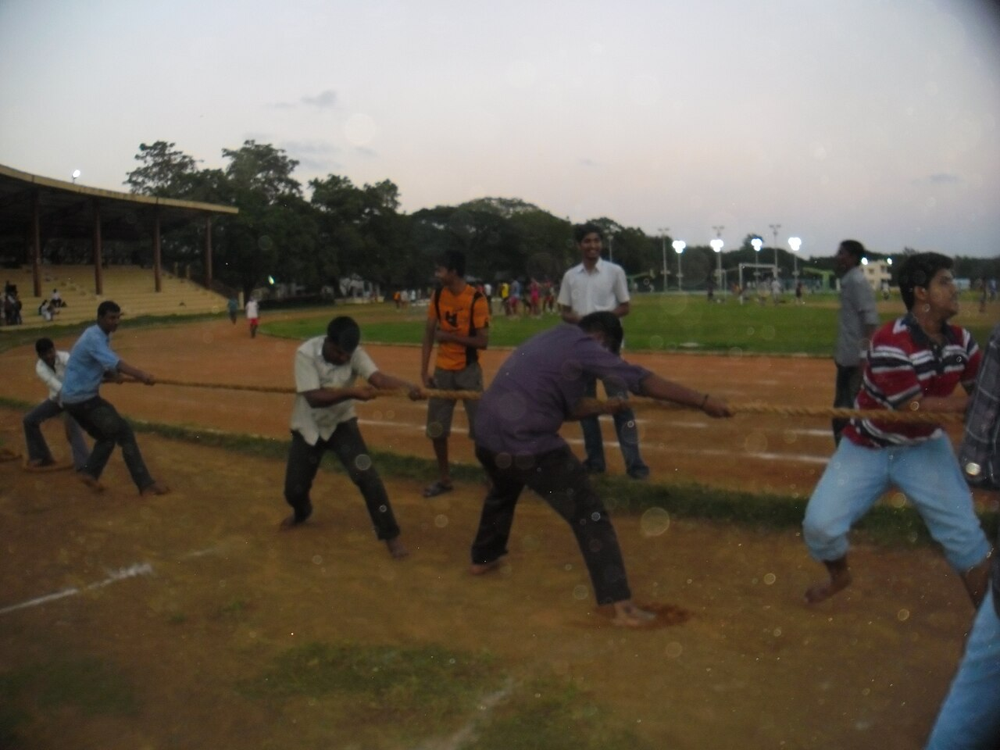

# Merge conflicts: read, resolve, retest

*A conflict is Git refusing to guess: both branches changed the same lines, so Git marks the spot and hands you the decision. How to read conflict markers, resolve step by step, or abort safely — and why testers retest after every resolution: hand-merged code is untested code.*

> Sooner or later `git merge` stops being polite and prints the word every beginner dreads:
> **CONFLICT**. Capital letters, 'Automatic merge failed,' the works. Most people's first conflict
> involves a small existential crisis and at least one consideration of deleting the whole folder and
> re-downloading it. Here's what's actually happening: nothing is broken, nothing is lost, and Git is
> not angry with you. A conflict is Git being *honest* — two branches edited the same lines of the same
> file, and Git, which merges by rules rather than by understanding your code, refuses to guess which
> version wins. So it marks the disputed lines, pauses the merge, and waits for a human. You are the
> human. This note teaches you to read the marks, make the call, finish the merge — or back out entirely
> with one command. And it teaches the tester's law of conflicts: the resolved code is code *no branch
> ever tested*, which makes every conflict resolution a retest trigger. Panic optional; retest not.

> **In real life**
>
> Two editors take home copies of the same recipe card. One rewrites the third line to say 'bake at
> 180 degrees.' The other rewrites the same line to say 'bake at 200 degrees, fan off.' Now the head
> chef has to combine their copies into one card. Lines they changed in *different places*? Easy — take
> both, no one even has to think. But that third line is a genuine
> **conflict**: A merge conflict: both branches changed the same lines of the same file (or one edited a file the other deleted), so Git cannot combine them automatically. Git marks the disputed region in the file, pauses the merge, and waits for a human to choose the final text and commit it.:
> two humans made two different decisions about the same sentence, and no rulebook can say which is
> right — 180 or 200 might each be correct for reasons only the editors know. So the chef does the only
> sane thing: puts both versions side by side on the card, circles them, and asks a person to decide.
> That's exactly what Git does — the circled versions are the conflict markers, and you're the person.
> The one thing the chef never does: pick one at random and hope. Neither should you.

## What a conflict actually is (and isn't)

A conflict needs one precise condition: **both branches changed the same lines of the same file**
since they forked. That's it. Two branches editing *different files*? Merges clean. Editing different
*parts* of the same file? Still merges clean — Git combines line changes happily as long as they
don't overlap. Only when the edits collide on the same lines does Git stop, because choosing between
them requires understanding *intent*, and Git has none.

What a conflict is **not**: an error, a corruption, or a punishment. Your commits on both branches are
safe and untouched — a conflict pauses the merge *before* anything is written to history. The repo sits
in a 'merging' state, the disputed files contain both versions clearly marked, and Git waits. It will
wait all week. There is no timer, and there's an eject handle (`git merge --abort`) the whole time.

## Reading the markers

When the merge pauses, open the conflicted file. Git has rewritten the disputed region with three
marker lines: a line of seven less-than signs, a line of seven equals signs, and a line of seven
greater-than signs. They fence off the two versions:

```text
<<<<<<< HEAD
bake at 180 degrees
=======
bake at 200 degrees, fan off
>>>>>>> update-recipe
```

Read it as a sandwich. **Top half** (between the less-than line and the equals line): the version from
`HEAD` — the branch you're standing on, the receiver. **Bottom half** (between the equals line and the
greater-than line): the version from the branch you're merging in — its name is printed right there on
the last marker. The equals line is just the divider. Everything outside the markers merged fine and
needs nothing from you. Your entire job: decide what this region should *finally* say — top version,
bottom version, both, or something new that combines them — then delete all three marker lines. The
markers are Git's sticky notes, not code; if they survive into your commit, congratulations, you've
just committed a syntax error (and yes, everyone does this exactly once).


*Rope pulling contest — Wikimedia Commons, CC BY-SA 3.0. [Source](https://commons.wikimedia.org/wiki/File:Rope_pulling_1.JPG)*
- **The left team = your branch's version (HEAD)** — One color of ink is the top half of the conflict sandwich: what the branch you're standing on says these lines should be. In the file it sits between the seven less-than signs and the seven equals signs, labelled HEAD. It's not automatically the right answer — it's just YOUR line's answer.
- **The right side = the incoming branch's version** — The other ink is the bottom half: what the branch you're merging in wants the same lines to say. It sits between the equals line and the seven greater-than signs, and Git prints that branch's name on the closing marker so you know exactly who's asking.
- **The taut rope = the conflict itself** — Where the two handwritings collide is the only disputed territory. Everything else on the board — everything outside the markers — merged automatically and is already settled. Conflicts are almost always smaller than the panic they cause: a few lines, not the whole file.
- **The onlooker = you, resolving** — No rule can pick between the two inks; a human who understands what the text MEANS must write the final version. That's resolution: edit the region to what it should say — one side, both, or a new blend — and erase all three marker lines. The markers are annotations, never part of the answer.
- **Dropping the rope = git merge --abort** — The escape hatch: wipe the overlapping mess and restore the board to exactly how it looked before the merge started. No harm, no lost work on either branch — both branches' commits were never touched. Abort, think, get context from whoever wrote the other version, try again.

## Resolving, step by step

The whole procedure is four moves, and none of them is clever:

1. **See the damage list:** `git status`. Conflicted files appear under 'Unmerged paths' as
   `both modified`. That list is your to-do list — nothing more is wrong than what's on it.
2. **Fix each file:** open it, find the marker sandwiches, decide the final text, delete the three
   marker lines. The file should end up looking like normal code that a person would write —
   no arrows, no equals fence, no leftover halves.
3. **Tell Git you've decided:** `git add <file>`. Staging a conflicted file is the signal 'this one's
   resolved.' `git status` moves it out of Unmerged paths.
4. **Finish the merge:** `git commit`. Git already has the message drafted (`Merge branch '...'`) —
   save and close. The merge commit is created, and the merge that paused is now complete.

And the panic button, available at any moment before that final commit: `git merge --abort`. It
cancels the merge and returns the repo to the exact state before you typed `git merge` — both branches
intact, nothing lost, no shame. Aborting isn't failure; it's how you go get context (usually: ask the
person who wrote the other version what they intended) before trying again.

**A conflict, from red text to resolved. Press Play.**

1. **The merge pauses** — git merge prints CONFLICT and 'Automatic merge failed; fix conflicts and then commit the result.' Nothing is broken: both branches' commits are untouched, the merge is simply paused mid-flight. The repo is in a merging state, and git status is your map of exactly what needs a decision.
2. **Find the disputed files** — git status lists every conflicted file under 'Unmerged paths' as both modified. Files NOT on that list merged cleanly and are already handled. Your problem is precisely as big as that list — usually one or two files, a few lines each. Scope the job before feeling anything about it.
3. **Read the sandwich, make the call** — In each file: top half = your branch's version (HEAD), divider of equals signs, bottom half = the incoming branch's version, closing marker names it. Decide what the final text should be — one side, both sides, or a new line that honors both intents. If you can't tell, that's a conversation, not a guess.
4. **Edit, delete markers, git add** — Rewrite the region to the final text and remove all three marker lines — they're Git's annotations, not content. Then git add the file: that's the 'resolved' signal. git status now shows it staged. Repeat per file until Unmerged paths is empty. (Wrong turn somewhere? git merge --abort resets everything, anytime before the commit.)
5. **Commit — then RETEST** — git commit completes the merge with the drafted message. Now the tester's law: the resolved region is text neither branch ever ran — both branches tested THEIR version, nobody tested your blend. Run the code, run the tests around the conflicted area, verify behavior. A merge isn't done when the commit lands; it's done when the result is retested.

Manufacture a conflict yourself — it's the fastest way to stop fearing them. Two branches, same line,
different edits:

*Try it — build a conflict on purpose. Press Run.*

```bash
git switch -c wording-a
# Switched to a new branch 'wording-a'
echo "Welcome to the new login page" > login.txt
git commit -am "Reword login greeting (variant A)"
# [wording-a 1a2b3c4] Reword login greeting (variant A)

git switch main
# Switched to branch 'main'
echo "Welcome to our login screen" > login.txt
git commit -am "Reword login greeting (variant B)"
# [main 5d6e7f8] Reword login greeting (variant B)
# same line, two different edits -- collision armed

git merge wording-a
# Auto-merging login.txt
# CONFLICT (content): Merge conflict in login.txt
# Automatic merge failed; fix conflicts and then commit the result.

git status
# On branch main
# You have unmerged paths.
#   (fix conflicts and run "git commit")
#   (use "git merge --abort" to abort the merge)
#
# Unmerged paths:
#   both modified:   login.txt

cat login.txt
# <<<<<<< HEAD
# Welcome to our login screen
# =======
# Welcome to the new login page
# >>>>>>> wording-a
# there's the sandwich: HEAD's version on top, wording-a's below
```

Now resolve it — and see the escape hatch too:

*Try it — resolve the conflict (or abort it). Press Run.*

```bash
# Option 1: the eject handle -- pretend the merge never happened
git merge --abort
# (no output -- repo is back to the exact pre-merge state)
git status
# On branch main
# nothing to commit, working tree clean

# Option 2: merge again and actually resolve it
git merge wording-a
# CONFLICT (content): Merge conflict in login.txt

# edit login.txt: choose the final text, DELETE all three marker lines
echo "Welcome to the new login screen" > login.txt
cat login.txt
# Welcome to the new login screen
# no markers, no halves -- just the final decision

git add login.txt
# staging = telling Git 'this file is resolved'

git status
# On branch main
# All conflicts fixed but you are still merging.
#   (use "git commit" to conclude merge)

git commit -m "Merge wording-a: combine both greeting rewrites"
# [main 9e8d7c6] Merge wording-a: combine both greeting rewrites

git log --oneline -3
# 9e8d7c6 (HEAD -> main) Merge wording-a: combine both greeting rewrites
# 5d6e7f8 Reword login greeting (variant B)
# 1a2b3c4 (wording-a) Reword login greeting (variant A)
# merge complete -- now go RETEST whatever that file touches
```

## The tester's law: resolved code is untested code

Here's the part of this topic that belongs to you professionally. Before the merge, branch A's version
was tested on branch A. Branch B's version was tested on branch B. The resolved version — the text a
human typed at the collision point, possibly at 6pm, possibly choosing 'both' when the two changes
quietly contradict each other — **has never run anywhere**. Conflict resolutions are tiny, manual,
unreviewed edits injected at the exact spot where two lines of work disagreed, which makes them one of
the sneakiest bug entry points in team development. Classic disasters: a resolver keeps their fix and
accidentally drops the other branch's fix (the bug it fixed quietly returns — a regression with no new
commit to blame); or keeps both halves of logic that individually work and jointly don't.

So build the reflex: **a merge with conflicts is a retest trigger.** Ask 'were there conflicts, and in
which files?' when testing a freshly merged feature — the answer tells you where to aim. Retest the
feature from *both* branches around the conflicted files, not just the one being merged in. When a
fixed bug mysteriously reopens with no related commit in sight, suspect a conflict resolution that
dropped the fix — `git log --merges` plus `git log -p <file>` finds the moment. Merged-and-green is
not the same as merged-and-verified.

> **Tip**
>
> Shrink conflicts before they happen: merge `main` into long-lived branches regularly (small frequent
> conflicts beat one archaeological dig), keep commits focused, and don't let two people knowingly edit
> the same file's same region in parallel without talking. When a conflict does land, resolve it *with
> context* — read both versions' commit messages (`git log` on each branch touching that file) before
> choosing. And never, ever resolve by 'take mine' on autopilot: half the time the other version contains
> a fix you're about to delete. If you don't understand the other side's change, that's a message to its
> author, not a coin flip.

### Your first time: First time? Cause, read, abort, and resolve a conflict

- [ ] Manufacture the collision — In a practice repo: branch off, change one specific line, commit. Switch to main, change THE SAME line differently, commit. You've armed a conflict on purpose — which already teaches the definition: same lines, same file, two branches.
- [ ] Trigger it and read the report — git merge your branch. Read the output slowly: CONFLICT names the file; 'fix conflicts and then commit the result' names the plan. Run git status — the file sits under Unmerged paths as 'both modified', and the abort instruction is printed right there. Git literally tells you everything.
- [ ] Open the file and identify the halves — Find the marker sandwich. Point at each line and say what it is: seven less-than signs plus HEAD = my branch's version; equals line = divider; the bottom half plus the branch name = the incoming version. If you can narrate the sandwich, you can resolve it.
- [ ] Abort once, just to feel the floor — Run git merge --abort, then git status: clean tree, both branches intact, as if nothing happened. Knowing the eject handle works is what makes conflicts non-scary — you cannot get trapped. Now re-run the merge to get the conflict back.
- [ ] Resolve for real — and retest — Edit the file to the final text, delete all three marker lines, git add, git commit. Check git log --oneline shows the merge commit. Then the tester's step everyone skips: look at the resolved file and verify the RESULT makes sense — because no branch ever tested that exact text. That verification habit is the whole point.

You've now caused, read, aborted, and resolved a conflict in ten minutes — the full lifecycle, with the panic surgically removed.

- **My code won't run after the merge — syntax errors mentioning strange arrow characters.**
  Conflict markers survived into the commit: the seven less-than signs, the equals fence, or the greater-than line are still sitting in the file, and the compiler is choking on them. It happens to everyone once. Search the file (and the whole project) for the marker patterns, finish the resolution properly — final text only, all three marker lines deleted — and commit the fix. Some editors and linters flag leftover markers automatically; let them.
- **'error: Merging is not possible because you have unmerged files.' or Git refuses to switch branches mid-conflict.**
  You're in a paused merge and tried to start something new on top of it. Git wants the current merge finished or cancelled first. Check git status: files still under Unmerged paths need resolving (edit, git add), then git commit to conclude — or bail out entirely with git merge --abort. Resolve or abort; those are the two doors out of a merging state, and both work.
- **I resolved and committed, but the OTHER branch's change is gone — a bug it fixed is back.**
  The resolution kept your half and dropped theirs — the classic 'take mine' casualty, and a real regression even though no new commit looks guilty. Nothing is lost: the other version still exists in the other branch's history. Find it (git log -p that-branch -- the-file), reapply the missing change in a new commit, and retest both behaviors together. Next time, read both halves before choosing — the other half usually existed for a reason.
- **The conflict is enormous — dozens of files, markers everywhere. I'm certain I did something wrong.**
  Probably not wrong — just late. Long-lived branches that never merged main in accumulate months of divergence and pay it all back at once. First: git merge --abort and breathe; you're not obligated to solve it this minute. Then merge main into the branch in smaller steps or with a teammate who knows the other line's changes, resolving file by file (git status is the checklist). Prevention is the real fix: refresh long-lived branches from main regularly so conflicts stay small and current.

### Where to check

Mid-conflict, everything you need to know lives in four places:

- **What's actually conflicted?** — `git status`. Unmerged paths is the complete to-do list; 'both modified' marks each disputed file. Files not listed are already fine. Status also prints your two exits: fix-and-commit or merge --abort.
- **Where in the file?** — search the file for the marker lines (seven less-than signs opens each sandwich). Everything outside the sandwiches merged cleanly; only the fenced regions need decisions.
- **Who changed this, and why?** — `git log --oneline -- <file>` on each branch shows the commits (and authors) behind each half. Commit messages are your context for choosing — read them before deciding, and ask the author when messages don't explain enough.
- **Am I still mid-merge?** — `git status` says 'You have unmerged paths' (still resolving) or 'All conflicts fixed but you are still merging' (ready for git commit). A clean tree means the merge finished — or was aborted.
- **Did a past resolution drop something?** — `git log --merges --oneline` finds merge commits; `git log -p <file>` shows exactly what each one did to a file. When a fixed bug reopens with no suspect commit, this is where the body is buried.

### Worked example: the bug that came back from the dead

A tester verified bug #482 fixed two weeks ago — the discount banner no longer shows for expired
coupons. Today it's back on staging, showing merrily. No new commits mention banners. The developers
shrug: 'nobody touched that code.'

1. **The claim to test:** 'nobody touched it.' In Git, that's checkable, not debatable. The tester runs
   `git log --oneline -- src/banner.js` — and the file WAS touched: by a merge commit three days ago,
   `Merge branch 'promo-redesign'`.
2. **Dig into the merge:** `git log -p -1 <merge-hash> -- src/banner.js` shows the merge changed the
   exact function the #482 fix lived in. The fix's guard clause is simply... not there anymore.
3. **Reconstruct what happened:** the `promo-redesign` branch forked *before* the #482 fix landed on
   main, and it rewrote the same function. At merge time, that collision produced a conflict — and the
   resolver, deep in their own redesign, took their branch's version wholesale. Their half didn't
   contain the fix, so the resolution silently deleted it. No malice, no warning, no failing test.
4. **Why nothing caught it:** the automated suite had no regression test for #482 (it was verified
   manually), and the resolver retested the redesign — their feature — not the code the other half of
   the conflict had been protecting. Both halves worked on their own branches; the blend was never
   tested by anyone.
5. **The fix:** reapply the guard clause in a new commit, and this time add a regression test so the
   next silent deletion fails loudly in CI.
6. **Tester's angle — three habits from one incident:** (a) a reopened bug with no suspicious commit
   means check the merges: `git log --merges` around the regression window, then `git log -p` on the
   file. (b) After any conflicted merge, retest the features from BOTH branches near the conflicted
   files — the resolver naturally retests only their own side. (c) Every verified fix worth its bug
   number deserves a regression test, precisely because conflict resolutions can un-fix things without
   creating any commit that says so.

> **Common mistake**
>
> Resolving on autopilot: seeing the markers, keeping whichever half is yours, deleting the rest, and
> committing without reading what the other half *did*. It feels efficient and it's how fixes get
> silently deleted — the other version usually exists because someone solved a problem there, and 'take
> mine' throws their solution away with no error, no warning, and no commit that admits it. Slow down for
> the thirty seconds it takes to read both halves and the commit messages behind them; when the halves
> genuinely contradict, that's a conversation with the other author, not a guess. The runner-up mistake:
> treating the merge commit as the finish line. The resolved region is text no branch ever tested — so
> run it, test around it, and *then* call the merge done. And if mid-resolution you realize you're out of
> your depth: git merge --abort, regroup, retry. The eject handle exists precisely so you never have to
> guess under pressure.

**Quiz.** During a merge, Git reports CONFLICT in checkout.js. What exactly is Git telling you, and what is it waiting for?

- [ ] The file is corrupted and must be restored from a backup before the merge can continue
- [x] Both branches changed the same lines of that file; Git has marked the two versions in the file, paused the merge, and is waiting for a human to write the final text, git add it, and git commit
- [ ] Your branch is too old to merge — you must delete it and start over from main
- [ ] Git has already picked the newer of the two versions and just wants you to confirm with git commit

*A conflict is a paused question, not an error: both branches edited the same lines of checkout.js, and Git — which merges text by rules, without understanding what the code means — refuses to guess which edit wins. It fences the two versions inside the file with marker lines (your branch's version labelled HEAD on top, the incoming branch's below the divider of equals signs), pauses the merge, and waits. Your job: edit the region to its final form, delete all three marker lines, git add the file to signal it's resolved, and git commit to complete the merge. Nothing was corrupted and neither branch's commits were touched — and Git never auto-picks the 'newer' version; that's precisely the guess it refuses to make. Not ready to decide? git merge --abort restores the exact pre-merge state, no harm done.*

- **Merge conflict — the precise condition** — Both branches changed the SAME LINES of the SAME FILE since they forked (or one edited a file the other deleted). Different files, or different regions of one file, merge automatically — only overlapping edits force a human decision.
- **The conflict marker sandwich** — Seven less-than signs plus HEAD opens YOUR branch's version; a line of seven equals signs divides; the incoming branch's version follows, closed by seven greater-than signs plus its name. Everything outside the sandwich already merged fine.
- **The resolution steps** — 1) git status — list the conflicted files (Unmerged paths). 2) Edit each: choose the final text, delete all three marker lines. 3) git add each file — the 'resolved' signal. 4) git commit — the merge completes. Then retest.
- **git merge --abort** — The eject handle: cancels a paused merge and restores the exact pre-merge state. Both branches' commits are untouched — a conflict never damages history. Abort, gather context (ask the other author), retry. Available any time before the final commit.
- **Why testers care about conflicts** — The resolved region is code NO branch ever tested — each branch tested only its own version. Resolutions can silently drop the other side's fix (a regression with no guilty commit). Conflicted merge = retest trigger, for BOTH branches' features near the conflicted files.
- **A fixed bug reopened, but no commit touched it — where to look** — Suspect a conflict resolution. git log --merges --oneline around the regression window finds merge commits; git log -p <file> shows what each did. A 'take mine' resolution deletes the other half's fix without any commit admitting it.

### Challenge

Run the full conflict lifecycle solo. (1) In a practice repo, engineer a conflict: two branches, same
line, different edits (prove your setup by predicting the conflict before running git merge). (2) When
it fires, write down — from git status alone — the conflicted file list and both exit routes Git offers.
(3) Open the file and label each of the five parts of the sandwich: opening marker, HEAD's version,
divider, incoming version, closing marker with branch name. (4) Abort with git merge --abort and prove
with git status and git log that nothing changed. (5) Redo the merge, resolve by COMBINING both edits
into one new line, add, commit — then state in one sentence why this exact line now needs testing even
though both branches were tested before. If your sentence includes 'no branch ever ran this version',
you've got the tester's law.

### Ask the community

> Conflict question: merging [branch] into [branch], Git reports CONFLICT in [file]. Here's the marker section from the file [paste the sandwich] and git status [paste]. I don't understand what the other version is doing — how do I choose?

Paste the actual marker sandwich — helpers can usually spot in seconds whether the halves are
compatible, contradictory, or trivially combinable. Say which branch is HEAD (yours) and what each
branch was trying to do. And remember the honest option: git merge --abort, ask the other change's
author what their version intends, then merge again with context. Guess-resolving under pressure is
how fixes vanish.

- [Pro Git — basic merge conflicts (free book chapter)](https://git-scm.com/book/en/v2/Git-Branching-Basic-Branching-and-Merging)
- [GitHub Docs — about merge conflicts (and resolving them in the web editor)](https://docs.github.com/en/pull-requests/collaborating-with-pull-requests/addressing-merge-conflicts/about-merge-conflicts)
- [Atlassian — merge conflicts: causes, anatomy, resolution](https://www.atlassian.com/git/tutorials/using-branches/merge-conflicts)

🎬 [How to resolve merge conflicts in Git — Ihatetomatoes](https://www.youtube.com/watch?v=xNVM5UxlFSA) (10 min)

- A conflict is Git refusing to guess: both branches changed the same lines of the same file, so Git fences both versions in the file, pauses the merge, and waits for a human. Nothing is broken and no commits are touched.
- Read the sandwich: your branch's version (HEAD) on top, a divider of equals signs, the incoming branch's version below with its name on the closing marker. Everything outside the markers already merged cleanly.
- Resolve in four moves: git status to list conflicted files, edit each to the final text and delete ALL marker lines, git add to signal resolved, git commit to complete the merge.
- git merge --abort is the always-available eject handle: it restores the exact pre-merge state. Aborting to gather context beats guess-resolving every single time — panic is optional because escape is guaranteed.
- The tester's law: resolved code is code no branch ever tested, and resolutions can silently drop the other side's fix. Treat every conflicted merge as a retest trigger for BOTH branches' features — and when a fixed bug reopens with no guilty commit, go read the merges.


---
_Source: `packages/curriculum/content/notes/version-control-with-git/branches-and-merging/resolving-conflicts.mdx`_
