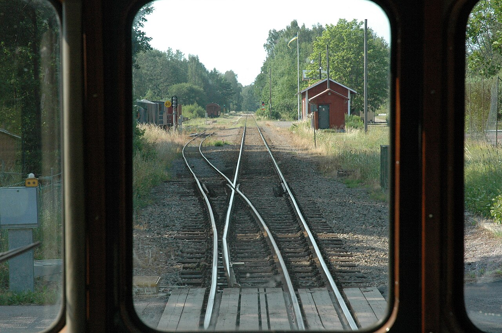

# Switching branches: git switch and HEAD

*Moving between branches with git switch (and its older sibling git checkout). What HEAD is — Git's 'you are here' marker — and what really happens to your working files when you jump: they transform to match the branch, and Git refuses the trip if uncommitted work would be lost.*

> Creating a branch was the easy half — a label, planted in a millisecond. The half that actually changes
> your day is *moving* between branches: `git switch login-fix`, and suddenly the files in your folder are
> the branch's files; `git switch main`, and they morph back. Same folder, different contents, no copying,
> no juggling directories. Two ideas make this feel sane instead of spooky. First, **HEAD** — Git's 'you
> are here' marker, the thing that decides both which files you see and where your next commit lands.
> Second, the rule for your unfinished work: uncommitted changes either ride along with you, or — if the
> trip would destroy them — Git flat-out refuses to move. Once you can predict what a switch will do to
> your working files, you'll hop between lines of work the way you switch browser tabs. This note makes
> that prediction automatic.

> **In real life**
>
> Switching branches is **throwing the lever on a railway switch.** The points move, the rails realign, and
> your train — same train, same driver — now rolls down a different track. In Git, the lever is `git switch`,
> and the thing the lever moves is
> **HEAD**: Git's pointer to where you currently are — normally it points at a branch name, like main. HEAD decides which branch your next commit lands on and which snapshot your working files show. git switch works by moving HEAD to a different branch and updating your files to match.
> — the 'you are here' marker. Whichever track HEAD points down is the one your files show and your commits
> land on. The analogy's one stretch: a train can only be mid-journey on one track, but you might have
> uncommitted cargo when you throw the lever. Git's rule is strict — the cargo rides along if it fits the
> new track, and if it would be crushed by the points, the lever refuses to move at all.

## git switch: hop to another line of work

Moving is one command — `git switch` plus the branch name. And because 'create a branch, then switch to
it' is the most common opening move in Git, `-c` does both at once:

```bash
git switch login-fix
# Switched to branch 'login-fix'

git switch -
# Switched to branch 'main'
#   (the dash means 'the branch I was just on' -- great for toggling)

git switch -c payment-fix
# Switched to a new branch 'payment-fix'
#   (-c = create AND switch in one move)
```

After a switch, three things are true: your next commit will land on the new branch, `git status` names
the new branch on its first line, and your working files show that branch's version of the project. That
third one deserves its own section — it's where the magic (and the caution) lives.

## HEAD: the 'you are here' marker

How does Git know which branch you're 'on'? A single pointer called **HEAD**. Normally HEAD points at a
branch name, and that branch points at a commit — so HEAD answers both big questions: *which snapshot
should the working files show?* and *which branch's pointer should the next commit move?* You can even
peek at it — HEAD is literally a small file in the repo:

```bash
cat .git/HEAD
# ref: refs/heads/main

git switch login-fix
# Switched to branch 'login-fix'

cat .git/HEAD
# ref: refs/heads/login-fix

git log --oneline -1
# f0e1d2c (HEAD -> login-fix) Fix login page typo
```

That `HEAD -> login-fix` in the log is Git drawing you the picture: HEAD points at the branch, the branch
points at the commit. `git switch` is nothing more mystical than 'move HEAD to a different branch, then
make the working files match.'

## Your working files transform — and when Git refuses

Here's the moment that startles every beginner: switch branches, and files in your folder *visibly
change* — lines appear, lines vanish, whole files come and go. Nothing is being destroyed. Committed work
is safe in the repository, and your folder is just a viewport showing whichever branch's snapshot HEAD
points at. Switch back and it all returns.

The interesting case is **uncommitted** changes — edits you haven't committed yet. They belong to no
branch, so Git applies one rule:

- If your edits **don't clash** with the branch you're switching to, they simply ride along — same edits,
  now sitting on the other branch. Convenient, and occasionally surprising.
- If switching **would overwrite** them — the two branches disagree about a file you've edited — Git
  refuses the whole trip and tells you to commit or stash first. Your work is never silently destroyed.

```bash
git switch login-fix
# error: Your local changes to the following files would be overwritten by checkout:
#         login.txt
# Please commit your changes or stash them before you switch branches.
# Aborting
```

(Yes, the error says 'checkout' even though you typed `switch` — a fossil from Git's history. Speaking of
which: in older tutorials you'll constantly see `git checkout login-fix`. It's the same move — `checkout`
was the original do-everything command, and `switch` was introduced to do just this one job with a
clearer name. Read `checkout` in the wild as `switch`; type `switch` yourself.)


*Turnout at Jenny seen from the train, Sweden — Wikimedia Commons, CC BY-SA 3.0. [Source](https://commons.wikimedia.org/wiki/File:Treskensv%C3%A4xel_vid_Jenny.jpg)*
- **The turnout blades = git switch** — The points mechanism is the command itself: throw the lever and the rails realign toward a different track. One deliberate action, instant effect — after it, everything you do rolls down the newly chosen line of work.
- **This cab = HEAD, your position** — The train is you — HEAD, Git's 'you are here' marker. It's always on exactly one track (branch) at a time, and where it sits決 decides two things: which files you're looking at, and which branch your next commit will move forward.
- **Each line ahead = a branch's snapshot** — The diverging tracks are branches, and each carries its own version of the project. Rolling onto a track means your working folder is rewritten to show THAT branch's files — lines and files appear or vanish because the viewport changed, not because work was destroyed.
- **The junction = the shared fork point** — Before the points, there's one shared line — the commits both branches have in common. Tracks only differ after the junction, just as branches only diverge after the commit they forked from. Switching near the fork changes little; far from it, plenty.
- **The signals = Git's refusal to derail you** — A signal stops the train when the points aren't safe — exactly what Git does when uncommitted changes would be overwritten by a switch: 'Please commit your changes or stash them.' The trip is simply refused. Git never silently flattens your unfinished work.

**What happens, step by step, when you switch. Press Play.**

1. **You're on main — HEAD says so** — HEAD points at main, main points at its latest commit. Your working folder shows main's snapshot, and a commit right now would move main forward. git status line one confirms it: 'On branch main'.
2. **You run git switch login-fix** — One command, one intention: move to another line of work. Git first checks the safety rule — would this trip overwrite any uncommitted changes? If yes, it aborts with 'commit or stash'. If no, the move proceeds.
3. **HEAD moves to the other branch** — The 'you are here' marker now points at login-fix. From this instant, your next commit will land on login-fix and move ITS pointer — main is out of the picture until you switch back.
4. **Working files are rewritten to match** — Git updates your folder to login-fix's snapshot: files and lines that exist only on this branch appear; things that exist only on main vanish from view. Nothing is lost — committed work sits safely in the repo, and switching back restores main's view.
5. **Uncommitted edits: ride along, or blocked** — Edits you hadn't committed either travel with you (when they don't clash with the target branch) or blocked the whole switch (when they do). Either way the rule is the same: Git never silently destroys uncommitted work — worst case it makes you commit or stash first.

*Try it — switch around and watch HEAD move. Press Run.*

```bash
git branch
#   login-fix
# * main

git switch login-fix
# Switched to branch 'login-fix'

cat .git/HEAD
# ref: refs/heads/login-fix

git status
# On branch login-fix
# nothing to commit, working tree clean

git switch -
# Switched to branch 'main'
# the dash toggles back to wherever you just were

git switch -c payment-fix
# Switched to a new branch 'payment-fix'
# -c creates the branch AND moves you onto it, in one move
```

Now the part you have to see to believe — the same file showing different contents on different branches,
and Git refusing a switch that would cost you work:

*Try it — files transform, and Git refuses an unsafe trip. Press Run.*

```bash
git switch login-fix
# Switched to branch 'login-fix'
cat login.txt
# login page v1
# fixed the login typo
# two lines here -- this branch has the fix commit

git switch main
# Switched to branch 'main'
cat login.txt
# login page v1
# the fix line is gone from VIEW -- main's snapshot never had it

echo "half-finished edit" >> login.txt
git switch login-fix
# error: Your local changes to the following files would be overwritten by checkout:
#         login.txt
# Please commit your changes or stash them before you switch branches.
# Aborting
# Git blocked the trip: switching would overwrite your uncommitted edit
```

> **Tip**
>
> Make `git status` your pre-flight check: one glance tells you which branch you're on ('On branch ...') and
> whether you're carrying uncommitted changes — the two facts that determine everything a switch will do.
> The cleanest habit is to **commit before you switch**: small, frequent commits mean every branch hop is
> boring and safe, exactly how you want it. If you're genuinely mid-thought and not ready to commit,
> `git stash` slips your changes into a pocket (`git stash pop` gets them back) — but nine times out of
> ten, a quick commit is simpler. And `git switch -` is your friend for ping-ponging between two branches
> while comparing behaviour.

### Your first time: First time? Ride the rails between two branches

- [ ] Check where you are before anything — Run git status and read the first line: 'On branch main'. Then cat .git/HEAD to see the same fact in raw form — ref: refs/heads/main. HEAD points at a branch; the branch points at a commit. That's your position, fully explained.
- [ ] Create and switch in one move — git switch -c ride-test creates the branch and moves you onto it — the message 'Switched to a new branch' confirms both. Run git status again: 'On branch ride-test'. Your next commit now belongs to this line, not main.
- [ ] Commit something branch-specific — Add a line to a file and commit it on ride-test. This gives the two branches genuinely different snapshots — which is what makes the next step visible. Without a difference, switching changes nothing you can see.
- [ ] Switch back and watch the file change — git switch main, then open the file: your new line is gone from view. Switch to ride-test again: it's back. Nothing is being created or destroyed — your folder is a viewport, showing whichever branch's snapshot HEAD points at.
- [ ] Get refused, on purpose — On main, edit the same line that differs on ride-test but do NOT commit, then try git switch ride-test. Read the refusal: 'Your local changes... would be overwritten... commit your changes or stash them.' Undo the edit (or commit it) and the switch works again. Git guarding your work — that's the safety rule, felt firsthand.

Fifteen minutes and switching stops being spooky: you can predict which files you'll see, where commits will land, and when Git will refuse the trip.

- **'fatal: invalid reference: login-fx.'**
  The branch name doesn't exist — usually a typo (login-fx vs login-fix). Run git branch to see the real names, then switch to one of those. If you meant to CREATE a new branch, that's git switch -c login-fx. Bare git switch only moves to branches that already exist; it won't invent one from a typo, which is exactly what you want.
- **'error: Your local changes to the following files would be overwritten...'**
  You have uncommitted edits to a file that differs on the target branch, so switching would destroy them — and Git refuses. Two clean exits: commit the work (git add, git commit) so it's safely on the current branch, or stash it (git stash), switch, and later git stash pop. Don't reach for anything with --force in it; the refusal is protecting real work.
- **'My uncommitted edits followed me to the other branch!'**
  That's the documented behaviour, not a bug: uncommitted changes belong to no branch, so when they don't clash with the target, Git carries them along. If they belong on the branch you just left, switch back and commit them there. The prevention habit: commit (or stash) before switching, so nothing ambiguous is in flight when you move.
- **'I'm in detached HEAD state and the warning looks terrifying.'**
  You switched to a commit instead of a branch (e.g. git checkout a1b2c3d) — HEAD now points directly at a commit, so new commits would belong to no branch. To just get back to normal: git switch main. To keep work you made while detached: git switch -c rescue-branch puts a branch label on it first. Look around freely in detached HEAD; just don't build there without planting a branch.

### Where to check

Something odd after a switch? Look here, in order:

- **Which branch am I on?** — first line of `git status`, or the `*` in `git branch`. Half of all switching confusion is being somewhere other than you thought.
- **Anything uncommitted in flight?** — the rest of `git status`. Uncommitted changes are what ride along or block switches; a clean tree makes every switch boring.
- **Where does HEAD point?** — `cat .git/HEAD` shows it raw (`ref: refs/heads/main`), and `git log --oneline -1` shows `HEAD -> branch` on the current commit.
- **Did my work end up on the wrong branch?** — `git log --oneline --all` shows every branch's commits; find your commit and see which label owns it.
- **Stashed and forgot?** — `git stash list` shows anything you pocketed earlier. Old stashes are where 'lost' edits often hide.

### Worked example: the bug that was 'already fixed' — testing on the wrong branch

A tester re-checks a login bug the developer marked fixed. It's still broken. Reopen the bug? Not yet —
watch the trace.

1. **The symptom:** the fix is supposedly committed, but the login page in the tester's local run still
   shows the old, buggy behaviour. Developer swears it's fixed; tester can reproduce the bug. Someone
   must be wrong — or they're looking at different code.
2. **Step zero — which code is this?** `git status` in the tester's checkout says `On branch main`.
   First fact established: whatever's running came from `main`'s snapshot.
3. **Where's the fix?** `git log --oneline --all` shows the commit 'Fix login page typo' — sitting on
   `login-fix`, with `main` parked one commit behind. Second fact: the fix exists, but it has not been
   merged into `main` yet.
4. **Reproduce the disagreement:** `git switch login-fix`, restart the app — bug gone. `git switch main`,
   restart — bug back. Same machine, same folder, two truths: the working files transform with the
   branch, so each switch is literally a different build under test.
5. **The verdict:** nobody was wrong. The developer tested on `login-fix` (fixed); the tester tested
   `main` (not yet). The bug report gets a precise update: 'Fix verified on branch login-fix; not yet
   merged to main' — and closes only after the merge lands.
6. **Tester's angle:** *which branch am I on?* is the first question of any verification, because the
   branch decides the code. `git status` before you test, and name the branch (or better, the commit) in
   every bug report and every 'verified fixed' note. Most works-for-me standoffs die the moment both
   people state their branch.

> **Common mistake**
>
> Switching branches with uncommitted changes in flight and being surprised by where they end up. The
> mental trap is believing edits 'belong' to the branch you made them on — they don't, until you commit.
> Uncommitted work floats free: switch branches and it either rides along with you (now mixed into a branch
> it was never meant for) or blocks the switch entirely. Both outcomes confuse beginners into thinking Git
> lost or duplicated their work. The fix is a habit, not a command: **commit — or stash — before you
> switch.** A clean `git status` makes every switch predictable. The sibling mistake is misreading the
> transformation of working files as data loss: lines 'vanishing' when you switch to `main` just means
> `main`'s snapshot never had them. They're safe on the other branch — switch back and look.

**Quiz.** You have uncommitted edits to app.txt and run git switch other-branch. Which describes what Git does?

- [ ] Your edits are always discarded — switching resets every file
- [x] If the edits don't clash with other-branch they ride along with you; if switching would overwrite them, Git refuses and tells you to commit or stash
- [ ] Git automatically commits your edits to the current branch before switching
- [ ] The edits are saved separately per branch and restored when you switch back

*Uncommitted changes belong to no branch, so Git applies one safety rule at switch time. When your edits don't conflict with the target branch's snapshot, the switch succeeds and the edits travel with you — same modified files, now on the other branch. When the target branch would overwrite an edited file, Git aborts the whole switch with 'Please commit your changes or stash them before you switch branches.' It never silently discards work, never auto-commits, and never stores per-branch drafts. The habit that makes this a non-issue: commit or stash before switching, so nothing is in flight.*

- **git switch <branch>** — Move to another branch: HEAD points at it, your next commit lands on it, and your working files are rewritten to its snapshot. git switch - toggles back to the previous branch.
- **git switch -c <name>** — Create a branch AND switch onto it in one move — the standard way to start new work. Equivalent to git branch <name> followed by git switch <name>. Message: Switched to a new branch '...'.
- **HEAD** — Git's 'you are here' pointer — normally aimed at a branch name (see cat .git/HEAD: ref: refs/heads/main). It decides which snapshot your files show and which branch your next commit moves. Switching = moving HEAD.
- **Working files on switch** — Rewritten to match the target branch's snapshot — lines and files appear or vanish because the VIEW changed, not because work was destroyed. Committed work is safe; switch back and it returns.
- **Uncommitted changes at switch time** — They belong to no branch. No clash with the target: they ride along with you. Would be overwritten: Git refuses — 'commit your changes or stash them.' Git never silently destroys uncommitted work.
- **git checkout (the older command)** — The original do-everything command — old tutorials use git checkout <branch> to switch. Same effect as git switch; even the refusal error still says 'checkout'. Read checkout as switch; type switch yourself.

### Challenge

Throw the lever with intent. (1) In a repo with two branches whose snapshots differ, predict — out loud,
before running it — what one specific file will contain after git switch, then switch and check yourself.
(2) Use git switch - three times and narrate where you land each time. (3) Make an uncommitted edit that
does NOT clash with the other branch, switch, and confirm with git status that it rode along; switch back
and commit it where it belongs. (4) Engineer a refusal: edit a line that differs between branches, try to
switch, and read the full error message. Resolve it with a commit. (5) Peek at cat .git/HEAD before and
after a switch, then write one sentence defining HEAD without using the word 'head'. If your sentence
mentions both 'where commits land' and 'which files you see', you've got it.

### Ask the community

> Switching question: I ran git switch and [my edits disappeared / my edits came with me / Git refused with an overwritten error / I'm in detached HEAD]. Here's my git status and git branch output [paste both]. What happened to my files?

Paste git status from BEFORE the switch if you can — whether the tree was clean is the whole story.
'Disappeared' lines are usually just the other branch's snapshot (switch back and look), and refused
switches are Git protecting uncommitted work: say what the file contained and which branch you expected
it on, and the mystery usually solves itself in one reply.

- [git switch — official reference (skim the examples)](https://git-scm.com/docs/git-switch)
- [Pro Git — switching branches and how HEAD moves (with diagrams)](https://git-scm.com/book/en/v2/Git-Branching-Branches-in-a-Nutshell)
- [Git branches tutorial — creating and switching — freeCodeCamp](https://www.youtube.com/watch?v=e2IbNHi4uCI)

🎬 [Git branches tutorial — creating and switching — freeCodeCamp](https://www.youtube.com/watch?v=e2IbNHi4uCI) (33 min)

- git switch <branch> moves you between lines of work; git switch -c <name> creates a branch and switches in one move; git switch - toggles back to the previous branch. In old tutorials, git checkout <branch> is the same move.
- HEAD is Git's 'you are here' marker — a pointer to the current branch (cat .git/HEAD shows it). It determines which branch your next commit moves and which snapshot your working files display.
- Switching rewrites your working files to the target branch's snapshot. Lines and files appearing or vanishing is the viewport changing, not data loss — committed work is safe, and switching back restores the other view.
- Uncommitted changes belong to no branch: they ride along when they don't clash with the target, and Git refuses the switch ('commit your changes or stash them') when they'd be overwritten. It never silently destroys work.
- Habits that make switching boring (in the best way): git status before every switch, commit or stash before you move, and state your branch when verifying fixes — the branch decides which code you're actually testing.


---
_Source: `packages/curriculum/content/notes/version-control-with-git/branches-and-merging/switching.mdx`_
