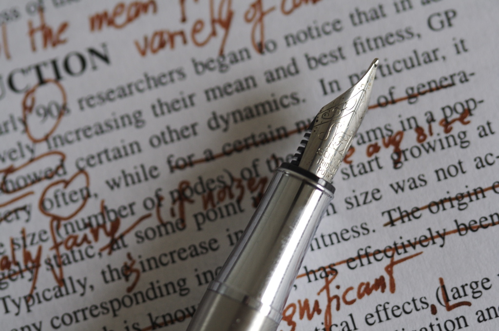

# Code review

*Code review is reading someone's diff and talking about it before it merges: leave specific, kind, question-shaped comments; respond to feedback without ego; use approve and request-changes deliberately. QA can review tests and testability without deep code skills — and should.*

> Here's an uncomfortable stat every senior engineer eventually accepts: **you cannot see your own bugs.**
> You wrote the code with a mental model, and you test it with the *same* mental model — so the blind spot
> that created the bug also hides it from you. Code review is the industry's answer: before a change
> merges, a second human reads the diff and says what they see. It's not a courtroom and it's not a
> performance review of the author — it's a bug hunt on paper, plus a quiet transfer of knowledge every
> time. GitHub bakes it into the PR page: reviewers comment on lines, then formally **approve** or
> **request changes**. And here's the part beginners in QA always underestimate: you don't need to write
> production code to review it. Testability, missing test cases, unclear behavior, risky edge cases —
> that's QA territory, and reviewers who cover it are rare and valuable. This note teaches you to read a
> review, write one, and survive receiving one.

> **In real life**
>
> Code review is **an editor marking up a manuscript before it goes to print.** The author hands over a
> chapter (the PR). The editor doesn't rewrite it and doesn't grade the author as a human being — they
> read closely and mark the margins: 'this sentence is ambiguous', 'this contradicts page 12', 'source?'.
> Margin notes anchored to exact lines — that's line-anchored review comments. The editor's verdict comes
> in flavors: 'print it' (approve), 'fix these first' (request changes), or 'thoughts attached, your
> call' (comment-only). And the crucial etiquette both sides live by: **the notes are about the text,
> never the writer.** A good editor says 'this paragraph loses the reader', not 'you're a bad writer'. A
> good author reads 'this is ambiguous' and thinks 'let me fix it', not 'how dare they'. Once the book
> ships, nobody remembers who caught the typo — they remember whether the book had typos.

## Reading a review, and writing one worth reading

On GitHub, a review starts in the PR's **Files changed** tab. Hover over any line of the diff and a
blue plus appears — click it, write a comment, and choose **Start a review** (batches your comments)
rather than posting one-by-one. When you're done, **Submit review** with one of three verdicts:
**Comment** (feedback, no verdict), **Approve** (this can merge), or **Request changes** (blocks merge
on protected branches until addressed). What separates a comment that helps from a comment that stings
is mostly shape. Bad: 'this is wrong.' Good: 'this returns null when the list is empty — line 42 then
crashes; should this return an empty list instead?' The good version names *the line, the behavior, and
a suggested direction* — the reviewer's holy trinity: **specific, actionable, about the code**.
Question-shaped comments ('what happens if the user has no orders?') work double duty: they're gentler,
and half the time the honest answer is 'oh no', which means you found a bug politely. Prefixing
minor-taste comments with 'nit:' (nitpick) tells the author it's non-blocking.

What do reviewers actually look for? Roughly in priority order: **correctness** (does it do what it
claims — and what happens on empty, null, huge, negative, concurrent?), **tests** (is the new behavior
tested? do the tests test anything real?), **readability** (will the next person understand this?),
**consistency** (does it follow the codebase's patterns?), and **safety** (performance cliffs, security
smells, breaking changes). Notice something? The first two are *thinking like a tester* — which is why
QA belongs in reviews.


*Editing a paper — Nic McPhee, Wikimedia Commons, CC BY-SA 2.0. [Source](https://commons.wikimedia.org/wiki/File:2008-01-26_(Editing_a_paper)_-_31.jpg)*
- **A correction on one line = a line-anchored comment** — The unit of review is a comment pinned to an exact line of the diff. It travels with the code: anyone reading the PR now or in two years sees precisely which line the comment meant. Vague feedback in chat ('something about the login change looked off?') has none of these properties. Anchor everything.
- **The circled question = the question-shaped comment** — The strongest review tool: 'what happens if the list is empty?' It's respectful (maybe the author handled it elsewhere), it's cheap to answer, and when the answer is 'hm, it crashes', a bug just got caught without anyone being accused of anything. Testers are professionally trained in exactly this kind of question.
- **The pen resting on the page = specific, actionable, about the code** — Good margin notes name the line, the observed problem, and a direction: 'returns null on empty input — caller on line 42 will crash; return empty list?'. Bad notes judge the author: 'sloppy'. The first gets fixed in ten minutes; the second starts a feud and the bug ships anyway. Review the code, never the person.
- **A rewrite offered in the margin = Approve with suggestions** — A formal verdict: this change can merge. On protected branches an approval is literally the key that unlocks the merge button. Approving means YOU are co-signing the change — 'LGTM' after ninety seconds on a forty-file diff is not a review, it's a liability with a thumbs-up emoji.
- **The dense red section = Request changes** — The blocking verdict: merge stays locked until the named issues are addressed and the reviewer re-reviews. Use it for real problems (bugs, missing tests, breaking behavior), not for taste. Prefix taste-level notes with 'nit:' and leave them as non-blocking comments instead — blocking on nits teaches people to dread review.

## Receiving feedback without ego — and closing the loop

Your first request-changes will sting. Read this paragraph again on that day: **the review is about the
diff, not about you.** Every engineer you admire has a trail of PRs full of 'good catch, fixed' — that
phrase is the sound of a professional. The response loop is mechanical: read each comment fully (not
the first line — the whole comment), reply to each one ('fixed in a1b2c3d', or 'intentional, because…',
or 'good catch — done'), push your fixes as new commits to the same branch, and re-request review.
Never merge past a request-changes without resolving it, and never take the argument to chat — the PR
thread is the record. Disagree? Disagree in the thread, with reasons, about the code. Reviewers are
sometimes wrong; the conversation is how everyone finds out which times.

**One review round-trip, end to end. Press Play.**

1. **The PR opens; a review is requested** — The author opens the PR with a description worth reading and requests reviewers — often a developer AND someone from QA. Automated checks start running in parallel: machines catch the mechanical stuff so humans can spend attention on behavior, edge cases and design.
2. **The reviewer reads the diff, then comments** — In Files changed, the reviewer reads the WHOLE diff before commenting (context first — the answer to an early question is often ten lines down). Comments get anchored to exact lines, batched with 'Start a review' so the author gets one coherent set of notes, not fifteen notification pings.
3. **A verdict lands: approve, comment, or request changes** — Submit review with a verdict. Approve = can merge, I co-sign it. Comment = feedback without a verdict. Request changes = blocking issues, named explicitly. The best request-changes reviews are unambiguous: numbered issues, each one specific and actionable.
4. **The author responds — without ego** — Each comment gets a reply: 'good catch, fixed', 'done', or a reasoned 'kept as-is because...'. Fixes are pushed as new commits to the same branch — the PR updates, checks re-run. Nothing is taken personally; the diff is the subject, the author is not.
5. **Re-review, approve, merge** — The author clicks 're-request review'; the reviewer checks the fixes (and only the fixes — the delta since last review), flips to Approve, and the merge button unlocks. The whole exchange is permanently recorded on the PR: future readers see what was caught and why decisions were made.

The GitHub CLI covers the whole reviewer workflow — including pulling the PR branch down to actually
run it, which is where QA reviews get their teeth:

*Try it — review a PR: read the diff, run the branch, submit a verdict. Press Run.*

```bash
# What's waiting for my review?
gh pr status
# Requested changes / review requests:
#   #14  Validate email on signup  - Review requested from you

# Read the diff right in the terminal
gh pr diff 14
# diff --git a/src/signup.js b/src/signup.js
# +  if (!email.includes('@')) {
# +    return { error: 'invalid email' };
# +  }

# QA superpower: check the branch out LOCALLY and actually run it
gh pr checkout 14
# Switched to branch 'validate-email'
npm test
# Tests: 41 passed, 41 total
# ...but try the edge cases the diff made you wonder about:
# what does '@' alone do? 'a@'? empty string? spaces?

# Leave a comment-only review (feedback, no verdict yet)
gh pr review 14 --comment --body "Ran it locally. '@' alone passes validation - is that intended? Also no test covers empty string."

# Or make it a blocking review when it's a real bug:
gh pr review 14 --request-changes --body "Bare '@' and ' a@b.c ' (spaces) both pass. Needs a stricter check + tests for empty, no-domain, and whitespace cases."
# Review submitted: changes requested
```

And the author's side of the same exchange — respond, fix, push, re-request:

*Try it — respond to review feedback and close the loop. Press Run.*

```bash
# See what the reviewer said
gh pr view 14 --comments
# priya requested changes:
#   Bare '@' and ' a@b.c ' (spaces) both pass. Needs a stricter
#   check + tests for empty, no-domain, and whitespace cases.

# Fix it on the SAME branch the PR came from
git switch validate-email
# ...tighten the validation, add the missing test cases...
git add src/signup.js tests/signup.test.js
git commit -m "Stricter email check + tests for empty/whitespace/no-domain"
# [validate-email 7c2d9e1] Stricter email check + tests...
git push
# The PR updates itself: new commit appears, checks re-run

# Reply to the review in the thread, then re-request review
gh pr comment 14 --body "Good catch - all three cases now rejected, tests added in 7c2d9e1. Re-requesting review."

# The reviewer verifies the fix and approves:
gh pr review 14 --approve --body "Edge cases covered, tests are real. Ship it."
# Review submitted: approved
gh pr checks 14
# All checks were successful
```

> **Tip**
>
> QA's seat at the review table — no deep code skills required. You can *always* review these four
> things: (1) **the tests** — does new behavior come with new tests, and do the tests assert something
> real, or just 'it runs'? (2) **the edge cases** — read the diff and ask your standard battery: empty,
> null, huge, negative, duplicate, wrong type, slow network. (3) **testability** — can this change even
> be verified? Is there a way to observe the result, a
> **testability**: How easy it is to verify a piece of software: can you control its inputs, observe its outputs, and reach its states? Code with clear seams, good logging and stable identifiers is testable; a black box that only says 'something went wrong' is not. Testability is a feature QA is entitled to request in review.
> hook, a log line, a stable element id for automation? (4) **the description** — does it say how to
> verify the change? If you can't tell how to test it from the PR, say so *in the PR*. That comment is
> QA doing its job at the cheapest possible moment.

### Your first time: First time? Review a real pull request

- [ ] Pick a small PR and read the description first — In your team repo (or any active open-source project), open a PR under ~100 lines. Read the description before any code: what does it CLAIM to do? Your whole review is checking the diff against that claim. No claim? That's your first comment.
- [ ] Read the entire diff before commenting — Files changed tab, top to bottom, no comments yet. Half your early questions get answered by a later hunk. Note behavior changes, and especially: changed behavior with unchanged tests — the classic review catch that needs zero coding skill.
- [ ] Leave two anchored comments: one question, one observation — Hover a line, click the plus, and 'Start a review' (don't post singles). One question-shaped ('what happens if this is empty?') and one specific observation ('this error message changed — is the test on line 88 still asserting the old text?'). Specific, actionable, about the code.
- [ ] Check out the branch and actually run it — gh pr checkout NUMBER, then run the app or the tests. Poke the changed behavior with your tester battery: empty, huge, weird. Reviewers who RUN the change catch what readers can't — this is QA's structural advantage in review.
- [ ] Submit with a deliberate verdict — Submit review: Comment if it's feedback, Approve only if you'd co-sign the merge, Request changes only for real named issues (bugs, missing tests). Then watch the loop: the author replies, pushes fixes, re-requests — and you verify just the delta.

One PR, read fully, run locally, two anchored comments, one deliberate verdict — you've done more review than the average 'LGTM'.

- **My review comments seem to be ignored — the PR merged anyway.**
  Check what verdict you actually submitted. A 'Comment' review is advisory — it never blocks a merge. If the issues were merge-blocking, the verdict needed to be 'Request changes' on a protected branch (Settings, Branches, require review approval). If the branch isn't protected, no verdict blocks anything — raise THAT with the team, because unprotected main means review is optional theater.
- **I got a request-changes and it feels like a personal attack.**
  Separate the information from the feeling: list each comment, strip the wording, keep only the technical claim ('empty input crashes line 42'). Verify each claim — true ones get 'good catch, fixed' plus a commit; false ones get a calm reply with your reasoning. Never respond in the first ten minutes of being annoyed, never move the fight to chat. If the wording was genuinely about YOU not the code ('lazy', 'sloppy'), that's a norms problem to raise with the team — separately from fixing the code.
- **The PR is huge and I can't meaningfully review it.**
  Say exactly that, as your review: 'This is too large to review with confidence — can it split into X and Y?' That's a legitimate, professional response, and rubber-stamping it instead is how bugs ride into main under a green tick. If it truly can't split, review in passes (behavior first, then tests, then style), timebox it, and state in the review which parts you covered and which you did not.
- **I approved, the author pushed more commits, and now the PR has changed under my approval.**
  Approvals apply to a moment in time, and new pushes can invalidate them. Re-review the delta: the PR's 'Compare' / 'Changes since your last review' view shows only what's new since you approved. Teams often enable 'dismiss stale approvals on new commits' in branch protection so this happens automatically — if yours doesn't, make re-reviewing after new pushes a personal habit; your name is on the approval.

### Where to check

Reading the state of a review — where the truth lives:

- **The merge box** on the Conversation tab — shows the effective verdicts: who approved, who requested changes, what's still required. This is the authoritative 'can this merge?' answer.
- **Files changed, 'Changes since your last review'** — reviewing a fix? Read the delta, not the whole diff again.
- **Unresolved conversations** — each comment thread has a Resolve button; unresolved threads are open questions. Scan them before approving: an unresolved 'this crashes on null?' is a red flag under a green tick.
- **`gh pr view NUMBER --comments`** — the whole conversation in the terminal, useful for reconstructing what was promised vs what was pushed.
- **The Commits tab after feedback** — did commits actually land for each 'fixed'? 'Fixed' with no new commit is a conversation, not a fix.

### Worked example: the review that tested the tests — QA requests changes without reading a line of app code

A PR titled 'Add discount calculation for bulk orders' lands with 300 lines of app code and 80 lines of
tests. The QA reviewer doesn't deeply know the app language. Watch what they can still do:

1. **Read the claim:** the description says 'orders of 10+ items get 15% off, capped at 100 currency
   units'. That sentence contains a test plan: the boundary at 9/10 items, the cap boundary, and the
   interaction of both.
2. **Read only the tests.** The 80 test lines are readable by anyone who can read English and numbers:
   there's a test for 10 items (discount applies) and one for 5 items (no discount). That's it. No test
   at 9 items. No test at the cap. No test for 10 items of something expensive enough to blow past the
   cap. The boundaries — where bugs live — are untested.
3. **One more observation, zero code skill needed:** every test uses quantity and price as round, happy
   numbers. What about quantity 0? A negative price from a refund line? The reviewer doesn't know if
   these CAN happen — which is exactly what a question is for.
4. **The review — request changes, three numbered items:** '(1) No boundary test at 9 vs 10 items.
   (2) No test where the 15% exceeds the 100-unit cap — the cap is the headline feature and is
   untested. (3) Question: can quantity be 0 or price negative here (refunds)? If yes, what should the
   discount do?' Specific, actionable, about the code.
5. **The answers are the payoff.** Boundary test added — passes. Cap test added — **fails**: the cap
   was applied before the discount, not after, so big orders got over-discounted. Real money, caught
   in review. And question 3 surfaces that refund lines CAN appear — a case nobody had decided, now
   ticketed instead of discovered in production.
6. **The lesson:** the QA reviewer never parsed the discount algorithm. They reviewed the *tests
   against the claim* and asked boundary questions — pure tester skills, applied at the review stage,
   catching a money bug and an undefined behavior before merge. That's what a seat at the review table
   is for.

> **Common mistake**
>
> Reviewing the author instead of the code — in either direction. Reviewers do it with wording:
> 'sloppy', 'why would you do this', 'obviously wrong'. Authors do it with reception: reading 'this
> crashes on empty input' as 'they think I'm bad at my job'. Both are the same bug: confusing the diff
> with the person. The professional stance is almost boring — comments name lines and behaviors,
> authors reply 'good catch, fixed' or 'kept as-is because...', and nobody's self-worth is on the field.
> The quieter version of the mistake is the **hollow approve**: 'LGTM' in ninety seconds on a diff you
> didn't read, because review feels like friction. Every hollow approve teaches the team that the gate is
> decorative — and the day a bad change ships under your green tick, you'll discover the approval had
> your name on it the whole time.

**Quiz.** You're reviewing a PR and find that empty input crashes a new function. Which comment does it right?

- [ ] 'This code is careless — did anyone even test it?' — honest feedback builds tough teams
- [x] 'Line 42: empty input throws here and the caller doesn't catch it — should this return an empty list instead? Also worth a test case.' — then submit as Request changes
- [ ] Say nothing in the PR but mention it privately in chat so the author isn't embarrassed publicly
- [ ] Approve it anyway — the checks are green, and blocking a merge over one edge case is disproportionate

*The good comment has all three properties: SPECIFIC (line 42, empty input, uncaught throw), ACTIONABLE (suggests a direction plus a test), and ABOUT THE CODE (no judgment of the author). A crash on a plausible input is a real bug, so a blocking Request changes is the honest verdict — that's exactly what the verdict exists for. Option one reviews the person, not the diff — it starts a feud and fixes nothing. Private chat feedback vanishes, blocks nothing, and robs the PR record of the catch (the next reader won't know the edge case was ever discussed). And approving over a known crash puts your name on shipping it — green checks only mean the EXISTING tests pass, and the whole finding is that the crashing case has no test.*

- **The three review verdicts** — Comment = feedback, no verdict. Approve = this can merge, I co-sign it. Request changes = blocking; on protected branches merge stays locked until addressed and re-reviewed.
- **Anatomy of a good review comment** — Specific (names the line and behavior), actionable (suggests a direction), about the code (never the person). 'Line 42 crashes on empty input — return empty list instead?' Question-shaped comments catch bugs politely.
- **nit:** — Prefix for a minor, non-blocking taste comment: 'nit: this name could be clearer.' Signals the author may fix or skip it. Keeps small stuff from blocking merges — and keeps review feedback honest about its own importance.
- **Responding to review feedback** — Reply to every comment ('good catch, fixed in abc123' / 'kept as-is because...'), push fixes as new commits to the same branch, re-request review. Disagree in the thread with reasons — never in chat, never silently.
- **What reviewers look for (priority order)** — Correctness (incl. edge cases: empty, null, huge, negative), tests (new behavior tested? tests assert something real?), readability, consistency with the codebase, safety (perf, security, breaking changes).
- **QA's four review targets (no deep code skills needed)** — 1) Tests — do they exist and assert real things? 2) Edge cases — run the standard battery against the diff. 3) Testability — can this change be observed and verified? 4) The description — does it say how to verify the change?

### Challenge

Find a small open PR (your team's repo, or any active open-source project). (1) Read the description
and write down the claim being made. (2) Read only the tests in the diff and list which cases from the
claim are covered — and which boundaries aren't. (3) Draft two review comments: one question-shaped
edge-case probe, one specific observation about the tests. Check each against the trinity: specific,
actionable, about the code. (4) If it's your team's repo, check out the branch with gh pr checkout and
run the changed behavior with one hostile input. (5) Finish with one sentence on when you'd choose
Request changes over Comment — if it includes 'a real named issue that shouldn't merge', you've got it.

### Ask the community

> Code review question: I'm [reviewing / responding to a review on] PR [number/link]. The situation: [huge diff / feedback feels personal / my comments were ignored / approval went stale after new pushes]. The verdict submitted was [comment/approve/request changes], the branch protection requires [approvals? checks?], and the merge box says [exact text]. How should I handle it?

Say which verdict was actually submitted (Comment reviews block nothing — the number-one surprise) and
whether the branch is protected. For feedback-feels-personal cases, paste the comment verbatim: the
crowd is good at separating a badly-worded technical point (fix the code) from an actual personal one
(raise the norm, separately).

- [GitHub Docs — About pull request reviews](https://docs.github.com/en/pull-requests/collaborating-with-pull-requests/reviewing-changes-in-pull-requests/about-pull-request-reviews)
- [Google Engineering Practices — How to do a code review](https://google.github.io/eng-practices/review/reviewer/)
- [Git It? How to use Git and GitHub — the review flow — Fireship](https://www.youtube.com/watch?v=HkdAHXoRtos)

🎬 [Git It? How to use Git and GitHub — the review flow — Fireship](https://www.youtube.com/watch?v=HkdAHXoRtos) (12 min)

- Code review exists because authors can't see their own bugs: a second reader with a different mental model reads the diff before it merges. It's a bug hunt on the code, never a judgment of the person.
- Good comments are specific, actionable, and about the code — name the line, the behavior, and a direction. Question-shaped comments ('what happens when this is empty?') catch bugs politely; 'nit:' marks non-blocking taste.
- Three verdicts, used deliberately: Comment (advisory), Approve (I co-sign this merge), Request changes (blocking, for real named issues). Approving is putting your name on the change — hollow LGTMs make the gate decorative.
- Receiving review: reply to every comment, push fixes to the same branch, re-request review, keep disagreements in the thread with reasons. 'Good catch, fixed' is the sound of a professional, not a defeat.
- QA reviews without deep code skills by targeting tests (do they assert real things at the boundaries?), edge cases, testability (can this be observed and verified?), and the description ('how do I test this?') — catching bugs at the cheapest moment they can be caught.


---
_Source: `packages/curriculum/content/notes/version-control-with-git/github-and-pull-requests/code-review.mdx`_
