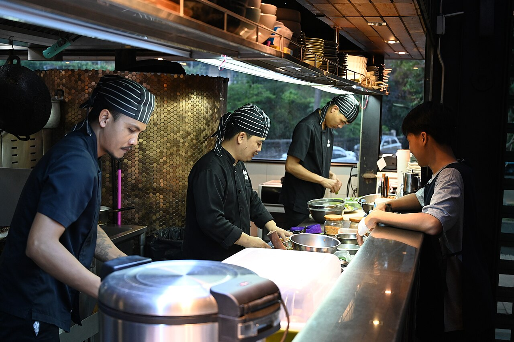

# The collaboration flow

*The full team loop: branch, commit, push, open a PR, get review, wait for CI to go green, merge, deploy. Trunk-based vs feature-branch styles change how long branches live, not the loop itself — and QA plugs into almost every step, from PR sight to verifying the deploy.*

> You now hold all the pieces: branches, commits, push, pull requests, review. Time to assemble the
> machine. Every software team on earth — two people or two thousand — runs some version of one loop:
> **branch → commit → push → PR → review → CI green → merge → deploy.** That's it. That loop is how a
> bug fix travels from an idea in someone's head to running code in front of users, and it repeats
> dozens of times a day on a healthy team. Once you see the loop, job postings stop being riddles
> ('experience with GitHub flow and CI/CD pipelines' = 'can you run this loop'), standups start making
> sense ('my PR is waiting on review' = 'my lap of the loop is at step five'), and — the part that
> matters for your career — you can point at exactly where QA adds value at *every single step*, not
> just at the end. This note is the map.

> **In real life**
>
> The loop is **a restaurant kitchen sending out a dish.** A ticket comes in (the task). A cook claims a
> station and works on their own cutting board — never on the plate that's about to go out (branch, not
> main). They build the dish in steps they could explain (commits), move it to the pass where others can
> see it (push), and call 'ready for the pass!' (the PR). The sous-chef tastes it (review), the kitchen's
> checklist runs — right temperature, no allergens, correct garnish (CI checks). Only when both say yes
> does the dish go onto the service counter (merge to main), and the runner carries it to the table
> (deploy). Now the QA twist: the health inspector isn't waiting at the customer's table hoping to catch
> food poisoning after the fact. A good inspector is *in the kitchen* — reading tickets, checking the
> fridge, tasting at the pass. Same with testing: the loop has eight steps, and quality work happens at
> all eight, not just the last one.

## The loop, step by step

Run through one full lap. **(1) Branch:** start from fresh `main` (`git pull` first!) and cut a branch
for one task. **(2) Commit:** small, described save-points as the work progresses. **(3) Push:**
publish the branch to GitHub — now it's backed up and visible. **(4) PR:** open the proposal; the diff,
description and conversation make the change reviewable. **(5) Review:** a human reads it, questions
it, and eventually approves. **(6) CI green:** in parallel,
**CI**: Continuous Integration: automation that runs your project's checks — tests, linters, builds — on every push and PR, and reports pass/fail. 'CI is green' means all automated checks passed; 'red' means something failed and merging is blocked. CI is a robot regression tester wired into the loop, and its results are on the PR's Checks tab.
runs the test suite, linters and build on the branch and reports on the PR — red blocks the merge,
green unlocks it. **(7) Merge:** approval plus green checks, and the change lands in `main`; branch
deleted. **(8) Deploy:** the new `main` ships — on many teams automatically, minutes after merge.
Then the loop begins again for the next task.

One flavor question teams argue about: how long should branches live? **Feature-branch** teams let a
branch run for days while a feature completes, reviewed as one bigger PR. **Trunk-based** teams keep
branches tiny — hours, not days — merging small slices into `main` (the 'trunk') constantly, hiding
unfinished features behind flags. Trunk-based means smaller reviews and fewer conflicts but demands
strong CI; long feature branches feel safer but drift from `main` and merge painfully. You don't need
a position on this yet — you need to recognize both, because either way *the loop is identical*; only
the lap length changes.


*Busy kitchen staff prepare meals behind the counter — Wikimedia Commons, CC BY-SA 4.0. [Source](https://commons.wikimedia.org/wiki/File:DZ6_0553_Busy_kitchen_staff_prepare_meals_behind_the_counter_as_a_customer_waits_and_watches.jpg)*
- **The cook's own station = the branch** — Work happens at a private station, never on the plates queued for service. A branch isolates one task's mess from main — half-finished work can't break teammates or users. QA's plug-in here: the task/ticket the branch is cut for is where test planning STARTS, before any code exists.
- **The dish taking shape = commits and push** — The dish is built in explainable steps (commits), then moved where the kitchen can see it (push). Small commits with honest messages become the audit trail QA later uses to answer 'what changed between the build that worked and the build that broke?'
- **Calling it at the pass = PR + review** — 'Ready for the pass!' is the PR: the dish presented for judgment before it reaches a customer. The sous-chef tasting it is code review. QA's plug-in: read the diff for blast radius, check tests exist, and ask 'how do we verify this?' — the cheapest moment in the whole loop to catch a problem.
- **Every plate checked before service = CI going green** — Temperature probe, allergen check, correct garnish — mechanical checks run the same way every time. That's CI: the full test suite against every push, results on the PR. Red = the dish goes back, no argument. QA's plug-in: the automated tests CI runs are often written or shaped by QA — this is your robot deputy.
- **Out to the customer = merge, then deploy** — Past the taste test and the checklist, the dish hits the service counter (merge to main) and the runner takes it out (deploy). QA's plug-in: verify in production — smoke-test the deployed change, watch monitoring, and know which merge/deploy shipped it so a bad release can be traced to its exact PR in minutes.

## Where QA plugs into every step

Here's the loop again — this time wearing the tester hat the whole way around:

**One lap of the team loop, with QA at every station. Press Play.**

1. **Branch: the task is claimed** — A ticket becomes a branch: git switch main, git pull, git switch -c fix/cart-total. QA plug-in: this is when test planning starts — read the ticket, draft the test cases, ask clarifying questions NOW. A vague ticket produces a vague fix; testers who sharpen tickets prevent bugs that would otherwise be written.
2. **Commit + push: work becomes visible** — Small commits with real messages, pushed to the shared remote. QA plug-in: pushed branches are testable branches — on many teams QA can pull a branch and explore the change before any PR exists. And commit messages are the trail you'll follow when bisecting 'which change broke this?'
3. **PR + review: the proposal is judged** — The PR shows the diff; humans review it. QA plug-in: earliest sight of the change — read the diff for blast radius, review the tests against the claim, ask the edge-case questions, request testability hooks (ids, logs). A comment here costs minutes; the same catch in production costs a war room.
4. **CI green: the robots vote** — Every push triggers the suite: unit tests, linters, builds — increasingly, automated checks QA helped write. Red blocks the merge. QA plug-in: watch WHAT is red — a flaky test that fails randomly teaches the team to ignore red, and an ignored red gate is no gate. Flake-hunting is real QA work.
5. **Merge: the change lands in main** — Approval + green checks = merge; the branch is deleted, main moves forward. QA plug-in: know what merged today. The merge list IS the 'what changed' answer when tonight's regression run fails — the suspect pool is exactly the PRs merged since the last green run.
6. **Deploy: users get it — and the loop closes** — Main ships to production, often automatically within minutes. QA plug-in: smoke-test the deployed change, watch error monitoring, and verify the fix ACTUALLY fixed the reported issue in the real environment. Then the next ticket starts the next lap. This loop, run well, is what 'quality culture' physically looks like.

Here is one complete lap as commands — this sequence is a day in the life of everyone on a modern team:

*Try it — one full lap: branch to merged. Press Run.*

```bash
# (1) BRANCH - always from fresh main
git switch main
git pull
# Already up to date.
git switch -c fix/cart-total-rounding
# Switched to a new branch 'fix/cart-total-rounding'

# (2) COMMIT - small save-points as the fix takes shape
git add src/cart.js
git commit -m "Round cart total to 2 decimals before display"
git add tests/cart.test.js
git commit -m "Add rounding test cases incl. 0.1 + 0.2 style floats"

# (3) PUSH - publish the branch
git push -u origin fix/cart-total-rounding
# * [new branch] fix/cart-total-rounding -> fix/cart-total-rounding

# (4) PR - open the proposal
gh pr create --title "Fix cart total rounding" \
  --body "Totals like 19.999999 showed raw. Rounds at display; tests cover float-sum cases."
# https://github.com/sajan-qa/shop/pull/21

# (5+6) REVIEW + CI - both happen on the PR while you start the next task
gh pr checks 21
# NAME    STATUS  ELAPSED
# tests   pass    1m41s
# lint    pass    19s
# ...review arrives: 'approve - nice test cases'

# (7) MERGE - and clean up in one move
gh pr merge 21 --squash --delete-branch
# Merged pull request #21
# Deleted branch fix/cart-total-rounding
```

Notice the rhythm at steps five and six: you don't sit refreshing the page — you start the next branch
while review and CI happen. Here's the monitoring side of the loop, the commands you run to answer
'where is my change right now?':

*Try it — watch a change move through the loop. Press Run.*

```bash
# Where are all my laps of the loop right now?
gh pr status
# Created by you:
#   #21  Fix cart total rounding  - Checks passing, review required
#   #22  Add empty-cart edge case - Checks pending

# Watch CI live on a PR (updates until checks finish)
gh pr checks 22 --watch
# tests   pending  ...
# tests   pass     2m03s
# All checks were successful

# What has CI been doing across the whole repo?
gh run list --limit 3
# STATUS  TITLE                     WORKFLOW  BRANCH
# ✓       Fix cart total rounding   tests     main
# ✓       Add empty-cart edge case  tests     add-empty-cart-case
# X       Rework promo codes        tests     promo-rework

# After merge: confirm the change is actually in main
git switch main
git pull
git log --oneline -3
# 9f3c2d1 Fix cart total rounding (#21)
# 4a8e7b2 Update onboarding copy (#20)
# 1c5d9e0 Add API retry logic (#19)
# The (#21) suffix links the commit back to its PR - the full story
# (diff, review, checks) is one click away, forever.
```

> **Tip**
>
> Learn to answer 'where is it?' for any change, in ten seconds. Every change is at exactly one station
> of the loop: unpushed on someone's machine (`git status`, ahead of origin), pushed but no PR, PR
> waiting on review, PR blocked on red CI, merged but not deployed, or live. When a standup says 'the
> login fix is done', the tester's reflex question is *which station?* — because 'done' at station two
> (committed locally) and 'done' at station eight (deployed and verified) are separated by every gate
> that exists to catch problems. Teams that use 'done' loosely ship surprises; testers who pin down the
> station don't get surprised.

### Your first time: First time? Run one complete lap of the loop

- [ ] Set up the gates — In a practice repo: protect main (require a PR + at least the existing checks). If you've added any GitHub Action that runs tests, require it to pass. Gates first — the loop only teaches you its shape when the shortcuts are actually closed.
- [ ] Lap steps 1-3: branch, commit, push — git switch main && git pull, then git switch -c my-first-lap. Make a small change with two commits (real messages), then git push -u origin my-first-lap. Station check: your work is now visible and backed up, but main is untouched.
- [ ] Lap steps 4-6: PR, review, checks — gh pr create with a description that says how to verify the change. Watch the Checks section populate. If you're solo, review your own diff line by line in Files changed and leave one honest comment — the ritual builds the habit even without a teammate.
- [ ] Lap steps 7-8: merge and confirm — Merge (try --squash --delete-branch), then git switch main && git pull && git log --oneline -3 — find your change with its (#N) PR link. If the repo auto-deploys, go see the change live. That end-to-end trace — idea to visible result — is the whole loop.
- [ ] Run a second lap, faster — Immediately do another small change through the full loop. The second lap takes half the time — and that's the real lesson: the loop is a rhythm, not a ceremony. Teams run it many times a day, and fluency in it is an actual line on QA job descriptions.

Two laps in, you've operated every station of the workflow that ships most of the world's software.

- **My PR sits for days — 'waiting on review' has become where work goes to die.**
  Review latency is a team process bug; treat it like one. Immediate moves: keep PRs small (a 50-line PR gets reviewed today; a 900-line one gets postponed forever), request a named reviewer instead of hoping, and nudge in the team channel after an agreed SLA (many teams: same business day). If it's chronic, raise it in retro with data — 'our median PR waits 3 days' lands better than 'reviews are slow'.
- **CI is red, but 'it's just the flaky test again — merge anyway'.**
  This is the most dangerous sentence in the loop. A check that everyone ignores trains the team to ignore ALL red — and the day the flake masks a real failure, red-was-normal is the incident review's first finding. Fix or quarantine the flaky test NOW (rerun it, reproduce, ticket it, temporarily skip WITH a ticket attached) so that red regains its meaning: red = stop. Flake-hunting is high-value QA work precisely because it protects the gate itself.
- **Two PRs merged the same day and now main is broken — whose change did it?**
  The merge list is your suspect pool: git log --oneline --merges -10 (or the repo's PR list filtered to merged-today). Check out main at each merge and run the failing test, or read each PR's diff for the broken area — the (#N) links take you straight to diffs and conversations. This is exactly why small, single-purpose PRs matter: 'which of these two 80-line changes broke checkout?' is an hour's work; 'which part of this 3,000-line mega-merge?' is a week's.
- **The fix was merged — but users still see the bug.**
  Merged is station 7; users live at station 8. Check the deploy: did it run after your merge (gh run list, or the team's deploy dashboard), did it SUCCEED, and does the environment you're checking actually run the new build (many teams show a version/commit hash in the footer or a /version endpoint — compare it to the merge commit)? 'Merged but not deployed' and 'deployed to staging but you're looking at prod' explain most ghost-bug reports. Verify the fix where users are, not where the code is.

### Where to check

Tracing a change through the loop — the station-by-station checklist:

- **`git status` + `git log --oneline -3` (author's machine)** — committed? pushed? 'Ahead of origin' means station 2, invisible to everyone.
- **The repo's branch list / PR list** — pushed branch with no PR is station 3: visible, but not yet proposed. `gh pr status` shows every open lap at once.
- **The PR's merge box** — station 4-6 truth: what's blocking (review? checks? conflicts?). Red check = click Details for the actual failing log.
- **`git log --oneline` on fresh main** — merged changes carry their (#N) PR reference; if the change isn't in main's log, it hasn't merged, whatever anyone remembers.
- **The deploy pipeline + the live app's version** — the final station: did a deploy run after the merge, did it succeed, and does the environment you're testing report the new version? Fixes get verified HERE.

### Worked example: one bug's full lap — from report to verified fix in a day

Follow a single real-world bug through every station, watching where QA touches it:

1. **The report (before the loop):** QA files it — 'cart shows total 19.999999999 for three 6.67
   items'. Clear repro steps, expected vs actual. A good bug report is the ticket that starts the lap.
2. **Station 1-2, branch + commits:** a developer cuts `fix/cart-total-rounding` from fresh main and
   commits the fix plus new test cases. QA's fingerprint is already here: the repro steps from the
   report became the test cases in the second commit.
3. **Station 3-4, push + PR:** the branch goes up; the PR description links the bug ticket and says
   how to verify. QA reads the diff — the rounding happens at display time. Immediate tester question,
   posted on the PR: 'does the BACKEND total round too? If not, do receipts and the payment call use
   the raw float?'
4. **The question pays off at station 5.** Review confirms: the payment call uses the unrounded total.
   Usually harmless — but for card payments the processor rejects amounts with more than 2 decimals.
   The fix expands to round in one shared place; the PR updates with a new commit and a payment test.
5. **Station 6, CI:** the suite runs — and the new payment test FAILS on the first push (the fix
   missed one call site). This is CI doing its job: the failure is found by a robot on a branch, not
   by a customer on a receipt. Second push, green.
6. **Station 7-8, merge + deploy:** approved, squash-merged as `Fix cart total rounding (#21)`,
   auto-deploy runs. QA smoke-tests production: adds three 6.67 items — total 20.01, receipt correct,
   payment succeeds. The bug ticket closes with the PR link.
7. **The takeaway:** count QA's touches — the report that started it, the test cases born from repro
   steps, the blast-radius question that doubled the fix's value, the flake-free CI gate, the
   production verification. Five contributions, one lap, and only ONE of them was 'testing the build'
   in the traditional sense. That's what 'QA plugs into every step' means in practice.

> **Common mistake**
>
> Believing QA's station is only at the end of the loop — wait for the build, test it, file bugs,
> repeat. That model turns testers into a bottleneck and bugs into expensive late surprises: by the time
> a broken build reaches end-of-line QA, the mistake is days old, the developer has mentally moved on,
> and the fix needs a whole new lap. Every station you plug into earlier makes the bug cheaper: a
> sharpened ticket prevents it, a PR question catches it at review, a CI test catches it in minutes on a
> branch. The mirror-image mistake exists too — skipping end-of-loop verification because 'CI was green'.
> Green CI means the automated checks passed, not that the feature works for humans in production. The
> loop needs both: shift your attention left into the early stations, AND still verify at the last one.
> The testers teams fight to hire do both, every lap.

**Quiz.** A developer says the login fix is 'done'. As a tester, why is your next question 'where exactly is it?'

- [ ] Because developers usually lie about finishing work
- [x] Because 'done' could mean any station of the loop — committed locally, in an unreviewed PR, blocked on red CI, merged but not deployed — and each means something different for when and where you can verify it
- [ ] Because Git deletes work that isn't deployed within 24 hours, so location determines urgency
- [ ] Because QA is only allowed to test changes after they are deployed, so anything earlier is irrelevant

*'Done' is ambiguous precisely because the loop has stations: a fix committed locally is invisible to everyone (station 2), a fix in a PR is reviewable but not merged (4-5), a fix blocked on red CI isn't going anywhere (6), and a merged fix may still not be deployed where users — or your test environment — actually are (7 vs 8). Each station has a different answer to 'can I verify this now, and where?'. Pinning down the station isn't distrust (option one) — it's shared vocabulary that prevents the classic ghost hunt of testing an environment that never received the fix. Git deletes nothing on a timer, and QA that only touches deployed code has given up the four cheapest places to catch a bug.*

- **The team loop (say it from memory)** — Branch -> commit -> push -> PR -> review -> CI green -> merge -> deploy. Every change on every modern team runs some version of this lap; only the lap length varies.
- **CI (Continuous Integration)** — Automation that runs tests/linters/builds on every push and PR, reporting pass/fail on the PR. Green unlocks merge; red blocks it. A robot regression tester wired into the loop — often running tests QA wrote.
- **Trunk-based vs feature branches** — Trunk-based: tiny short-lived branches, merged to main constantly, unfinished work behind flags — small reviews, needs strong CI. Feature branches: longer-lived, bigger PRs, drift and merge pain grow with age. Same loop, different lap length.
- **QA's plug-in points around the loop** — Ticket: sharpen requirements + draft tests. PR: read diff blast radius, review tests, ask edge-case questions. CI: write checks, hunt flakes. Merge list: the suspect pool for regressions. Deploy: smoke-test and verify in production.
- **'Done' — the tester's follow-up** — Ask which station: committed (local only), pushed, PR open, review passed, CI green, merged, deployed? Each means a different answer to 'can I verify it now, and in which environment?'. Verify fixes where users are.
- **Why red CI must stay meaningful** — One tolerated flaky test teaches the team to ignore red — and ignored red is no gate at all. Fix or quarantine flakes immediately (with a ticket). Protecting the gate's credibility is real QA work.

### Challenge

Map a real team's loop. Pick any active repository you can see (your team's, or a busy open-source
project). (1) Find one recently merged PR and reconstruct its full lap: when was the branch pushed, how
long did review take, how many CI runs, when did it merge? (2) Identify the gates: is main protected?
Which checks are required? (3) Find one PR currently stuck, and name its station (waiting review? red
CI? conflicts?). (4) Write the loop as this team actually runs it — stations, gate rules, typical lap
time. (5) Finish with three sentences: one QA contribution you could make at the PR station, one at the
CI station, one at the deploy station of THIS repo. That answer is interview-ready material.

### Ask the community

> Team-flow question: our loop looks like [describe: branch style, review rules, CI checks, deploy trigger]. The pain point: [PRs wait days / CI flaky / main breaks after merges / fixes 'done' but not live]. What we tried: [attempts]. What does a healthy version of this station look like?

Name the station where it hurts — review latency, flaky CI, merge collisions, and deploy drift are all
different diseases with different cures. Include your lap numbers if you can (PR size, wait time, CI
duration): the crowd gives much sharper advice on 'median PR waits 3 days' than on 'reviews feel slow'.

- [GitHub Docs — GitHub flow (the loop, officially)](https://docs.github.com/en/get-started/using-github/github-flow)
- [Trunk-Based Development — the short-lived-branch style explained](https://trunkbaseddevelopment.com/)
- [GitHub pull request in 100 seconds — the team flow — Fireship](https://www.youtube.com/watch?v=8lGpZkjnkt4)

🎬 [GitHub pull request in 100 seconds — the team flow — Fireship](https://www.youtube.com/watch?v=8lGpZkjnkt4) (2 min)

- The whole industry runs one loop: branch -> commit -> push -> PR -> review -> CI green -> merge -> deploy. Learn the stations and every team's process becomes readable.
- CI is the robot gate: tests and checks run on every push, reported on the PR — red blocks merge. A tolerated flaky test destroys the gate's meaning, and defending that meaning is real QA work.
- Trunk-based (tiny, hours-long branches, flags for unfinished work) and feature branches (longer-lived, bigger PRs) are lap-length choices — the loop itself is identical, and both need the same gates.
- 'Done' is a station, not a fact: committed, pushed, in review, CI green, merged and deployed are different states with different verification answers. Pin the station; verify fixes where users actually are.
- QA plugs into every station: sharpen tickets before code, read PR diffs for blast radius, review tests, keep CI honest, use the merge list to trace regressions, and smoke-test deploys — the earlier the station, the cheaper the catch.


---
_Source: `packages/curriculum/content/notes/version-control-with-git/github-and-pull-requests/collaboration-flow.mdx`_
