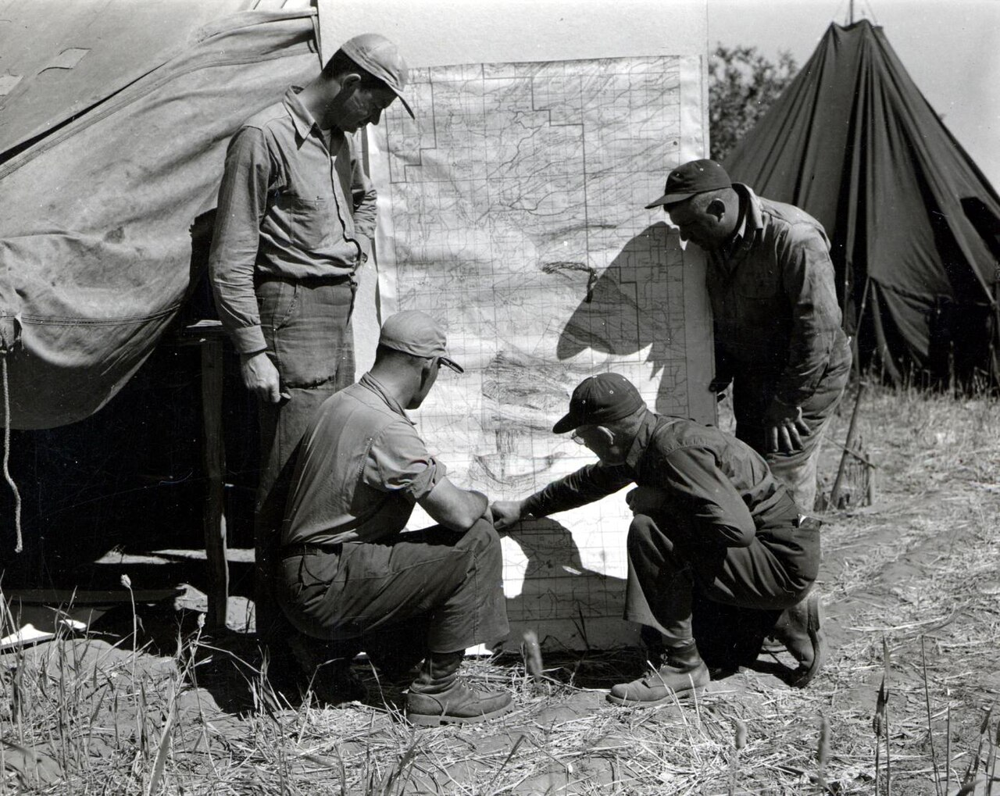

# Pull requests

*A pull request is a proposed merge plus a conversation: your branch's changes shown as a diff, with commits, automated checks, and comments in one place. Teams gate main behind PRs so nothing lands unreviewed — and the PR page is where QA gets first sight of every change.*

> You've pushed a branch to GitHub. Now what — does it just... become part of the project? No, and thank
> goodness. If everyone merged their own work straight into `main`, the shared branch would be a landfill
> of half-tested experiments within a week. Instead, teams use a **pull request** (PR): a page on GitHub
> that says 'here's my branch, here's exactly what it changes, please look before it merges.' A PR is two
> things stapled together — a *proposed merge* and a *conversation about it* — and it's where software
> quality actually gets negotiated, line by line, before anything ships. For a tester this page is gold:
> the PR is the earliest moment you can see a change, read what it touches, and ask 'how do we test this?'
> — hours or days before the build ever reaches you. Learn to read a PR and you've moved QA from the end
> of the line to the front.

> **In real life**
>
> A PR is **a proposed page for the shared recipe book, handed over with a sticky-note conversation.**
> The team's master cookbook is `main` — nobody scribbles in it directly, because a typo in the master
> copy poisons every kitchen. Instead you write your new recipe on your own page (your branch), then hand
> it to the head chef clipped to a note: 'Proposing this for the book — changed the sauce, here's why.'
> That handover is the pull request. The chef reads the *exact differences* from the old recipe (the
> **diff**: The line-by-line comparison between your branch and the branch you want to merge into. Green lines were added, red lines were removed. The diff is the single most information-dense view of a change — reviewers and testers read the diff, not the whole codebase.),
> scribbles questions in the margin (review comments), maybe the kitchen does a trial cook (automated
> checks), and only when everyone's satisfied does the page get glued into the book (the merge). Until
> that moment it's a *proposal* — visible, discussable, and rejectable. That's the whole trick: the
> conversation happens **before** the mistake becomes everyone's problem.

## A PR is a proposed merge, plus the conversation about it

Mechanically, a pull request is tiny: it's a request to merge one branch into another — usually *your
feature branch* into *main*. You push your branch, open a PR on GitHub, and GitHub computes everything
worth discussing: which files changed, which lines, which commits, whether it merges cleanly. But the
mechanics aren't the point. The point is that the PR **freezes the change in a reviewable state** and
attaches a discussion thread to it. Teammates comment on specific lines. Automated checks (tests,
linters — you'll meet CI properly soon) run against the branch and report pass or fail right on the
page. The author pushes fixes, the conversation updates, and eventually someone clicks **Merge** — or
doesn't. This is why teams **protect `main`**: with branch protection on, nobody *can* push directly to
`main`; every change must arrive through a PR with a passing review and green checks. Not because
developers are untrusted — because *everyone* ships bugs, and a second pair of eyes plus an automated
test run is the cheapest bug-catching machine ever invented.

There's also a polite half-open state: a **draft PR**. Mark a PR as draft and you're saying 'work in
progress — look if you're curious, but don't formally review yet.' Teams use drafts to share direction
early and get feedback before polishing. It converts to 'ready for review' with one click.


*Reviewing the progress map of a control project, Oregon, 1949 — USDA via Wikimedia Commons, Public domain. [Source](https://commons.wikimedia.org/wiki/File:1949._John_F._Wear_(left,_standing;_BEPQ),_Ace_Demers,_Walter_J._Buckhorn_(BEPQ_-_kneeling,_right_-_pointing),_and_Amos_Smelzer_by_progress_map_of_western_spruce_budworm_control_project._Mt._Hood_area,_Oregon._(32832847921).jpg)*
- **The pinned-up map = title + description** — Every PR opens with a title and a description written by the author: what changed, why, and how to verify it. A good description names the ticket, the risk, and the testing done. As a tester, read this FIRST — it is the author telling you where the bodies are buried. A PR with an empty description is a PR asking to be misunderstood.
- **The marked plan everyone reads = the Files changed tab (the diff)** — The heart of the PR: every changed file, with removed lines in red and added lines in green. This is the exact, complete truth of what the change touches — no more, no less. Testers who skim the diff learn the blast radius of a change in minutes: which screens, which validations, which edge cases just became worth retesting.
- **The pointing finger = walking reviewers through it** — The individual commits that make up the branch, in order. Useful for seeing HOW the change evolved — and for spotting a stowaway: a commit that clearly belongs to different work riding along in this PR. Review feedback usually arrives as NEW commits here, so the tab grows as the conversation progresses.
- **The quiet man checking it over = checks running** — Automated checks — the test suite, linters, builds — run against the PR branch and report right on the page: green tick means passed, red cross means failed. Branch protection can require green checks before merge is even possible. For QA this is the first quality signal on every change, generated before any human tester touches it.
- **The gathered reviewers = the Conversation tab** — The discussion thread: review comments (often anchored to specific lines of the diff), the author's replies, approvals and change requests, plus a timeline of every push and status change. This is where a tester can ask the highest-value question in software: how should we test this? Asked here, it costs minutes. Asked after release, it costs a war room.

## The anatomy of a PR page — and its lifecycle

Open any PR on GitHub and you get four tabs that map exactly to the pins above: **Conversation** (the
thread), **Commits** (the history of the branch), **Checks** (automation results), and **Files changed**
(the diff). Everything else — reviewers, labels, linked issues, the merge button — hangs off the
Conversation tab. Here's the life of a typical PR from branch to merge:

**The life of a pull request. Press Play.**

1. **Push a branch with your commits** — Work happens on a branch, never on main: git switch -c fix/login-locator, commit, then git push -u origin fix/login-locator. GitHub notices the new branch and offers a big 'Compare and pull request' button. Nothing is proposed yet — the branch just exists on the remote.
2. **Open the PR (draft if it's early)** — You pick the base branch (main) and the compare branch (yours), write a title and a description that explains WHAT and WHY, and click Create. Choose 'Create draft pull request' if it's work in progress — drafts share direction without demanding formal review yet.
3. **Checks run, reviewers read** — Automation kicks off immediately: the test suite and linters run against YOUR branch and report pass/fail on the page. Meanwhile requested reviewers read the diff and leave comments — some anchored to exact lines, some on the whole change. The PR is now a live conversation.
4. **The author responds with new commits** — Feedback lands, the author fixes and pushes again — the SAME branch, so the PR updates itself: new commits appear, the diff refreshes, checks re-run. No new PR needed. This loop (comment, fix, push, re-check) repeats until reviewers approve and every check is green.
5. **Merge — and the proposal becomes history** — With approval and green checks, someone clicks Merge: the branch's changes land in main, the PR closes, and the branch gets deleted (it is finished — its story lives on in main and in the PR's permanent record). Every future reader can revisit this PR to see what changed, why, and who agreed.

Here's the whole thing from the command line, using the GitHub CLI (`gh`) — the same actions the website
buttons perform:

*Try it — branch, push, open a PR (and a draft). Press Run.*

```bash
# Start from up-to-date main, then branch for the work
git switch main
git pull
# Already up to date.
git switch -c fix/login-locator
# Switched to a new branch 'fix/login-locator'

# ...fix the broken locator in login-test... then save and push:
git add tests/login-test.md
git commit -m "Fix stale locator in login test"
# [fix/login-locator 3e8b1a4] Fix stale locator in login test
git push -u origin fix/login-locator
# * [new branch] fix/login-locator -> fix/login-locator

# Open the pull request: base = main, head = your branch
gh pr create --base main --title "Fix stale locator in login test" \
  --body "Login test failed after the id changed. Updated locator, re-ran suite locally: green."
# https://github.com/sajan-qa/qa-notes/pull/12

# Not ready for formal review yet? Open it as a DRAFT instead:
gh pr create --draft --title "WIP: rework checkout tests"
# https://github.com/sajan-qa/qa-notes/pull/13
# (draft PRs can't be merged until marked ready)
gh pr ready 13
# Pull request #13 is marked as "ready for review"
```

And once PRs exist, reading them from the terminal is often faster than clicking around:

*Try it — inspect open PRs, their checks and their status. Press Run.*

```bash
# What's open right now?
gh pr list
# ID  TITLE                              BRANCH              STATUS
# 12  Fix stale locator in login test    fix/login-locator   Open
# 13  WIP: rework checkout tests         rework-checkout     Draft

# Read one PR: description, reviewers, checks, mergeability
gh pr view 12
# Fix stale locator in login test #12
# Open - sajan-qa wants to merge 1 commit into main from fix/login-locator
# Reviewers: priya (Requested)
# Login test failed after the id changed. Updated locator...

# How are the automated checks doing?
gh pr checks 12
# All checks were successful
# NAME        STATUS  ELAPSED
# tests       pass    1m12s
# lint        pass    24s

# Your personal dashboard: PRs you opened, PRs waiting on you
gh pr status
# Created by you:
#   #12  Fix stale locator in login test  [fix/login-locator] - Checks passing
# Requested changes / review requests:
#   #9   Add cart edge-case tests         - Review requested from you
```

> **Tip**
>
> The tester's PR habit: **read the diff before you read the code.** You don't need to understand every
> line — you need the *blast radius*. Which files changed? Any validation logic? Any test files touched
> (or suspiciously NOT touched — a behavior change with zero test changes is a smell)? Then ask your
> question on the PR itself, anchored to the line: 'does this change what happens when the field is
> empty?' A question on a PR is visible to everyone, answered once, and recorded forever. The same
> question on chat is answered once and lost by lunchtime.

### Your first time: First time? Open a real pull request

- [ ] Protect main in your practice repo — On github.com: repo Settings, then Branches, then add a branch protection rule for main — tick 'Require a pull request before merging'. Now even YOU can't push straight to main. This one setting is why the rest of this note exists: it turns the PR from a nice idea into the only door.
- [ ] Branch, change, push — git switch -c improve-readme, edit a file, commit, then git push -u origin improve-readme. Refresh the repo on github.com — a yellow banner offers 'Compare and pull request'. That banner appears for every freshly pushed branch.
- [ ] Open the PR with a real description — Click the banner (or run gh pr create). Title = what changed; description = why, plus how you verified it. Write it like a bug report in reverse — you're the one claiming things work. Check the base branch says main and the compare branch is yours.
- [ ] Tour all four tabs — Conversation (the thread and the merge button), Commits (your commits, in order), Checks (automation — may be empty in a fresh repo), Files changed (the diff: red = removed, green = added). Leave a comment on a specific line of your own diff to see how line-anchored comments work.
- [ ] Merge it and watch the cleanup — Click 'Merge pull request', then 'Delete branch'. Switch locally: git switch main and git pull — your change is now in main, arrived through the front door. Run git log --oneline -3 and find the merge in the history.

Ten minutes, one PR, all four tabs visited — and main never took a direct push. That's the workflow every software team on earth runs daily.

- **My PR shows 30 files changed — but I only touched two.**
  Your branch was cut from stale or wrong history, or the base branch is wrong. Check the PR header: 'wants to merge N commits into BASE from YOURS'. If base isn't main (say it targets another feature branch), edit the base in the PR. If base is right, your branch probably started from an old main — update it: git switch main, git pull, git switch your-branch, git merge main, push. The diff shrinks to just YOUR change.
- **GitHub says 'This branch has conflicts that must be resolved'.**
  Someone merged changes to main that touch the same lines as yours — Git can't auto-combine them. Bring main into your branch and resolve locally: git switch main, git pull, git switch your-branch, git merge main — fix the conflict markers in the listed files, commit, push. The PR updates itself and the conflict banner disappears. Conflicts are traffic, not disaster.
- **The merge button is greyed out even though nobody objected.**
  Branch protection is doing its job: merge is blocked until the rules pass. Read the merge box — it lists exactly what's missing: 'Review required' means no approval yet (silence is not approval — request a reviewer), 'Some checks were not successful' means a red check to fix, and a draft PR can't merge at all until you click 'Ready for review'. Fix the named blocker; the button turns green.
- **I pushed a fix, but the PR still shows the old code and a red check.**
  First: did you push to the RIGHT branch? git status shows your branch; git log --oneline -1 should match the newest commit on the PR's Commits tab. If you committed to a different branch (classic: you were on main locally), cherry-pick or re-commit on the PR branch and push. If the commit IS there, checks may still be running — watch gh pr checks, or refresh; checks re-run per push and take minutes.

### Where to check

Debugging a confusing PR — look in this order:

- **The PR header** — 'wants to merge N commits into BASE from HEAD'. Wrong base or a surprising commit count explains most weird diffs before you read a single file.
- **Files changed tab** — is the diff exactly your change? Extra files = stale branch or stowaway commits.
- **The merge box** (bottom of Conversation) — it names every blocker: missing review, failing check, conflict, draft status. GitHub tells you; read it.
- **`gh pr checks`** (or the Checks tab) — which check failed, and its log. A red check has a 'Details' link with the actual error.
- **Commits tab vs `git log --oneline -3` locally** — do they match? If your newest local commit isn't on the PR, it wasn't pushed, or went to another branch.

### Worked example: the bug that never shipped — QA reads a PR before the build exists

A team is changing password validation: minimum length goes from 6 to 10. The PR is open; no build has
reached QA yet. Watch what early sight does:

1. **The tester reads the PR description:** 'Raise password minimum to 10 chars per security review.'
   Then the diff: one change in `validation.js` — the new rule — and one updated unit test. Small,
   clean, green checks. Most people would approve and move on.
2. **The tester thinks in test cases, not in code:** new-signup passwords are covered... but what about
   *existing* users whose passwords are 6–9 characters? Can they still log in? Are they forced to
   reset? The diff touches signup validation only — login isn't in the blast radius shown, which is
   exactly the question.
3. **One comment on the PR:** 'What happens to existing users with 6–9 char passwords on next login?
   I don't see login or reset flows in this diff — is that intentional?' Anchored to the changed line,
   visible to the whole team.
4. **The developer checks — and finds the trap.** The shared validator is called on login too, in
   another file the change didn't touch but the *behavior* did. Existing users would have been locked
   out at next login. In production, that's a support-ticket flood and an emergency rollback.
5. **The fix lands in the same PR:** login skips the new minimum, a forced-reset flow is ticketed, and
   two new test cases (existing-user login, boundary at 9/10 chars) are added. The PR merges a day
   later — correct, tested, documented in the conversation.
6. **The tester's angle:** this catch cost one comment and zero test execution. The tester never ran
   anything — they read a diff and asked a 'what about the users who already exist?' question. That is
   the cheapest, highest-leverage form of testing there is, and the PR page is the only place it can
   happen this early.

> **Common mistake**
>
> Treating the PR as a formality — the 'LGTM, merge it' rubber stamp. If PRs on your team get approved in
> ninety seconds regardless of size, you don't have code review, you have a click ritual, and `main` is
> effectively unprotected with extra steps. The sibling mistake belongs to authors: the **giant PR** —
> forty files, two weeks of work, 'please review'. Nobody can meaningfully review that, so nobody does,
> and the rubber stamp becomes rational. The fix for both is the same habit: **small PRs, reviewed
> properly.** One logical change per PR, a description that explains why, and reviewers (including QA!)
> who actually read the diff and ask at least one 'how does this behave when...' question. A PR is a
> quality gate. A gate that always opens isn't a gate — it's a decoration.

**Quiz.** A teammate pushes their branch to GitHub and opens a pull request into main. What exactly exists at this moment?

- [ ] Their changes are now in main — a PR is how changes get uploaded to the default branch
- [x] A proposal: the branch's diff, commits and checks are on display with a discussion thread, but main is untouched until someone merges the PR
- [ ] A copy of the whole repository that reviewers must download to see the changes
- [ ] Nothing until a reviewer approves — the PR page stays empty until the first approval

*A pull request changes nothing in main — it's a PROPOSED merge plus the conversation about it. GitHub shows the branch's diff against main, lists its commits, runs automated checks, and hosts review comments, all while main stays exactly as it was. Only the merge (a deliberate click, usually gated by approvals and green checks) moves the changes in. That's the entire safety model: the change is fully visible, discussable and testable BEFORE it becomes part of the shared branch — which is also why the PR page is where QA gets its earliest look at every change. Nobody downloads anything to review (the diff is right there in the browser), and the PR page is fully populated the moment it opens.*

- **Pull request (PR)** — A proposed merge of one branch into another, plus the conversation about it: diff, commits, automated checks and review comments in one page. Main stays untouched until the PR is merged.
- **The four tabs of a PR** — Conversation (thread, reviews, merge button), Commits (the branch's commits in order), Checks (automated test/lint results), Files changed (the diff — red removed, green added).
- **Diff** — The line-by-line comparison between the PR branch and its base. The complete truth of what a change touches — the single most useful thing a tester can read before a build exists.
- **Draft PR** — A PR marked 'work in progress': visible and discussable but not formally reviewable or mergeable until marked 'Ready for review'. Use it to share direction early.
- **Branch protection** — Repo rules that gate main: require a PR, require approvals, require green checks before merge. It's why 'just push to main' fails on real teams — every change goes through the front door.
- **Updating a PR** — Push more commits to the SAME branch — the PR updates itself: new commits appear, the diff refreshes, checks re-run. You never open a second PR to address review feedback.

### Challenge

In a practice repo with branch protection on main: (1) branch, make a small change, push, and open a PR
with a description that answers 'what, why, and how I verified it'. (2) Visit all four tabs and write
down one fact you learned from each. (3) Leave a line-anchored comment on your own diff asking a
testing question ('what happens if this input is empty?'). (4) Push a second commit to the same branch
and watch the PR update itself. (5) Merge, delete the branch, pull main locally. Finish with one
sentence: why does the team gate main behind PRs — if your sentence includes 'the conversation happens
before the change lands', you've got it.

### Ask the community

> PR question: I opened a pull request from [branch] into [base]. Expected [what], but the PR shows [wrong diff / conflicts / greyed-out merge / old code]. The merge box says [exact text], gh pr checks shows [output], and the header says 'wants to merge N commits into [base] from [branch]'. What am I missing?

Paste the PR header line and the merge box text word-for-word — between them they explain almost every
PR mystery: wrong base, stale branch, missing review, failing check, or draft status. If the diff looks
wrong, say how many files YOU changed vs how many the PR shows; that gap is the diagnosis.

- [GitHub Docs — About pull requests](https://docs.github.com/en/pull-requests/collaborating-with-pull-requests/proposing-changes-to-your-work-with-pull-requests/about-pull-requests)
- [GitHub Docs — About branches and branch protection](https://docs.github.com/en/pull-requests/collaborating-with-pull-requests/proposing-changes-to-your-work-with-pull-requests/about-branches)
- [Creating a simple GitHub pull request — Jake Vanderplas](https://www.youtube.com/watch?v=rgbCcBNZcdQ)

🎬 [Creating a simple GitHub pull request — Jake Vanderplas](https://www.youtube.com/watch?v=rgbCcBNZcdQ) (8 min)

- A pull request is a proposed merge plus the conversation about it. Main is untouched until someone deliberately merges — the discussion, checks and fixes all happen while the change is still a proposal.
- The PR page has four load-bearing parts: the Conversation (thread + merge box), Commits, Checks (automation results), and Files changed (the diff). The diff is the complete truth of what a change touches.
- Draft PRs share work-in-progress without demanding formal review; branch protection makes the PR the ONLY door into main by requiring reviews and green checks before merge.
- Updating a PR = pushing more commits to the same branch. The diff refreshes and checks re-run automatically; you never open a new PR to address feedback.
- For a tester, the PR is the earliest sight of every change: read the diff for blast radius, notice behavior changes with no test changes, and ask 'how do we test this?' as a line-anchored comment — the cheapest bug catch in the business.


---
_Source: `packages/curriculum/content/notes/version-control-with-git/github-and-pull-requests/pull-requests.mdx`_
