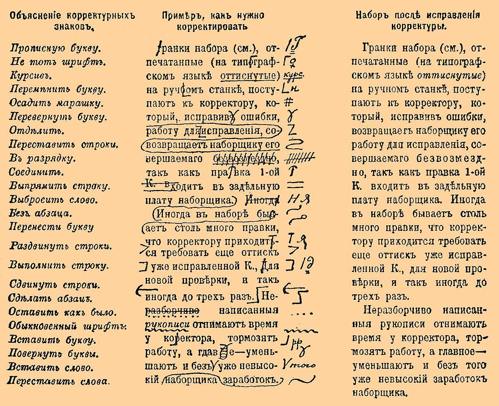

# Reading a diff

*A diff is the change itself: minus lines removed, plus lines added, grouped into hunks whose headers say exactly where. Learn to read unified diff output and GitHub's Files changed view — and turn every diff into a test plan before you run a single test.*

> Here is the payoff for everything you've learned about Git so far. Every bug you will ever hunt was
> *introduced by a change*, and Git shows you every change in one compact format: the **diff**. Lines that
> begin with `-` were removed, lines that begin with `+` were added, and a header like `@@ -14,7 +14,5 @@`
> tells you exactly where in the file it happened. A developer reads a diff to review code; a tester reads
> the *same diff* to answer a sharper question: *what did this change actually do, and what do I need to
> test because of it?* You don't have to understand every line of the codebase — the diff hands you only
> the lines that moved. Learn to read it and you'll walk into any pull request and know where the risk
> lives before anyone runs a single test.

> **In real life**
>
> A diff is **a proofreader's red-ink markup on a manuscript.** The proofreader doesn't retype the whole
> book to show you an edit — they cross out the old words and write the new ones beside them, right where
> the change happens, page and line noted in the margin. That's exactly what a
> **diff**: Git's format for showing the difference between two versions of a file: lines removed (starting with a minus), lines added (starting with a plus), and unchanged context lines, grouped into hunks with headers that give the line numbers.
> is: crossed-out lines (the `-` lines), the replacement text (the `+` lines), and a margin note (the `@@`
> hunk header) telling you the exact line numbers. Untouched paragraphs aren't shown at all — just a little
> surrounding context so you can find your place. And like a good proofreader's markup, the crossings-out
> matter as much as the additions: what got *removed* is often where the safety net used to be.

## Minus lines out, plus lines in

A unified diff shows three kinds of lines, told apart by their first character: `-` for removed, `+` for
added, and a space for unchanged *context* lines shown so you can orient yourself. A changed line appears
as a pair — the old version removed, the new version added:

```diff
--- a/login.py
+++ b/login.py
@@ -22,5 +22,5 @@ def check_login(user, password):
     if user is None:
         return False
-    if attempts > 3:
+    if attempts > 5:
         lock_account(user)
     return verify(password)
```

Read it like a tester: one line changed, and it's a *behaviour* change — accounts now lock after 5 failed
attempts instead of 3. Your tests for 'locks at 4' just became wrong, and 'still unlocked at 4 and 5,
locked at 6' just became the thing to verify. The file names at the top (`a/login.py` is the old version,
`b/login.py` is the new) tell you *which file*; the rest tells you *what happened to it*.


*Proofreading plate, Brockhaus and Efron Encyclopedic Dictionary — Wikimedia Commons, Public domain. [Source](https://commons.wikimedia.org/wiki/File:Brockhaus_and_Efron_Encyclopedic_Dictionary_b31_339-0.jpg)*
- **Struck-through words = minus lines** — What the proofreader strikes through is what a diff marks with a leading minus: the old text, removed. For a tester these are gold — a removed line is often a removed check, a removed guard, a removed safety net. Always read the minus lines first and ask: what stopped happening?
- **Marks in the margin column = plus lines** — The replacement text the editor writes in is the plus line: what the file says NOW. Compare it against its paired minus line character by character — a 3 becoming a 5, a greater-than gaining an equals sign. The smallest visual change is often the biggest behaviour change.
- **The legend of marks = diff syntax you learn once** — A proofreader notes 'p.14, line 7' so you can find the edit; a diff writes a hunk header like @@ -14,7 +14,5 @@ meaning: in the old file this excerpt starts at line 14 and shows 7 lines, in the new file it starts at line 14 and shows 5. It's the diff's way of saying exactly where you are.
- **The clean right-hand column = the file after the change** — The proofreader doesn't mark clean paragraphs, and a diff doesn't show unchanged code — only a few context lines around each edit so you can orient yourself. That's the tester's gift: out of a 2,000-line file, the diff hands you exactly the 6 lines that moved.
- **The whole marked column = one hunk** — Each cluster of edits with its margin note is one hunk: a group of nearby changes shown together. A diff can have many hunks across many files. Count them — every hunk is a place behaviour may have changed, which makes every hunk a candidate for a test.

## Hunks and the `@@` header: where am I?

Changes in different parts of a file are grouped into **hunks**, and each hunk opens with a header
wrapped in `@@` markers. It looks cryptic; it's just two ranges:

```diff
@@ -14,7 +14,5 @@ def apply_discount(total, code):
```

The first pair (after the minus) describes the *old* file: this excerpt starts at line 14 and covers 7
lines. The second pair (after the plus) describes the *new* file: starts at line 14, now covers 5 lines —
so this hunk made the file two lines shorter. The text after the second `@@` is a free bonus: Git shows
the enclosing function name, so you know you're inside `apply_discount` without opening the file. For a
tester, the hunk header is a treasure map reference: 'the change is at line 14 of checkout.py, in the
discount function' is exactly what you write in a bug report when the change turns out to be the culprit.

## Getting a diff in front of you

You'll meet diffs in two places: the terminal and GitHub's **Files changed** tab on a pull request. Same
format, different clothes — GitHub colours the lines (red for removed, green for added) and offers a
split view with old and new side by side:

```bash
git diff                    # your uncommitted changes -- what am I about to test?
git diff main..feature-x    # everything the branch changed vs main
git show abc1234            # the full diff of one commit
git diff --stat main..feature-x   # just filenames + change counts: the overview
```

Start with `--stat` (or the file list at the top of a GitHub PR): it tells you the *shape* of the change —
two files with three lines each is a different testing day than forty files with a thousand. Then read
each file's hunks. On GitHub, hover over a line and you can comment on it directly — which is exactly
where a tester asks 'what happens if total is zero here?'

**How a tester reads a diff, top to bottom. Press Play.**

1. **Start with the file list** — Before any lines, see WHICH files changed — the stat view or GitHub's file list. This is your first scope estimate: a change to checkout.py plus payment.py means money is involved; a change only to README.md means you can relax. Shape first, detail second.
2. **Read the hunk header** — Each @@ header names the line numbers and (usually) the enclosing function. Now you know WHERE you are: line 14, inside apply_discount. You haven't read a line of code yet and you can already say which feature this touches.
3. **Read the minus lines first** — What was REMOVED? A removed if is a removed guard; a removed function call is something that stopped happening. Deletions are where safety nets vanish, and they're the easiest thing to miss when your eye is drawn to shiny green additions.
4. **Read the plus lines against them** — Now the additions — compare each plus line with its paired minus line character by character. A 3 became a 5; greater-than became greater-or-equal; a default flipped. The behaviour change usually lives in a difference of one or two characters.
5. **Turn each hunk into test ideas** — Finish every hunk by asking: what behaviour changed, and what input would prove it? Locks at 6 not 4 — test 4, 5, 6. Guard removed — test the input the guard used to catch. The diff just wrote the first draft of your test plan.

*Read a real unified diff — the guard that vanished. Press Run.*

```bash
# A real unified diff, exactly as git prints it.
# Read it yourself before scrolling to the tester's notes below.
cat <<'DIFF'
diff --git a/checkout.py b/checkout.py
index 3f1a2b4..9c8d7e1 100644
--- a/checkout.py
+++ b/checkout.py
@@ -14,7 +14,5 @@ def apply_discount(total, code):
     if code == "SAVE10":
         return total * 0.90
     if code == "SAVE20":
-        if total < 50:
-            return total
-        return total * 0.80
+        return total * 0.80
     return total
DIFF

echo ""
echo "Tester's read:"
echo "1. One file (checkout.py), one hunk, inside apply_discount."
echo "2. Old side: 7 lines. New side: 5 lines. The file got SHORTER."
echo "3. Three minus lines: the small-order guard is GONE. SAVE20"
echo "   used to require a total of at least 50 -- now ANY total gets 20% off."
echo "4. First test to run: a 1.00 order with code SAVE20."
```

Now decode a diff with **two hunks** — including the small twist that the second hunk's line numbers
drift apart, because the first hunk changed the file's length:

*Two hunks, two behaviour changes — decode the headers. Press Run.*

```bash
# Two hunks in one file. Decode each @@ header yourself, then check.
cat <<'DIFF'
diff --git a/signup.py b/signup.py
--- a/signup.py
+++ b/signup.py
@@ -8,5 +8,6 @@ def create_user(email, password):
     user = User(email)
     user.set_password(password)
+    user.plan = "trial"
     db.save(user)
     return user
@@ -31,5 +32,5 @@ def default_settings():
     return {
         "theme": "light",
-        "notifications": True,
+        "notifications": False,
         "language": "en",
     }
DIFF

echo ""
echo "Hunk 1: old file line 8 (5 lines), new file line 8 (6 lines)"
echo "        -- one line ADDED: every new user is now created as a trial."
echo "Hunk 2: old line 31 but new line 32 -- hunk 1 added a line above,"
echo "        pushing everything below down by one. Notifications now"
echo "        default to OFF for new accounts."
echo ""
echo "Tester's read: two behaviour changes -- trial plan + silent"
echo "notifications -- and neither one is mentioned in the PR title."
```

> **Tip**
>
> Read the **minus lines first**. Everyone's eye jumps to the green additions, but removed lines are where
> validation, error handling, and guards disappear — and a vanished safety net is invisible in the running
> app until the exact input it used to catch comes along. Then read each `+` line against its paired `-`
> line *character by character*: a `3` becoming a `5`, a comparison gaining an equals sign, `True` becoming
> `False`. The behaviour change almost always lives in one or two characters. And before reading any lines
> at all, check the shape with `--stat` or the PR file list — knowing *which* files changed is half your
> test scoping done already.

### Your first time: First time? Read a diff like a tester

- [ ] Get a diff in front of you — In any repo (even one you made in the earlier notes), edit a file and run git diff. Or open any public GitHub project, click a pull request, and open the Files changed tab. Same format either way: file names, hunk headers, minus and plus lines.
- [ ] Name the files and the shape — Before reading lines, list what changed: how many files, roughly how many lines each (git diff --stat, or GitHub's file list). Say out loud what area of the app each file belongs to. This is scoping — the first thing a tester does with any change.
- [ ] Decode one hunk header — Pick one @@ header and translate it: 'in the old file this starts at line N and shows X lines; in the new file, line M with Y lines.' If X and Y differ, the file grew or shrank. Note the function name after the header — free context.
- [ ] Read minus lines, then plus lines — For each hunk: what was removed, what was added, and what pairs up? Find the exact characters that differ between a paired minus and plus line. Say the behaviour change in plain words: 'locks after 5 tries instead of 3.'
- [ ] Write one test idea per hunk — Finish by turning each hunk into a question you could test: what input exercises the changed line? What input did a removed check used to catch? If you can write one test idea per hunk, you just read a diff the way a QA pro does.

Fifteen minutes with one real pull request and diffs stop being wall-of-text — they become the change, itemised, with line numbers.

- **The diff is enormous and I can't find the real change.**
  Usually a formatting or whitespace change is drowning the signal. Try git diff -w (ignore whitespace) or add ?w=1 to a GitHub diff URL / toggle 'Hide whitespace' in the Files changed settings. Also check for a renamed or moved file — Git may show it as one giant deletion plus one giant addition unless rename detection kicks in. Start from --stat to find the files with small, real changes hiding among the noise.
- **The line numbers in the @@ header don't match what I see in my editor.**
  A hunk header carries TWO sets of numbers: the range in the old file (after the minus) and the range in the new file (after the plus). Your editor shows the new file, so use the second pair. And remember earlier hunks shift later ones — if hunk 1 added two lines, every hunk below it starts two lines later on the new side. That drift is normal, not an error.
- **A line shows as removed AND added but looks identical.**
  Something invisible changed: trailing whitespace, a tab swapped for spaces, or line endings (CRLF vs LF). Diff compares characters, not meaning. Use git diff -w to confirm it's whitespace-only. As a tester, don't burn review time on these — but do note when an entire file changed this way, because whitespace-only churn can hide one real edit in the middle.
- **I read the whole diff but I still can't tell what the change DOES.**
  Zoom out: a diff shows lines, not intent. Read the commit message and PR description first — that's the claimed intent — then check the diff against it. If the diff does MORE than the message says (extra files, an unrelated hunk), that gap is exactly what testers exist to catch. And if the context lines aren't enough, open the full file at that line number; the hunk header tells you exactly where to look.

### Where to check

Staring at a diff and unsure what to make of it:

- **The file list first** — `git diff --stat` or the PR's file list. Which areas of the app are touched? That's your scope before you read a single line.
- **The hunk header** — the second number pair is the new file's line numbers; the trailing text names the enclosing function. That's your 'where'.
- **Minus lines** — what stopped happening? Removed checks and guards are the highest-risk deletions and the easiest to skim past.
- **Paired lines, character by character** — for each `-`/`+` pair, find the exact characters that differ. That's usually the entire behaviour change.
- **Intent vs content** — read the commit/PR message, then verify the diff matches it. Extra hunks the message never mentions deserve their own scrutiny.

### Worked example: the two-line diff that unlocked every account — read before testing

A pull request titled 'Tidy up login flow' lands, and you're asked what to test. The diff is tiny:

```diff
--- a/auth.py
+++ b/auth.py
@@ -40,6 +40,5 @@ def login(user, password):
     if not verify(password, user.hash):
-        record_failure(user)
-        if user.failures >= 5:
-            lock_account(user)
+        log.info("bad password for " + user.email)
         return False
     return True
```

1. **Shape first:** one file, one hunk, inside `login` in auth.py. Small diff — but auth is a
   high-stakes file, so small does not mean safe. The header says the old excerpt was 6 lines, the new
   is 5: the function shrank.
2. **Minus lines first:** three lines removed. `record_failure(user)` — failed attempts are no longer
   counted. And the whole lock-after-5 block — accounts are no longer locked, ever.
3. **Plus line against them:** the replacement is a log statement. So the *observable* behaviour (bad
   password returns False) is unchanged — which means a quick happy-path check would pass and this would
   ship looking fine.
4. **Say the behaviour change in plain words:** brute-forcing a password is now unlimited. The 'tidy up'
   removed the lockout defence entirely — most likely a developer cleaning 'unused' code without knowing
   why it was there.
5. **Turn it into tests:** fail login 6 times in a row and check the account state — before this change
   the 6th attempt hit a locked account; now it just keeps accepting guesses. That single test proves the
   regression no happy-path suite would ever see.
6. **Tester's angle:** nothing about this required running the app or writing code — the *diff itself*
   was the evidence. Minus lines told the story; the PR title actively pointed away from it. This is why
   testers read diffs: the change is the risk, and the diff is the change.

> **Common mistake**
>
> Skimming only the green. Beginners read a diff by scanning the additions — new code, new feature, test
> the new thing — and skate straight past the minus lines, which is where validation, error handling, and
> guards quietly vanish. The sibling mistake is trusting size: a two-line diff *feels* safe, but two lines
> in auth.py or checkout.py can outweigh two hundred in a README, and 'small change' is precisely when
> review attention is lowest. Read minus lines first, weight the diff by *which files* it touches rather
> than how long it is, and check the diff against the commit message's claimed intent — a hunk the message
> never mentions is a hunk nobody meant to explain.

**Quiz.** A hunk header reads: at-at -30,6 +30,8 at-at. What does it tell you, and what should a tester do with the hunk below it?

- [ ] The change is 30% complete; wait for the rest before testing
- [x] In the old file this excerpt starts at line 30 and spans 6 lines; in the new file it starts at line 30 and spans 8 — so two lines were added. Read the minus and plus lines beneath it and turn the behaviour change into test ideas
- [ ] Lines 30 to 68 were deleted from the file
- [ ] The file was renamed from version 30,6 to version 30,8

*The hunk header carries two ranges: the first (after the minus sign) describes the OLD file — this excerpt starts at line 30 and shows 6 lines — and the second (after the plus sign) describes the NEW file — line 30, now 8 lines. Net effect: the hunk made the file two lines longer. It says nothing about percentages, deletions of that size, or renames. For a tester it's the 'where': combine it with the function name Git prints after the header, then read the minus lines (what stopped happening) and plus lines (what starts happening) and write a test idea for the behaviour that changed at that spot.*

- **Diff** — Git's view of the difference between two versions: removed lines (leading minus), added lines (leading plus), unchanged context lines (leading space), grouped into hunks. For a tester, the diff IS the change — and the change is what needs testing.
- **Minus line / plus line** — A minus line existed in the old version and is gone; a plus line is new. A changed line appears as a minus/plus pair — compare them character by character. Read minus lines FIRST: removed checks and guards are the classic hidden regression.
- **Hunk** — One group of nearby changes with its own header. A diff can hold many hunks across many files. Tester's rule of thumb: one hunk = one place behaviour may have changed = at least one test idea.
- **Hunk header (the at-at line)** — Two ranges: old-file start line and line count (after the minus), then new-file start line and count (after the plus), often followed by the enclosing function name. It's the 'where' — line numbers you can cite in a bug report.
- **Context lines** — Unchanged lines (leading space) shown around each edit so you can orient yourself. Diffs omit everything else — out of a 2,000-line file you see only the lines that moved plus a little padding. If context isn't enough, the header's line number tells you where to open the full file.
- **Where testers meet diffs** — git diff (uncommitted work), git diff main..branch (what a branch changed), git show for one commit, and GitHub's Files changed tab on every pull request — red/green colouring, split view, and line-level comments where you ask your what-if questions.

### Challenge

Read a real diff cold. (1) Open any public GitHub repository, pick a recent pull request, and open Files
changed. (2) From the file list alone, write one sentence on the change's scope: which app areas, how
many files, big or small. (3) Pick one hunk and decode its header: old start line and count, new start
line and count, and the function it sits in. (4) List every minus line in that hunk and answer: what
stopped happening? (5) Write three test ideas the diff suggests — one for a changed value, one for a
removed line, one for an added line. If you can do all five without running any code, you can read a
diff as a tester.

### Ask the community

> Diff-reading question: here's a hunk from a PR I'm testing [paste the hunk including the at-at header]. I think the behaviour change is [your plain-words guess] and I plan to test [your test ideas]. Am I reading it right, and what am I missing?

Paste the whole hunk including its header — the line numbers and function name are half the context.
Say what you think the minus lines removed in behaviour terms ('failed logins are no longer counted'),
not code terms, and list the tests you'd run. The best answers will point at the minus line you
underweighted — that's where diff-reading skill grows.

- [git-diff — official Git documentation](https://git-scm.com/docs/git-diff)
- [GitHub Docs — reviewing proposed changes in a pull request](https://docs.github.com/en/pull-requests/collaborating-with-pull-requests/reviewing-changes-in-pull-requests/reviewing-proposed-changes-in-a-pull-request)
- [Git & GitHub crash course — reading diffs in practice — freeCodeCamp](https://www.youtube.com/watch?v=RGOj5yH7evk)

🎬 [Git & GitHub crash course — watch git diff used for real](https://www.youtube.com/watch?v=RGOj5yH7evk) (69 min)

- A diff is the change itself: minus lines were removed, plus lines were added, context lines (leading space) are unchanged padding. A changed line shows as a minus/plus pair — the behaviour change usually lives in one or two differing characters.
- Hunks group nearby changes; the header between at-at markers gives the old file's start line and count, then the new file's, plus the enclosing function name. It's the 'where' you cite in a bug report.
- Read minus lines FIRST. Removed validation, removed guards, removed error handling are the classic invisible regressions — the app looks fine until the exact input the deleted check used to catch shows up.
- Scope before you read: git diff --stat or GitHub's file list tells you the shape — which areas, how many files. Two lines in auth or checkout outweigh two hundred in a README; weight diffs by what they touch, not how long they are.
- Every hunk is a test idea: what input exercises the changed line, and what input did a removed line used to catch? Reading the diff writes the first draft of your test plan — before you've run anything at all.


---
_Source: `packages/curriculum/content/notes/version-control-with-git/reading-code-as-a-tester/reading-a-diff.mdx`_
