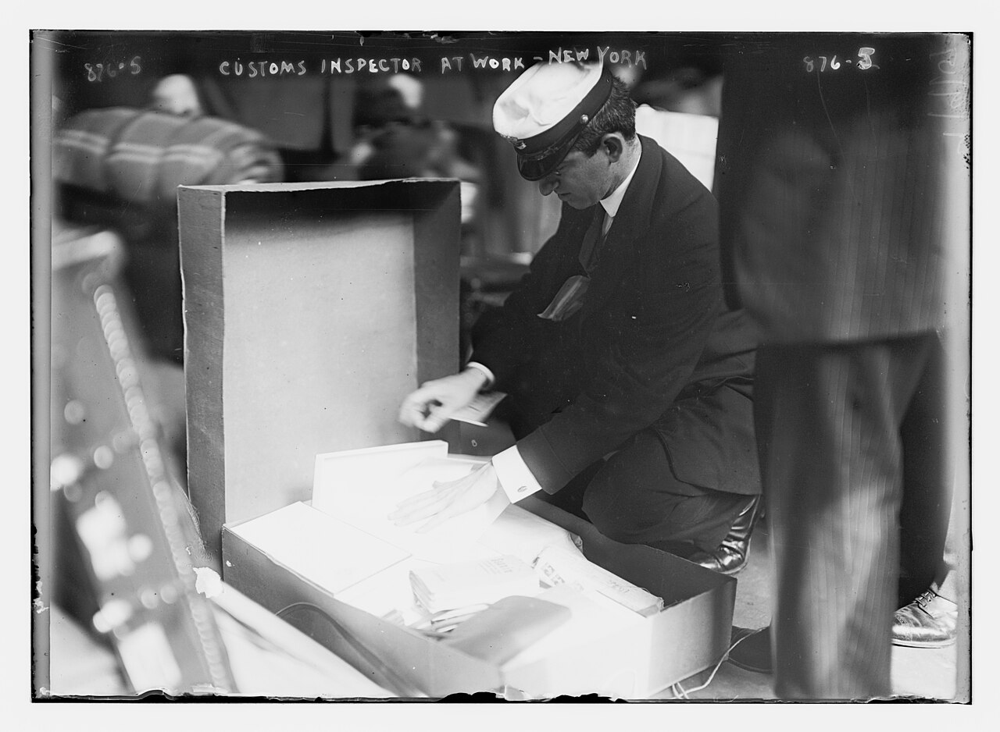

# Spotting risky changes

*Not every diff deserves the same testing. Triage changes by risk: blast radius over line count, shared utilities vs leaf code, config/migration/dependency red flags, missing tests — and why 'one-line fix' is famous last words. Build a checklist that sets your regression depth.*

> Two pull requests land on the same afternoon. PR one: 390 shiny new lines across two brand-new pages.
> PR two: four lines changed in a file called `formatMoney.ts`. Every beginner tester dives into the big
> one — big diff, big risk, right? — and waves the little one through. Then Friday arrives and every
> price in the checkout, every invoice, and every receipt email is showing `$NaN`, because those four
> lines sat inside a utility that twenty-three files call. Welcome to the tester's most valuable
> judgment call: **risk triage**. You can't regression-test everything on every change — nobody can —
> so the real skill is reading a diff and deciding, in about sixty seconds, *how afraid to be*. This
> note gives you the triage: what actually predicts risk (spoiler: it's almost never line count), which
> file types should make your eye twitch, and how to build the personal checklist that tells you when a
> 'quick look' is enough and when it's time to cancel your evening.

> **In real life**
>
> A customs officer at a busy airport cannot search every passenger — the queue would back up to another
> country. So they don't try. They *profile the risk*: the frequent flyer with a gym bag gets waved
> through; the one-way-ticket passenger with a wrapped package and a sweaty forehead gets the table and
> the gloves. Notice what the officer is NOT doing: judging by luggage size. A huge suitcase full of
> socks is boring; a tiny envelope can be the whole case. Diff triage is identical. The 390-line PR of
> brand-new leaf pages is the suitcase of socks — bulky, low-stakes. The four-line change to a shared
> money formatter is the envelope. Your job is the officer's job: a fast, consistent set of questions —
> what is it, where has it been, who does it touch — that decides who gets waved through and who gets
> the full
> **regression**: Re-testing existing functionality after a change, to catch things that USED to work and quietly broke. The depth of regression testing — one smoke test vs a full sweep — should scale with the risk of the change, not with its line count.
> treatment.

## Size lies: measure blast radius, not line count

Line count is the first thing a diff shows you and the least useful thing it tells you. What predicts
pain is
**blast radius**: How far a change's effects can spread: the set of features, screens, and flows that depend — directly or through intermediaries — on the code that changed. A one-line edit in code with a large blast radius outranks a thousand new lines in code nothing depends on.:
how much of the app *depends on* the thing that changed. New code that nothing calls yet — a new page,
a new endpoint, a new component — is **leaf code**: if it's broken, it's broken alone, like a new shop
opening on a quiet street. But **shared code** — utilities, helpers, base classes, the functions with
names like `format`, `parse`, `validate`, `auth` — is load-bearing: one line moves and every caller
moves with it, whether the author thought about them or not. The sixty-second way to measure it:

*Two PRs, one afternoon — triage by blast radius, not size. Press Run.*

```bash
# PR-101: two brand-new marketing pages. Big diff, zero callers.
git diff --stat main..pr-101
#  src/pages/about.tsx  | 210 ++++++++++++++++++++++
#  src/pages/team.tsx   | 180 +++++++++++++++++++
#  2 files changed, 390 insertions(+)

# PR-102: a tiny change inside a shared utility.
git diff --stat main..pr-102
#  src/utils/formatMoney.ts | 4 ++--
#  1 file changed, 2 insertions(+), 2 deletions(-)

# Line count says PR-101 is 97x bigger. Now measure what MATTERS:
# who calls the thing PR-102 changed? git grep -l lists every file
# that mentions it:
git grep -l "formatMoney" -- src
# src/utils/formatMoney.ts
# src/cart/CartTotal.tsx
# src/checkout/OrderSummary.tsx
# src/invoices/InvoiceRow.tsx
# src/emails/receipt.ts
# src/admin/RefundPanel.tsx
# ...23 files total

# Verdict: 390 new lines that nothing depends on yet (leaf code)
# vs 4 lines inside a function that cart, checkout, invoices,
# refunds, AND receipt emails all call. PR-102 gets the deep
# regression pass. Size is not risk. Blast radius is risk.
```

## The file types that should make your eye twitch

Some changes are high-risk *by category*, before you read a single line — the customs officer's
wrapped-package list. Burn these into memory:

**Config changes** (`.env`, `.yml`, `settings`, feature flags) — behaviour changes with *no code to
read*. A flipped boolean in `payment.yml` can reroute real money, and no unit test will blink,
because tests usually run against test config. **Database migrations** — they touch every existing
row, they're painful to undo (you can revert code in seconds; un-dropping a column is another story),
and they fail in ways that only appear with production-shaped data. **Dependency changes**
(`package.json`, `pom.xml`, `requirements.txt`) — one line in the diff, but an entire library changed
underneath you; a major version bump means the *authors themselves* are telling you behaviour changed.
And the quiet killer across all three: they look tiny in a diff. Two characters — `"11.2.0"` becoming
`"14.0.0"` — can be the biggest change in the release.


*Customs officer inspecting opened luggage, New York — Library of Congress via Wikimedia Commons, Public domain. [Source](https://commons.wikimedia.org/wiki/File:Customs_officer_inspecting_opened_luggage,_N.D.L._pier,_New_York_LCCN2014684204.jpg)*
- **The baggage piled around = every diff wants your attention** — More changes land every day than any tester can deep-test — exactly like the passenger queue. Triage exists because attention is finite: the skill is not testing everything, it is spending your limited regression time where the risk actually lives, on purpose, with a repeatable set of questions.
- **The big trunk lid = big leaf-code diffs** — Bulky but boring: 390 lines of brand-new pages that nothing else calls. If they break, they break alone. New leaf code needs ITS OWN testing, but it rarely needs a regression sweep of everything else — low blast radius earns the wave-through.
- **The small papers in his hands = the tiny shared-utility change** — Four lines inside formatMoney used by 23 files: cart, checkout, invoices, receipts. The officer knows envelopes can outweigh suitcases; the tester knows one changed line in shared code multiplies by every caller. Small plus shared equals the full search, every time.
- **The boxes inside the trunk = config, migrations, dependencies** — Some items are suspicious by CATEGORY. Config changes behaviour with no code to read; migrations touch every row and resist undo; a dependency bump swaps an entire library in one diff line. These get flagged before reading a single line of logic.
- **The inspector himself = your personal risk checklist** — Good officers do not vibe — they run the same questions on every passenger. Your version: how big? shared or leaf? config/migration/dependency? tests included? area with history? Five questions, sixty seconds, and the answer sets your regression depth. Consistency beats intuition.

## Missing tests, and the 'one-line fix' myth

Two more signals close the triage. First: **is the diff carrying its own tests?** A healthy change to
risky code arrives with test changes in the same diff — new tests proving the fix, updated tests
tracking the behaviour. When 40 lines of order logic land and the file list shows zero `test` files,
that silence is information: whatever safety net exists, this change didn't add to it, and your manual
regression just became the only net. Second: the most dangerous phrase in software — *'it's just a
one-line fix.'* One-liners get less review ('LGTM' in four seconds), less testing ('too small to
break anything'), and land late ('we can squeeze it in before the release'). But risk lives in *what*
the line does, not how long it is: one line flipped a default, raised a limit, removed a guard —
remember the lockout that vanished in the reading-a-diff note? Three lines. The 'one-line fix' myth is
where confidence and blast radius trade places.

**The sixty-second risk triage — run it on every diff. Press Play.**

1. **Shape: how big, how many files?** — git diff --stat or the PR file list. Size is your WEAKEST signal but still a signal: forty files touched means broad exposure even if each edit is small. Note the shape, then immediately distrust it — the next three questions outrank it.
2. **Location: shared plumbing or leaf?** — Are the changed files utilities, helpers, auth, formatting, base components — names half the codebase imports? Or new, self-contained leaf code? git grep -l for the changed function counts the callers. Shared code multiplies risk by every caller; leaf code breaks alone.
3. **Category: config, migration, dependency?** — Scan the file list for the watchlist: .env and .yml files, db/migrations, package.json or pom.xml or requirements.txt. Any hit is automatic high-risk regardless of line count — behaviour with no code to read, schema you cannot easily undo, or a whole library swapped in one line.
4. **Safety net: are tests in the diff?** — Does the file list include test files that changed WITH the code? Risky logic arriving with zero new tests means your manual pass is the only net there is. Tests present is not proof of safety — but tests absent is a fact you plan around.
5. **Verdict: pick the regression depth** — Low risk (leaf code, tests included): test the new thing, smoke the neighbours. Medium (moderate sharing or size): test the change plus every direct caller. High (shared/config/migration/dependency, no tests, or fragile area): full regression on every flow in the blast radius — and say WHY in one sentence, out loud, to the team.

## Building your personal risk checklist

The officer's power isn't intuition — it's asking the *same* questions every time, so nothing slides
through on a busy day. Write yours down (a sticky note is fine) and run it on every diff you're asked
to test: **1) How big, how many files?** (weakest signal, still worth ten seconds). **2) Shared or
leaf?** (count the callers — this question outranks size every time). **3) Config, migration, or
dependency in the file list?** (any hit = automatic high). **4) Are tests in the diff?** (absent net =
your net). **5) Does this area have a history?** (the module that breaks every release gets no benefit
of the doubt — your bug tracker knows which one it is). Score it however you like — high/medium/low
works fine — but the output is always the same decision: *how deep does the regression pass go?* Watch
the checklist catch a genuinely scary PR:

*Run the checklist on a real PR — three red flags in one file list. Press Run.*

```bash
# PR-203: 'Update order status handling'. Run the triage.
# Question 1+2: shape and location.
git diff --stat main..pr-203
#  .env.example                      |  2 +
#  config/payment.yml                |  3 ++-
#  db/migrations/0042_add_status.sql | 12 ++++++++++++
#  package.json                      |  2 +-
#  src/orders/status.ts              | 25 +++++++++++++-----
#  5 files changed, 40 insertions(+), 5 deletions(-)

# Only 40 lines -- but question 3 lights up THREE times:
# config/payment.yml    -> payment behaviour, no code to read
# db/migrations/0042    -> schema change, touches every order row
# package.json          -> a dependency moved. Which one? How far?
git diff main..pr-203 -- package.json
# -    "stripe": "11.2.0",
# +    "stripe": "14.0.0",
# Three MAJOR versions of the PAYMENT library, in one diff line.

# Question 4: did any tests arrive with all this?
git diff --stat main..pr-203 -- "*test*" "*spec*"
# (no output)
# Zero test files touched. The safety net for a payment-library
# jump plus a schema change is... you.

# Verdict: 40 lines, HIGH risk. Full regression on order + payment
# flows, migration checked against production-shaped data, and a
# question in the thread: 'stripe 11 to 14 -- which breaking
# changes apply to us?' The checklist made this call in a minute.
```

> **Tip**
>
> Say your verdict *out loud, with the reason attached*: 'this is high-risk because it changes a shared
> money utility with no tests in the diff, so I'm running the full checkout regression.' Two magic
> things happen. First, your reasoning gets checked — a dev might say 'actually that util is only used
> in one place now', and your triage just got smarter for free. Second, you're building a reputation as
> the tester who *scales effort to risk* instead of treating every change like a crisis or a formality.
> That sentence — risk, reason, depth — is the difference between 'QA is a bottleneck' and 'run it past
> QA, they'll size it in a minute.'

### Your first time: First time? Triage three real diffs

- [ ] Write your checklist first — On paper or a note file, write the five questions: how big / shared or leaf / config-migration-dependency / tests in the diff / history in this area. This is YOUR copy — you'll tune it later with the bugs that teach you. Triage without a written list decays into vibes within a week.
- [ ] Find three merged PRs — Open any active public GitHub repo and pick three recent pull requests of different sizes — one big, one small, one touching a config or dependency file if you can find it. Merged PRs are perfect practice: the risk assessment is real but nothing depends on your verdict yet.
- [ ] Run the five questions on each — For every PR use only the Files changed list and the diff — no reading the discussion yet. Score each question, then write one verdict line per PR: 'HIGH — shared utility, no tests' or 'LOW — leaf pages, self-contained'. Sixty seconds per PR is the goal; speed is part of the skill.
- [ ] Decide the regression depth — For each verdict, write what you would actually test: the changed thing only? The change plus its direct callers? A full sweep of every flow in the blast radius? The depth MUST follow from the score — if your low-risk PR somehow earned a full sweep, one of the two is wrong.
- [ ] Check yourself against reality — NOW read each PR's discussion and any linked issues. Did reviewers worry about what you flagged? Did a follow-up fix land after the merge (the classic sign of an under-tested change)? Every miss is a checklist upgrade: add the question that would have caught it.

Three PRs, fifteen minutes, and risk triage stops being a senior-tester mystery — it's five questions you now own.

- **Everything scores high on my checklist, so I'm regression-testing everything, so I'm drowning.**
  Your checklist has become a fear amplifier — every question answered 'maybe' rounds up to high. Recalibrate with ranking instead of scoring: given ten real diffs, ORDER them by risk; the top two or three get the deep pass, and the ranking forces genuine comparison. Remember the point of triage is to spend LESS total effort, better aimed. If everything is high-priority, you don't have a checklist — you have anxiety with bullet points.
- **I triaged a change as low-risk and it broke production anyway.**
  Congratulations, you've collected the tuition every senior tester has paid. Do the debrief, not the shame spiral: WHICH question would have caught it? A caller you didn't count (git grep next time)? A config file you skimmed past? An area with a bad history you didn't know? Add exactly one question or rule to your checklist per incident. A personal checklist that has eaten three real escapes is worth more than any generic risk matrix from a textbook.
- **The PR has no description, the title says 'fixes', and I can't assess anything.**
  The absence of information is itself risk information — you cannot triage what you cannot see, so opacity rounds UP, never down. Two moves: read the diff yourself (the file list alone answers most of the five questions — that's why the checklist leans on it), and ask the author ONE precise question: 'what's the intended behaviour change, and what areas could it affect?' If the answer is a shrug, say explicitly: 'unknown scope means I test it as high-risk, which takes a day.' Scope clarifies remarkably fast after that sentence.
- **Devs push back: 'it's a one-line fix, why is QA making it a whole thing?'**
  Don't argue with vibes — show the blast radius. 'This one line is in formatMoney, which 23 files call, including checkout and invoices; here's the list.' Evidence turns the conversation from QA-is-slow into oh-I-didn't-realise. And concede honestly when the line really IS low-risk (a leaf-code typo fix deserves a wave-through — credibility comes from scaling BOTH directions). The reputation you want: not the tester who blocks everything, but the one whose risk calls keep being right.

### Where to check

Triaging a diff and unsure where the risk signals live? Look here, in order:

- **The file list before any code** — `git diff --stat` or the PR's Files changed sidebar. Paths ending in `.yml`, `.env`, anything under `migrations/`, and `package.json`/`pom.xml`/`requirements.txt` are category flags you can spot in five seconds.
- **Caller count for changed functions** — `git grep -l "functionName"` (or the IDE's find-usages). This one number separates 'breaks alone' from 'breaks everywhere' — it outranks every other signal.
- **Test files in the same diff** — filter the file list for `test`/`spec`. Code risk plus zero test changes means the safety net is you.
- **The dependency delta** — for any lockfile/manifest change, diff the actual versions. A patch bump (11.2.0 to 11.2.1) and a major bump (11.x to 14.x) are different planets; the version numbers say which.
- **Your bug tracker's history for the touched area** — the module that produced last quarter's incidents gets no benefit of the doubt. Past escapes are the strongest predictor your checklist can use.

### Worked example: the Friday one-liner — triage under pressure, step by step

1. **The setup:** Friday, 4pm. A dev pings: 'super quick one — one line in `dateUtils`, fixes the
   timezone thing on the profile page. Can QA glance at it so we can ship before the weekend?' Every
   word of that sentence is engineered to produce a wave-through: *quick*, *one line*, *glance*.
2. **Question 1 — shape:** `git diff --stat` confirms one file, one changed line in
   `src/utils/dateUtils.ts`. Smallest possible diff. If size were risk, this is a rubber stamp.
3. **Question 2 — shared or leaf:** the path says `utils`, and `git grep -l "formatDate"` returns 31
   files: profile, yes — but also order history, invoices, report exports, the audit log, and the
   booking calendar. This is not a profile-page change. It's a *31-features* change that happens to
   have been noticed on the profile page.
4. **Question 3 — category:** no config, no migration, no dependency. One genuine pass.
5. **Question 4 — tests:** no test files in the diff. The dev's evidence that nothing else breaks is
   'I checked the profile page.' For the other 30 call sites, the safety net is whoever tests next.
6. **Question 5 — history:** the tracker shows two previous timezone bugs in this same utility, both
   of which 'fixed one page and broke another' — date handling has form. That's strike three.
7. **The verdict, said out loud:** 'One line, but it's a shared date utility with 31 callers, no tests
   in the diff, and this exact util has broken cross-page twice before. I can deep-test the top five
   callers tonight, or we ship Monday after a proper pass. Not Friday.' The team ships Monday. The
   Monday pass finds that the fix formats dates correctly on the profile page — and shifts every date
   in *exported reports* by one day for users east of UTC. The envelope, not the suitcase.

> **Common mistake**
>
> Sizing the regression pass by the size of the diff — the beginner move this whole note exists to
> delete. Its cousins: trusting the PR title over the file list (titles say 'tidy up'; file lists say
> 'payment config plus a migration'); skimming past 'boring' files like `package.json` because they're
> only one line (that line swapped an entire library); and treating a missing description or missing
> tests as neutral, when absence of information should always round the risk UP. The deepest version of
> the mistake is triaging by *vibes* — today's mood, the dev's confidence, how busy you are — instead of
> running the same five questions every time. The checklist isn't bureaucracy; it's what keeps your
> judgment consistent on the Friday afternoon when everyone, including you, wants the answer to be
> 'looks fine.'

**Quiz.** Same release, two changes: (A) 300 new lines adding a self-contained 'export as PDF' page, with new tests included; (B) a 2-line change to parseAmount in src/utils/, no tests changed, and git grep shows 19 files call it. How do you split your regression effort?

- [ ] Mostly A — 300 lines is 150 times more code than 2 lines, and more code means more bugs
- [ ] Equal effort on both — fairness keeps the process simple
- [x] Mostly B — it's a shared utility with 19 callers and no tests in the diff, so its blast radius covers 19 features; A is leaf code carrying its own tests, so test the new page itself and smoke its surroundings
- [ ] Neither needs regression testing if both developers say they tested locally

*Change B is the envelope: two lines, but they sit inside shared code that 19 features depend on, arriving with no test changes — every caller (money parsing, so likely cart, checkout, invoices) is in the blast radius, and the only safety net is your regression pass. Change A is the suitcase of socks: bulky but leaf — nothing existing depends on a brand-new page, and it carries its own tests, so it needs solid testing OF ITSELF but not a sweep of everything else. Splitting by line count inverts the real risk; splitting equally ignores it; and 'tested locally' is a claim about the changed line, never about the 19 callers. Blast radius, category, and tests-in-diff set the depth — size is the weakest signal in the list.*

- **Blast radius** — How far a change's effects can spread: everything that depends on the changed code, directly or indirectly. Measured in callers and affected flows, not lines. The single strongest risk signal — a 1-line change with 23 callers outranks 400 new leaf lines.
- **Shared code vs leaf code** — Shared: utilities, helpers, auth, formatting — code many files import; one change multiplies across every caller. Leaf: new, self-contained code nothing depends on yet; breaks alone. Find out which with git grep -l 'name' or find-usages before choosing regression depth.
- **The high-risk-by-category file types** — Config (.env, .yml, flags): behaviour change with no code to read. Migrations: touch every row, hard to undo. Dependency manifests (package.json, pom.xml, requirements.txt): one diff line swaps a whole library — check if it's a major version. All three look tiny and aren't.
- **Missing tests in the diff** — Risky code changes should arrive WITH test changes. A diff touching order/payment/auth logic with zero test files changed means the safety net wasn't extended — your manual regression is the only net. Absence of tests is a fact you plan around, and it rounds risk up.
- **The 'one-line fix' myth** — One-liners get four-second reviews, minimal testing, and late-Friday merges — while risk lives in WHAT the line does: flipped default, raised limit, removed guard, bumped dependency. Judge the line by its blast radius and category, never by its length.
- **The five-question risk checklist** — 1) How big / how many files? (weakest signal) 2) Shared or leaf — how many callers? 3) Config, migration, or dependency touched? 4) Tests in the diff? 5) Does this area have bug history? Output: regression depth — smoke, change-plus-callers, or full sweep. Same questions, every diff.

### Challenge

Build and battle-test your checklist. (1) Write your five questions down — start with this note's
five, but in your own words. (2) Open a public repo's merged PRs and triage five of them at sixty
seconds each: verdict plus one-sentence reason. (3) For each, name the regression depth you'd order:
smoke, change-plus-callers, or full sweep. (4) Read the PR discussions and any follow-up fixes —
score your calls against what actually worried the reviewers or broke later. (5) Add exactly one
question your misses suggest (dependency majors? a specific fragile module?). Keep the checklist
where you'll see it — it only works if it runs on EVERY diff, especially the ones that arrive at 4pm
on Friday wearing the words 'super quick one'.

### Ask the community

> Risk-triage check: PR I'm testing touches [N] files: [paste the git diff --stat output]. My read: [shared/leaf, and caller count if known], category flags: [config/migration/dependency/none], tests in diff: [yes/no], area history: [any past bugs]. My verdict is [low/medium/high] and I plan [smoke / change+callers / full regression]. Am I weighing this right, and what signal am I missing?

Paste the actual `--stat` output — the file list carries most of the signal and the community can
triage it faster than any prose summary. State your verdict AND the regression depth it buys, because
that pairing is what gets calibrated. The best replies will point at the file you underweighted
(usually the one-line lockfile change) or tell you you're over-testing leaf code — both corrections
tune the checklist, which is the whole point.

- [Martin Fowler's site — The Rise of Test Impact Analysis (formalising 'what does this change affect?')](https://martinfowler.com/articles/rise-test-impact-analysis.html)
- [Semantic Versioning — why a major version bump is the library authors declaring breaking changes](https://semver.org/)
- [Google Testing Blog — essays on risk, flaky areas, and scaling test effort](https://testing.googleblog.com/)

🎬 [Git It? The everyday Git and GitHub flow, diffs and PRs — Fireship](https://www.youtube.com/watch?v=HkdAHXoRtos) (12 min)

- Line count is the weakest risk signal a diff offers. Blast radius — how many features depend on the changed code — is the strongest: count callers with git grep or find-usages before deciding anything.
- Shared code multiplies, leaf code breaks alone: a 2-line change in a utility with 20 callers outranks 400 lines of self-contained new pages, every time.
- Three categories are high-risk before you read a line: config (behaviour with no code to read), migrations (every row, hard to undo), and dependencies (one diff line = a whole library changed; majors mean declared breaking changes).
- A risky change arriving with zero test changes means the safety net wasn't extended — absence of tests, like absence of description, always rounds risk UP. And 'one-line fix' is a description of length, not of risk.
- Run the same five questions on every diff — size, shared-or-leaf, category, tests, history — and let the score pick the regression depth. Then say the verdict out loud with its reason: that sentence is what turns triage into trust.


---
_Source: `packages/curriculum/content/notes/version-control-with-git/reading-code-as-a-tester/spotting-risky-changes.mdx`_
