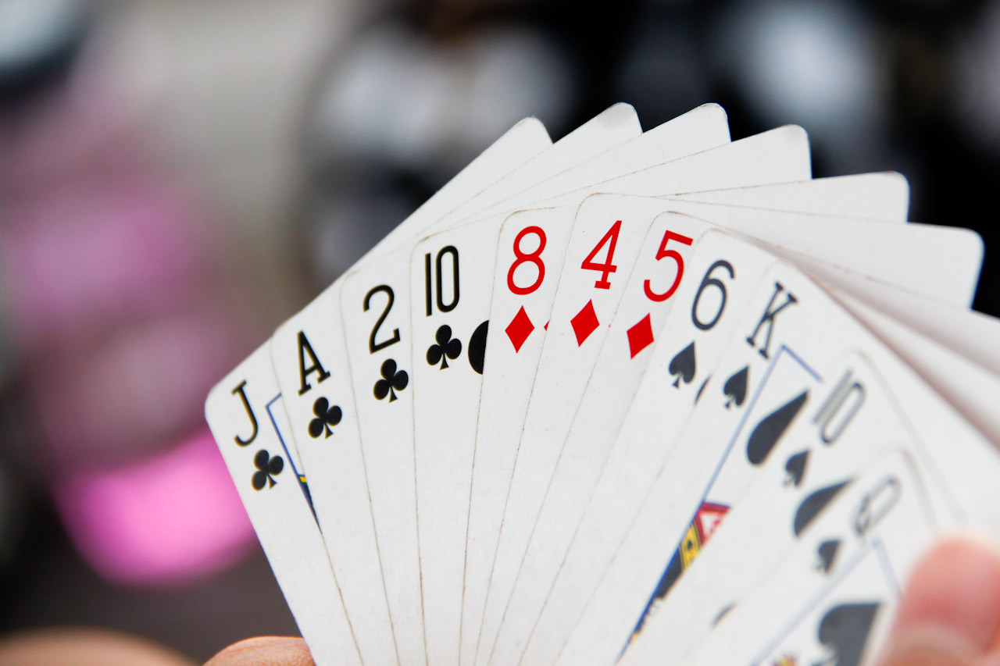

# Sorting lists

*Put a list in order: sorted() (returns a new list) vs .sort() (in place, returns None), ascending and descending, and custom keys to sort by length, a field, or any rule. Plus stable sort and the .sort()-returns-None trap.*

> Ordered data is everywhere a program shows a list to a human: prices low-to-high, names A–Z, newest posts
> first, a leaderboard by score. Sorting is how you get there, and the good news is you almost never write the
> sorting algorithm yourself — the language does it, fast and correctly. What you *do* choose is three things:
> whether to sort a *copy* or the list *in place*, which *direction* (ascending or descending), and — the real
> power — by what *key* (sort people by age, words by length, files by date). Two small traps trip up
> beginners here, and both are worth meeting once: Python's `.sort()` reorders the list but returns `None` (so
> `x = mylist.sort()` quietly gives you nothing), and sorting text is case-sensitive in surprising ways. Get
> sorting down and you can present any collection the way a user expects to see it — which is often the
> difference between data and *usable* data.

> **In real life**
>
> Sorting is **arranging a hand of playing cards.** You pick up a jumbled hand and rearrange it into order —
> maybe grouped by suit, maybe ranked low to high. You can shuffle the very cards you're holding into order
> (that's an
> **in-place**: An operation that reorders/modifies the original object rather than returning a new one. Python's list.sort() sorts in place and returns None; sorted(list) leaves the original alone and returns a NEW sorted list.
> sort — `list.sort()`), or lay out a fresh, ordered copy while keeping your original hand as-is (that's
> `sorted(list)`, which returns a new list). And the interesting choice is *by what*: sort by rank, and the
> cards line up 2, 3, 4…; sort by suit, and they group clubs, diamonds, hearts, spades. That 'by what' is the
> **key** — you tell the sort which feature to order on, and it does the rest. Same cards, different key,
> different order.

## sorted() vs .sort(), and direction

Two ways to sort in Python, and the difference matters:

```python
nums = [3, 1, 4, 1, 5, 9, 2]

print(sorted(nums))       # [1, 1, 2, 3, 4, 5, 9]  -- returns a NEW sorted list
print(nums)               # [3, 1, 4, 1, 5, 9, 2]  -- original UNCHANGED

nums.sort()               # sorts IN PLACE (reorders nums itself)
print(nums)               # [1, 1, 2, 3, 4, 5, 9]

print(sorted(nums, reverse=True))   # [9, 5, 4, 3, 2, 1, 1]  -- descending
```

**Java:**
```java
List<Integer> nums = new ArrayList<>(List.of(3, 1, 4, 1, 5, 9, 2));
Collections.sort(nums);                 // sorts in place, ascending -> [1,1,2,3,4,5,9]
nums.sort(Comparator.reverseOrder());   // descending -> [9,5,4,3,2,1,1]
```

Use `sorted(list)` (Python) when you want a sorted copy and need the original left alone; use `list.sort()`
when you want to reorder the list itself and don't need the old order. **The trap:** `list.sort()` sorts *in
place* and **returns `None`**, so `x = nums.sort()` puts `None` in `x`, not a sorted list. If you want to
capture a result, use `sorted()`. Ascending is the default; add `reverse=True` (Python) /
`Comparator.reverseOrder()` (Java) for descending.


*Photo: a hand of playing cards — Wikimedia Commons, CC BY-SA 2.0. [Source](https://commons.wikimedia.org/wiki/File:Hand_holding_playing_cards-4530227761.jpg)*
- **The fanned hand = the list** — A hand of cards is your list — a collection of items you want in some order. Sorting takes the jumble you were dealt and arranges it into a defined sequence, so you (and a human reading it) can find and compare things at a glance.
- **Grouped by suit = sorting by a KEY** — These cards sit grouped by suit — clubs, then diamonds, then spades. That grouping is a sort by a KEY: you tell the sort which feature to order on (here, suit). Choose a different key and the arrangement changes — the key is what 'sorted' means for this data.
- **A different key = a different order** — Sort by RANK instead (2, 4, 5, 6, 8, 10, J, K, A) and the same cards line up completely differently. sorted(cards, key=rank) vs key=suit. And direction is a choice too: ascending by default, or reverse for high-to-low. Same list, key + direction decide the result.
- **Rearrange the same cards = in place** — Shuffling the cards you're holding into order is an IN-PLACE sort: list.sort() / Collections.sort reorder the original list (and list.sort() returns None!). Laying out a fresh ordered copy while keeping your hand is sorted(list), which returns a NEW list and leaves the original untouched.
- **Ties keep their order = stable sort** — If two cards tie on the key — two 10s when sorting by rank — a STABLE sort keeps them in their original relative order. Python and Java both sort stably, which matters when you sort by one field (say, last name) and want earlier ordering (first name) preserved among ties.

## Sorting by a key: the real power

The default sorts by natural order (numbers ascending, strings alphabetically). But you often want to sort by
some *feature* of each item — its length, a field, a computed value. That's the **key**: a function that,
given an item, returns the value to sort on.

```python
words = ["banana", "kiwi", "apple", "fig"]
print(sorted(words, key=len))        # ['fig', 'kiwi', 'apple', 'banana']  -- by length

people = [("Sam", 30), ("Amy", 25), ("Bo", 40)]
print(sorted(people, key=lambda p: p[1]))   # by age -> Amy(25), Sam(30), Bo(40)
```
```java
List<String> words = new ArrayList<>(List.of("banana", "kiwi", "apple", "fig"));
words.sort(Comparator.comparingInt(String::length));   // by length -> [fig, kiwi, apple, banana]
```

`key=len` sorts by each word's length; `key=lambda p: p[1]` sorts tuples by their second element (age). Java
uses a `Comparator` — `comparingInt(String::length)` for the same effect. This is how you sort anything by
anything: leaderboards by score, files by date, users by last name. And because the sort is **stable**,
sorting by one key then another builds multi-level orderings (sort by first name, then by last name, and ties
in last name keep their first-name order).

**How a sort orders your list. Press Play.**

1. **Pick copy or in place** — sorted(list) returns a NEW sorted list and leaves the original as-is — use it when you still need the unsorted order. list.sort() (Python) / Collections.sort (Java) reorders the list ITSELF and returns nothing useful (Python's returns None). Decide whether you want to keep the original.
2. **Choose the direction** — Ascending is the default (small to large, A to Z). For descending, add reverse=True (Python) or Comparator.reverseOrder() (Java). Direction is a one-flag choice on top of whatever key you sort by.
3. **Choose the key (what to sort ON)** — By default it sorts by the item's natural order. Give a key to sort by a feature instead: key=len (by length), key=lambda p: p.age (by a field), or a Comparator in Java. The key maps each item to the value the sort compares.
4. **The sort orders everything by that key** — The language runs a fast, correct sorting algorithm (you don't write it) and arranges every element by the key and direction you chose. Numbers, strings, tuples, objects — anything with a comparable key can be sorted.
5. **Ties keep original order (stable)** — When two items have equal keys, a stable sort leaves them in the order they were already in. Python and Java sort stably, so you can sort by one field and then another to build layered orderings without the second sort scrambling the first.

*Try it — sorting in Python. Press Run.*

```python
nums = [3, 1, 4, 1, 5, 9, 2]

# sorted() returns a NEW list; original unchanged
print("sorted():", sorted(nums))
print("original:", nums)

# .sort() reorders IN PLACE and returns None
nums.sort()
print("after .sort():", nums)

# descending
print("descending:", sorted([3, 1, 4, 1, 5], reverse=True))

# sort by a KEY: words by length
words = ["banana", "kiwi", "apple", "fig"]
print("by length:", sorted(words, key=len))

# sort tuples by a field (age)
people = [("Sam", 30), ("Amy", 25), ("Bo", 40)]
print("by age:", sorted(people, key=lambda p: p[1]))

# THE TRAP: .sort() returns None
result = nums.sort()
print("result of .sort():", result)     # None -- NOT a sorted list!
```

Here's the **same in Java** — `Collections.sort`, `reverseOrder`, and a `Comparator` key:

*Try it — sorting in Java. Press Run.*

```java
import java.util.*;

public class Main {
    public static void main(String[] args) {
        List<Integer> nums = new ArrayList<>(List.of(3, 1, 4, 1, 5, 9, 2));
        Collections.sort(nums);                    // in place, ascending
        System.out.println(nums);                  // [1, 1, 2, 3, 4, 5, 9]

        nums.sort(Comparator.reverseOrder());      // descending
        System.out.println(nums);                  // [9, 5, 4, 3, 2, 1, 1]

        List<String> words = new ArrayList<>(List.of("banana", "kiwi", "apple", "fig"));
        words.sort(Comparator.comparingInt(String::length));   // by length
        System.out.println(words);                 // [fig, kiwi, apple, banana]
    }
}
```

> **Tip**
>
> Pick `sorted()` vs `.sort()` by whether you need the original order kept: `sorted(list)` returns a new sorted
> list (original safe); `list.sort()` reorders in place — and remember it returns `None`, so never write
> `x = mylist.sort()`. For anything beyond simple ascending, use a **key**: `key=len`, `key=lambda p: p.field`,
> or a Java `Comparator` — that's how you sort by score, date, or any feature. Two gotchas: sorting **strings is
> case-sensitive** by default, so all uppercase letters sort before all lowercase ('Zebra' before 'apple') —
> use `key=str.lower` for a human-friendly A–Z; and sorting a list of **mixed types** (numbers and strings
> together) errors in Python and won't compile in Java, because they aren't comparable. Sort by a consistent,
> comparable key.

### Your first time: First time? Put a list in order

- [ ] Sort a copy vs in place — sorted(nums) gives a new sorted list and leaves nums unchanged; nums.sort() reorders nums itself. Run both and print nums after each to see the difference. Choose sorted() when you still need the original order, .sort() when you don't.
- [ ] Hit the .sort()-returns-None trap — Try result = nums.sort() and print result — it's None, not a sorted list, because .sort() reorders in place and returns nothing. This bites everyone once. If you want to capture a sorted result, use sorted(); if you want to reorder, call .sort() on its own line.
- [ ] Sort descending — sorted(nums, reverse=True) gives high-to-low. Direction is just a flag on top of the sort. Ascending is the default; reverse=True (Python) / Comparator.reverseOrder() (Java) flips it.
- [ ] Sort by a key — sorted(words, key=len) orders by length instead of alphabetically. The key is a function mapping each item to what you sort ON. Try key=str.lower for case-insensitive A–Z, and see how 'Zebra' vs 'apple' order changes versus the default.
- [ ] Sort records by a field — sorted(people, key=lambda p: p[1]) sorts (name, age) tuples by age. This is the everyday power move — sort a list of records by whatever field matters (score, date, name). The key picks the field; the sort does the rest.

Ten minutes and you can order any list — ascending or descending, by natural order or any key — and present data the way users expect.

- **“My list is None after sorting (Python).”**
  You wrote x = mylist.sort(). .sort() reorders the list IN PLACE and returns None, so x gets None, not a sorted list. Two fixes: to capture a sorted result use sorted() (x = sorted(mylist)); to reorder in place, call mylist.sort() on its own line and keep using mylist. This 'sorted list is None' bug is the most common sorting mistake.
- **“My alphabetical sort puts capitals before lowercase weirdly ('Zebra' before 'apple').”**
  String sorting is case-sensitive by default: all uppercase letters (A–Z) come before all lowercase (a–z) in character order, so 'Zebra' sorts before 'apple'. For a human-friendly A–Z, sort case-insensitively with key=str.lower (Python) / String.CASE_INSENSITIVE_ORDER (Java). Decide whether you want true character order or human order, and add the key if it's the latter.
- **“TypeError: '<' not supported between instances of 'int' and 'str' (Python).”**
  You're sorting a list of MIXED types (numbers and strings together) — they aren't comparable, so the sort can't order them. In Java the same thing won't compile. Sort a list of one comparable type, or provide a key that maps every item to the same comparable type (e.g. key=str to sort everything by its string form). Mixed-type lists are usually a data problem worth fixing upstream.
- **“I sorted by one field and it scrambled another I'd already ordered.”**
  Actually, a STABLE sort does NOT scramble — equal keys keep their prior order, and Python/Java both sort stably. If your multi-level order is wrong, sort by the LEAST significant key first, then the most significant (to order by last name then first name: sort by first name, THEN by last name). If you truly need multiple keys at once, use a compound key (key=lambda p: (p.last, p.first)) / Comparator.comparing(...).thenComparing(...).

### Where to check

Sorting a list:

- **Result is None?** — you assigned `.sort()`'s return. Use `sorted()` to capture a result; call `.sort()` on its own line to reorder in place.
- **Copy or in place?** — `sorted(list)` returns a new list (original kept); `.sort()`/`Collections.sort` reorder the original.
- **Case-sensitive strings** — uppercase sorts before lowercase by default. Use `key=str.lower` for human A–Z.
- **Mixed types** — numbers + strings together aren't comparable (errors / won't compile). Sort one type, or map to a common key.
- **By a feature** — use a `key` (`key=len`, `key=lambda p: p.field`) / `Comparator`. For multi-level, rely on stable sort or a compound key.

### Worked example: the leaderboard that showed None — a .sort() return-value bug, traced

A game builds a leaderboard by sorting scores high-to-low, but the display is empty. Here's the code:

```python
scores = [420, 990, 150, 700]

def top_scores(scores):
    ranked = scores.sort(reverse=True)   # BUG: .sort() returns None
    return ranked

print(top_scores(scores))    # None -- the leaderboard is empty!
```

1. **The symptom:** the leaderboard shows nothing (None), even though there are clearly scores to rank. The
   sort 'ran,' so why is the result empty?
2. **The cause:** `scores.sort(reverse=True)` sorts the list IN PLACE — it reorders `scores` itself — and
   returns `None`. The code assigns that `None` to `ranked` and returns it. The sorting happened; the return
   value just isn't the sorted list.
3. **See the mix-up:** `.sort()` is a *command* (reorder this list), not a *question* (give me a sorted list).
   Assigning its result is the classic mistake — it's like expecting `list.append(x)` to return the new list
   (it also returns None). In-place operations return None in Python.
4. **The fix — use sorted() to get a value back:**
   ```python
   def top_scores(scores):
       return sorted(scores, reverse=True)   # returns a NEW sorted list
   print(top_scores(scores))   # [990, 700, 420, 150]
   ```
   `sorted()` returns the ordered list, so the function has something real to return. (If you wanted to
   reorder in place instead, you'd call `scores.sort(reverse=True)` and then use `scores` — not its return.)
5. **Bonus — it also stopped mutating the caller's list:** the buggy version reordered the caller's `scores`
   as a side effect; `sorted()` leaves the input alone and returns a fresh list, which is usually the safer,
   more predictable choice for a function.
6. **Tester's angle:** the give-away is a value being None right after a sort/append/reverse call — the
   fingerprint of assigning an in-place method's return. A test like `assert top_scores([1,3,2]) == [3,2,1]`
   catches it instantly. It's a great example of why you assert on the actual returned value, and why 'the
   operation ran' doesn't mean 'I got the result back.'

> **Common mistake**
>
> Assigning the result of an in-place sort. `list.sort()` reorders the list itself and returns `None`, so
> `x = mylist.sort()` gives you `None`, not a sorted list — the number-one sorting bug (and the same trap as
> `append`/`reverse`, which also return `None`). Use `sorted(list)` when you want a sorted value back; call
> `.sort()` on its own line when you want to reorder in place. Two more to watch: string sorting is
> case-sensitive by default (uppercase before lowercase, so 'Zebra' before 'apple') — use `key=str.lower` for
> human-friendly A–Z; and sorting a list of mixed, non-comparable types (numbers and strings together) errors,
> so sort one comparable type or map everything to a common key. And lean on the fact that both languages sort
> **stably** — equal keys keep their order — to build multi-level sorts. Choose copy-vs-in-place deliberately,
> pick your key, and never assign what `.sort()` hands back.

**Quiz.** In Python, what is x after: x = my_list.sort() ?

- [ ] A new sorted copy of my_list
- [x] None — because .sort() sorts the list IN PLACE and returns None; use sorted(my_list) to get a sorted list back
- [ ] The original unsorted list
- [ ] The first element of the sorted list

*list.sort() reorders the list in place and returns None, so x = my_list.sort() puts None in x (my_list itself does get sorted, but the return value is None). This is the most common sorting bug — it's the same as append() and reverse(), which also return None because they're in-place commands, not value-returning questions. To get a sorted list as a value, use sorted(my_list), which returns a NEW sorted list and leaves the original unchanged. To reorder in place, call my_list.sort() on its own line and keep using my_list.*

- **sorted() vs .sort()** — sorted(list) returns a NEW sorted list, original unchanged. list.sort() (Python) / Collections.sort (Java) reorders IN PLACE. Key trap: .sort() returns None — never write x = mylist.sort().
- **Direction** — Ascending by default (small→large, A→Z). Descending: reverse=True (Python) / Comparator.reverseOrder() (Java). A flag on top of whatever key you sort by.
- **Sort key** — A function mapping each item to the value to sort ON: sorted(words, key=len) (by length), key=lambda p: p.age (by field). Java uses a Comparator. This is how you sort by score, date, name, anything.
- **Stable sort** — Equal keys keep their original relative order. Python and Java both sort stably. Lets you build multi-level orderings: sort by first name, then by last name — ties in last name keep first-name order.
- **Case-sensitive string sort** — By default, all uppercase (A–Z) sort before all lowercase (a–z), so 'Zebra' comes before 'apple'. For human A–Z, use key=str.lower (Python) / String.CASE_INSENSITIVE_ORDER (Java).
- **Mixed types don't sort** — Sorting numbers and strings together errors in Python ('<' not supported) and won't compile in Java — they aren't comparable. Sort one type, or map every item to a common comparable key.

### Challenge

Order a list. (1) sorted() a number list and confirm the original is unchanged; then .sort() it and confirm it
changed. (2) Assign result = nums.sort() and print result — see None, the classic trap. (3) Sort descending
with reverse=True. (4) Sort ['banana','kiwi','apple','fig'] by length (key=len), then case-insensitively
(key=str.lower). (5) Write one sentence: why does x = mylist.sort() give None, and what should you use instead?
If you can say '.sort() reorders in place and returns None, so use sorted(mylist) to get a sorted list back',
you've mastered ordering lists.

### Ask the community

> Sorting question: my [sorted list is None / alphabetical order looks wrong / sort errors on mixed types]. Here's the code [paste it]. I'm using [Python/Java]. What's off?

If your result is None, you assigned .sort()'s return (it sorts in place, returns None) — use sorted() to get
a value. If A–Z looks wrong, string sort is case-sensitive by default (uppercase first) — try key=str.lower. If
it errors on mixed types, you're sorting numbers and strings together — sort one type or map to a common key.

- [Python docs — sorting HOW TO (sorted, key, reverse)](https://docs.python.org/3/howto/sorting.html)
- [Java docs — Comparator (sort keys)](https://docs.oracle.com/javase/8/docs/api/java/util/Comparator.html)
- [Python sorting — reverse, key, multiple fields — PyMoondra](https://www.youtube.com/watch?v=EvjBFPydY7w)

🎬 [Sorting lists — sorted vs sort, keys & direction — PyMoondra](https://www.youtube.com/watch?v=EvjBFPydY7w) (11 min)

- Two ways to sort in Python: sorted(list) returns a NEW sorted list (original unchanged); list.sort() reorders IN PLACE. Java: Collections.sort / list.sort reorder in place. Ascending is the default.
- The number-one trap: list.sort() returns None (it's an in-place command), so x = mylist.sort() gives None. Use sorted() when you want a sorted list back; call .sort() on its own line to reorder in place.
- Sort by a KEY to order on any feature: key=len (by length), key=lambda p: p.field (by a field), or a Java Comparator. This is how you sort leaderboards by score, files by date, users by name.
- Descending is a flag (reverse=True / Comparator.reverseOrder()); and the sort is STABLE (equal keys keep their order), which lets you build multi-level orderings by sorting on successive keys.
- Two data gotchas: string sorting is case-sensitive by default (uppercase before lowercase — use key=str.lower for human A–Z), and mixed non-comparable types (numbers + strings) can't be sorted — sort one type or map to a common key.


---
_Source: `packages/curriculum/content/notes/working-with-data/lists-and-arrays/sorting-lists.mdx`_
