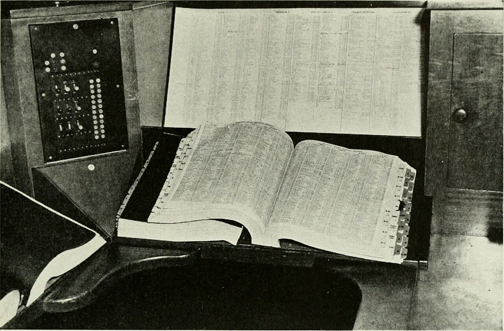

# Basic sort and search

*Two ways to find an item: linear search scans every element until it matches; binary search halves a SORTED list each step, finding one of a million in about 20 looks. Plus sorting ascending, descending, and by a key in Python and Java — and why binary search on unsorted data fails silently.*

> Every app you'll ever test spends half its life doing two things: **putting data in order** and
> **finding one item in a pile**. There are two fundamentally different ways to find something. The
> obvious one — start at the front, check every item until you hit it — is **linear search**, and it's
> fine until the pile gets big. The clever one — **binary search** — needs the pile *sorted* first,
> and then finds any item in a million by looking at just ~20 of them. That "sorted first" condition
> is the whole deal: sorting is the price you pay once so every later lookup is nearly free. Learn
> these two searches and the sort that unlocks the fast one, and you'll understand why some features
> fly and some crawl — and how to predict which, before the users find out.

> **In real life**
>
> Finding "Sharma" in a paper phone book. Nobody starts at page 1 and reads every name — that's
> linear search, and on a 2,000-page book it's a week of your life. Instead you open the book near
> the middle: "M". Sharma comes after M, so you *throw away the entire front half* without reading a
> single name in it. Open the middle of what's left: "T" — too far, discard the back. Each split
> halves what remains, and in about eleven splits you've landed on the page. That's binary search.
> But notice the fine print: it only works because the phone book is **alphabetised**. Hand someone a
> phone book printed in random order and the halving trick is worse than useless — the front half you
> threw away might have held Sharma. Sorted data is what buys you the fast lookup.

## Scan it, or halve it

**Linear search — scan till found.** Start at index 0, compare each item to the target, stop when
it matches (or the list ends). It works on ANY list, sorted or shuffled, and it's the honest
default. Cost in plain words: on average you check half the list, at worst all of it. Ten items?
Instant. Ten million? Every search is a slow crawl through memory — and users feel it.

**Binary search — sorted list, halve each time.** Look at the middle item. Too small? The target
can only live in the right half — discard the left. Too big? Discard the right. Repeat on what
remains. Each step halves the search space, so a million items take about 20 steps, a billion about
30. The plain-words Big-O: linear search grows *with* the data (double the list, double the work);
binary search grows *barely at all* (double the list, ONE extra step). The catch, always: **the
list must already be sorted**, and on unsorted data binary search doesn't error — it just quietly
returns wrong answers.

**Sorting** is how you pay for that speed. Ascending, descending, or by a **key** you choose —
sort users by age, orders by total, names by length. Python gives you `sorted(items)` and
`items.sort(key=...)`; Java gives you `Collections.sort(list)` and `list.sort(comparator)`, plus a
ready-made `Collections.binarySearch(list, target)` that expects — you guessed it — a sorted list.


*Telephone directory in use — Bell Telephone Magazine (1941), Wikimedia Commons, no known copyright restrictions. [Source](https://commons.wikimedia.org/wiki/File:Bell_telephone_magazine_(1941)_(14733166236).jpg)*
- **The alphabetical order = the SORT, paid up front** — Someone sorted this book once, before printing — and that single up-front cost is what makes every search afterwards fast. This is the trade at the heart of the topic: sorting is expensive-ish, done once; searching sorted data is nearly free, done millions of times. Apps do the same — sort (or index) the data once, then serve every lookup cheaply.
- **Opening at the middle = binary search step 1** — You don't open at page 1; you open near the middle and read ONE name. That single comparison tells you which half of the entire book the target lives in — you learn about a thousand pages' worth of information from one look. That's the halving idea: each comparison is chosen to eliminate half of everything that's left.
- **The discarded front half = never even read** — Sharma comes after M, so every page before M is dead to you — hundreds of pages eliminated without reading a single name in them. This only works BECAUSE of the ordering: in a sorted list, one comparison proves where the target CAN'T be. On an unsorted book, throwing away half might throw away the answer — which is exactly how binary search on unsorted data silently fails.
- **The shrinking remainder = halve, and halve again** — After each split, the same trick applies to what's left: 2,000 pages, then 1,000, 500, 250... about eleven splits to reach one page. Doubling the book adds ONE split. That's the plain-words Big-O of binary search: the work grows with the number of halvings (log n), not the number of items — which is why a million items cost about 20 looks, not a million.
- **Reading every name from page 1 = linear search** — The alternative — start at 'Aaron' on page 1 and read until 'Sharma' — is linear search: simple, needs no ordering, and hopeless at scale. On average you'd read half the book. This is what a loop scanning a list does, and it's fine for small data; the pain arrives only when the data grows, which is why slow search bugs hide in small test datasets.

**Binary search for 'raj' in a sorted list — press Play**

1. **Start: sorted names + a target** — [ali, ben, eva, kim, mia, raj, zoe] — seven names, ALREADY SORTED (the non-negotiable precondition), searching for 'raj'. Linear search would check up to seven names one by one. Binary search will need three looks. Keep count.
2. **Look at the MIDDLE: 'kim'** — Middle of indexes 0..6 is index 3: 'kim'. Is 'raj' equal to 'kim'? No. Is it before or after? After — r comes after k. One comparison, and the entire left half [ali, ben, eva] plus 'kim' itself is eliminated without ever being read.
3. **Halve: only [mia, raj, zoe] remain** — The search space is now indexes 4..6. Middle is index 5: 'raj'. Compare... match! Found in 2 comparisons. Worst case for seven items is 3 — because seven halves to three, halves to one. The pattern: each look removes HALF of whatever is left.
4. **The payoff at scale** — Seven items: 3 looks. A thousand: 10. A MILLION: about 20. A billion: about 30. Meanwhile linear search needs up to 7, 1,000, 1,000,000, 1,000,000,000. Double the data and binary search pays ONE extra look; linear search pays double. This gap is the difference between an instant search box and a spinning one.
5. **The fine print: sorted, or silently wrong** — Run the same halving on an UNSORTED list and step 2's logic lies: discarding the left half may discard the target. No crash, no error — the search just reports 'not found' for items that are right there. Sorted-ness is a precondition the algorithm cannot check for you, and testers should treat it as a claim to verify.

Here's all of it running in Python — linear search with a step counter, sorting three ways, then
binary search on the sorted list with its own counter, so you can see the gap:

*Run it — linear search, sorting, binary search (Python)*

```python
names = ["mia", "zoe", "ali", "raj", "kim", "ben", "eva"]
target = "raj"

# LINEAR SEARCH -- scan till found (works on ANY list, sorted or not)
found_at = -1
steps = 0
for i in range(len(names)):
    steps += 1
    if names[i] == target:
        found_at = i
        break
print("LINEAR  found", target, "at index", found_at, "in", steps, "steps")

# SORTING -- ascending, descending, and by a key
print("sorted asc: ", sorted(names))                      # new sorted list
print("sorted desc:", sorted(names, reverse=True))        # descending
users = [("mia", 34), ("ali", 19), ("raj", 27)]
print("by age key: ", sorted(users, key=lambda u: u[1]))  # sort by field

# BINARY SEARCH -- sorted list, halve the remainder each step
ordered = sorted(names)
print("searching in:", ordered)
lo, hi = 0, len(ordered) - 1
steps = 0
while lo <= hi:
    steps += 1
    mid = (lo + hi) // 2
    if ordered[mid] == target:
        print("BINARY  found", target, "at index", mid, "in", steps, "steps")
        break
    elif ordered[mid] < target:
        lo = mid + 1        # target is in the RIGHT half; discard the left
    else:
        hi = mid - 1        # target is in the LEFT half; discard the right

# The payoff in plain numbers
import math
n = 1_000_000
print("At n =", n, "-> linear worst case:", n, "steps",
      "| binary worst case:", math.ceil(math.log2(n)), "steps")
```

The same three ideas in Java — a linear scan, `Collections.sort` / `List.sort(Comparator)` for the
three sort flavours, and the built-in `Collections.binarySearch` (which trusts you to have sorted
first):

*Run it — linear search, sorting, binary search (Java)*

```java
import java.util.*;

public class Main {
    record User(String name, int age) {}   // for the sort-by-key example

    public static void main(String[] args) {
        List<String> names = new ArrayList<>(List.of("mia", "zoe", "ali", "raj", "kim", "ben", "eva"));
        String target = "raj";

        // LINEAR SEARCH -- scan till found
        int foundAt = -1, steps = 0;
        for (int i = 0; i < names.size(); i++) {
            steps++;
            if (names.get(i).equals(target)) { foundAt = i; break; }
        }
        System.out.println("LINEAR  found " + target + " at index " + foundAt + " in " + steps + " steps");

        // SORTING -- ascending, descending, and by a key (Comparator)
        List<String> asc = new ArrayList<>(names);
        Collections.sort(asc);                                // ascending
        System.out.println("sorted asc:  " + asc);
        List<String> desc = new ArrayList<>(names);
        desc.sort(Comparator.reverseOrder());                 // descending
        System.out.println("sorted desc: " + desc);
        List<User> users = new ArrayList<>(List.of(
            new User("mia", 34), new User("ali", 19), new User("raj", 27)));
        users.sort(Comparator.comparingInt(User::age));       // sort BY A KEY
        System.out.println("by age key:  " + users);

        // BINARY SEARCH -- the list MUST already be sorted
        int idx = Collections.binarySearch(asc, target);
        System.out.println("BINARY  found " + target + " at index " + idx + " of " + asc);
        int missing = Collections.binarySearch(asc, "nia");
        System.out.println("BINARY  missing item returns a NEGATIVE code: " + missing);

        // The payoff in plain numbers
        int n = 1_000_000;
        int binarySteps = (int) Math.ceil(Math.log(n) / Math.log(2));
        System.out.println("At n = " + n + " -> linear worst: " + n
            + " steps | binary worst: " + binarySteps + " steps");
    }
}
```

Big-O

> **Tip**
>
> A search-strategy cheat you can carry everywhere: **how often will you look?** Searching once in a
> small pile — just scan; a linear search is simple and honest, and sorting first would cost more than
> it saves. Searching *many times* in the same big pile — pay the sorting cost once (or build a
> map/set, last chapter's tool) and make every lookup nearly free. And when you sort by a key, sort by
> the SAME field you search by — a list sorted by name is still *unsorted* as far as a search by age
> is concerned, and `binarySearch` will lie accordingly.

### Your first time: Your mission: watch the halving beat the scan

- [ ] Count the steps — Run the Python playground and compare the two printed step counts for finding 'raj' — the scan's count vs the halving's. Then read the final line: at a million items it's 1,000,000 steps vs about 20. Same job, different algorithm.
- [ ] Move the target, predict the cost — Change `target` to 'zoe' (last alphabetically) and predict both counts before running. Linear search's cost depends on WHERE the item sits; binary search's barely changes. That stability is what O(log n) feels like.
- [ ] Sort three ways — Find the three sort lines: ascending, descending (`reverse=True` / `Comparator.reverseOrder()`), and by a key (`key=lambda u: u[1]` / `Comparator.comparingInt(User::age)`). Change the key to sort users by NAME instead of age and re-run.
- [ ] Break binary search on purpose — In the Python playground, change `ordered = sorted(names)` to `ordered = names` (unsorted!) and re-run. 'raj' is right there in the list — and binary search likely never finds it. No crash. No error. Just a wrong answer. Remember this failure; it's silent.
- [ ] Read the negative number — In the Java playground, `binarySearch` for 'nia' (not in the list) returns a negative code — that's the API's way of saying 'not found, but it would insert here'. Knowing return conventions like this is exactly the kind of thing testers read API docs for.

You've now measured scan vs halve, sorted by three different rules, and watched binary search fail silently on unsorted data — the one failure this topic is famous for.

- **Binary search says 'not found' for an item that is definitely in the list.**
  The list isn't sorted — or isn't sorted by the field you're searching on. Binary search's halving logic is only valid on sorted data; on anything else it discards the half containing the target and reports absence, with no error. Sort first (and in Java, sort with the SAME comparator you pass to binarySearch), then search. If the data changes after sorting, re-sort or keep it sorted on insert.
- **My sort order looks wrong: 'Zoe' comes before 'ali', or '10' comes before '9'.**
  Two classics. Capitals: default string ordering puts all uppercase before all lowercase (Z before a) — sort case-insensitively with `key=str.lower` (Python) or `String.CASE_INSENSITIVE_ORDER` (Java). Numbers-as-strings: '10' sorts before '9' because text compares character by character ('1' beats '9'). Convert to real numbers before sorting, or sort with a numeric key.
- **I sorted the list, but later searches started failing again.**
  Something appended or updated items AFTER the sort, so the list drifted out of order — and binary search resumed lying. Sorted-ness is not a permanent property; it's a state you must maintain. Either re-sort before searching, insert new items at their sorted position, or (often best) stop maintaining order by hand and use a map/set keyed by what you search on.
- **Sorting crashes: TypeError in Python, ClassCastException or comparator error in Java.**
  Mixed or incomparable types — a list holding numbers AND strings can't be ordered (Python 3 refuses), and Java objects without a Comparator don't know how to compare. Fix the data (one type per list) or supply an explicit key/comparator that maps every item to something comparable. If None/null can appear, decide where it sorts and handle it in the key.
- **Search works in the demo but is unusably slow in production.**
  A linear scan meeting real data volume. Scanning is O(n): invisible at 100 items, painful at 100,000, an outage at 10 million. Fix by sorting once and binary-searching, keying a map by the searched field, or letting the database index do it (that's what indexes ARE — presorted lookup structures). And test with production-sized data; a small dataset can't reveal an O(n) problem.

### Where to check

Sort and search run half the UI you'll ever test — and each has signature failure spots:

- **Search boxes and filters** — is the lookup scanning? Type into search with 50 records and it's instant; the question is 10,000. Ask (or measure) how search behaves at production scale, not demo scale.
- **Sortable table columns** — click every sortable header and check the ORDER itself: capitals vs lowercase, 9 vs 10 in text columns, dates as strings ('02/01' vs '10/12'), None/null rows. Sorting bugs are visible right in the data if you actually read it.
- **Anything alphabetised for humans** — contact lists, dropdowns, indexes. Mixed case and accented names (Åsa, Élodie) expose naive default-ordering fast.
- **Features that promise 'fast lookup'** — autocomplete, typeahead, id lookups. These rely on sorted data or indexes; stale or drifted ordering makes them miss items that exist — the silent binary-search failure, in production clothing.
- **Pagination + sorting together** — page 2 of a wrongly-sorted list shows wrong ITEMS, not just wrong order; items can appear twice or vanish across pages.

Tester's habit: **sorted-ness is a claim, and scale is the exposing input.** When a feature depends
on order — fast search, sorted display, pagination — test the order directly (case, numbers-as-text,
nulls), and test the speed with a big dataset. A search that scans works perfectly right up until
the data outgrows it.

### Worked example: the product that existed but could not be found

1. **The report:** "Support keeps getting tickets: the admin SKU lookup says 'no such product' for SKUs that are clearly in the catalogue. It's intermittent — some SKUs are found fine, others never. It started after last month's release."
2. **The tester reproduces it** and notices a pattern in WHICH SKUs fail: recently added ones fail far more often. Old SKUs mostly resolve fine. Intermittent-by-item, not intermittent-by-time — that's a data-shape clue, not a flaky-network clue.
3. **The lookup code reads:** `Collections.binarySearch(skuList, target)` — binary search, for speed, over a list of half a million SKUs. Reasonable. The question a trained eye asks instantly: *who guarantees that list is sorted?*
4. **Git archaeology finds the answer.** Before the release, the catalogue loader sorted the list after loading. During a refactor, new SKUs started being APPENDED to the cached list as products were created — after the sort. The list is sorted for the first 499,000 items and unsorted at the tail.
5. **Now the symptom explains itself.** Binary search's halving assumes order everywhere. Searching for a tail SKU, the middle comparisons steer the search into the sorted region — away from where the item actually sits — and it confidently returns 'not found'. No exception, no log, nothing: the algorithm did exactly what it does, on data that broke its one precondition.
6. **The fix is two-part:** insert new SKUs at their sorted position (or re-sort on append), AND add a regression test that creates a product, then immediately searches for it — the exact flow that was broken. A cheaper design fix also lands later: key the catalogue by a map, deleting the ordering requirement entirely.
7. **The tester's angle.** No error was thrown anywhere, so no monitoring caught it — only a functional test of search-after-create could. And the happy-path suite searched only for long-standing seeded SKUs, which all lived in the sorted region and always passed.
8. **The lesson for a tester.** When code uses binary search (or any 'fast lookup'), sorted-ness is an invisible precondition that nothing enforces — so test the flows that ADD or CHANGE data and then search for it, not just searches of stable seed data. 'Search says missing, but the item exists' is the signature of order that silently drifted; check who sorts, when, and what happens to items added afterwards.

> **Common mistake**
>
> Trusting binary search — or any sorted-data trick — without asking *what keeps the data sorted*.
> The demo works: someone sorted the list once, the search flies, everyone moves on. Then real life
> appends, edits, and deletes, the order quietly rots, and the fast search starts denying that
> existing items exist — with no crash and no error to flag it. If code binary-searches, something
> must own the sorting: sort-on-load plus never-mutate, insert-in-order, or re-sort before search.
> And if nobody wants that job, the honest answers are a linear scan (slow but never wrong) or a
> map keyed by the search field (fast AND order-free). The silent failure mode is the whole reason
> this topic matters to testers.

**Quiz.** A sorted list holds 1,000,000 user ids. Roughly how many comparisons does binary search need to find one, worst case — and linear search?

- [x] About 20 for binary search, up to 1,000,000 for linear — each binary step halves the remaining space, and a million halves to one in about 20 steps, while a scan may touch every element
- [ ] About 500,000 for both, since on average you find things in the middle
- [ ] About 1,000 for binary search — it checks every thousandth item
- [ ] It depends entirely on how fast the computer is

*Binary search eliminates HALF of what remains with every comparison: 1,000,000 -> 500,000 -> 250,000 -> ... -> 1 in about 20 halvings (2 to the 20th is ~1,048,576). Linear search has no such trick — worst case it examines all 1,000,000. The averages answer is right in spirit for LINEAR search (average ~half the list) but binary search doesn't work by averages, it works by halving. Machine speed changes the seconds, never the SHAPE: an O(n) scan doubles its work when data doubles on any hardware, while O(log n) adds one step. That shape is what Big-O describes, and it's why the tester's question about any search feature is 'what happens at production scale?' — a scan that feels instant over the 200-row test dataset is 5,000 times more work at a million rows, and no amount of fast hardware keeps that invisible forever.*

- **Linear search — how it works, and its cost** — Scan from the front, compare each item, stop when found. Works on ANY list, sorted or not. Cost O(n): on average half the list, worst case all of it. Double the data = double the work.
- **Binary search — how it works, and its cost** — On a SORTED list: look at the middle, discard the half that can't hold the target, repeat. Cost O(log n): a million items in ~20 looks. Double the data = ONE extra look.
- **Binary search's one precondition** — The list MUST be sorted (by the same field/comparator you search with). On unsorted data it fails SILENTLY — returns 'not found' for items that exist. No error, no crash.
- **Sorting in Python** — `sorted(items)` returns a new sorted list; `items.sort()` sorts in place. Descending: `reverse=True`. By a key: `sorted(users, key=lambda u: u.age)` or `key=str.lower` for case-insensitive.
- **Sorting in Java** — `Collections.sort(list)` ascending; `list.sort(Comparator.reverseOrder())` descending; by a key: `list.sort(Comparator.comparingInt(User::age))`. Then `Collections.binarySearch(list, target)` — sorted input assumed, negative code = not found.
- **The plain-words Big-O ladder** — O(1) constant (map lookup) beats O(log n) (binary search) beats O(n) (scan) beats O(n log n) (good sort) beats O(n²) (loop-in-loop). The question: if data doubles, what happens to the work?
- **The classic sort-order bugs a tester reads for** — Capitals sort before lowercase (Z before a); numbers-as-strings sort textually ('10' before '9'); dates-as-strings sort wrong; None/null items crash or land oddly. Read the sorted output, don't just see it.

### Challenge

In the Python playground: (1) sort the `users` list descending by age, then by name
length — two different keys, one line each. (2) Make the binary search count comparisons for a
list of 1,000 numbers (`ordered = list(range(1000))`, search for 999) and confirm it's about 10.
(3) Break it deliberately: shuffle the list with `import random; random.shuffle(ordered)` and
search for a value you can SEE in the printout — watch it miss. Finish with one sentence: a search
feature is fast in the demo with 200 records; what two questions do you ask before trusting it at
a million?

### Ask the community

> Sort/search issue: I'm `[searching / sorting]` a list of `[what, roughly how many]` in `[Java/Python]`. Symptom: `[slow at scale / item not found though present / wrong order]`. Is the list sorted, and WHO keeps it sorted? `[sorted on load / maintained on insert / not sure]`. Sort key vs search field: `[same / different / n-a]`. Code line: `[the search or sort call]`.

Most sort/search bugs answer to two questions: is the data ACTUALLY sorted by the field being
searched (binary search lies silently if not), and does the cost fit the scale (a linear scan is
fine small, hopeless big)? State the size, the sort owner, and the symptom, and the diagnosis is
usually one of those two.

- [Python docs — Sorting HOWTO (sorted, key functions, reverse)](https://docs.python.org/3/howto/sorting.html)
- [Java tutorial — Collections algorithms (sort, binarySearch)](https://docs.oracle.com/javase/tutorial/collections/algorithms/)
- [Khan Academy — binary search, step by step](https://www.khanacademy.org/computing/computer-science/algorithms/binary-search/a/binary-search)
- [Big-O cheat sheet — the complexity ladder at a glance](https://www.bigocheatsheet.com/)

🎬 [Binary search in 4 minutes](https://www.youtube.com/watch?v=fDKIpRe8GW4) (4 min)

- Two searches: LINEAR scans every item until it matches (works anywhere, O(n) — cost grows with the data); BINARY halves a SORTED list each step (O(log n) — a million items in ~20 looks).
- Sorting is the price paid once so every later lookup is cheap: Python `sorted`/`.sort(key=)`, Java `Collections.sort`/`list.sort(Comparator)` — ascending, descending, or by any key you choose.
- Binary search's precondition is absolute: sorted, by the SAME field you search. On unsorted data it fails SILENTLY — 'not found' for items that exist, no error anywhere.
- Plain-words Big-O is a prediction tool: if the data doubles, does the work double (scan), quadruple (loop-in-loop), or grow by one step (halving)? That answer tells you what production scale will do to the feature.
- For a tester: scale is the exposing input for scans, and data-that-changes is the exposing input for sorted-data tricks — test search-after-create, read sorted output for case/number/date bugs, and never trust demo-sized datasets.


---
_Source: `packages/curriculum/content/notes/working-with-data/simple-algorithms/basic-sort-and-search.mdx`_
