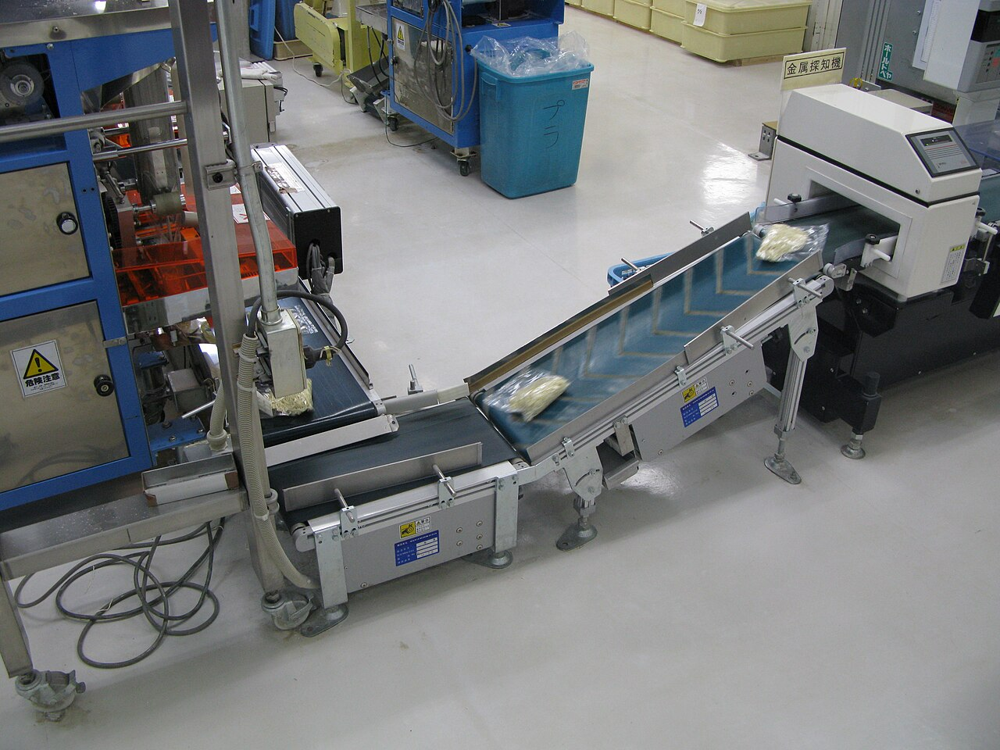

# Looping over data

*Most loops do one of three jobs: FILTER (keep some items), MAP (change each item), or REDUCE (boil everything down to one value — a sum, count, or max). See which job a loop is doing and code becomes readable; each pattern also has a classic failure a tester should know.*

> You already know how to write a loop. Here's the secret that turns "I can loop" into "I can read
> and write real code": almost every loop over a collection is doing one of just **three jobs**.
> It's **filtering** — keeping only the items that pass a test. It's **mapping** — transforming each
> item into a new form. Or it's **reducing** — boiling the whole collection down to one value: a
> total, a count, a maximum. Every report, every search result, every "total: $1,484" at the bottom
> of a page is these three, alone or chained. Learn to name the job a loop is doing and unfamiliar
> code snaps into focus — and so do the places where each job classically goes wrong.

> **In real life**
>
> Picture a factory conveyor belt carrying boxes. Three stations work the line. The **inspector**
> pulls defective boxes off the belt and lets the good ones pass — that's *filter*: fewer boxes come
> out than went in, but each survivor is untouched. The **stamping machine** presses a label onto
> every single box that passes — that's *map*: the same number of boxes come out, each one changed.
> And at the end of the line stands a worker with a **tally counter**, clicking once per box and
> keeping a running total on a clipboard — that's *reduce*: no boxes come out at all, just one
> number that summarises everything that rolled past. Same belt, three different jobs — and every
> loop you'll ever read is one of these stations.

## The three jobs, side by side

All three walk the collection item by item. The difference is what they *produce*:

**Filter — keep some.** In: a collection. Out: a *smaller* (or equal) collection of the items that
passed a yes/no test. "Orders of 100 or more", "users who are active", "lines that aren't blank".
The shape of each item is unchanged; only membership changes.

**Map (transform) — change each.** In: a collection. Out: a collection of *the same size*, where
every item has been transformed. "Each price with tax added", "each name uppercased", "each row
turned into a summary string". Membership is unchanged; the shape of each item changes.

**Reduce (accumulate) — boil down to one.** In: a collection. Out: a *single value* built up in an
**accumulator** as the loop runs — a sum, a count, a max, a joined string. This is the pattern
behind every total, average, and "best of" you've ever seen on a screen.


*Noodle packing line — Wikimedia Commons, CC BY 2.0. [Source](https://commons.wikimedia.org/wiki/File:Ramen_Packets_(2023713571).jpg)*
- **A packet on the belt = one ELEMENT** — Each clear packet riding the belt is a single item in your collection — one order, one row from a file, one result from an API. A loop's whole job is to visit these one at a time. The belt doesn't care what's in each packet; it just makes sure every one gets carried past the machines in turn, exactly the way a `for` loop hands you each element in order.
- **The belt itself = the LOOP** — The moving belt IS the loop: it guarantees every packet passes each station exactly once, in order, and then stops when there are no more. Whatever a station DOES to each packet — check it, change it, count it — the belt's role is unchanged: deliver every element to the work, one by one. Filter, map and reduce are all just different jobs done on this same belt.
- **The metal detector = a per-item CHECK (filter)** — That unit on the right (labelled 'metal detector') inspects every packet and rejects the bad ones — a FILTER: one yes/no question per item, keep the passes, drop the fails. In code it's a loop with an `if` that appends only the items that pass. The classic filter bug is in the question itself — `over 100` vs `100 or more` decides the fate of the item sitting exactly on the boundary.
- **The packing machine = the SOURCE** — At the far end, the packer produces the stream of packets — your input collection, wherever it comes from: a database query, a file, a list you built. Everything downstream just processes what arrives. A tester's first question here is what the source can emit that's unusual — an empty run (no packets at all), one packet, or a malformed one — because that's what the belt will faithfully carry into the code that assumed a normal batch.
- **One packet at one station = one ITERATION** — A single packet being worked on by a single machine is one pass of the loop body. Change the machine's job and you change the pattern with the SAME belt: reject-or-keep is filter, stamp-every-one (price with tax, uppercase) is map, keep-a-running-total-on-a-clipboard is reduce. Recognising which of the three a loop is doing is how you read — and test — data-processing code at a glance.

**One order list through all three jobs — press Play**

1. **The input: seven order amounts** — [120, 8, 250, 42, 999, 5, 60] — a plain list of numbers, like every list of anything you'll ever process. The question decides the pattern: keep some? change each? or boil down to one number?
2. **FILTER: keep the big orders** — Question: 'is this order 100 or more?' Each item answers yes or no; the yeses go into a new list: [120, 250, 999]. Seven in, three out, none of them changed. Watch the boundary: an order of exactly 100 lives or dies on whether the code says strictly-greater or greater-or-equal.
3. **MAP: add tax to every order** — Every amount is transformed: multiplied by 1.1 and rounded. Seven in, seven out — [132.0, 8.8, 275.0, ...] — same items, new form. Nothing is dropped; nothing is summarised. The output list lines up one-to-one with the input.
4. **REDUCE: total, count, and max** — One value out. An accumulator starts BEFORE the loop (total = 0, count = 0, biggest = the first item) and updates once per item. After the last item: total 1484, count 7, max 999. The starting value is part of the logic — start the max at 0 instead of the first item and all-negative data breaks it.
5. **Chain them: real questions need all three** — 'Total with-tax value of the big orders' = filter (keep 100+), then map (add tax), then reduce (sum). Real code is these three jobs composed — as separate loops while learning, as comprehensions and streams once the jobs are second nature.

Here are all three jobs on the same list in Python — first as honest beginner loops, then in the
compact idioms you'll meet in real codebases:

*Run it — filter, map, reduce (Python)*

```python
prices = [120, 8, 250, 42, 999, 5, 60]

# FILTER -- keep some: only orders of 100 or more
big = []
for p in prices:
    if p >= 100:              # the yes/no test (watch the boundary!)
        big.append(p)
print("FILTER  big orders:", big)

# MAP -- change each: add 10% tax to every price
with_tax = []
for p in prices:
    with_tax.append(round(p * 1.1, 2))
print("MAP     with tax:  ", with_tax)

# REDUCE -- boil down to ONE value: total, count, max
total = 0                     # accumulator for a sum starts at 0
count = 0                     # accumulator for a count starts at 0
biggest = prices[0]           # accumulator for a max starts at the FIRST ITEM
for p in prices:
    total += p
    count += 1
    if p > biggest:
        biggest = p
print("REDUCE  total:", total, "| count:", count, "| max:", biggest)

# The same three jobs, the compact Python way (same logic, less ceremony)
print("compact filter:", [p for p in prices if p >= 100])
print("compact map:   ", [round(p * 1.1, 2) for p in prices])
print("compact reduce:", sum(prices), "/", len(prices), "/", max(prices))

# Chained: total with-tax value of the big orders (filter -> map -> reduce)
print("chained:", round(sum(p * 1.1 for p in prices if p >= 100), 2))
```

The same three jobs in Java — beginner loops first, then the same logic as a stream pipeline,
which is Java's version of the compact form:

*Run it — filter, map, reduce (Java)*

```java
import java.util.ArrayList;
import java.util.List;

public class Main {
    public static void main(String[] args) {
        List<Integer> prices = List.of(120, 8, 250, 42, 999, 5, 60);

        // FILTER -- keep some: only orders of 100 or more
        List<Integer> big = new ArrayList<>();
        for (int p : prices) {
            if (p >= 100) {           // the yes/no test (watch the boundary!)
                big.add(p);
            }
        }
        System.out.println("FILTER  big orders: " + big);

        // MAP -- change each: add 10% tax to every price
        List<Double> withTax = new ArrayList<>();
        for (int p : prices) {
            withTax.add(Math.round(p * 110) / 100.0);
        }
        System.out.println("MAP     with tax:   " + withTax);

        // REDUCE -- boil down to ONE value: total, count, max
        int total = 0;                 // sum accumulator starts at 0
        int count = 0;                 // count accumulator starts at 0
        int biggest = prices.get(0);   // max accumulator starts at the FIRST ITEM
        for (int p : prices) {
            total += p;
            count++;
            if (p > biggest) biggest = p;
        }
        System.out.println("REDUCE  total: " + total + " | count: " + count + " | max: " + biggest);

        // The same jobs as a stream pipeline -- Java's compact form
        System.out.println("stream filter: " + prices.stream().filter(p -> p >= 100).toList());
        System.out.println("stream map:    " + prices.stream().map(p -> Math.round(p * 110) / 100.0).toList());
        System.out.println("stream reduce: " + prices.stream().mapToInt(Integer::intValue).sum());
    }
}
```

accumulator

> **Tip**
>
> Before writing any loop, say the job out loud: "this is a **filter**", "this is a **map**", "this
> is a **reduce**". It sounds trivial; it isn't. Naming the job tells you the shape of the answer
> before you code (smaller list? same-size list? single value?), which accumulator you need and
> where it starts, and what to test (the boundary for a filter, every-item coverage for a map, the
> empty and all-negative cases for a reduce). And when one loop is doing two or three jobs at once
> and turning to soup — split it into two loops, one job each. Clarity beats cleverness, and you can
> merge them again later when both work.

### Your first time: Your mission: run all three jobs, then bend them

- [ ] Predict, then run — Before running the Python playground, predict the three REDUCE outputs (total, count, max) by hand from [120, 8, 250, 42, 999, 5, 60]. Run and check. Hand-predicting reduce outputs is exactly how you'll verify totals as a tester.
- [ ] Move the filter boundary — Change `p >= 100` to `p > 100` and re-run. Nothing changes! No order is exactly 100 — your data can't tell the two conditions apart. Now add 100 to the list and re-run both versions: THAT item's fate flips. A boundary test needs a boundary value.
- [ ] Break the max accumulator — In the REDUCE block, change `biggest = prices[0]` to `biggest = 0` — still works. Now make all the prices negative and re-run: max reports 0, a number that isn't even in the list. That's the classic accumulator-start bug, found by all-negative data.
- [ ] Read the compact forms — Match each comprehension / stream line to the loop above it — same filter test, same transform, same accumulation. The compact forms aren't new logic, just new packaging. Being able to translate both directions is the skill.
- [ ] Chain the jobs — Read the final 'chained' line in Python: filter (100 or more), then map (times 1.1), then reduce (sum). Compute it by hand from the big-orders list and confirm the printed answer. Real reporting code is exactly this chain.

You've now run all three patterns, flipped an item's fate at the filter boundary, and broken an accumulator with all-negative data — the three classic checks for loop code.

- **My total / count / max is wrong, but the loop looks fine.**
  Interrogate the accumulator, not the loop. Where does it START (a max starting at 0 fails on all-negative data; a sum starting at the first item double-counts it if the loop also visits the first item)? And is it updated exactly ONCE per item (an update inside the if AND after it applies twice)? Print the accumulator every iteration — the first wrong value names the exact item where it went off the rails.
- **My filter keeps everything, or keeps nothing.**
  The yes/no test is inverted or impossible. Keeping everything usually means the condition is accidentally always true (or you appended outside the if — check the indentation / braces). Keeping nothing means it's always false — often a type mismatch, like comparing the string '100' against the number 100. Print the test's result for the first three items and read what the code actually asked.
- **The filter includes (or drops) exactly the items ON the limit.**
  The boundary is wrong: `>` when the spec meant 'or more' (`>=`), or vice versa. Both versions pass every test that avoids the boundary value, which is why this survives so long. Fix the operator to match the words of the spec, then add a test item EXACTLY on the limit so the two conditions can never be confused again.
- **My map skipped items, or crashed with a modification error.**
  You modified the collection you were looping over — removing or inserting while walking shifts the items under your feet (Python skips silently, Java throws ConcurrentModificationException). The map discipline: read from the input list, append transformed items to a NEW output list. If you truly must remove-in-place, loop over a copy of the list while mutating the original.
- **My reduce crashes on an empty list.**
  Accumulators initialised from the data (`biggest = prices[0]`) explode when there is no data — index error in Python, IndexOutOfBounds in Java, and Python's max([]) raises too. Decide what empty SHOULD mean (return 0? None? raise a clear error?) — that's a spec question — then guard: check for empty before the loop, or supply a default like max(prices, default=0). Empty input is the first thing a tester will send.

### Where to check

Filter, map, reduce run the features you'll test every day — each with a signature failure:

- **Search results and reports** are filters — and the bug is always at the boundary. 'Orders over $100', 'users active in the last 30 days': test the value exactly ON the line, because `>` and `>=` agree everywhere else.
- **Totals, counts, averages, 'best seller'** are reduces — check them against a hand-computed answer on a small dataset, then send the empty collection and all-negative (or all-zero) data at them.
- **Formatted or converted columns** are maps — verify the count out equals the count in (a map never drops rows), and that the transform hit EVERY item, including the last one.
- **Dashboards** chain all three — filter to a date range, map to a currency, reduce to a total. A wrong number could come from any link, so test each stage's output where you can, not just the final figure.
- **Empty inputs everywhere** — every one of the three patterns has an empty-collection story (filter of nothing, map of nothing, reduce of nothing), and reduce's is usually a crash.

Tester's habit: **for loop code, the killer inputs are the boundary value, the empty collection,
and all-negative data.** The first splits `>` from `>=`, the second explodes data-initialised
accumulators, and the third exposes accumulators that started at zero. Three cheap inputs, three
whole families of bugs.

### Worked example: the coldest day that read zero degrees

1. **The report:** "The weather dashboard's 'warmest reading this week' tile showed 0° all through the January cold snap. The sensors were fine — every reading came through. It fixed itself in spring."
2. **The tile is a reduce** — one number boiled down from a week of readings. The tester asks the reduce questions: what's the update rule, and where does the accumulator START?
3. **The code reads:** `warmest = 0; for r in readings: if r > warmest: warmest = r`. Update rule: fine. Starting value: `0` — and there's the bug, hiding in the shortest line.
4. **Walk it with a winter week:** readings [-12, -7, -15, -9]. Is -12 warmer than 0? No. Is -7? No. Every comparison fails, the accumulator never moves, and the tile reports 0° — a temperature that appears nowhere in the data — as the week's warmest.
5. **Why it 'fixed itself' in spring:** the moment any reading beats 0, the bug is invisible. All summer the code is indistinguishable from correct code. It was never fixed; the data just stopped asking the question.
6. **The fix is the accumulator's start:** `warmest = readings[0]` — begin with a value that's actually IN the data, and comparisons take it from there. (And now handle the empty list explicitly, since readings[0] needs at least one reading — a second spec question the 0 had been silently papering over.)
7. **The tester's angle:** no summer test could ever catch this, no matter how many were run — every one passes. The exposing input is a property of the DATA (all values below the starting constant), not an edge of the code. All-negative data is a standard probe for exactly this reason.
8. **The lesson for a tester.** When a screen shows a suspicious 'round' value — 0, empty, the maximum possible — suspect an accumulator that never moved, and ask where it started. For any reduce, the three probes are: a hand-checked small case, the empty collection, and data that is entirely below (or above) any plausible starting constant. 'Worked all summer' is not evidence of correctness; it's evidence the killer input hasn't arrived yet.

> **Common mistake**
>
> Writing one mega-loop that filters, transforms, and accumulates three different things at once —
> then trying to debug it as a unit. When each item can be dropped, changed, and counted in the same
> twelve lines, a wrong total has six possible causes and no way to isolate them. While you're
> learning (and honestly, long after): **one loop, one job.** Filter into a new list; map that into
> another; reduce at the end. It's a few more lines and dramatically fewer places for a bug to hide —
> and each stage's output is now visible and testable on its own. Merge into a pipeline later, once
> each job is proven.

**Quiz.** A loop finds the biggest number in a list and starts with `biggest = 0`. On which input does it silently give a wrong answer, and why?

- [ ] A list with duplicate values, because duplicates confuse the comparison
- [x] An all-negative list like [-12, -7, -15] — no element beats the starting 0, so the accumulator never updates, and the loop reports 0 as the maximum: a value that isn't even in the list. A max accumulator must start at the FIRST ITEM (or negative infinity), not at a constant the data can sit entirely below.
- [ ] A very long list, because the accumulator overflows after enough items
- [ ] An unsorted list, because finding a maximum requires sorting first

*This is the signature reduce bug: a plausible-looking starting value that the data can sit entirely on one side of. With [-12, -7, -15], every comparison against 0 fails, `biggest` never moves, and the code confidently reports a number that appears nowhere in the input — no crash, no error, just a wrong answer (see the worked example, where exactly this shipped in a weather dashboard and 'fixed itself' every spring). The correct initialisations: sum and count start at 0, but max/min must start at the first element of the actual data. Duplicates are harmless to a max; unsorted input is exactly what the loop is FOR; and overflow, while real in Java for astronomically large sums, isn't what breaks here. The tester's takeaway: all-negative (or all-zero, or all-below-the-constant) datasets are a standard probe for reduce code, and a dashboard showing a suspiciously clean 0 is often an accumulator that never moved.*

- **The three loop jobs** — FILTER — keep the items that pass a test (smaller list out). MAP — transform every item (same-size list out). REDUCE — boil all items down to ONE value via an accumulator (total, count, max).
- **How do you recognise a FILTER, and its classic bug?** — A loop with an if that appends passing items to a new list. Classic bug: the boundary — `>` vs `>=` — which only a test value EXACTLY on the limit can expose.
- **How do you recognise a MAP, and its rule?** — Same count out as in, every item transformed. Rule: build a NEW list; don't modify the list you're walking (skipped items in Python, ConcurrentModificationException in Java).
- **How do you recognise a REDUCE?** — An accumulator created before the loop, updated once per item, holding the answer after — total, count, max, joined string. Every dashboard total is one.
- **Accumulator starting values** — Sum: 0. Count: 0. Product: 1. Joined string: empty. Max/min: the FIRST ITEM (never a constant like 0 — all-negative data breaks it).
- **The compact forms of the three jobs** — Python: `[p for p in xs if test]` / `[f(p) for p in xs]` / `sum(xs)`, `max(xs)`. Java: `stream().filter(...)` / `.map(...)` / `.reduce(...)` or `sum()`. Same jobs, less ceremony.
- **The three killer inputs for loop code** — 1) A value exactly ON the filter boundary. 2) The EMPTY collection (reduce often crashes). 3) All-negative data (exposes accumulators started at 0).

### Challenge

In the Python playground, answer three questions about the same `prices` list, naming the pattern
before you write each one: (1) how many orders were under 50? (filter, then count — or a count
with a condition), (2) what would every price look like with a flat $5 discount, never going below
zero? (map — mind the small orders), (3) what's the SECOND biggest order? (reduce — you'll need two
accumulators; decide what they start at). Then send `prices = []` through all your code and fix
whatever breaks. Finish with one sentence: which of the three killer inputs would you try first
against a "total revenue this month" tile, and why?

### Ask the community

> Loop bug: my `[filter/map/reduce — name the job]` over `[what data]` gives `[wrong output]` instead of `[expected]`. Accumulator start (if reduce): `[e.g. 0 / first item]`. Boundary condition (if filter): `[e.g. > vs >=]`. Tested with empty / boundary / all-negative input? `[yes/no]`. Language: `[Java/Python]`.

Naming the job is half the diagnosis: filter bugs live in the boundary condition, map bugs in
modifying-while-looping, reduce bugs in the accumulator's start or a double update. Say which job,
show the condition or the accumulator line, and the bug usually identifies itself.

- [Python docs — functional programming HOWTO (filter, map, reduce)](https://docs.python.org/3/howto/functional.html)
- [Java tutorial — aggregate operations and streams](https://docs.oracle.com/javase/tutorial/collections/streams/)
- [Real Python — list comprehensions (the compact filter+map)](https://realpython.com/list-comprehension-python/)
- [Martin Fowler — the collection pipeline pattern](https://martinfowler.com/articles/collection-pipeline/)

🎬 [Comprehensions — filter and map, the Python way](https://www.youtube.com/watch?v=3dt4OGnU5sM) (19 min)

- Nearly every loop over a collection does one of three jobs: FILTER (keep some), MAP (change each), REDUCE (boil down to one value). Name the job before writing the loop.
- The job tells you the output shape: filter gives a smaller list, map a same-size list, reduce a single value built up in an accumulator.
- Accumulator starts are logic, not boilerplate: sum/count start at 0, but max/min must start at the FIRST ITEM — a constant start silently fails when all the data sits below it.
- Comprehensions (Python) and streams (Java) are the same three jobs in compact form; one loop should do one job while you're learning, and pipelines can come later.
- For a tester: the killer inputs for loop code are the value exactly ON a filter boundary, the empty collection, and all-negative data — three cheap probes that each expose a whole family of bugs.


---
_Source: `packages/curriculum/content/notes/working-with-data/simple-algorithms/looping-over-data.mdx`_
