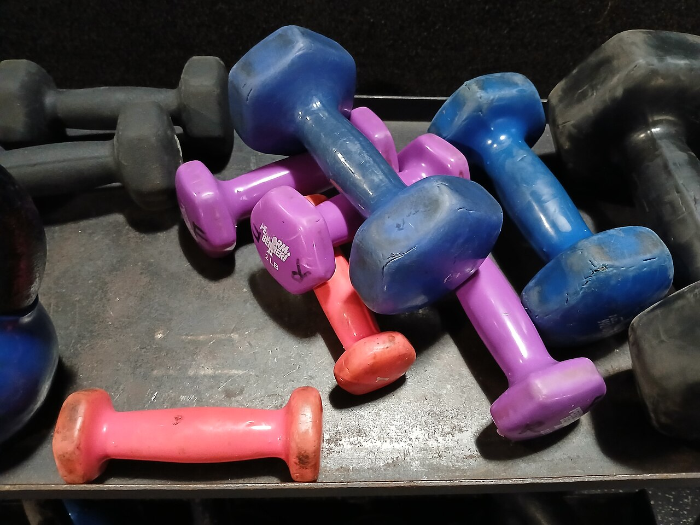

# Practice katas

*Five classic katas with worked solutions in Python and Java — reverse a string, count vowels, FizzBuzz, find the max, is-a-palindrome — plus how to practise deliberately: list the edge cases (empty, one char, all-same) BEFORE coding. Kata practice is edge-case-thinking practice.*

> You've learned loops, the three loop jobs, and sort-and-search. Now comes the part nobody can do
> for you: **reps**. A kata is a small, classic exercise — reverse a string, FizzBuzz, find the max —
> that you solve not because anyone needs a string reversed, but because solving it *builds the
> reflexes* real code demands. Here's the twist that makes katas gold for a tester: every kata comes
> with a built-in family of **edge cases** — the empty input, the single character, the all-same
> list — and the difference between a beginner's solution and a solid one is entirely in how those
> edges are handled. Practising katas deliberately IS practising edge-case thinking. Five classics,
> worked in both languages, and a method for squeezing every drop out of them.

> **In real life**
>
> Katas come from martial arts: short, fixed forms you repeat hundreds of times — not because a real
> fight will ever follow the form, but because the reps burn the movements into your body until they
> happen without thought. Coding katas work the same, and so does the gym: nobody lifts a dumbbell
> because the world needs dumbbells moved up and down. You lift because controlled, repeated, *small*
> movements build strength you then use everywhere else. The key word is controlled — ten sloppy reps
> teach less than three deliberate ones. A kata rushed to 'it prints the right thing' builds nothing;
> the same kata done slowly — edges listed first, solution traced by hand, then varied — builds the
> muscle that finds bugs for the rest of your career.

## Five katas, one method

The method matters more than the katas, so here it is up front. For every kata: **(1) list the edge
cases before writing any code** — empty input, one item, all items the same, the weird-but-legal
input. **(2) Solve it plainly** — a loop and an if, no clever built-ins doing the thinking for you.
**(3) Trace one input by hand**, line by line, like you did with debugging. **(4) Fire your edge
list at it** and watch what breaks. **(5) Vary it** — solve it again a different way, or change the
rules slightly. That loop, repeated, is deliberate practice; anything less is just typing.

The five classics, and what each secretly trains: **reverse a string** (index-walking and building
results), **count vowels** (filtering characters, case traps), **FizzBuzz** (ordering overlapping
conditions — the most bug-shaped kata ever written), **find the max without a built-in** (the
accumulator, and its famous starting-value trap), and **is-a-palindrome** (composing two skills and
deciding what 'equal' even means). None takes more than ten lines. All five have shipped real bugs
in real products — which is exactly why they're the classics.


*Colorful dumbbells of various sizes — Wikimedia Commons, CC BY-SA 4.0. [Source](https://commons.wikimedia.org/wiki/File:Colorful_dumbbells_of_various_sizes.jpg)*
- **The little pink dumbbell = a small exercise, on purpose** — Nobody's first session is the heaviest weight in the gym, and no kata is a real feature. Reverse-a-string is deliberately tiny: small enough to finish, small enough to trace by hand, small enough to redo five different ways. The size is the point — you can't do deliberate reps on a problem that takes a week. Strength built here (loops, accumulators, edge handling) transfers to every real problem later.
- **The '2 LB' label = start LIGHT and rep it** — One perfect FizzBuzz teaches a little; FizzBuzz solved five times — loop-and-if, then with different rules, then in the other language — teaches the PATTERN until it's a reflex. Start light and do many reps, not one heavy lift. The first solve is problem-solving; the reps afterwards are what make it permanent. Coming back to a kata a week later and re-solving it cold is the rep that counts most.
- **The worn, scuffed grips = trace before you run** — These grips are worn because the weights get used — over and over. Your equivalent of good form is tracing a solution by hand: walking one input through the code line by line, predicting the output BEFORE running. Speed-solving katas while sloppy just automates sloppiness. Slow, predicted, verified reps build the mental model; the speed arrives on its own later.
- **The heavier weights = graded difficulty (your log)** — The rack runs from tiny to heavy so you can progress. Log every kata like a lifter logs sessions: the edge cases you listed BEFORE coding — empty input, one character, all-same values, mixed case — and which your first attempt failed. After ten katas you'll notice it's nearly the SAME list every time. That reusable list IS edge-case thinking, trained — and it's what makes you reach for a heavier problem next.
- **A whole pile of them = the mess of failed attempts** — A used rack is a scuffed, mismatched pile — like your attempts. Your first reverse-a-string will be off by one; your first max will fail on all-negatives; your first palindrome will choke on capitals. Perfect — a kata that never breaks teaches nothing. Each failure here is one you'll RECOGNISE later in production code, which is precisely the tester's edge: you've seen this bug before, in the gym.

**One kata, done deliberately — press Play**

1. **Read the kata, then STOP** — Kata: 'return the largest number in a list, no built-ins'. Don't code yet. The urge to type immediately is exactly what deliberate practice resists — the first move is thinking, not typing.
2. **List the edges BEFORE coding** — What inputs could make this hard? The empty list (largest of nothing = what?). One element. All elements the same. All NEGATIVE numbers. Duplicated maximums. This list, written before any code exists, is the tester's half of the kata — and it will judge your solution in step 4.
3. **Solve it plainly** — An accumulator: start `biggest` at the FIRST element (the edge list already warned you: not at 0, all-negatives would break it), loop the rest, replace when bigger, return. Ten lines, no cleverness. Plain solutions are traceable; traceable solutions are debuggable.
4. **Fire the edges at it** — [3,1,2] fine. [7] fine. [5,5,5] fine. [-12,-7,-15] fine — because of the starting value. [] ... crash! `nums[0]` of an empty list explodes. Now DECIDE: return None? Raise a clear error? That's a spec decision, and noticing it is the skill. Fix, and re-fire the whole list.
5. **Vary and repeat** — Now: find the SECOND largest (two accumulators). Find the max by a key (longest name). Same kata next week, cold. Variation forces the pattern out of memory and into understanding — and every variation gets its own edge list first. That loop, on five katas, beats a hundred passive tutorials.

All five katas in Python — plain, traceable solutions, each followed by the edge cases that judge
it:

*Run it — the five katas, with edge checks (Python)*

```python
# KATA 1 -- reverse a string (no slicing tricks, no reversed())
def reverse_string(s):
    result = ""
    for ch in s:
        result = ch + result          # prepend: 't' then 'e'+'t' then 's'+'et'...
    return result

# KATA 2 -- count the vowels
def count_vowels(s):
    count = 0
    for ch in s.lower():              # lowercase FIRST, or 'A' slips through
        if ch in "aeiou":
            count += 1
    return count

# KATA 3 -- FizzBuzz: multiples of 3 -> Fizz, of 5 -> Buzz, of both -> FizzBuzz
def fizzbuzz(n):
    if n % 15 == 0:                   # MOST SPECIFIC RULE FIRST (3 and 5)
        return "FizzBuzz"
    if n % 3 == 0:
        return "Fizz"
    if n % 5 == 0:
        return "Buzz"
    return str(n)

# KATA 4 -- find the max WITHOUT max()
def find_max(nums):
    if len(nums) == 0:
        return None                   # the empty list is a DECISION, not an accident
    biggest = nums[0]                 # start at the first item, never at 0
    for n in nums:
        if n > biggest:
            biggest = n
    return biggest

# KATA 5 -- is it a palindrome? (reads the same reversed)
def is_palindrome(s):
    cleaned = s.lower().replace(" ", "")     # decide what counts as 'the same'
    return cleaned == reverse_string(cleaned)

print("reverse 'tester':", reverse_string("tester"))
print("vowels in 'Quality Assurance':", count_vowels("Quality Assurance"))
print("fizzbuzz 1..15:", " ".join(fizzbuzz(i) for i in range(1, 16)))
print("max of [-12, -7, -15]:", find_max([-12, -7, -15]))
print("palindrome 'level'?", is_palindrome("level"))
print("palindrome 'never odd or even'?", is_palindrome("never odd or even"))

# THE EDGE GAUNTLET -- empty, one char, all-same
print("edges -> reverse('')  :", repr(reverse_string("")))
print("edges -> vowels('')   :", count_vowels(""))
print("edges -> max([])      :", find_max([]))
print("edges -> max([5,5,5]) :", find_max([5, 5, 5]))
print("edges -> palindrome('a')?", is_palindrome("a"))
```

The same five in Java — notice they're the *same* solutions wearing Java syntax; the patterns
(build-a-result, filter-count, ordered conditions, accumulator, normalise-then-compare) don't
change between languages:

*Run it — the five katas, with edge checks (Java)*

```java
public class Main {
    // KATA 1 -- reverse a string
    static String reverseString(String s) {
        String result = "";
        for (int i = 0; i < s.length(); i++) {
            result = s.charAt(i) + result;      // prepend each character
        }
        return result;
    }

    // KATA 2 -- count the vowels
    static int countVowels(String s) {
        int count = 0;
        for (char ch : s.toLowerCase().toCharArray()) {   // lowercase FIRST
            if ("aeiou".indexOf(ch) >= 0) count++;
        }
        return count;
    }

    // KATA 3 -- FizzBuzz: most specific rule first
    static String fizzbuzz(int n) {
        if (n % 15 == 0) return "FizzBuzz";
        if (n % 3 == 0) return "Fizz";
        if (n % 5 == 0) return "Buzz";
        return String.valueOf(n);
    }

    // KATA 4 -- max without a built-in (null = 'no answer' for empty input)
    static Integer findMax(int[] nums) {
        if (nums.length == 0) return null;
        int biggest = nums[0];                  // first item, never 0
        for (int n : nums) {
            if (n > biggest) biggest = n;
        }
        return biggest;
    }

    // KATA 5 -- palindrome: normalise, then compare with the reverse
    static boolean isPalindrome(String s) {
        String cleaned = s.toLowerCase().replace(" ", "");
        return cleaned.equals(reverseString(cleaned));
    }

    public static void main(String[] args) {
        System.out.println("reverse 'tester': " + reverseString("tester"));
        System.out.println("vowels in 'Quality Assurance': " + countVowels("Quality Assurance"));
        StringBuilder fb = new StringBuilder();
        for (int i = 1; i <= 15; i++) fb.append(fizzbuzz(i)).append(" ");
        System.out.println("fizzbuzz 1..15: " + fb.toString().trim());
        System.out.println("max of [-12, -7, -15]: " + findMax(new int[]{-12, -7, -15}));
        System.out.println("palindrome 'level'? " + isPalindrome("level"));
        System.out.println("palindrome 'never odd or even'? " + isPalindrome("never odd or even"));

        // THE EDGE GAUNTLET -- empty, one char, all-same
        System.out.println("edges -> reverse('')  : '" + reverseString("") + "'");
        System.out.println("edges -> vowels('')   : " + countVowels(""));
        System.out.println("edges -> max(empty)   : " + findMax(new int[]{}));
        System.out.println("edges -> max(5,5,5)   : " + findMax(new int[]{5, 5, 5}));
        System.out.println("edges -> palindrome('a')? " + isPalindrome("a"));
    }
}
```

kata

> **Tip**
>
> Write the edge list BEFORE the solution — physically, in a comment above the function. For string
> katas the list is nearly always: empty string, one character, all-same characters, mixed case,
> spaces. For list katas: empty list, one element, all-equal, all-negative, duplicates of the
> extreme. Then code, then fire the list. Two payoffs: your solutions handle edges because the edges
> were in view while you wrote — and after five katas you'll catch yourself asking 'what's the empty
> case?' about *features at work*. That transfer is the entire reason a tester does katas.

### Your first time: Your mission: one full deliberate rep

- [ ] Trace reverse by hand first — Before running, trace reverse_string('abc') on paper: result='' -> 'a' -> 'ba' -> 'cba'. Predict the output, THEN run. The prepend trick (new char + old result) is worth understanding, not just observing.
- [ ] Run the edge gauntlet and read it — Run either playground and study the edge section: reverse('') returns '' (not a crash), max of empty returns None/null (a decision!), max of [5,5,5] is 5, one char IS a palindrome. Every line is a spec decision someone made.
- [ ] Break FizzBuzz the classic way — Move the `% 15` check BELOW the `% 3` check and re-run. Now 15 prints 'Fizz' — first match wins, and the specific rule never gets a turn. This exact ordering bug ships in real tiered-pricing and notification code; you've now seen it in the gym first.
- [ ] Break the max the classic way — Change `biggest = nums[0]` to `biggest = 0` and re-run. The all-negative list now reports 0 — a number not in the list. You met this in the loops note; here it is again, because it's the most re-shipped accumulator bug in existence.
- [ ] Do one variation cold — Pick one: count CONSONANTS instead of vowels; FizzBuzz with 3 -> 'Fizz' and 7 -> 'Bang'; reverse the WORDS of a sentence, not the letters. Edge list first, then code. That's a complete deliberate rep — log what broke.

You've now done a full deliberate rep: traced by hand, run the edges, re-created two famous bugs on purpose, and solved a variation. That's what a practice session should look like.

- **My reversed string is missing the first character, or came back in the original order.**
  Off-by-one or wrong build direction. If you looped with indexes, check the range covers index 0 AND the last index (in Java, `i = s.length() - 1; i >= 0` for a backward walk — the minus one matters). If the string came back unreversed, you appended instead of prepended: `result = result + ch` keeps order, `result = ch + result` reverses. Trace 'ab' by hand — two characters expose both mistakes.
- **My vowel count is too low on real text.**
  Case. 'A' is not in 'aeiou', so every capitalised vowel slips through. Normalise once at the top (`s.lower()` / `s.toLowerCase()`) and count on the normalised text. The test that catches it: an ALL-CAPS input, which should count the same as its lowercase twin. (Accented vowels like é are a spec question — ask, don't assume.)
- **FizzBuzz prints 'Fizz' for 15 instead of 'FizzBuzz'.**
  Condition order. 15 is divisible by 3, so if the `% 3` check runs first it matches and returns — the `% 15` rule never gets asked. With overlapping conditions, the MOST SPECIFIC must come first (15, then 3, then 5). This is a first-match-wins bug, and its production twin lives in every tiered-discount and notification-rules feature you'll ever test.
- **My find-max returns 0 for a list of negative numbers, or crashes on an empty list.**
  The two accumulator classics. Returning 0: you started `biggest` at 0 instead of the first element, and nothing negative ever beats 0 — start at `nums[0]`. Crashing on empty: `nums[0]` needs at least one element, so decide what empty MEANS (None/null? an error with a clear message?) and guard for it explicitly before the loop. Both fixes were sitting in the pre-written edge list.
- **My palindrome check fails on 'Level' or 'never odd or even'.**
  You compared the raw string, but 'same forwards and backwards' quietly assumed case and spaces don't count. Normalise before comparing: lowercase, strip spaces (and decide about punctuation — 'A man, a plan...' is the classic stretch case). Notice this is a SPEC gap, not just a code bug: the kata never said whether 'Level' qualifies. Real features have the same gap, and the tester is the one who asks.

### Where to check

The katas are toys; their bug patterns ship in production constantly. Where each one resurfaces:

- **FizzBuzz = every overlapping-rules feature** — tiered discounts, loyalty levels, notification rules ('daily digest AND mention alert'). Test the value where rules COLLIDE (the 15), because first-match-wins code silently eats the combined case.
- **Find-the-max = every dashboard superlative** — 'top seller', 'peak load', 'coldest day'. Send all-negative or all-zero data and the empty period; accumulator starting values are the bug you're fishing for.
- **Count-vowels = every counter and validator** — character counts, password rules ('at least one digit'), word counts. Mixed case, empty input, and 'weird but legal' characters are the probes.
- **Reverse/palindrome = every normalise-then-compare** — deduplicating names, matching emails case-insensitively, comparing user input to stored values. The bug is comparing RAW when the spec meant NORMALISED, or vice versa — ask which 'equal' the feature means.
- **The empty input, everywhere** — every kata had an empty case, and so does every feature: zero search results, an empty cart, a report over a period with no data. It's the first probe on any new screen.

Tester's habit: **the kata edge list IS the feature edge list.** Empty, one, all-same, all-negative,
mixed case, the colliding value — you built this list in the gym, on code small enough to fully
understand. Production features are bigger, but the list barely changes.

### Worked example: the day-15 digest that never arrived

1. **The report:** "Users who get both reminder types complain the combined weekly digest never arrives. Plain email reminders work. Plain SMS reminders work. Only the 'both' case fails — they get a lone email instead of the digest."
2. **The rules, from the spec:** every 3rd day, send an email reminder; every 5th day, send an SMS; when a day qualifies for BOTH (every 15th), send a single combined digest instead. Read that again slowly — it is FizzBuzz wearing a business-casual shirt.
3. **The tester recognises the shape** and goes straight for the colliding value: day 15. Sure enough, day 15 sends a plain email. Days 3, 6, 9, 12 fine; days 5, 10 fine. Only the overlap misbehaves — the exact signature of a condition-order bug.
4. **The code confirms it:** `if day % 3 == 0: send_email(); elif day % 5 == 0: send_sms(); elif day % 15 == 0: send_digest()`. Day 15 is divisible by 3, the first branch matches, first-match-wins, and the digest branch is unreachable — dead code that every code path politely walks around.
5. **The fix is a reorder:** the most specific condition (`% 15`) must be checked FIRST, then 3, then 5. One line moved. The kata version of this fix is moving the FizzBuzz check above Fizz — literally the same edit.
6. **Why testing missed it:** the test plan checked 'email works' (day 3), 'SMS works' (day 5)... and never scheduled a case where both rules fired at once. Each rule passed alone; the collision was the only untested path, and the only broken one.
7. **The tester's angle:** whoever had done FizzBuzz deliberately — and broken it deliberately, the way you just did in the playground — would have asked for the day-15 case at test-design time, before a line of code existed. The kata didn't teach string formatting; it taught *where overlapping-rule features break*.
8. **The lesson for a tester.** Katas are rehearsals for bug patterns: the ordering bug (FizzBuzz), the accumulator start (find-max), the normalisation gap (palindrome), the empty input (all of them). When a feature's spec contains overlapping rules, your first designed test is the value where they collide — you know this because you've broken it in the gym, cheaply, where bugs cost nothing.

> **Common mistake**
>
> Practising for output instead of for edges — grinding through katas as fast as possible, calling
> each one 'done' the moment the happy-path input prints correctly, then reaching for the next.
> That's ten sloppy reps: it feels productive and builds almost nothing, because the learning in a
> kata lives almost entirely in the edge cases and the variations, not in the first green run. A
> solution that reverses 'tester' but was never fed '' or 'a'; a max that was never given
> all-negatives; a FizzBuzz never asked about 15 — these are incomplete reps. One kata done
> deliberately (edges listed first, traced by hand, gauntlet fired, one variation solved) is worth
> ten done for speed — and the habit it builds is the one you'll be paid for.

**Quiz.** A FizzBuzz solution checks `n % 3` first, then `n % 5`, then `n % 15`. What does it print for 15, and what's the general rule this breaks?

- [ ] 'FizzBuzz' — the % 15 check still runs eventually
- [x] 'Fizz' — 15 is divisible by 3, so the first branch matches and returns, and the % 15 branch is unreachable. The rule: with OVERLAPPING conditions, the most specific one must be checked first, because first-match-wins silently swallows the combined case.
- [ ] 'Buzz' — 5 takes priority over 3 in the modulo operator
- [ ] It crashes, because 15 matches more than one condition

*Once `n % 3 == 0` matches (and 15 is divisible by 3), that branch returns and nothing after it runs — an if/elif chain stops at the FIRST true condition, so the % 15 branch can never be reached by any input: every multiple of 15 is captured earlier by the % 3 branch. Nothing crashes and no operator has 'priority'; the logic simply never asks the later question. The general rule: when conditions OVERLAP, order them most-specific first (15 before 3 and 5), because first-match-wins otherwise eats the combined case silently. The production twin appears in tiered discounts, loyalty levels, and notification rules (see the worked example, where day 15 sent a lone email instead of the digest). The tester's takeaway: whenever a spec has overlapping rules, the value that satisfies SEVERAL rules at once is the first test you design — each rule passing alone proves nothing about the collision.*

- **What is a kata, and what makes practice 'deliberate'?** — A small classic exercise done for the reps, not the output. Deliberate = edge list BEFORE coding, solve plainly, trace by hand, fire the edges, then vary and re-solve. Racing to the happy-path output builds ~nothing.
- **The universal edge list for string/list katas** — Strings: empty, one char, all-same chars, mixed case, spaces. Lists: empty, one element, all-equal, all-negative, duplicate extremes. Nearly the same list judges every kata — and every production feature.
- **FizzBuzz's famous bug + the rule it teaches** — Checking % 3 before % 15 makes 15 print 'Fizz' — first match wins, the combined branch is unreachable. Rule: overlapping conditions go MOST SPECIFIC FIRST. Production twin: tiered pricing, notification rules.
- **Find-the-max's two famous bugs** — 1) Starting the accumulator at 0 instead of the first element — all-negative data then reports 0, a value not in the list. 2) Not deciding what the EMPTY list returns (crash vs None/null vs error) — that's a spec decision.
- **Why palindrome is a SPEC exercise as much as a code one** — 'Reads the same reversed' hides decisions: does case count? Spaces? Punctuation? 'Level' passes only after lowercasing; 'never odd or even' only after stripping spaces. Normalise-then-compare — and ASK which 'equal' is meant.
- **Reverse-a-string: the two beginner mistakes** — Appending instead of prepending (string comes back unreversed), and off-by-one in an index walk (first or last char missing). The two-character input 'ab' exposes both — trace it by hand.
- **Why does a TESTER practise katas?** — Each kata is a rehearsal of a real bug family — ordering, accumulator starts, normalisation, empty inputs — on code small enough to fully understand. The edge-case reflex built in the gym transfers straight to test design at work.

### Challenge

Three variations, edge list first for each: (1) reverse the WORDS of a sentence ('hello brave
world' -> 'world brave hello') — what are the edges when the input is one word, or has double
spaces? (2) FizzBuzz with new rules — 3 -> 'Fizz', 7 -> 'Bang', both -> 'FizzBang' — and write down
which input you must test before you run anything. (3) find the SECOND largest without built-ins —
two accumulators; decide what [5, 5] and a one-element list should return before coding. Then
re-solve one of today's five cold, in the other language. Finish with one sentence: which edge case
do you now check by reflex that you didn't a month ago?

### Ask the community

> Kata check: I solved `[which kata]` in `[Java/Python]`. My edge list before coding: `[list it]`. Edges that broke my first attempt: `[which + how]`. My open spec question: `[e.g. does case count for palindromes? what should max([]) return?]`. Code: `[paste the function]`.

Share the edge list, not just the code — the list is the half of the kata that builds tester
muscle. If an edge broke your attempt, say which and how you fixed it; if none did, that usually
means the list was too short, and the community will happily supply the input that breaks it.

- [CodingDojo — the classic kata catalogue](https://codingdojo.org/kata/)
- [Codewars — thousands of katas, graded by difficulty](https://www.codewars.com/)
- [Exercism — free katas with human mentoring, Java and Python tracks](https://exercism.org/)
- [Coding Horror — why FizzBuzz became THE interview filter](https://blog.codinghorror.com/why-cant-programmers-program/)

🎬 [FizzBuzz: one simple interview question — Tom Scott](https://www.youtube.com/watch?v=QPZ0pIK_wsc) (7 min)

- A kata is a small classic exercise done for the reps: reverse a string, count vowels, FizzBuzz, find the max, is-a-palindrome — each under ten lines, each training a reusable pattern.
- Deliberate practice is a loop: list the edge cases BEFORE coding, solve plainly, trace an input by hand, fire the edges, then vary and re-solve. Racing to the happy-path output is the rep that doesn't count.
- The edge list barely changes between katas — empty, one, all-same, all-negative, mixed case, the colliding value — and it barely changes for production features either. That transfer is the point.
- Each kata rehearses a real shipped-bug family: FizzBuzz = overlapping-condition order (most specific first), find-max = accumulator starts and the empty-input decision, palindrome = the normalise-then-compare spec gap.
- For a tester: katas are edge-case training with free bugs — break each one on purpose in the gym, and you'll recognise the same break at work, at test-design time, before the code exists.


---
_Source: `packages/curriculum/content/notes/working-with-data/simple-algorithms/practice-katas.mdx`_
