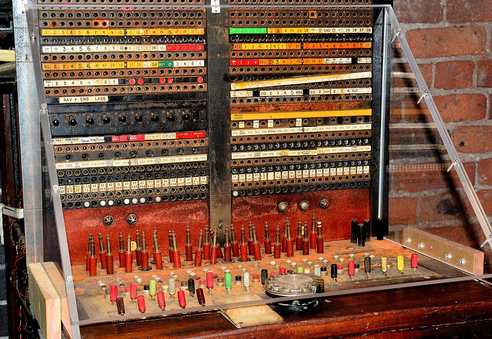

# ERP, CRM & enterprise

*A century-old switchboard connected hundreds of lines through hand-plugged cables, and one wrong plug sent a call to the wrong office. Enterprise software - ERP, CRM, the systems running a whole business - has that same web of connections, just running silently in code.*

> A bug in a standalone mobile app affects that app. A bug in an ERP system's inventory module can
> silently throw off procurement, shipping, invoicing, and financial reporting all at once - because
> enterprise software's entire point is that everything connects to everything else, which means a small
> error in one place rarely stays contained to just that one place.

> **In real life**
>
> A century-old telephone switchboard connected hundreds of individual lines through cables plugged in by
> hand, one connection at a time - and a single wrong plug sent a call to the wrong office entirely,
> invisible to the caller until something clearly went wrong on the other end. Enterprise software runs on
> the exact same principle, just without visible cables: an ERP or CRM system exists specifically to
> connect sales, inventory, finance, HR, and procurement into one working whole, and a bug in how two of
> those modules pass data to each other can misroute information just as silently as a wrong plug on that
> old switchboard - and just as consequentially for whoever's on the other end of the connection.

**ERP and CRM testing**: ERP (Enterprise Resource Planning) and CRM (Customer Relationship Management) testing is QA work focused on large, highly-integrated business software - systems like SAP, Oracle, Salesforce, or Microsoft Dynamics - where the central testing challenge is verifying correct behavior across module boundaries and complex configuration, not just within any single feature in isolation.

## Integration testing is the actual center of gravity here

A standalone app's features mostly stand alone; an ERP or CRM's entire value proposition is the
opposite - a sales order created in a CRM module needs to correctly trigger inventory allocation,
which needs to correctly trigger a shipping workflow, which needs to correctly trigger an invoice in the
finance module. Testing any one of those modules in isolation, without verifying what actually happens
at the boundary where it hands off to the next one, misses the exact place where enterprise software
most often actually breaks - a change entirely within the finance module's boundaries can still corrupt
data that sales or inventory depend on downstream.

## Configuration complexity is a testing surface most other domains don't have

Enterprise platforms are typically heavily configurable rather than hard-coded - custom fields, custom
workflows, role-based permissions, and company-specific business rules layered on top of the base
product. Two different companies running the exact same underlying ERP platform can behave in
meaningfully different ways because of configuration differences alone, which means testing this domain
well requires understanding the specific configuration in play, not just the base platform's documented
behavior in the abstract - a test that passes against a vanilla, unconfigured instance can still fail
against a real customer's heavily customized one.

> **Tip**
>
> When testing any single change in an ERP or CRM system, explicitly map out which other modules read
> or depend on the data being touched before testing - the downstream consequence is frequently less
> obvious than the change itself, and mapping it first prevents testing only the immediately visible
> surface.

> **Common mistake**
>
> Testing a configuration change only against a clean, default environment when real production
> instances are heavily customized. A workflow or validation rule that behaves correctly in a vanilla
> test environment can behave completely differently once real custom fields, role permissions, and
> business rules specific to an actual customer are layered on top.


*Vintage telephone switchboard — Mike McBey, CC BY 2.0, via Wikimedia Commons. [Source](https://commons.wikimedia.org/wiki/File:Vintage_telephone_switchboard_(49467795397).jpg)*
- **The rows of red connector plugs** — Each cable a live connection between two separate lines - the direct physical version of an integration point between two enterprise modules, where a wrong connection causes real, often invisible, downstream trouble.
- **The hundreds of labeled jacks above** — An enormous number of possible connections, each one individually labeled and tracked - the same scale of interdependency an ERP or CRM system's module boundaries represent, far beyond what a standalone app needs to manage.
- **The dense grid of numbered sockets** — Configuration at scale - hundreds of specific, trackable settings, much like the custom fields, workflows, and permissions layered onto a real enterprise platform beyond its base, out-of-the-box behavior.
- **The colored routing labels above each row** — A system for tracking which connection goes where, essential at this scale - the same discipline good enterprise testing needs: knowing exactly which downstream modules a given change actually touches before testing it.

**Testing a change in an ERP or CRM system**

1. **Map which modules read or depend on the data being touched** — Before testing anything, identify the actual downstream reach of the change - often wider than the immediately visible feature.
2. **Test the change within its own module first** — Confirm the immediate, local behavior is correct before moving outward.
3. **Test each identified integration boundary explicitly** — Verify the handoff to each downstream module actually behaves as expected, not just that the local change looks right in isolation.
4. **Re-test against realistic configuration, not just a clean default instance** — Custom fields, workflows, and permissions can change behavior meaningfully from the vanilla base case.

*Modeling a cross-module integration check after a sales order (Python)*

```python
sales_order = {"order_id": "SO-4471", "sku": "WIDGET-100", "qty": 5}

inventory = {"WIDGET-100": 50}
finance_invoices = {}

def process_order(order, inventory, invoices):
    sku, qty = order["sku"], order["qty"]
    if inventory.get(sku, 0) < qty:
        return "FAILED - insufficient inventory"
    inventory[sku] -= qty
    invoices[order["order_id"]] = qty * 19.99
    return "OK"

result = process_order(sales_order, inventory, finance_invoices)
print("Order result: " + result)
print("Inventory after: " + str(inventory["WIDGET-100"]))
print("Invoice generated: " + str(finance_invoices.get("SO-4471")))

assert inventory["WIDGET-100"] == 45, "FAIL: inventory module didn't correctly reflect the sale"
assert "SO-4471" in finance_invoices, "FAIL: finance module never received the downstream invoice"
print("PASS: sales -> inventory -> finance integration held correctly")
```

*Modeling a cross-module integration check after a sales order (Java)*

```java
import java.util.*;

public class Main {
    public static void main(String[] args) {
        String sku = "WIDGET-100";
        int qty = 5;

        Map<String, Integer> inventory = new HashMap<>();
        inventory.put(sku, 50);

        Map<String, Double> financeInvoices = new HashMap<>();

        String result;
        if (inventory.getOrDefault(sku, 0) < qty) {
            result = "FAILED - insufficient inventory";
        } else {
            inventory.put(sku, inventory.get(sku) - qty);
            financeInvoices.put("SO-4471", qty * 19.99);
            result = "OK";
        }

        System.out.println("Order result: " + result);
        System.out.println("Inventory after: " + inventory.get(sku));
        System.out.println("Invoice generated: " + financeInvoices.get("SO-4471"));

        if (inventory.get(sku) != 45) {
            throw new AssertionError("FAIL: inventory module didn't correctly reflect the sale");
        }
        if (!financeInvoices.containsKey("SO-4471")) {
            throw new AssertionError("FAIL: finance module never received the downstream invoice");
        }
        System.out.println("PASS: sales -> inventory -> finance integration held correctly");
    }
}
```

### Your first time: Trace one real integration boundary

- [ ] Pick any multi-step business process in a real or example ERP/CRM system — An order-to-cash flow, a lead-to-customer conversion - anything crossing more than one module.
- [ ] Map every module the process touches, in order — Even without deep platform expertise, this can usually be traced from documentation or observed behavior.
- [ ] Identify the exact handoff points between modules — Where does data leave one module and get consumed by the next.
- [ ] Note one thing that could plausibly go wrong at each handoff — Even hypothetically - this is the instinct integration testing in this domain actually depends on.

- **A change tests correctly within its own module but a downstream process fails days later.**
  A classic sign of an untested integration boundary - map every module that reads or depends on the changed data next time, and test each handoff explicitly, not just the local change.
- **A workflow behaves correctly in the test environment but fails for a specific real customer in production.**
  Check for a configuration difference - custom fields, workflow rules, or permissions specific to that customer's instance can change behavior meaningfully from a clean default test environment.
- **Testing an ERP or CRM feature feels overwhelming because of how many other areas it seems to touch.**
  Normal for this domain - explicitly mapping the specific downstream dependencies first, rather than trying to hold the entire system in mind at once, makes the actual testing surface much more manageable.

### Where to check

- Any change to shared or foundational data, mapped for every module reading or depending on it before testing begins.
- Behavior tested against realistic, customer-like configuration, not only a clean default instance.
- [[your-first-90-days/domains-and-specializations/payments-and-fintech-testing]] for a different, similarly high-stakes specialized domain with its own distinct testing demands.
- [[your-first-90-days/domains-and-specializations/picking-a-niche-deliberately]] for weighing this domain's integration-heavy, configuration-heavy nature against other specialization options.
- [[sql-and-databases-for-testers/reading-data/joins-gently]] for the underlying data-relationship skill that understanding cross-module dependencies in ERP/CRM systems draws on directly.

### Worked example: a finance-module change that broke something nobody thought to check

1. A tester verifies a change to how the finance module rounds tax calculations, confirming the new
   rounding behavior is correct within the finance module's own test suite.
2. Two weeks after release, the sales team reports that order confirmation emails are showing totals
   that don't match what finance later invoices for the same orders.
3. Investigation reveals the sales module independently calculates and displays an estimated total using
   its own, separate rounding logic that was never updated alongside the finance module's change - the
   two modules had silently drifted out of sync.
4. The fix isn't just correcting the mismatch, but adding an explicit integration test that compares
   the sales-estimated total against the finance-calculated total for the same order, specifically to
   catch this class of drift going forward.
5. The original finance-module-only test suite genuinely passed the whole time - the bug lived entirely
   in the untested boundary between two modules, not inside either one individually.

**Quiz.** According to this note, what is the actual center of gravity for testing well in ERP and CRM systems?

- [ ] Testing each individual module as thoroughly and in as much isolation as possible
- [x] Integration testing across module boundaries - verifying the handoffs between modules like sales, inventory, and finance - since enterprise software's entire value proposition is that these systems connect to each other
- [ ] Focusing primarily on the user interface, since that's what most users directly interact with
- [ ] Testing exclusively against a clean, default, unconfigured instance of the platform

*A standalone app's features mostly stand alone, but an ERP or CRM system's whole purpose is connecting different business functions together - sales, inventory, finance, and more. A change tested thoroughly within just one module can still break something downstream at the handoff to another module, which is exactly the class of bug that isolated, single-module testing alone will never catch.*

- **ERP and CRM testing** — QA work on large, highly-integrated business software, where the central challenge is verifying correct behavior across module boundaries, not just within any single feature.
- **Why integration testing is the actual center of gravity in this domain** — Enterprise software's whole value proposition is connecting business functions together - a change tested only within its own module can still break something at an untested handoff to another module.
- **Why configuration complexity is its own testing surface here** — Two companies running the same base platform can behave meaningfully differently due to custom fields, workflows, and permissions - a test passing against a clean default instance can still fail against a real, customized one.
- **The practical first step before testing any ERP/CRM change** — Explicitly map every module that reads or depends on the data being touched - the downstream reach of a change is frequently wider than the immediately visible feature.

### Challenge

Pick a multi-step business process in any ERP or CRM system you can access or research (even a free trial or documentation walkthrough). Trace every module it touches and identify the specific handoff points between them.

- [Salesforce — Testing (Official Help Documentation)](https://help.salesforce.com/s/articleView?id=sf.deploy_tools_test.htm)
- [Katalon — Salesforce Testing: A Complete Guide](https://katalon.com/resources-center/blog/salesforce-testing)
- [What Is CRM? Introduction To CRM Software | Simplilearn](https://www.youtube.com/watch?v=sQD7kaZ5h0s)

🎬 [What Is CRM? Introduction To CRM Software | Simplilearn](https://www.youtube.com/watch?v=sQD7kaZ5h0s) (7 min)

- ERP and CRM systems exist specifically to connect business functions together - a change tested in isolation can still break at an untested integration boundary.
- Testing the handoff points between modules is the actual center of gravity in this domain, not any single module tested alone.
- Configuration complexity is its own real testing surface - two customers on the same base platform can behave meaningfully differently.
- Always test against realistic, customer-like configuration, not just a clean default instance.
- Map every module that reads or depends on changed data before testing - the downstream reach of a change is often wider than the visible feature itself.


## Related notes

- [[Notes/your-first-90-days/domains-and-specializations/payments-and-fintech-testing|Payments & fintech testing]]
- [[Notes/your-first-90-days/domains-and-specializations/picking-a-niche-deliberately|Picking a niche deliberately]]
- [[Notes/sql-and-databases-for-testers/reading-data/joins-gently|JOINs, gently]]


---
_Source: `packages/curriculum/content/notes/your-first-90-days/domains-and-specializations/erp-crm-and-enterprise.mdx`_
