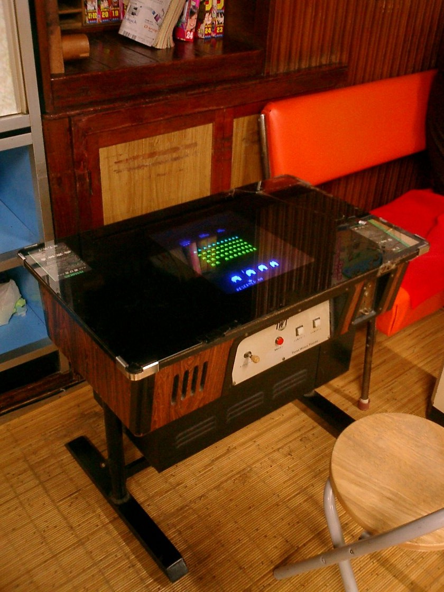

# Games, IoT & embedded

*A cocktail-cabinet arcade machine is one fixed piece of hardware running one exact program - no browser tab to refresh, no other app competing for memory. Testing games, IoT, and embedded software means testing that same tight union of hardware and code, not software on a generic device.*

> A web app bug can usually be fixed and redeployed to every user within minutes of discovery. A bug
> shipped in a game cartridge, a smart thermostat's firmware, or an embedded medical device often can't
> be patched nearly as easily after release - some of it never gets patched at all - which means testing
> before release carries a different, heavier weight than it does for most web or mobile software.

> **In real life**
>
> A cocktail-cabinet arcade machine is one specific piece of hardware permanently paired with one exact
> program - no browser tab competing for memory, no other app interrupting it, no operating system update
> changing its behavior overnight. It runs precisely one thing, on precisely one physical device, and
> that tight union is exactly the point. Games, IoT devices, and embedded systems all share this same
> fundamental trait: the software and the specific hardware it runs on can't be cleanly separated the way
> a web app is separated from the countless different browsers and machines that might load it, which
> means testing has to account for the hardware just as seriously as the code.

**Games, IoT, and embedded testing**: Games, IoT, and embedded testing is QA work on software tightly coupled to specific hardware - a game console or engine, a connected physical device, or firmware running on dedicated hardware - where testing must account for hardware constraints, real-time performance, and update limitations that most standard web or mobile software doesn't need to worry about to the same degree.

## Performance and timing aren't optional polish - they're core correctness

A web page that's a little slow is a usability complaint; a game that drops frames during a critical
input window, or embedded firmware that misses a real-time deadline controlling physical hardware, can
be an outright functional failure, not just a rough edge. Testing in this domain routinely includes
frame-rate and timing verification, memory usage under sustained load, and behavior under real
resource constraints - concerns that exist in web and mobile testing too, but rarely with the same
make-or-break weight they carry here.

## Update limitations change what "shipping a fix" actually means

A web app's fix ships the moment the deploy finishes; a game on physical media, IoT firmware on a
device already installed in someone's home, or an embedded controller in a piece of manufacturing
equipment may be difficult, slow, or in some cases functionally impossible to patch after release.
That reality shifts real weight onto pre-release testing specifically - a bug caught before a physical
product ships is dramatically cheaper and safer than the same bug discovered after thousands of units
are already in the field with no easy update path.

> **Tip**
>
> When testing anything hardware-adjacent, deliberately test under real resource constraints - low
> battery, poor network connectivity, limited memory - not just on a well-provisioned development
> machine. Bugs in this domain disproportionately live in exactly those constrained conditions.

> **Common mistake**
>
> Assuming a device or game behaves identically across every unit or platform variant just because it
> passed on one test device. Hardware and firmware variation across device batches, or platform-specific
> quirks across different consoles or chipsets, are a real and distinct source of bugs that testing on a
> single reference device won't catch.


*Space Invaders cocktail cabinet — Tomomarusan, CC BY 2.5, via Wikimedia Commons. [Source](https://commons.wikimedia.org/wiki/File:Space_Invaders.JPG)*
- **The glowing screen showing the game running** — One exact program, running on one exact piece of dedicated hardware - the tight coupling that defines this whole domain, unlike a web page loading identically across countless different devices.
- **The control panel and joystick** — Physical input hardware permanently wired to this specific unit - real-world timing and responsiveness matter here in a way a generic software input rarely has to account for as strictly.
- **The sealed cabinet housing beneath the glass** — Hardware and software shipped together as one product - once this cabinet left the factory, updating what's inside was never as simple as pushing a web deploy.
- **The dedicated coin/token mechanism** — Purpose-built hardware for exactly one function - the same specificity embedded and IoT devices carry: built for one job, on one piece of hardware, not a general-purpose platform running arbitrary software.

**Approaching a hardware-coupled testing task**

1. **Test core functional correctness first** — The baseline every domain needs, before anything hardware-specific.
2. **Test timing and performance as correctness, not polish** — Frame drops, missed real-time deadlines, and lag under load can be functional failures here, not just rough edges.
3. **Test under real resource constraints deliberately** — Low battery, poor connectivity, limited memory - not just a well-provisioned development environment.
4. **Test across real hardware variation, not just one reference device** — Different device batches, chipsets, or console generations can behave differently even running identical software.

*Flagging a frame-timing budget violation in a simulated game loop (Python)*

```python
TARGET_FRAME_MS = 16.67  # ~60fps budget

frame_times_ms = [15.2, 16.9, 17.8, 14.5, 22.3, 16.1]

dropped_frames = [t for t in frame_times_ms if t > TARGET_FRAME_MS]

print("Frame budget: " + str(TARGET_FRAME_MS) + "ms")
for t in frame_times_ms:
    status = "OVER BUDGET" if t > TARGET_FRAME_MS else "ok"
    print("  frame: " + str(t) + "ms -> " + status)

drop_rate = len(dropped_frames) / len(frame_times_ms)
print("Dropped frame rate: " + str(round(drop_rate * 100, 1)) + "%")
if drop_rate > 0.1:
    print("FLAG: drop rate exceeds 10% - likely a visible, functional stutter, not just cosmetic")
```

*Flagging a frame-timing budget violation in a simulated game loop (Java)*

```java
import java.util.*;

public class Main {
    public static void main(String[] args) {
        double targetFrameMs = 16.67; // ~60fps budget

        List<Double> frameTimesMs = Arrays.asList(15.2, 16.9, 17.8, 14.5, 22.3, 16.1);

        int droppedFrames = 0;
        System.out.println("Frame budget: " + targetFrameMs + "ms");
        for (double t : frameTimesMs) {
            boolean over = t > targetFrameMs;
            if (over) droppedFrames++;
            System.out.println("  frame: " + t + "ms -> " + (over ? "OVER BUDGET" : "ok"));
        }

        double dropRate = (double) droppedFrames / frameTimesMs.size();
        System.out.println("Dropped frame rate: " + Math.round(dropRate * 1000) / 10.0 + "%");
        if (dropRate > 0.1) {
            System.out.println("FLAG: drop rate exceeds 10% - likely a visible, functional stutter, not just cosmetic");
        }
    }
}
```

### Your first time: Test one real app or game under a real resource constraint

- [ ] Pick any mobile game or app already installed on a real device — Something with real-time interaction, not just static content.
- [ ] Deliberately test it with low battery mode or battery saver enabled — Note any difference in performance, responsiveness, or behavior.
- [ ] Test it again with a throttled or poor network connection simulated — Airplane mode toggling, or a network-throttling dev tool if available.
- [ ] Compare both against normal, well-provisioned conditions — Note any specific behavior that only appears under the constrained conditions.

- **A game or app performs perfectly on a development device but users report lag or stutter in the field.**
  Test under real resource constraints deliberately - low battery, background thermal throttling, and lower-end hardware variants frequently surface performance bugs invisible on a well-provisioned dev machine.
- **A firmware or embedded bug is discovered after a device has already shipped to customers.**
  This is exactly the scenario pre-release testing in this domain exists to prevent - if an update path exists at all, prioritize confirming it works correctly before relying on it as a fallback for missed pre-release bugs.
- **A bug reproduces on one test device but not others running the same software version.**
  Suspect hardware or chipset variation across the device batch - test explicitly across multiple real device units or variants, not just one reference unit assumed to represent them all.

### Where to check

- Any real-time or performance-sensitive interaction, checked against a concrete timing or frame budget, not just a subjective 'feels fine' impression.
- Behavior specifically under low battery, poor connectivity, or constrained memory conditions.
- [[your-first-90-days/domains-and-specializations/picking-a-niche-deliberately]] for weighing this domain's hardware-coupled, harder-to-patch nature against other specialization options.
- [[your-first-90-days/domains-and-specializations/erp-crm-and-enterprise]] for a very different kind of specialized domain, integration-heavy rather than hardware-heavy.
- [[mobile-testing/appium-intro/what-appium-is]] for a concrete automation tool commonly used at the boundary between mobile and hardware-adjacent testing.

### Worked example: a performance bug that only showed up under real constraints

1. A mobile game passes every functional and performance test on the QA team's flagship test devices,
   running smoothly at a stable frame rate throughout.
2. Post-launch reviews report noticeable stuttering specifically on older, lower-end devices - a segment
   the test device pool hadn't actually included.
3. Investigating on a borrowed older device confirms it: frame times regularly exceed the 60fps budget
   during a specific particle-effect-heavy game sequence, invisible on the newer, more powerful test
   hardware.
4. The fix reduces particle effect density specifically on detected lower-end hardware, verified against
   the same older device that originally reproduced the issue.
5. The device test pool is expanded going forward to explicitly include a range of hardware
   tiers, not just the flagship devices that had made this specific class of bug invisible during the
   original testing pass.

**Quiz.** According to this note, why does update limitation shift extra weight onto pre-release testing in games, IoT, and embedded software specifically?

- [ ] It doesn't - fixing a bug after release is exactly as easy in this domain as it is for a typical web application
- [x] Physical products, firmware already installed on devices in the field, or software on media that's difficult to patch may be slow, difficult, or sometimes functionally impossible to update after release - making a bug caught before shipping dramatically cheaper and safer than one discovered after release
- [ ] Pre-release testing only matters for games, not for IoT or embedded systems
- [ ] Update limitations are purely a legal concern, not a testing concern

*A web app's fix can typically ship the moment a deploy finishes. Games on physical media, IoT firmware already installed in someone's home, or embedded controllers in equipment may be difficult, slow, or in some cases nearly impossible to patch after release - which means a bug caught during pre-release testing is dramatically cheaper and safer to fix than the same bug discovered with thousands of units already in the field.*

- **Games, IoT, and embedded testing** — QA work on software tightly coupled to specific hardware, accounting for hardware constraints, real-time performance, and update limitations most web or mobile testing doesn't face to the same degree.
- **Why timing and performance count as correctness here, not polish** — A dropped frame during a critical input window, or firmware missing a real-time deadline controlling physical hardware, can be an outright functional failure, not just a rough edge.
- **Why update limitations matter so much in this domain** — Physical products and installed firmware may be difficult or impossible to patch after release - shifting real weight onto catching bugs before shipping rather than relying on a fix afterward.
- **Why testing across multiple hardware units matters** — Hardware and firmware variation across device batches or chipsets is a real, distinct source of bugs that testing on a single reference device won't reliably catch.

### Challenge

Pick a mobile game or app already on a real device. Test it deliberately under low battery mode and a throttled network connection, and note any behavior that differs from normal, well-provisioned conditions.

- [Guru99 — Game Testing Tutorial: What Is, Types, Test Cases](https://www.guru99.com/game-testing.html)
- [Testbytes — A Complete Guide to Game Testing](https://www.testbytes.net/blog/game-testing/)
- [What do game testers do | Game QA role explanation and scope](https://www.youtube.com/watch?v=22_O8zj8EeI)

🎬 [What do game testers do | Game QA role explanation and scope](https://www.youtube.com/watch?v=22_O8zj8EeI) (10 min)

- Games, IoT, and embedded testing deals with software tightly coupled to specific hardware, unlike most web or mobile software.
- Timing and performance are often correctness concerns here, not polish - a missed real-time deadline can be a functional failure.
- Update limitations after release shift real weight onto pre-release testing - some bugs may never get a clean patch path once shipped.
- Testing across real hardware variation matters - a bug can be invisible on one reference device and very real on another.
- Deliberately testing under real resource constraints (battery, network, memory) surfaces bugs a well-provisioned dev environment hides.


## Related notes

- [[Notes/your-first-90-days/domains-and-specializations/picking-a-niche-deliberately|Picking a niche deliberately]]
- [[Notes/your-first-90-days/domains-and-specializations/erp-crm-and-enterprise|ERP / CRM & enterprise]]
- [[Notes/mobile-testing/appium-intro/what-appium-is|What Appium is]]


---
_Source: `packages/curriculum/content/notes/your-first-90-days/domains-and-specializations/games-iot-and-embedded.mdx`_
