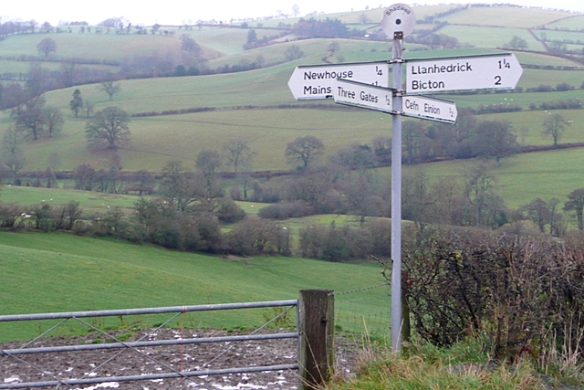

# Picking a niche, deliberately

*A signpost at a real crossroads names every direction and exact distance, so nobody wanders off guessing. Picking a QA niche works best the same way - naming the real options explicitly, then choosing one path on purpose, not drifting toward whichever direction happened to be underfoot.*

> "I ended up doing mostly mobile testing because that's what my first job happened to need" describes
> how a lot of QA careers actually get their initial shape - by circumstance, not by a deliberate choice.
> That's not necessarily a bad outcome, but it's a very different process than actually choosing a
> direction on purpose, and the difference matters most once a real decision point finally arrives.

> **In real life**
>
> A signpost standing at a real countryside crossroads names every direction explicitly - Newhouse, a
> quarter mile; Llanhedrick, one and a quarter miles - so a traveler chooses deliberately, with actual
> information, rather than picking whichever path happens to look most walked-on in the moment. Career
> niches rarely come with a signpost this clear, but the same discipline applies: naming the real
> options and their actual tradeoffs explicitly, on purpose, produces a far more deliberate choice than
> drifting toward whatever direction circumstance happened to put underfoot first.

**Picking a niche deliberately**: Picking a niche deliberately means explicitly comparing the real, named options for a QA specialization - considering genuine interest, market realities, and available opportunity to build experience - rather than letting a direction get chosen passively by whatever a first job or immediate circumstance happened to require.

## Circumstance is a legitimate starting point, but not a reason to stop choosing

Ending up in a domain because a first job needed it is completely normal, and often produces genuine,
real experience worth building on rather than abandoning. The distinction that actually matters is
whether that direction gets examined and either deliberately continued or deliberately changed at some
point, versus just continuing indefinitely by default because nobody ever explicitly asked the
question. A tester who's been doing e-commerce testing for three years by circumstance and genuinely
enjoys it, having actually considered the alternatives, is in a very different position than one who's
never once asked whether it's actually still the right direction.

## Weigh genuine interest, market reality, and available opportunity together

None of the three factors alone should make the decision. Genuine interest with zero market opportunity
in a given region can make a specialization hard to actually practice professionally; strong market
demand with zero real interest is difficult to sustain the ongoing deliberate practice specialization
requires (see [[your-first-90-days/growing-from-here/specializing]]); and available opportunity - the
kind of work a current or next job can actually expose someone to - shapes what's realistically
learnable hands-on versus only theoretically. The strongest niche choices tend to sit where genuine
curiosity, a real market, and an actual path to hands-on experience meaningfully overlap, rather than
maximizing any single factor alone.

> **Tip**
>
> Write down two or three real candidate niches explicitly, with one honest sentence each on interest,
> market reality in your specific region, and current access to hands-on experience. Seeing the actual
> tradeoffs written side by side usually clarifies a decision that feels vague when only considered in
> the abstract.

> **Common mistake**
>
> Treating "picking a niche" as a single, permanent, high-stakes decision that has to be gotten right the
> first time. A niche chosen deliberately now can still be deliberately revisited and changed later if
> circumstances or genuine interest shift - the goal is a real, examined choice at each point, not a
> single irreversible one made once early in a career.


*Clear directions — Graham Horn, CC BY-SA 2.0, via Wikimedia Commons. [Source](https://commons.wikimedia.org/wiki/File:Clear_directions_-_geograph.org.uk_-_1595674.jpg)*
- **Each arm, named and measured precisely** — Every real option stated explicitly with a concrete distance - the same clarity a deliberate niche comparison needs: named candidates, not a vague general sense of 'a few options exist.'
- **The gate and worn path leading in one specific direction** — The direction actually walked most often - not necessarily the objectively best one, just the one circumstance made most convenient. Worth noticing, not automatically following.
- **The rolling hills stretching toward every other direction** — All the other real options, still there and still valid, even once one path gets chosen - a reminder that picking a niche doesn't erase the alternatives, it just commits attention to one for now.
- **The signpost's single central post holding every arm together** — One decision point where every option is compared together, at once - the deliberate moment of comparison itself, rather than each option being considered separately and never side by side.

**Choosing a niche deliberately rather than by default**

1. **Name two or three real candidate niches explicitly** — Not a vague sense of options - specific, named domains actually being considered.
2. **Rate each honestly on genuine interest, market reality, and access to experience** — One honest sentence per factor, per candidate - written down, not just held loosely in mind.
3. **Look for where the factors meaningfully overlap** — The strongest choice usually isn't the single highest score on any one factor alone.
4. **Treat the choice as revisitable, not permanent** — A deliberate decision now doesn't forbid deliberately reconsidering it later if real circumstances or genuine interest shift.

*Comparing real niche candidates across three weighted factors (Python)*

```python
candidates = [
    {"niche": "payments/fintech", "interest": 7, "market": 9, "access": 4},
    {"niche": "mobile testing", "interest": 8, "market": 7, "access": 8},
    {"niche": "accessibility", "interest": 9, "market": 5, "access": 6},
]

for c in candidates:
    # no single factor dominates; overlap across all three matters most
    c["overlap_score"] = round((c["interest"] * c["market"] * c["access"]) ** (1/3), 1)

ranked = sorted(candidates, key=lambda c: c["overlap_score"], reverse=True)
print("Ranked by three-factor overlap (not any single factor alone):")
for c in ranked:
    print("  " + c["niche"] + " -> " + str(c["overlap_score"]))
```

*Comparing real niche candidates across three weighted factors (Java)*

```java
import java.util.*;

public class Main {
    static class Candidate {
        String niche; double interest, market, access, overlapScore;
        Candidate(String niche, double interest, double market, double access) {
            this.niche = niche; this.interest = interest; this.market = market; this.access = access;
            this.overlapScore = Math.round(Math.cbrt(interest * market * access) * 10) / 10.0;
        }
    }

    public static void main(String[] args) {
        List<Candidate> candidates = new ArrayList<>();
        candidates.add(new Candidate("payments/fintech", 7, 9, 4));
        candidates.add(new Candidate("mobile testing", 8, 7, 8));
        candidates.add(new Candidate("accessibility", 9, 5, 6));

        candidates.sort((a, b) -> Double.compare(b.overlapScore, a.overlapScore));

        System.out.println("Ranked by three-factor overlap (not any single factor alone):");
        for (Candidate c : candidates) {
            System.out.println("  " + c.niche + " -> " + c.overlapScore);
        }
    }
}
```

### Your first time: Compare your own real niche candidates explicitly

- [ ] Name two or three real specialization candidates — Domains you've actually considered, not a hypothetical exhaustive list.
- [ ] Write one honest sentence per candidate on genuine interest — Not what sounds impressive - what's actually produced real curiosity so far.
- [ ] Write one honest sentence per candidate on market reality in your specific region — Actual job postings and demand where you'd realistically be working, not a global average.
- [ ] Write one honest sentence per candidate on current access to hands-on experience — What your current or realistically next job could actually expose you to.

- **A specialization direction was never actually chosen - it just happened by whatever a first job needed.**
  That's a legitimate starting point, not a mistake - the actual step worth taking now is deliberately examining whether it's still the right direction, rather than continuing indefinitely without ever asking.
- **A niche with strong personal interest has very little market opportunity in a specific region.**
  Weigh this honestly rather than ignoring it - remote or relocation options might open the market, or a related, more available niche might satisfy similar underlying interest.
- **A chosen niche starts to feel wrong months or years after the original decision.**
  Treat the original choice as revisitable, not permanent - deliberately reconsidering a niche later is a normal part of the same deliberate process, not a failure of the original decision.

### Where to check

- Any current specialization direction, checked honestly for whether it was actually chosen deliberately or just happened by default.
- Real candidate niches, compared explicitly on interest, market reality, and access to experience - written down, not just held loosely in mind.
- [[your-first-90-days/growing-from-here/specializing]] for the deeper mechanics of what specializing actually requires once a direction is chosen.
- [[your-first-90-days/domains-and-specializations/payments-and-fintech-testing]] for one concrete, real specialization option with its own specific tradeoffs.
- [[your-first-90-days/domains-and-specializations/erp-crm-and-enterprise]] for another concrete, real specialization option to weigh against others explicitly.

### Worked example: a niche decision made explicit after years of drifting by default

1. A tester has spent three years doing primarily e-commerce web testing, entirely because that's what
   their first and only job so far has needed - never an explicit choice, just circumstance.
2. Prompted to consider specializing further, they realize they've never actually asked whether
   e-commerce is the direction they'd choose on purpose, versus just the one that happened.
3. Writing out three real candidates explicitly - e-commerce (current), accessibility (occasional real
   interest), and mobile (some market appeal, but limited genuine pull) - with honest notes on interest,
   market, and access for each.
4. The comparison reveals e-commerce actually scores well on all three factors once honestly considered:
   genuine, if quiet, ongoing interest, strong market demand, and three years of real hands-on access
   already built.
5. The tester deliberately recommits to e-commerce specialization - not because nothing changed, but
   because the decision is now genuinely examined and chosen on purpose, rather than simply continuing
   by default without ever having actually asked the question.

**Quiz.** According to this note, what's the key distinction between ending up in a niche by circumstance and picking one deliberately?

- [ ] Ending up in a niche by circumstance is always a mistake that should be corrected immediately
- [x] The distinction isn't whether the direction started by circumstance, but whether it ever gets explicitly examined and either deliberately continued or deliberately changed, rather than just continuing indefinitely by default
- [ ] A deliberately chosen niche can never be changed again later without it being a sign of failure
- [ ] Circumstance-driven and deliberately-chosen niches always require completely different skill sets

*Ending up in a direction because a first job needed it is a completely normal and legitimate starting point - the real distinction is whether that direction ever gets explicitly examined at some point, rather than simply continuing by default because the question never got asked. A niche can be deliberately re-chosen even after starting by circumstance, and a deliberate choice made now can still be deliberately reconsidered again later.*

- **Picking a niche, deliberately** — Explicitly comparing real specialization options - genuine interest, market reality, and available opportunity - rather than letting a direction get chosen passively by whatever circumstance happened to require.
- **Why circumstance-driven starting points aren't inherently a problem** — They're a legitimate, common way careers get their initial shape - the distinction that matters is whether the direction ever gets explicitly examined, not whether it started deliberately.
- **The three factors worth weighing together** — Genuine interest, market reality in a specific region, and actual current access to hands-on experience - the strongest niches sit where these meaningfully overlap, not where any single factor is maximized alone.
- **Why a niche decision should be treated as revisitable, not permanent** — A deliberate choice made now doesn't forbid deliberately reconsidering it later if genuine interest or real circumstances shift - the goal is an examined choice at each point, not one irreversible decision.

### Challenge

Name two or three real specialization candidates you've actually considered. Write one honest sentence each on genuine interest, market reality in your specific region, and current access to hands-on experience.

- [BetterUp — How to Choose a Career: A Practical Guide](https://www.betterup.com/blog/how-to-choose-a-career)
- [Indeed — How To Choose a Career Path in 5 Steps](https://www.indeed.com/career-advice/finding-a-job/how-to-choose-a-career-path)
- [The Psychology of Career Decisions | Sharon Belden Castonguay | TEDxWesleyanU](https://www.youtube.com/watch?v=4e6KSaCxcHs)

🎬 [The Psychology of Career Decisions | Sharon Belden Castonguay | TEDxWesleyanU](https://www.youtube.com/watch?v=4e6KSaCxcHs) (12 min)

- Ending up in a niche by circumstance is normal and legitimate - the real distinction is whether it ever gets explicitly, deliberately examined.
- Weigh genuine interest, market reality, and available opportunity together - the strongest niches sit where all three meaningfully overlap.
- Write real candidates down explicitly with honest notes on each factor - seeing the actual tradeoffs side by side clarifies a decision that feels vague in the abstract.
- A niche choice isn't a single permanent decision - it can be deliberately revisited and changed later if genuine interest or circumstances shift.
- The goal at any point is an examined, deliberate choice - not necessarily a different choice, just one that's actually been asked and answered on purpose.


## Related notes

- [[Notes/your-first-90-days/growing-from-here/specializing|Specializing]]
- [[Notes/your-first-90-days/domains-and-specializations/payments-and-fintech-testing|Payments & fintech testing]]
- [[Notes/your-first-90-days/domains-and-specializations/erp-crm-and-enterprise|ERP / CRM & enterprise]]


---
_Source: `packages/curriculum/content/notes/your-first-90-days/domains-and-specializations/picking-a-niche-deliberately.mdx`_
