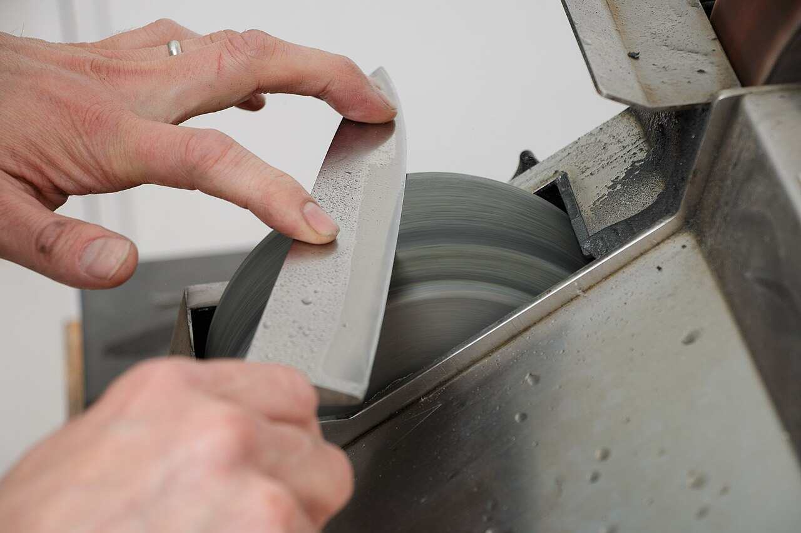

# Continued learning

*A knife left in a drawer stays exactly as sharp as the day it was put there - which is to say, it doesn't. Skills used at work without any deliberate sharpening on the side drift the same way, dulled by whatever's routine rather than kept honed on purpose.*

> A tester who hasn't deliberately learned anything new in a year, relying entirely on whatever the job
> happens to require day to day, often doesn't notice the drift until a new tool, a new kind of bug, or a
> new interview question exposes a gap that quietly grew the whole time nobody was actively working
> against it.

> **In real life**
>
> A knife used daily but never deliberately sharpened doesn't stay sharp by default - ordinary use dulls
> the edge steadily, and the knife that felt sharp enough a year ago is now noticeably worse, without any
> single dramatic moment marking the decline. Sharpening it isn't a one-time fix either; it's a
> maintenance habit, done deliberately and repeatedly, that keeps the edge where daily use alone never
> would. Skills work exactly the same way - using them at work daily is not the same as sharpening them,
> and drift happens gradually enough that it's easy to miss until a real gap gets exposed.

**Continued learning**: Continued learning, in a QA career, is the deliberate, ongoing habit of building skill beyond what the current job strictly requires day to day - since routine use of existing skills maintains them at best, and rarely builds genuinely new capability or catches up with how the field itself keeps changing.

## Routine work maintains skills; it rarely grows them

Testing the same kind of feature the same way, week after week, keeps existing skills serviceable but
provides little pressure to actually grow beyond them - there's no natural forcing function pushing
past what the current role already demands. Deliberate learning - a course, a side project, a new tool
tried outside of what's strictly required - is what actually builds new capability, precisely because
it's chosen specifically to go beyond the routine rather than repeat it. The distinction matters because
it's easy to feel busy and productive at work while genuinely stagnating on the specific skills that
would open the next opportunity.

## Small, consistent investment beats sporadic intense bursts

An hour a week, sustained across a year, reliably outperforms an occasional intense weekend binge
followed by months of nothing - consistency compounds, and the field itself changes continuously enough
that periodic catch-up sessions tend to always feel like playing catch-up rather than staying ahead.
Picking one small, concrete, recurring commitment - a specific course chapter each week, one new tool
feature tried each month - and actually sustaining it beats an ambitious but unsustainable plan that
quietly stops after the first few weeks once initial motivation fades.

> **Tip**
>
> Tie continued learning to a visible artifact, not just passive consumption - a small script written
> while learning a new tool, a short write-up of what a course actually taught, a mini project applying
> a new technique. An artifact both reinforces the learning and becomes something concrete to show later.

> **Common mistake**
>
> Treating continued learning as something that only needs to happen right before a job search, in a
> short intense burst. Skills built under that kind of pressure tend to be shallow and don't hold up well
> under real interview or on-the-job scrutiny - the steady, ongoing version produces far more durable
> capability than a compressed cram session ever does.


*Knife sharpening on grinding wheel — Didriks, CC BY 2.0, via Wikimedia Commons. [Source](https://commons.wikimedia.org/wiki/File:Friedr_Dick_sharpening_knife_on_grinding_wheel.jpeg)*
- **The spinning grinding wheel** — Deliberate, ongoing maintenance in motion - not a one-time fix, but a repeated habit applied consistently, the same discipline continued learning requires.
- **The blade angled precisely against the wheel** — Careful, deliberate technique, not passive contact - the same intentional engagement that separates real deliberate learning from just being present at a job day to day.
- **The two hands, actively controlling the motion** — Hands-on, active involvement in the sharpening itself - the same active, applied engagement (a project, a written artifact) that makes learning stick better than passive consumption alone.
- **Water visible on the wheel's surface** — A necessary part of the process, not an afterthought - a reminder that sharpening (and learning) has real technique and conditions behind it, not just good intentions.

**Building a sustainable continued-learning habit**

1. **Pick one small, specific, recurring commitment** — A course chapter weekly, a new tool feature monthly - concrete enough to actually follow through on.
2. **Tie it to a visible artifact, not passive consumption alone** — A script, a short write-up, a mini project - something concrete that reinforces the learning and can be shown later.
3. **Protect the small habit's consistency over any single ambitious burst** — An hour a week sustained beats an intense weekend followed by months of nothing.
4. **Revisit and adjust the direction periodically, not the habit itself** — What's being learned can shift over time - the recurring habit of learning something is the part worth protecting.

*Comparing sustained small investment against sporadic bursts (Python)*

```python
weeks = 52

sustained_hours_per_week = 1
sporadic_binge_hours = 20  # one intense weekend
sporadic_binges_per_year = 2

sustained_total = sustained_hours_per_week * weeks
sporadic_total = sporadic_binge_hours * sporadic_binges_per_year

print("Sustained (1 hr/week for 52 weeks): " + str(sustained_total) + " hours")
print("Sporadic (2 intense weekends/year): " + str(sporadic_total) + " hours")

# consistency bonus: sustained learning compounds, modeled here as a simple multiplier
effective_sustained = sustained_total * 1.3
print("Effective sustained learning (consistency-adjusted): " + str(round(effective_sustained)) + " hours")

if effective_sustained > sporadic_total:
    print("Sustained wins despite fewer raw hours, due to consistency and reduced re-learning overhead")
```

*Comparing sustained small investment against sporadic bursts (Java)*

```java
public class Main {
    public static void main(String[] args) {
        int weeks = 52;

        int sustainedHoursPerWeek = 1;
        int sporadicBingeHours = 20;
        int sporadicBingesPerYear = 2;

        int sustainedTotal = sustainedHoursPerWeek * weeks;
        int sporadicTotal = sporadicBingeHours * sporadicBingesPerYear;

        System.out.println("Sustained (1 hr/week for 52 weeks): " + sustainedTotal + " hours");
        System.out.println("Sporadic (2 intense weekends/year): " + sporadicTotal + " hours");

        double effectiveSustained = sustainedTotal * 1.3;
        System.out.println("Effective sustained learning (consistency-adjusted): " +
                Math.round(effectiveSustained) + " hours");

        if (effectiveSustained > sporadicTotal) {
            System.out.println("Sustained wins despite fewer raw hours, due to consistency and reduced re-learning overhead");
        }
    }
}
```

### Your first time: Start one small, sustainable learning commitment

- [ ] Pick one specific skill or tool slightly beyond current daily work — Narrow enough to commit to concretely, not a vague 'learn more about testing.'
- [ ] Set a small, specific recurring time commitment — One hour a week is a realistic, sustainable starting point for most schedules.
- [ ] Choose one artifact to produce as you go — A small script, a short write-up, a mini project - something concrete, not just notes to yourself.
- [ ] Put the recurring commitment on an actual calendar or reminder — Treat it with the same seriousness as any other recurring commitment, not something to fit in only if time allows.

- **A skill that felt solid a year ago now feels noticeably rusty with no clear single moment explaining the decline.**
  Routine work maintains skills at best - it rarely builds new ones or actively prevents drift. Add a small, deliberate learning habit specifically targeting that skill rather than assuming daily use alone will keep it sharp.
- **An ambitious learning plan gets abandoned within a few weeks of starting.**
  Scale down to something smaller and more sustainable - a modest, consistent commitment reliably outlasts an ambitious one that depends on sustained high motivation.
- **Learning only happens in occasional intense bursts right before a job search or interview.**
  Skills built under that kind of compressed pressure tend to be shallow - shift to a small, steady, ongoing habit instead, so depth is already there when it's actually needed.

### Where to check

- Skills used routinely at work, checked honestly for whether they've been actively grown or just maintained over the last year.
- Any learning plan currently in progress, checked for whether it's small and sustainable or ambitious and at risk of quietly stopping.
- [[your-first-90-days/growing-from-here/specializing]] for the specific direction continued learning often ends up concentrated around once a specialization is chosen.
- [[your-first-90-days/growing-from-here/junior-to-mid-roadmap]] for how sustained skill growth connects concretely to the capabilities that roadmap actually tracks.
- [[ai-and-the-modern-tester/staying-employable-in-the-ai-era/learning-loop-for-new-tools]] for applying this same continued-learning discipline specifically to fast-moving AI-era tooling.

### Worked example: a learning plan that only started working once it got smaller

1. A tester sets an ambitious New Year's goal: finish an entire in-depth automation framework course
   within one month, alongside full-time work.
2. Three weeks in, only two of twelve course modules are done, and the tester feels behind enough that
   the whole effort quietly stops rather than continuing at a slower pace.
3. Six months later, revisiting the goal, the plan is deliberately scaled down: one course module every
   two weeks, with a small script written afterward applying whatever that module covered.
4. This much smaller commitment actually gets sustained - by the end of the year, all twelve modules are
   complete, each backed by a real small artifact demonstrating the concept applied.
5. The slower, sustained version produces both a completed course and twelve small real projects -
   concretely more than the ambitious one-month plan produced in its three abandoned weeks.

**Quiz.** According to this note, why does routine work at a job fail to substitute for deliberate continued learning?

- [ ] Routine work actively causes skills to get worse over time
- [x] Routine work maintains existing skills at best, but provides no natural pressure to build genuinely new capability beyond what the current role already requires
- [ ] Continued learning is only necessary for testers who dislike their current role
- [ ] Routine work and deliberate learning build exactly the same skills at the same rate

*Doing the same kind of work the same way keeps existing skills serviceable, but there's no natural forcing function in routine work pushing past what the current role already demands. Deliberate learning is what actually builds new capability, specifically because it's chosen to go beyond the routine - without it, skills tend to plateau or quietly drift as the field itself keeps changing around them.*

- **Continued learning (QA career)** — The deliberate, ongoing habit of building skill beyond what the current job strictly requires - since routine work maintains existing skills at best and rarely builds new capability.
- **Why routine work isn't enough on its own** — It maintains existing skills but provides no natural pressure to grow beyond them - deliberate learning is what actually builds new capability, precisely because it's chosen to exceed the routine.
- **Why small, sustained investment beats sporadic intense bursts** — Consistency compounds and avoids the re-learning overhead of long gaps - a modest weekly habit reliably outperforms an ambitious plan that depends on sustained high motivation.
- **Why tying learning to a visible artifact helps** — It reinforces the learning through active application rather than passive consumption, and produces something concrete to show later, not just private notes.

### Challenge

Pick one skill slightly beyond your current daily work. Commit to one small, specific, recurring time block for it, and choose one concrete artifact you'll produce from the first session.

- [Ministry of Testing — The Dojo (Learning Hub for Testers)](https://www.ministryoftesting.com/dojo)
- [freeCodeCamp — Testing Articles and Tutorials](https://www.freecodecamp.org/news/tag/testing/)
- [Learning Software Engineering During the Era of AI | TEDxCSTU](https://www.youtube.com/watch?v=w4rG5GY9IlA)

🎬 [Learning Software Engineering During the Era of AI | Raymond Fu | TEDxCSTU](https://www.youtube.com/watch?v=w4rG5GY9IlA) (12 min)

- Routine work maintains existing skills at best - deliberate, ongoing learning is what actually builds new capability.
- Small, consistent investment - an hour a week sustained - reliably outperforms occasional intense bursts followed by long gaps.
- Tie learning to a visible artifact, not passive consumption alone - it reinforces the learning and produces something concrete to show later.
- Cramming learning into a burst right before a job search tends to produce shallow skill that doesn't hold up under real scrutiny.
- Skill drift happens gradually and is easy to miss until a real gap gets exposed - deliberate practice is what actively works against it.


## Related notes

- [[Notes/your-first-90-days/growing-from-here/specializing|Specializing]]
- [[Notes/your-first-90-days/growing-from-here/junior-to-mid-roadmap|Junior → mid roadmap]]
- [[Notes/ai-and-the-modern-tester/staying-employable-in-the-ai-era/learning-loop-for-new-tools|Learning loop for new tools]]


---
_Source: `packages/curriculum/content/notes/your-first-90-days/growing-from-here/continued-learning.mdx`_
