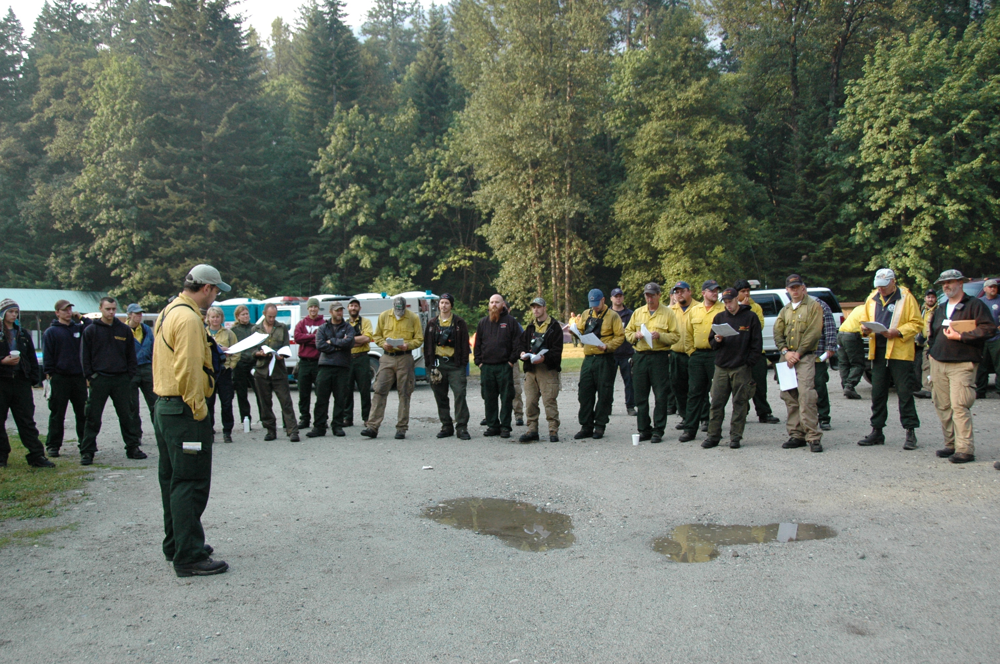

# Onboarding as a QA

*What to prioritize in week one and two at a new QA job: environment access, meeting the team, understanding the existing test suite and tools, and asking how this team works instead of assuming your last employer's process.*

> Your first login does not work, nobody has told you where the test environment lives, and the
> standup is already using three acronyms you have never heard. This is normal. The first two weeks
> of a QA job are not about finding bugs — they are about learning enough of the terrain that your
> first bugs land somewhere useful.

> **In real life**
>
> A firefighter transferring to a new firehouse does not show up and start directing the crew. She
> finds out where the gear actually lives on this rig, learns this house's truck-check routine, and
> meets the crew before her first call — because the fire does not care that her last house did
> things differently, and neither does this one.

**Onboarding**: Onboarding is the structured first-weeks process of gaining working access, meeting the people you depend on, and learning a team's existing tools and conventions before contributing independently. Its purpose is not politeness — an onboarded tester produces evidence the team can actually use; an un-onboarded one produces noise that looks like evidence.

## Week one is infrastructure, not output

Nobody expects a shipped test plan on day two. What they do notice, quietly, is whether you got your
accounts working without four separate Slack threads, whether you showed up to standup having
skimmed the board first, and whether you asked before you assumed. Treat access, tooling, and
introductions as the actual week-one deliverable — everything else depends on them.

## Learn the existing suite before you touch it

Every team already has a test suite, a bug tracker, a CI pipeline, and habits around all three, even
if none of it is documented well. Read the suite before you add to it. Run it before you trust it.
Ask why a strange-looking test exists before you delete or "clean up" it — it may be the only thing
standing between the team and a regression that bit them once already.

> **Tip**
>
> Write down the answers to five questions in your first week, verbatim: how are bugs filed here, what
> does each severity level actually mean on this team, who owns test environment access, where does the
> test suite run, and who do I ask when I am stuck. You will use every one of these answers within a
> month.

> **Common mistake**
>
> Do not import your last employer's process on day three because it is familiar. A severity scale,
> bug template, or review habit that worked at your old company is a guess here until you have
> confirmed this team actually works the same way. Ask first; propose changes later, once you
> understand why the current process exists.


*Rainbow Bridge Fire morning briefing, 2010 — NPS Staff, North Cascades National Park, Wikimedia Commons, public domain. [Source](https://commons.wikimedia.org/wiki/File:Rainbow_Bridge_Fire_morning_briefing_during_2010_Rainbow_Bridge_Fire_(9069728504a140b58ce523618227b6a3).JPG)*
- **Whoever actually runs point** — The person leading a briefing like this is rarely just the loudest title on the org chart. In week one, find out who actually owns each decision on your team, and let them set the agenda instead of guessing from a job title.
- **A crew with an existing rhythm** — Two dozen people here already share a routine: where to stand, what to bring, when to speak. A new QA's job in week one is to learn that rhythm, not to introduce a different one carried over from a previous job.
- **Gear that was already assigned** — The trucks and equipment behind the crew were checked and assigned long before this morning. Environment access, tool accounts, and permissions work the same way — get them working before you try to be useful.
- **Unfamiliar terrain behind the crew** — Nobody on this crew is meeting this forest for the first time today, but you are meeting the existing test suite and codebase for the first time. Read and run it before you touch it.

**A defensible week one**

1. **Get access and environment working** — Accounts, test environments, and tool permissions come first; every later step stalls without them.
2. **Meet the team and learn who owns what** — Introductions are not small talk — they tell you who to ask when a decision actually needs making.
3. **Read the existing suite and tooling before touching it** — Understand what already exists, and why, before adding to it, replacing it, or judging it.
4. **Ask how this team works instead of assuming** — Bug templates, severity scales, and review habits vary by team; confirm them rather than import your last job's defaults.

*A week-one onboarding checklist tracker (Python)*

```python
checklist = [
    ("accounts_and_env_access", True),
    ("met_the_team", True),
    ("reviewed_existing_test_suite", True),
    ("reviewed_tooling_and_ci", True),
    ("asked_about_ways_of_working", True),
    ("shadowed_a_teammate_session", True),
    ("knows_where_bugs_are_filed", True),
    ("knows_escalation_path", True),
]
completed = 0
for name, done in checklist:
    status = "DONE" if done else "PENDING"
    print(name + "=" + status)
    completed += 1 if done else 0
percent = round(completed / len(checklist) * 100)
print("COMPLETION=" + str(percent) + "%")
result = "READY" if percent == 100 else "INCOMPLETE"
assert result == "READY", "onboarding checklist incomplete"
print("RESULT=" + result)
```

*A week-one onboarding checklist tracker (Java)*

```java
import java.util.LinkedHashMap;
import java.util.Map;
public class Main {
    public static void main(String[] args) {
        Map<String, Boolean> checklist = new LinkedHashMap<>();
        checklist.put("accounts_and_env_access", true);
        checklist.put("met_the_team", true);
        checklist.put("reviewed_existing_test_suite", true);
        checklist.put("reviewed_tooling_and_ci", true);
        checklist.put("asked_about_ways_of_working", true);
        checklist.put("shadowed_a_teammate_session", true);
        checklist.put("knows_where_bugs_are_filed", true);
        checklist.put("knows_escalation_path", true);
        int completed = 0;
        for (var e : checklist.entrySet()) {
            String status = e.getValue() ? "DONE" : "PENDING";
            System.out.println(e.getKey() + "=" + status);
            if (e.getValue()) completed++;
        }
        int percent = Math.round(completed * 100.0f / checklist.size());
        System.out.println("COMPLETION=" + percent + "%");
        String result = percent == 100 ? "READY" : "INCOMPLETE";
        if (!result.equals("READY")) throw new AssertionError("onboarding checklist incomplete");
        System.out.println("RESULT=" + result);
    }
}
```

### Your first time: Build your own week-one checklist

- [ ] List every access point you need before you can test anything — Environment logins, VPN, bug tracker, test data, feature flags — write the list on day one so gaps surface immediately.
- [ ] Schedule short intro chats, not just standup nods — Ask each teammate what they own and what they wish a new QA understood sooner.
- [ ] Run the existing suite before reading its code — See what currently passes and fails so you have a baseline before you change anything.
- [ ] Ask, do not assume, about conventions — Bug template, severity scale, review habits, and escalation path — confirm each one explicitly in week one.

- **You propose a process change in week one and it lands badly.**
  Ask why the current process exists before suggesting a replacement. Most 'obviously wrong' habits have history you have not heard yet.
- **You are still blocked on environment access after several days.**
  Escalate specifically and early — name the exact permission or account missing, and who you already asked, rather than waiting quietly.
- **You cannot tell if a test failure is new or a known flake.**
  Ask a teammate to walk you through the suite's known-flaky list before you file anything based on a red run.

### Where to check

- Your team's onboarding doc or wiki, if one exists, and note out loud anything it gets wrong or misses.
- The bug tracker's recent history for this product, to see real examples of the team's expected format.
- The CI dashboard, to see what currently passes and fails before you change anything.
- [[your-first-90-days/landing-well/learning-the-product-fast]] for how to build product knowledge quickly once basic access and orientation exist.

### Worked example: the bug template that was not what it looked like

1. A new QA notices the team's bug template has no explicit severity field and assumes it is missing.
2. Instead of adding one unilaterally, she asks her buddy how severity gets communicated here.
3. It turns out severity lives in a label applied during triage, not in the report body — a convention the wiki never documented.
4. She files her first bug using the label convention, and it is triaged without a single clarifying question.

**Quiz.** What should a new QA prioritize in their first week on a job?

- [ ] Filing as many bugs as possible to show value immediately
- [ ] Proposing a new bug-severity scale based on their last job
- [x] Getting environment access working, meeting the team, and learning existing conventions
- [ ] Rewriting the test suite to match a preferred style

*Access, people, and existing conventions are the foundation everything else depends on. Bug volume, process changes, and rewrites all land better once that foundation is actually understood.*

- **Week-one priority** — Access, environment, team introductions, and reading the existing test suite and tooling before contributing independently.
- **Before proposing a process change** — Ask why the current process exists. Most existing habits carry history a newcomer has not heard yet.
- **Ways of working** — Bug templates, severity scales, and review habits vary by team. Confirm this team's version explicitly rather than assuming your last employer's was universal.

### Challenge

Write your own five onboarding questions for a first week at a new QA job, and for each one, name exactly who you would ask.

- [ARDURA — QA Onboarding Checklist for New Team Members](https://ardura.consulting/blog/qa-onboarding-checklist-new-team-members/)
- [Ministry of Testing — Onboarding testers: Growing your new hire](https://www.ministryoftesting.com/masterclasses/32c3f343)
- [First Day as a QA Engineer: What to Do and Expect](https://www.youtube.com/watch?v=gwTE62vbbJg)

🎬 [First Day as a QA Engineer: What to Do and Expect](https://www.youtube.com/watch?v=gwTE62vbbJg) (6 min)

- Week one is infrastructure: access, environment, and introductions, not bug volume.
- Read and run the existing test suite before adding to it or judging it.
- Confirm this team's conventions explicitly instead of assuming your last job's process is universal.
- Ask why a habit exists before proposing to replace it.


## Related notes

- [[Notes/your-first-90-days/landing-well/learning-the-product-fast|Learning the product fast]]
- [[Notes/your-first-90-days/landing-well/your-first-bug-report-at-work|Your first bug report at work]]
- [[Notes/your-first-90-days/landing-well/building-trust|Building trust]]


---
_Source: `packages/curriculum/content/notes/your-first-90-days/landing-well/onboarding-as-a-qa.mdx`_
