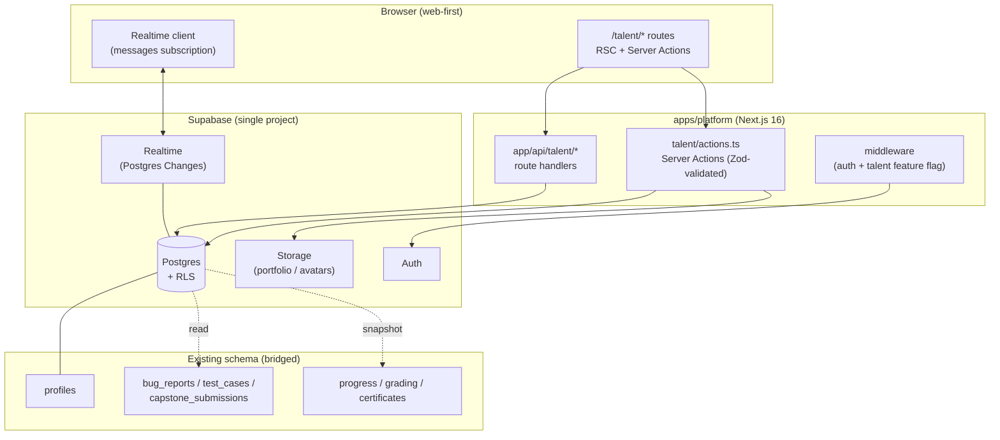
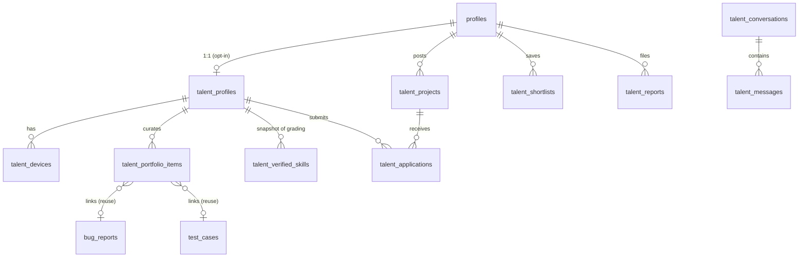
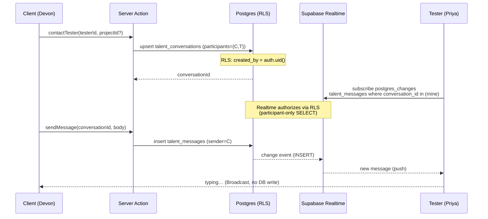

# QA Mastery Talent — Technical Architecture & ADRs

> Companion to `QA-Marketplace-PRD.md` and `QA-Marketplace-UX-Research.md`. The system design for the marketplace module: where it lives, the data model, RLS/security, realtime messaging, and the decisions (ADRs) behind them.

**Status:** Architecture v1.0 (for MVP build) · **Pattern:** modular feature inside the existing modular monolith · **Stack:** unchanged (Next.js 16 App Router, Supabase, Turborepo)

---

## 0. Grounding — what already exists (verified against the repo)

The marketplace is **not greenfield**; it slots into proven structure and reuses several tables:

| Existing asset | Path / object | Reused for |
|---|---|---|
| Authed route group | `apps/platform/src/app/(app)/…` | `(app)/talent/*` lives here |
| Server Actions pattern | `(app)/learn/actions.ts`, `(app)/feedback/actions.ts` | `talent/actions.ts` mirrors it |
| API route handlers / webhooks | `app/api/*`, `app/api/webhooks/paddle` | realtime token / Paddle (V1.0) |
| SSR Supabase clients | `lib/supabase/server.ts`, `packages/db` (`browser.ts`, `service.ts`) | all DB access |
| **`profiles`** table | `migrations/…_init.sql` | FK anchor; add `role` |
| **`bug_reports`**, **`test_cases`**, **`capstone_submissions`**, **`evidence_uploads`** | `…_bug_reports.sql`, `…_test_cases.sql`, etc. | **portfolio proof artifacts (reuse, don't duplicate)** |
| Progress / grading / certificates | progress + grading packages, `certificate/[track]` | **verified-skill badges source** |
| RLS + migration conventions | `…_feedback.sql` (owner = `(select auth.uid())`, service-role triage, named indexes) | every Talent table copies this |
| Paddle | `@paddle/paddle-*`, webhook handler | V1.0 monetization only |

**Coupling check** (skill's analyzer): platform app = 0 circular deps, coupling 0/100. Adding a self-contained `talent` feature keeps it that way.

---

## 1. Architecture overview

A **modular feature** inside the existing modular monolith — one Next.js app, one Postgres DB, RLS as the security boundary. No new services.



**Layering inside the feature** (presentation → action → data):
```
(app)/talent/*  (RSC pages, client islands)      ← presentation
   └─ talent/actions.ts  (Server Actions, Zod)    ← application/business
        └─ packages/db + lib/supabase/server.ts   ← data access (RLS-enforced)
             └─ Postgres (talent_* tables)        ← persistence
```

### Route surface (mirrors existing groups)
```
(app)/talent
  ├── page.tsx                 hub / role-aware landing
  ├── onboarding/              pick role (tester | client | both)
  ├── profile/                 tester profile editor (skills, devices, portfolio)
  ├── u/[handle]/              public tester profile  (also reachable unauth → see ADR-006)
  ├── testers/                 client: directory + QA-native filters
  ├── post/                    client: guided project posting
  ├── projects/[id]/           project + applications
  ├── inbox/                   conversations list + thread (Realtime)
  └── actions.ts               all Server Actions for the feature
app/api/talent/realtime-token  (only if Broadcast auth needed; see ADR-002)
```

---

## 2. Data model

New tables are prefixed `talent_*` and FK to the existing `public.profiles`. All follow the `…_feedback.sql` conventions. **One migration:** `supabase/migrations/20260621000017_talent.sql` (next in sequence), applied via Supabase MCP and recorded in `schema_migrations` so `db push` stays clean.



### Table summary

| Table | Purpose | Key columns | Notable RLS |
|---|---|---|---|
| `profiles` (alter) | add marketplace role | `+ talent_role text check in (tester,client,both,none) default none` | unchanged (owner) |
| `talent_profiles` | tester public profile | `id uuid pk → profiles(id)`, `handle citext unique`, `headline`, `availability`, `rate_cents`, `discipline`, `specialties text[]`, `stack text[]`, `langs text[]`, `is_public bool`, `verification_status` | public read if `is_public`; write own |
| `talent_devices` | device matrix rows | `tester_id → talent_profiles`, `kind (mobile/desktop)`, `device`, `os`, `os_version`, `browser` | public read via parent; write own |
| `talent_portfolio_items` | curated proof | `tester_id`, `type (bug_report\|test_case\|automation\|coverage\|other)`, `source_table`, `source_id` (nullable FK to reused artifact), `title`, `body`, `repo_url`, `asset_path`, `is_nda bool` | public read if parent public **and** `not is_nda`; write own |
| `talent_verified_skills` | denormalized badges | `tester_id`, `skill`, `score smallint`, `source (lab\|certificate)`, `earned_at` | public read; **service-role write only** (see ADR-004) |
| `talent_projects` | client postings | `owner_id → profiles`, `title`, `project_type`, `stack text[]`, `required_types text[]`, `engagement`, `budget_cents`, `tooling text[]`, `nda_required bool`, `status (open\|closed)` | public read if `open`; write own |
| `talent_applications` | tester → project | `project_id`, `tester_id`, `status (applied\|shortlisted\|declined\|hired)`, `note` | read: project owner **or** the tester; write own (tester) |
| `talent_conversations` | contact boundary | `client_id`, `tester_id`, `project_id` (nullable), `created_by`, unique(client_id,tester_id,project_id) | read/write: **participants only** |
| `talent_messages` | chat | `conversation_id`, `sender_id`, `body`, `attachments jsonb`, `read_at` | read/write: **conversation participants only** (ADR-002/006) |
| `talent_shortlists` | client saves tester | `client_id`, `tester_id` | owner only |
| `talent_reports` | moderation | `reporter_id`, `target_type`, `target_id`, `reason`, `status` | insert own; **read/triage service-role only** (copies feedback pattern) |

> Skills taxonomy (`specialties`, `stack`, `required_types`) stored as `text[]` with **GIN indexes** for `&&`/`@>` filtering — see ADR-005.

---

## 3. Architecture Decision Records

### ADR-001 — Modular monolith feature, not a new app or microservice
**Context:** PRD fixes integration as "module inside QA Mastery." Team = 1 (solo). Domain boundaries with the learning side are *shared* (same users, same portfolio artifacts).
**Decision:** Build as a `talent` feature **inside `apps/platform`**, sharing the DB, auth, and `packages/*`. Not a new `apps/marketplace`, not a service.
**Rationale (per skill's monolith-vs-microservices checklist):** <10 devs ✓, unclear/*overlapping* boundaries ✓, rapid iteration ✓, minimize ops ✓, shared DB acceptable ✓ — every box points to monolith. A separate app would re-pay auth/session/CI cost for zero isolation benefit while the data is deeply shared (verified skills, portfolio reuse).
**Trade-off accepted:** marketplace traffic shares the platform's runtime/DB; revisit only if Talent develops radically different scaling needs (then extract per the strangler pattern). Keep the feature self-contained (own route group, own `actions.ts`, `talent_*` tables) so a future extraction is clean.

### ADR-002 — Realtime messaging via Supabase **Realtime: Postgres Changes** (RLS-authorized), Broadcast only for ephemerals
**Context:** PRD needs "fast, real-time messaging" without new infra. Options: (a) Supabase Realtime *Postgres Changes* on `talent_messages`; (b) Realtime *Broadcast* channels; (c) external (Pusher/Ably/socket server); (d) polling.
**Decision:** **Persisted messages → Postgres Changes** subscription on `talent_messages`, filtered to the user's conversations and **authorized by RLS** (Realtime respects RLS for Postgres Changes). **Typing indicators / presence → Broadcast/Presence** (ephemeral, no DB write).
**Rationale:** (c) adds a service + a second source of truth; (d) wastes resources and lags. Postgres Changes gives durable, RLS-secured delivery with the message already persisted — one system, no new infra. Add `talent_messages` to the `supabase_realtime` publication; set `REPLICA IDENTITY FULL` so the `conversation_id` filter is available on the change payload.
**Trade-off:** Postgres Changes scales to thousands of concurrent subscribers, not millions; for an early marketplace this is ample. If message volume explodes, move the hot path to Broadcast with a DB-write side-channel — interface stays the same.

### ADR-003 — **Reuse** existing artifacts as portfolio proof (bridge, don't duplicate)
**Context:** The platform already stores `bug_reports`, `test_cases`, `capstone_submissions`, `evidence_uploads` — exactly the QA proof the marketplace wants. Duplicating them would fork the source of truth.
**Decision:** `talent_portfolio_items` is a **curation/join layer**: a tester opts an existing artifact into their public portfolio via `(source_table, source_id)`, *or* adds a net-new external item (repo URL / uploaded file) where `source_id is null`. Public reads of a linked item join through to the real artifact (read-only).
**Rationale:** single source of truth; graduates get an instant portfolio from work they already did (the "learn → earn" story becomes literally one click). Honors the existing `portfolio/` route work.
**Trade-off:** cross-table reads need careful RLS (a *public* portfolio item must expose only the intended fields of a *private* learning artifact). Mitigation: expose linked artifacts through a **`security definer` view** that projects only whitelisted columns, never the raw table.

### ADR-004 — Verified skills as a **service-role-written snapshot**, not a live join
**Context:** Badges come from grading/progress/certificate data that changes as learners study. Joining live on every directory render is expensive and couples the marketplace read-path to the grading schema.
**Decision:** `talent_verified_skills` is a **denormalized snapshot**, written **only by the service role** (mirrors the feedback-triage trust model). It's refreshed when a grading/certificate event fires (reuse the existing audit/grading hooks) — event-driven, not on read.
**Rationale:** directory and profile reads stay a single indexed table scan (meets p95 < 300ms); the grading internals can evolve without breaking marketplace queries; learners can't forge badges (no client write path). This is a small **CQRS read-model**: write side = grading; read side = the snapshot.
**Trade-off:** eventual consistency (a new badge may lag minutes behind). Acceptable — badges aren't time-critical. A nightly reconcile job catches missed events.

### ADR-005 — Search/filter on **Postgres (GIN + trigram)**, not an external engine
**Context:** Filters are structured (array overlap on specialties/stack/devices) plus light text. Options: Postgres indexes vs Typesense/Algolia/Elastic.
**Decision:** **Postgres only** for MVP: `GIN` on `text[]` columns for `&&`/`@>` filters, `pg_trgm` for fuzzy name/headline, partial/composite indexes for the common directory query (`is_public = true AND specialties && $1`).
**Rationale (skill's DB workflow):** dataset is well under 1M rows for a long time; structured array filters are exactly Postgres GIN's strength; an external engine adds a sync pipeline + a service for no current benefit. Decision is reversible — add Typesense behind the same `searchTesters()` data function later.
**Trade-off:** very complex relevance ranking is awkward in SQL; acceptable since MVP ranking is rule-based (verified-match > specialty-match > recency).

### ADR-006 — Enforce the **consent boundary** and anti-bypass at the data layer
**Context:** PRD: messaging opens only after explicit contact; email is never exposed; on-platform nudges (future paywall point).
**Decision:** No message can exist without a `talent_conversations` row whose participants are exactly `{client_id, tester_id}`; `talent_messages` RLS checks participant membership via an `EXISTS` subquery (not a client-supplied flag). Email/phone live in `auth.users` and are **never** selected into any public view. Public tester profile (`/talent/u/[handle]`) is served from a view exposing only public columns.
**Rationale:** putting the boundary in RLS (server-truth) means a malicious client can't message someone who hasn't been contacted, nor scrape contact info, regardless of UI bugs. Contact-masking microcopy is presentation; the guarantee is in the policy.
**Trade-off:** cross-row RLS subqueries cost more than a column check — mitigated by an index on `talent_conversations(client_id, tester_id)` and on `talent_messages(conversation_id, created_at)`.

---

## 4. Realtime messaging — sequence



---

## 5. Security architecture (RLS patterns)

Copy the `…_feedback.sql` idioms. Three policy archetypes cover everything:

**(a) Owner-write / public-read profile** — `talent_profiles`:
```sql
alter table public.talent_profiles enable row level security;

create policy "anyone reads public profiles"
  on public.talent_profiles for select
  using (is_public = true or (select auth.uid()) = id);

create policy "owner upserts own profile"
  on public.talent_profiles for all
  using ((select auth.uid()) = id)
  with check ((select auth.uid()) = id);
```

**(b) Participant-only messaging** — the security-critical one (`talent_messages`):
```sql
create policy "participants read conversation messages"
  on public.talent_messages for select
  using (exists (
    select 1 from public.talent_conversations c
    where c.id = conversation_id
      and (select auth.uid()) in (c.client_id, c.tester_id)
  ));

create policy "participants send as themselves"
  on public.talent_messages for insert
  with check (
    (select auth.uid()) = sender_id
    and exists (
      select 1 from public.talent_conversations c
      where c.id = conversation_id
        and (select auth.uid()) in (c.client_id, c.tester_id)
    ));
-- no update/delete: messages are immutable (read_at handled via a scoped RPC)
```

**(c) Insert-own / service-role-triage** — `talent_reports`, `talent_verified_skills` (writes) — identical to feedback: users insert, founder reads/acts via service role (bypasses RLS).

**Storage:** private buckets `talent-portfolio`, `talent-avatars`. Access via **signed URLs** minted in a Server Action only after an RLS-equivalent ownership/visibility check. NDA items (`is_nda = true`) never get a public signed URL — only released to a granted conversation participant.

**PII boundary:** `auth.users.email/phone` never enter a `talent_*` table or any public view. Contact happens exclusively through `talent_messages`.

---

## 6. Non-functional & operations

| Concern | Approach (reuse where possible) |
|---|---|
| **Performance** | Indexes: GIN on `specialties/stack/required_types`; `talent_profiles(is_public)` partial; `talent_messages(conversation_id, created_at desc)`; `talent_conversations(client_id, tester_id)`. Directory paginated (keyset). Target p95 < 300ms. |
| **Scalability path** | Vertical first (Supabase plan). Read replicas if directory reads dominate. Realtime hot-path → Broadcast if needed (ADR-002). Feature is extractable (ADR-001) as a last resort. |
| **Observability** | Reuse existing `audit_events` table for marketplace actions (contact, post, hire). Supabase logs + `get_advisors` for RLS/index gaps. |
| **Consistency** | Strong within a request (single Postgres). Verified-skills snapshot is eventually consistent (ADR-004) — acceptable. |
| **Rollout** | Ship behind a `talent` **feature flag** + middleware gate. Seed supply (graduates) before exposing the client directory (cold-start, UX §2B). |
| **Migration safety** | Single additive migration; no changes to existing tables except one nullable `profiles.talent_role` column (default `none`, backward-compatible). Apply via Supabase MCP, record in `schema_migrations`. |

---

## 7. Decision summary

| # | Decision | Why (one line) | Reversible? |
|---|---|---|---|
| 001 | Module in `apps/platform` | Solo team, shared data, fastest | Yes (strangler-extract) |
| 002 | Supabase Realtime (Postgres Changes) | RLS-secured, no new infra | Yes (→ Broadcast/external) |
| 003 | Reuse bug_reports/test_cases as portfolio | Single source of truth; instant graduate portfolios | Yes |
| 004 | Verified-skills service-role snapshot (CQRS read-model) | Fast reads, forge-proof, decoupled from grading | Yes |
| 005 | Postgres GIN/trigram search | Right tool < 1M rows; no sync pipeline | Yes (→ Typesense) |
| 006 | Consent boundary + PII in RLS | Server-truth anti-bypass, not UI | No (foundational) |

---

## 8. Build order (architecture-driven)

1. **Migration** `20260621000017_talent.sql` — tables, RLS, indexes, `profiles.talent_role`, realtime publication for `talent_messages`. Run RLS tests (`pnpm test:rls`).
2. **Data layer** — `searchTesters()`, `getPublicProfile()` (view), `contactTester()`, `sendMessage()` in `talent/actions.ts` + `packages/db`.
3. **Verified-skills snapshot** — event hook from grading → service-role upsert; nightly reconcile.
4. **Tester surface** — onboarding, profile editor (skills/devices), portfolio curation (reuse picker), public profile.
5. **Client surface** — guided posting, directory + filters, shortlist, contact.
6. **Realtime inbox** — Postgres Changes subscription + Broadcast typing.
7. **Moderation** — report action + service-role queue.
8. **Feature-flag launch** — seed graduates, then open directory.

**Verification:** `pnpm typecheck && pnpm test:rls && pnpm e2e`; manually exercise the §4 sequence (contact → realtime delivery) and confirm a non-participant **cannot** read a conversation (RLS negative test) and a private/NDA artifact is not reachable via signed URL.
